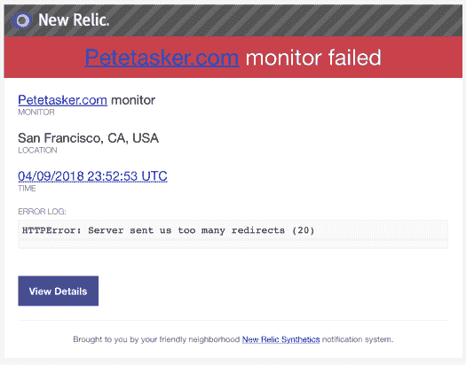

# Nginx，让我们加密并关闭我自己的服务器😢

> 原文：<https://dev.to/ptasker/nginx-lets-encrypt-and-taking-my-own-server-down--34a2>

<small>*[照片由西蒙·菲托尔在 Unsplash 上拍摄](https://unsplash.com/photos/tvleqH3p1os?utm_source=unsplash&utm_medium=referral&utm_content=creditCopyText)*</small>

如果你关注[谷歌和它的索引规则](https://fourdots.com/blog/why-you-need-ssl-to-rank-better-in-2016-and-how-to-set-it-2169)，你可能听说过你的网站需要 SSL 证书。我知道这一点已经有一段时间了，我在 petetasker.com 的个人网站并不是一个高优先级的情况。

嗯，有一天晚上，我觉得无聊，决定是时候得到一条免费的花里胡哨的裤子了[让我们加密安装在我的旧 Linode 服务器上的](https://letsencrypt.org/)证书。

互联网上有大量的资源概述了如何在您的站点上安装 SSL 证书，所以我不打算讨论这一部分。我要说的是盲目地跟随他们会如何让你的服务器瘫痪…

你看，大部分教程都希望你用 [Certbot](https://certbot.eff.org/) 来安装你的证书，配置 Nginx。

`certbot --nginx -d petetasker.com`

似乎没什么坏处，不是吗？那个小小的`--nginx`标志，如果你没有仔细阅读，将会修改你的虚拟主机配置。是啊。在设置证书时，有一个选项将所有 HTTP 流量重定向到 HTTPS，显然我说了“当然”。

并将重定向循环排队。网站监控邮件泛滥，推特“网站瘫痪”DM 的…

[T2】](https://i1.wp.com/petetasker.com/wp-content/uploads/2018/04/Monosnap-2018-04-09-20-27-44.png?ssl=1)

一切都很顺利！

我设法通过删除`/etc/nginx/sites-available/petetasker.com`虚拟主机声明中的以下代码块来解决这个问题:

```
if ($host = petetasker.com) {
    return 301 https://$host$request_uri;
} # managed by Certbot 
```

Enter fullscreen mode Exit fullscreen mode

并添加一个更简单的重定向块，只是为了*真正*清楚，在文件的顶部:

```
server{
        listen 80;
        server_name petetasker.com;
        return 301 https://$server_name$request_uri;
} 
```

Enter fullscreen mode Exit fullscreen mode

孩子们，这里的教训是什么？教训是，如果你正在使用一个工具，它会“自动地”为你做一些事情，并且听起来好得不像是真的，它很可能是真的。

如果您想知道最终的虚拟主机块是什么样子的:

```
server{
        listen 80;
        server_name petetasker.com;
        return 301 https://$server_name$request_uri;
}
server {

        listen 80 default_server;
        #listen [::]:80 default_server ipv6only=on;
        server_name petetasker.com www.petetasker.com;

        server_name petetasker.com www.petetasker.com;
        root /usr/share/nginx/sites/petetasker.com;
        index index.php index.html;

        location / {
                try_files $uri $uri/ /index.php?$args;
        }

        location ~ \.php$ {
                try_files $uri =404;
                fastcgi_pass unix:/var/run/php/php7.0-fpm.sock;
                fastcgi_index index.php;
                fastcgi_param SCRIPT_FILENAME $document_root$fastcgi_script_name;
                include fastcgi_params;
        }

    listen [::]:443 ssl ipv6only=on; # managed by Certbot
    listen 443 ssl; # managed by Certbot
    ssl_certificate /etc/letsencrypt/live/petetasker.com-0001/fullchain.pem; # managed by Certbot
    ssl_certificate_key /etc/letsencrypt/live/petetasker.com-0001/privkey.pem; # managed by Certbot
    include /etc/letsencrypt/options-ssl-nginx.conf; # managed by Certbot
    ssl_dhparam /etc/letsencrypt/ssl-dhparams.pem; # managed by Certbot

} 
```

Enter fullscreen mode Exit fullscreen mode

Nginx，让我们加密并关闭我自己的服务器😢最早出现在[🔥数据库关键🔥](https://petetasker.com)。