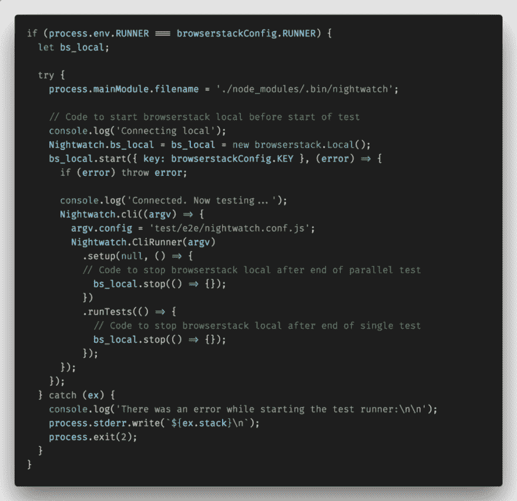
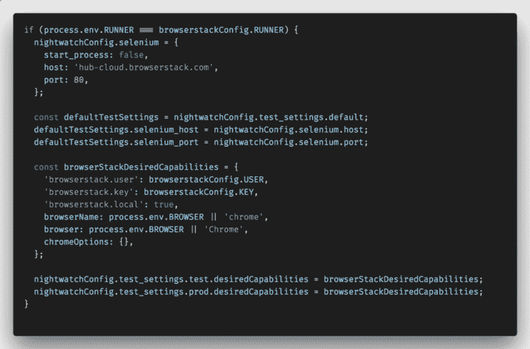
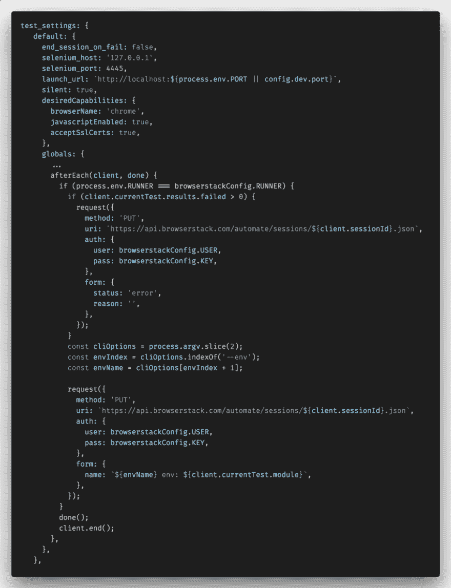

# 守夜+浏览器堆栈

> 原文：<https://dev.to/digitaledawn/nightwatch-browserstack-5f5a>

### Vue cli 2:夜视+浏览器堆栈

最近，我不得不配置我们在 Vue.js 项目上的 Nightwatch 测试，以便能够在 Browserstack 自动化测试平台上运行。这必须适用于不同的环境。我们有两个主要的环境:测试和测试。

我们想要实现的配置是能够在以下设备上运行 e2e 测试:

*   使用本地 selenium 和 Chromedriver 的本地主机。
*   使用本地 selenium 和 Chromedriver 测试/生产 URL
*   浏览器堆栈期间测试/生产 URL

最终文件在本文的末尾，您可以从中粘贴。

### 初始设置

我们的应用程序正在使用 Vue.js，并且是使用 webpack 模板通过 vue cli 2 生成的。我们有一个 runner.js 文件，用于设置 webpack，以便能够在本地主机上运行测试。我们必须更新这个 runner.js 文件和 nightwatch 配置。

### 将 Browserstack 配置为仅在测试/生产环境中运行

Browserstack 有一份关于如何运行 Nightwatch 测试套件的很好的文档。唯一的问题是，他们假设您想一直在 Browserstack 上运行，并且没有给出可配置的例子。如果你想使用 Selenium 和 Chrome 的本地版本呢？当你不得不使用 [Browserstack local](https://www.npmjs.com/package/browserstack-local) 来访问内部 URL 时，事情就变得更加复杂了，我们的情况就是如此。

为了运行 Browserstack local，您需要使用一个特定的设置，该设置在他们文档中的另一个 runner 文件中。

#### 1。Runner.js 更新

在 runner 中，为了使用 Browserstack local，我们使用命令行节点环境变量使其可配置。我们期望一个名为 RUNNER 的变量出现，以指定使用哪个 RUNNER:local 或 Browserstack。

如果测试需要在 Browserstack 上运行，我们设置 runner 使用 Browserstack local。如果没有，我们使用默认配置来设置服务器，这与 Browserstack 文档提供的代码相同。

<figure> 

<figcaption>在浏览器堆栈</figcaption>

</figure>

上运行测试时使用浏览器堆栈本地

#### 2。守夜人配置更新

我们的配置默认使用本地 selenium。如果提供节点环境变量 RUNNERis 来对 browserstack 执行测试，我们将覆盖这些设置以使用 Browserstack selenium(类似于 Browserstack 文档)。

<figure> 

<figcaption>覆盖 Nightwatch 配置以使用浏览器堆栈硒</figcaption>

</figure>

#### 3。通过 API 更新 Browserstack 中的测试状态

默认情况下，当执行测试时，Browserstack 不会显示测试是否失败。更新的唯一方法是向 [Browserstack API 发出请求。](https://www.browserstack.com/automate/rest-api#rest-api-sessions)

请求需要会话 ID，它可以在测试中或者在每个测试套件结束时执行的全局 afterEach 中获得。在 nightwatch 配置文件中，您可以在 globals 属性中设置它。如果测试失败，我们会请求将它们设置为失败。我们还更新了会话的名称，以显示测试是在哪个环境中执行的:test 或 prod。

<figure> 

<figcaption>将浏览器堆栈中的测试会话设置为失败或成功</figcaption>

</figure>

### 最终文件