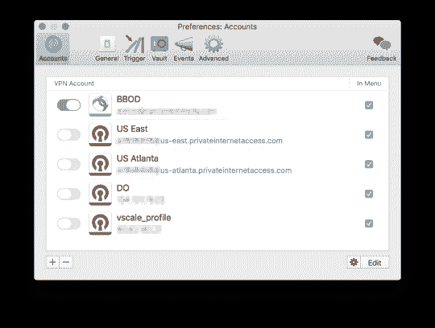
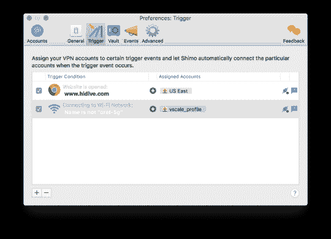

# 不再有 VPN 之痛👍

> 原文：<https://dev.to/orels1/no-more-vpn-pain-25ia>

[T2】](https://res.cloudinary.com/practicaldev/image/fetch/s--UBc8sWVE--/c_limit%2Cf_auto%2Cfl_progressive%2Cq_auto%2Cw_880/https://78.media.tumblr.com/09952fdb8877be94eda519233e6350ea/tumblr_inline_p6rm2e5lCk1veql8b_540.png)

所以，事情是这样的。我们在这里使用的客户端使用思科的 AnyConnect 作为 VPN 客户端，我的上帝，我讨厌它。它不记得密码，减慢一切，只是一般不稳定。当同时有任何其他 VPN 连接时，它也会消失。

我四处寻找更好的解决方案，我终于找到了——石墨！(#非赞助)。

基本上，它的工作就像任何其他 VPN 客户端(例如，免费隧道 Bick)。但是除了 OpenVPN 协议，它支持旧的 IPSEC/L2TP 和思科的 AnyConnect！

> 更好的是，它允许你设置自定义触发器，所以当你打开一个特定的网站，它打开特定的连接！

以上对我来说尤其重要，因为我使用许多不同的流媒体服务，其中大多数都有地区锁定的内容。即使是在你付钱的时候，这很可悲。

[T2】](https://res.cloudinary.com/practicaldev/image/fetch/s--V5ckSdCi--/c_limit%2Cf_auto%2Cfl_progressive%2Cq_auto%2Cw_880/https://78.media.tumblr.com/f8d6a21af18648495cab3bfed12e71f2/tumblr_inline_p6rm9i1DKe1veql8b_540.png)

唯一的问题是-它很贵。但是！如果你像我一样使用 SetApp 这是他们 5 美元/月订阅的一部分，考虑到有多少其他应用程序，这更容易管理。

> 所以是啊，肯定推荐[https://www.shimovpn.com/](https://www.shimovpn.com/)