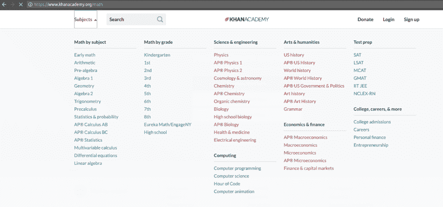

# 不，你数学不差

> 原文：<https://dev.to/acoh3n/no-youre-not-bad-at-math-5h77>

[T2】](https://res.cloudinary.com/practicaldev/image/fetch/s--ENQeCFXs--/c_limit%2Cf_auto%2Cfl_progressive%2Cq_auto%2Cw_880/https://thepracticaldev.s3.amazonaws.com/i/9yua3zu52u4hybwlyx3l.jpg)

抱歉，但是在这一点上我不得不反对你。全心全意。如果你认为自己“数学不好”，那你就错了。大错特错。我怎么知道这个？因为没有人的数学比我差。整个青少年时期，我都是班上的垫底学生，并且深信数学只不过是虐待狂老师手中的刑具。

上周，我发表了一篇描述我个人数学旅程的文章。一些人在社交媒体上评论了这篇文章，大意是:“我不擅长数学”。这篇文章的目的是彻底消除他们的这种观念。

在他 2015 年的 TED 演讲中，萨尔·汗先生认为当今大多数公立学校教授数学的方法导致了这门学科的高失败率。学生被分组，通常是按年龄分组，并在整个课程中被引导在一起。每隔几周，学生们将接受一次测试来评估他们的知识，不管每个学生在测试中表现如何，整个班级都将进入下一个科目。

这就是问题的核心。你看，数学概念是相互建立的。不先懂算术，就看不懂代数。同样，不先了解代数，就无法了解微积分。事情就是这样。但是还记得那次你上中学的时候数学考了 85%甚至 95%吗？你猜怎么着？这种差距从未得到纠正，后来当你试图处理下一个主题时，你会错过理解它所需知识的 5%-15%。所以现在你在下一次考试中只得了 70%,很快你就会开始讨厌数学以及任何与数学有关的人和事。

为了真正阐明他的观点，汗先生用了一个类似于房屋建筑的例子:

> 要理解这有多荒谬，想象一下如果我们以这种方式做其他事情。比如说，房屋建筑。
> 
> (笑声)
> 
> 所以我们找来承包商说，“我们被告知我们有两周的时间来建造地基。量力而行。”
> 
> (笑声)
> 
> 所以他们尽力而为。也许下雨了。也许有些供应品没有出现。两个星期后，检查员来了，四处看了看，说，“好吧，那边的混凝土还是湿的，那部分不太符合规范...我会给它百分之八十。”
> 
> (笑声)
> 
> 你说，“太好了！那是个 c，我们建一楼吧。”

好了，这一切都很好。但是你可能会问自己:“是的，但是我为什么需要学习数学呢？我知道你对数学之类的东西很感兴趣。我为什么需要关心？”好吧，如果你正在读这篇文章，很可能你是一名程序员。虽然许多程序员试图忽略数学，并在不同程度上取得了成功，但他们正在将自己逼入一个非常狭窄的角落。计算机科学深深植根于数学，因此忽视数学就意味着忽视整个学科所依赖的基础。

最终，自动化将赶上更琐碎的编程任务，那些对这个主题只有肤浅理解的人将面临被他们自己的工具取代的风险——讽刺的是。

好了，希望现在我已经让你相信你的数学并不差。你并不缺乏某种神秘的数学基因，数学也不是特别聪明的人的专利。

你从哪里开始？就我个人而言，我喜欢可汗学院按科目和成绩划分的方式:

[T2】](https://res.cloudinary.com/practicaldev/image/fetch/s--EtvfSrwK--/c_limit%2Cf_auto%2Cfl_progressive%2Cq_auto%2Cw_880/https://thepracticaldev.s3.amazonaws.com/i/rcypo5vgeknwiyzduih8.png)

当我报名时，我决定放下自尊，从头开始。是的，我又开始做算术和幼儿园水平的数学了。但是因为我是在自己的家里，用自己的时间做这件事，所以没有人来评判我或取笑我。通过这样做，我确信我覆盖了数学教育中的每一个缺口。你知道吗？我早在一年级或二年级就发现了差距！

接下来，你知道我取得了进展，处理了越来越复杂的课题。这些科目我在高中时都不及格。所以我知道这是可以做到的，因为我已经做到了。

干杯。