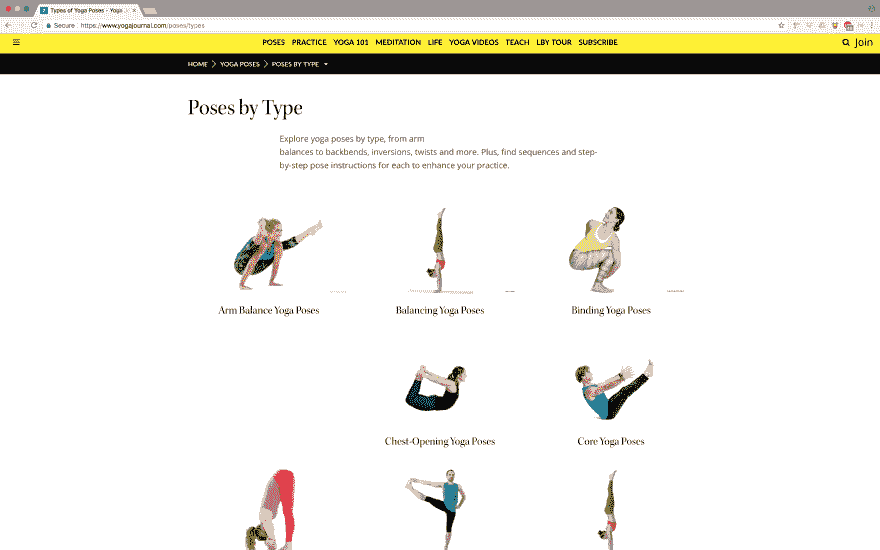
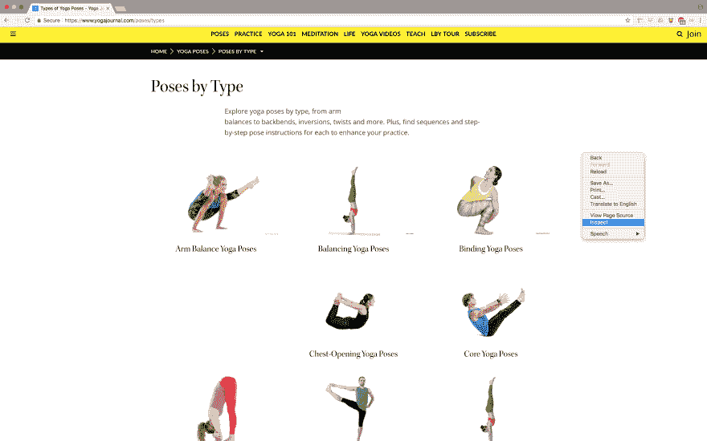
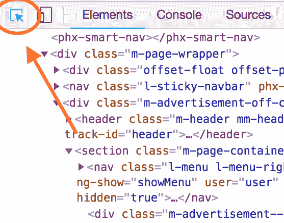
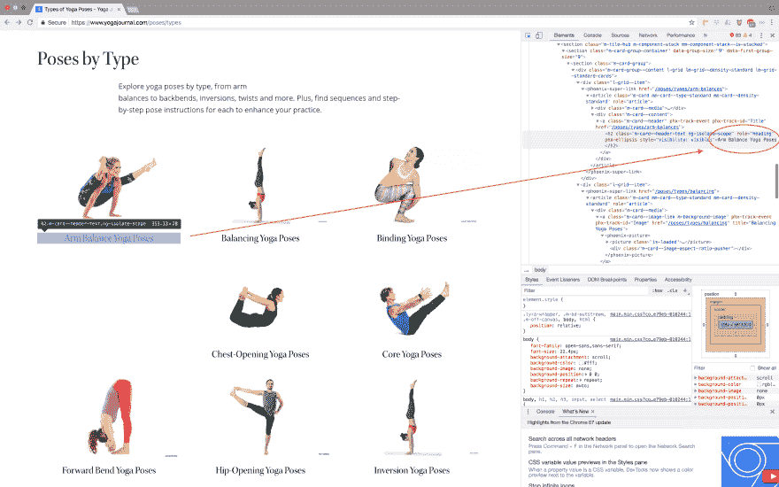
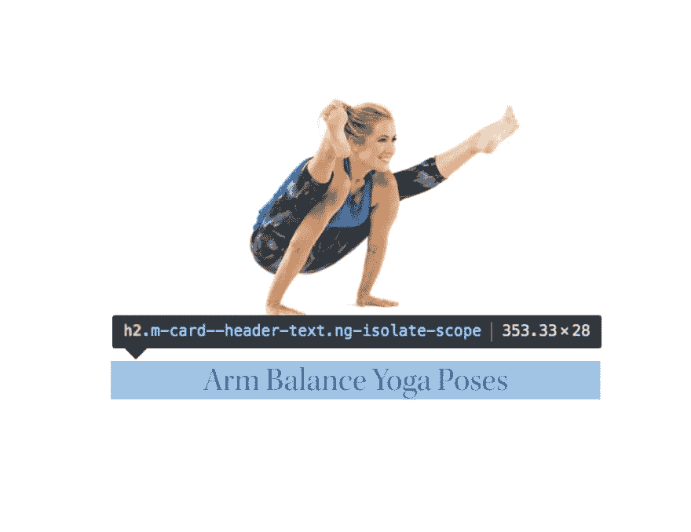
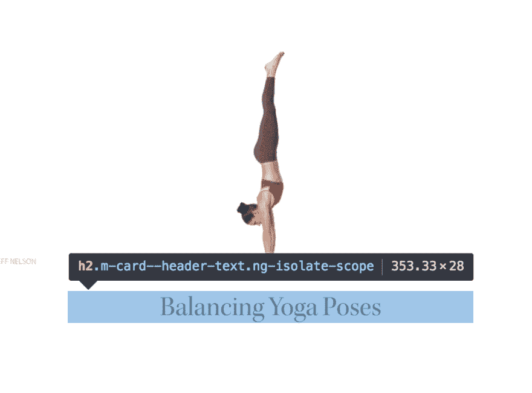
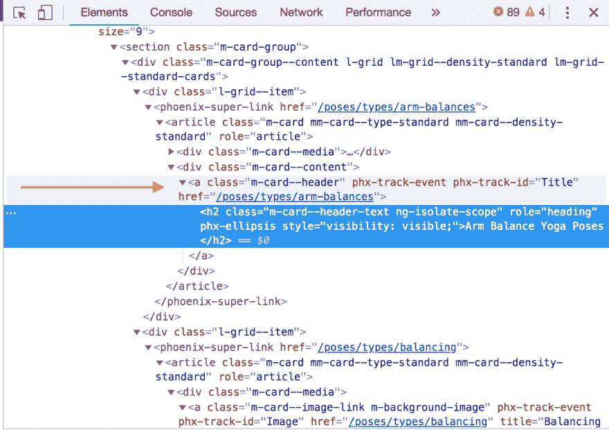

# Nokogiri 刮擦演练

> 原文：<https://dev.to/kreopelle/nokogiri-scraping-walkthrough-alk>

当我构建我的第一个 CLI 应用程序时，我对 Nokogiri gem 非常熟悉。我不认为自己是专家，但我很好奇 gem 是如何工作的。这篇文章介绍了我使用 Nokogiri 收集数据的过程。

Nokogiri 是一种红宝石，用于从网站上收集数据。要使用它，你需要的只是一点 CSS 知识、Ruby 基础知识和耐心。

对于这个演练，我使用的是[瑜伽杂志的](https://www.yogajournal.com/poses/types)类型的姿势。

[T2】](https://res.cloudinary.com/practicaldev/image/fetch/s--_Nt607ny--/c_limit%2Cf_auto%2Cfl_progressive%2Cq_auto%2Cw_880/https://i.imgur.com/FRr2M3A.png)

这是我在 CLI 应用程序中使用的页面之一。如果内容或结构发生变化，抓取网站可能会失败，因此截至 2018 年 6 月 12 日发布时，这些内容是准确的。我还将在 Mac 电脑上使用谷歌 Chrome 浏览器。请随意跟随！

## 1。添加 Nokogiri，打开-URI，并窥探到您的红宝石文件

首先，在终端中输入:
来安装 gems

```
gem install nokogiri
gem install pry 
```

一旦安装好了，就要求它们在你的 ruby 文件的顶部:

```
require ‘nokogiri’
require ‘open-uri’
require ‘pry’ 
```

*注意: [Open-URI 不是一个 gem，而是一个内置的 Ruby 包装器，它允许 HTML 文档作为一个文件被读取:](https://ruby-doc.org/stdlib-2.1.0/libdoc/open-uri/rdoc/OpenURI.html)。我不确定它与当前的 Ruby 系列有什么关系。*

## 2。将您想要抓取的站点保存到变量中

```
doc = Nokogiri::HTML(open(‘https://www.yogajournal.com/poses/types')) 
```

## 3。在变量下面添加一个`binding.pry`并运行您的文件。

如果您一直跟随，文档应该看起来像这样:

```
require ‘nokogiri’
require ‘open-uri’
require ‘pry’

doc = Nokogiri::HTML(open(‘https://www.yogajournal.com/poses/types'))
binding.pry 
```

运行该文件的终端命令应该是:

`ruby my-file.rb`

## 4。检查网页上要抓取的内容

让我们跳到网站上。对于我的应用程序的一部分，我希望创建一类对象，其中每个实例都是一种瑜伽姿势。我想使用 Nokogiri 来抓取所有的姿势类型名称及其相关的 URL。

右键点击页面，点击*检查*。转到 inspect 窗口的左上角，单击指向正方形中间的箭头(信息气球应该显示类似于“在页面中选择一个元素来检查它”)。

[T2】](https://res.cloudinary.com/practicaldev/image/fetch/s--jaeAPM2K--/c_limit%2Cf_auto%2Cfl_progressive%2Cq_auto%2Cw_880/https://i.imgur.com/rS5ViSy.png)

[T2】](https://res.cloudinary.com/practicaldev/image/fetch/s--2RY3MeNm--/c_limit%2Cf_auto%2Cfl_progressive%2Cq_auto%2Cw_880/https://i.imgur.com/sRm1YT2.png)

将鼠标悬停在您正在寻找的商品示例上。这将在元素窗口中突出显示相应的 CSS，同时突出显示元素的边界(通常通过一个彩色框)。在“元素”窗口中单击该项以选择其 CSS。

盘旋的时候，我喜欢问自己:

*   我要查找的内容是否存储在此项目中？我能看到文本、链接、图片等吗？包装在元素面板的 CSS 中？

[T2】](https://res.cloudinary.com/practicaldev/image/fetch/s--g4wUT2da--/c_limit%2Cf_auto%2Cfl_progressive%2Cq_auto%2Cw_880/https://i.imgur.com/wmeoAwG.png)

是啊！在>

*   这个项目的 CSS 选择器或者 HTML 标签是什么？一些常见的例子有`div`、`a`和`h2`。在 Chrome 中，这将是首先显示的文本，以粉红色显示。

[T2】](https://res.cloudinary.com/practicaldev/image/fetch/s--LA0BTbQQ--/c_limit%2Cf_auto%2Cfl_progressive%2Cq_auto%2Cw_880/https://i.imgur.com/ZQk4oH3.png)

对于这个例子，选择器是`h2`。

*   选择器/标签后面有 ID 或类信息吗？

[T2】](https://res.cloudinary.com/practicaldev/image/fetch/s--LA0BTbQQ--/c_limit%2Cf_auto%2Cfl_progressive%2Cq_auto%2Cw_880/https://i.imgur.com/ZQk4oH3.png)

这里，正文有点长。貌似这个类叫`m-card--header-text ng-isolate-scope`。双击元素面板中的类信息并复制它。

提示:在 Google Chrome 中，当你将光标悬停在你想要抓取的项目上时，格式已经与你需要放入 Nokogiri 抓取参数的内容相匹配了！如果是 id，文本前面会有一个“#”。如果是一个类，文本将有一个“.”在它面前。在 Chrome 的表示中，id 是橙色的，类是蓝色的。

*   页面上相似的内容是否共享 CSS 选择器/类等？将鼠标悬停在相似的项目上，查看它们是否共享选择器/类别/id 信息。

[T2】](https://res.cloudinary.com/practicaldev/image/fetch/s--Ta19b0ji--/c_limit%2Cf_auto%2Cfl_progressive%2Cq_auto%2Cw_880/https://i.imgur.com/HP9VtTF.png)

是的:“平衡瑜伽体式”和“手臂平衡”有相同的 CSS！

让我们将这些信息带回我们的代码。

## 5。在窥探中玩耍

实验时间！

在 Nokogiri 中使用 CSS 进行抓取的标准结构是`variable.css(‘selector#id.class’)`，所以在这个例子中，`doc.css(‘h2.m-card--header-text ng-isolate-scope’)`是我首先要运行的。

嗯，看起来我们得到的是一个空数组。因为“text”和“ng”之间的空格，我对这个类有点怀疑。使用 Nokogiri 时，空格可以表示在不同嵌套层之间移动。我还注意到，成功的 Nokogiri 抓取通常很简单，并且不包含完整的 CSS。让我们试着把它分成两部分，在空格前只包含类名。

`doc.css(‘h2.m-card--header-text’)`

*提示:在终端中只需点击向上箭头就可以获得之前输入的值。*

现在我们有进展了！在返回的数据中，我可以看到我想要提取的字符串，但是我需要添加更多的细节来获得姿势类型类别名称。

点击“q”退出返回值并返回到空白处键入新命令。

要指定您在 Nokogiri 中搜索的内容，请在`#.css`之后链接其他方法。我最常用的:

```
#.text —> will pull strings 
#.attribute('href').value —> will pull urls 
#.attribute('img').value —> will pull image urls 
```

我们正在寻找一个字符串，所以让我们尝试添加`#.text`

```
pry(main)> doc.css('h2.m-card--header-text').text
=> "Arm Balance Yoga PosesBalancing Yoga PosesBinding Yoga PosesChest-Opening Yoga PosesCore Yoga PosesForward Bend Yoga Po
sesHip-Opening Yoga PosesInversion Yoga PosesPranayama Exercises & PosesRestorative Yoga PosesSeated Yoga PosesStanding Yog
a PosesStrengthening Yoga PosesTwist Yoga PosesYoga BackbendsYoga BandhaYoga Mudras8 Top Yoga Teachers Give Their Best Advi
ce for Finding Bravery in Inversions3 Ways to Modify PaschimottanasanaMaster Paschimottanasana in 6 StepsThe Bandha Approac
h You Haven't Tried—That Could Change EverythingThe Muscle That Can Make or Break Healthy Shoulders in InversionsMaster Cla
ss: How Does Pranayama Help Digestion?This Energy-Boosting Breathwork Is Better Than CaffeineMaster Class: Rodney Yee’s 3-S
tep Pranayama Technique for Stillness and PeaceYoga Journal's 2017 Pose of YearRodney Yee's Restorative Yoga Sequence to Pr
epare for Pranayama" 
```

我们有一个包含所有 pose 类型标题的长字符串！为了确定它们作为个体是否可访问，我喜欢运行相同的代码，但是在`#.text`
之前链接`#.first`

```
pry(main)> doc.css('h2.m-card--header-text').first.text
=> "Arm Balance Yoga Poses” 
```

太棒了。我们抓到你了。

## 6。将内容推入数组

返回到您的网络浏览器。看看你想要的数据的父数据。在“元素”面板中查找指向下方的箭头。

[T2】](https://res.cloudinary.com/practicaldev/image/fetch/s--eKMQpiCn--/c_limit%2Cf_auto%2Cfl_progressive%2Cq_auto%2Cw_880/https://i.imgur.com/UPbbmYM.png)

在构建从网页上抓取的数据数组时，我倾向于只使用类作为方法的参数。让我们测试以下内容:

`doc.css('.m-card—header')`

太棒了——我们的小字符串位于这个代码中。让我们试着遍历它:

```
doc.css('.m-card--header').collect do |pose_type|
    pose_type.css('h2').text
end 
```

在这里，我使用了`doc`变量，保存到我们想要的网页的 HTML 值中，并将其缩小到只有类为`.m-card--header`的数据。我使用`#collect`迭代器遍历这个类的每个子类——在我们的例子中，我们希望它是一个 pose 类型的类别——并将`h2`标签中的文本推入一个数组。

为什么只是`h2`？Nokogiri 不需要在每次调用中都使用标签/选择器和类/id。有时其中一个会找到你想要的。`.m-card--header`类将检索的内容缩小到该类的子类。每个标题都包含在一个`h2`标签中，只有作为`.m-card--header`的子标签的`h2`标签包含我想要抓取的数据。

```
=> ["Arm Balance Yoga Poses",
 "Balancing Yoga Poses",
 "Binding Yoga Poses",
 "Chest-Opening Yoga Poses",
 "Core Yoga Poses",
 "Forward Bend Yoga Poses",
 "Hip-Opening Yoga Poses",
 "Inversion Yoga Poses",
 "Pranayama Exercises & Poses",
 "Restorative Yoga Poses",
 "Seated Yoga Poses",
 "Standing Yoga Poses",
 "Strengthening Yoga Poses",
 "Twist Yoga Poses",
 "Yoga Backbends",
 ... 
```

成功！

不要害怕继续尝试，直到你找到有用的东西，或者回到 CSS，看看是否有另一种方法可以找到你想要的东西。

我注意到页面底部的一些文章标题也被删除了，这意味着我将在 CLI 应用程序中进行一些额外的钻探/数据验证，以便只检索姿势类型类别名称。

链接有点复杂。要获得每个姿势类型指向的链接，我不能悬停，我需要单击标题并查看元素的数据。当我将鼠标悬停在元素面板中“h2”标签上方的“a”标签上时，页面上包含链接的元素高亮显示。这帮助我确认了我想要抓取的链接数据被封装在突出显示的 CSS 元素中。

要返回链接而不是文本，Nokogiri 格式为:

`doc.css('a.class-name).attribute('href').value`

若要循环访问它们，只需对集合使用“a”标记，后跟。属性(' href ')。价值链作为区块。为了获得伴随这些姿势类型的链接，我使用了:

```
doc.css('a.m-card—header').collect do |pose_link|
    pose_link.attribute('href').value
end 

=> ["/poses/types/arm-balances",
 "/poses/types/balancing",
 "/poses/types/binds",
 "/poses/types/chest-openers",
 "/poses/types/core",
 "/poses/types/forward-bends",
 "/poses/types/hip-openers",
 "/poses/types/inversions",
 "/poses/types/pranayama",
 "/poses/types/restorative",
 "/poses/types/seated-twists",
 "/poses/types/standing",
 "/poses/types/strength", 
```

就是这样！Nokogiri 的关键是密切关注你正在抓取的网站的 CSS 模式。找到模式，找到数据！