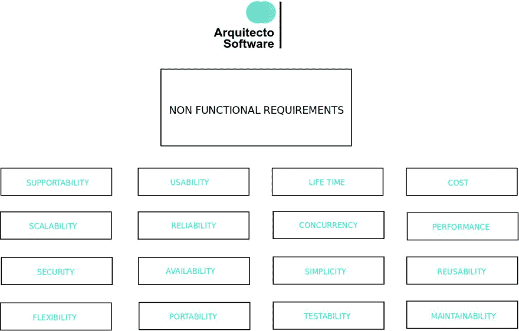

# 非功能需求:坚实软件架构的支柱

> 原文：<https://dev.to/arquitectosoft1/non-functional-requirements-the-pillars-of-a-solid-software-architecture-2mbg>

[T2】](https://res.cloudinary.com/practicaldev/image/fetch/s--oLghcdBU--/c_limit%2Cf_auto%2Cfl_progressive%2Cq_auto%2Cw_880/https://thepracticaldev.s3.amazonaws.com/i/rl099ybsi3zorkvpgyo0.jpg)

## 软件架构中的非功能需求是什么

在了解**非功能需求**之前，了解什么是软件工程中的需求是很重要的。

需求是对系统提供的服务及其操作限制的描述。

发现、分析、记录和验证需求的过程称为**需求工程**。需求可以是**合同**要约的基础，也可以是软件项目中的基础合同本身。

有几种类型:

*   **功能**要求

*   **非功能性**要求

*   **UI** 需求

*   域或**业务**需求

非功能需求与软件系统的**紧急属性**直接相关，并指定或限制它们。这些属性的示例包括:

*   可靠性

*   响应时间

*   表演

*   有效性

它们可能比任何其他要求都更加苛刻。结果，不满足可靠性要求的飞行控制系统将是不安全的，因此是不可用的。

非功能性需求，也称为**质量属性**，来自用户需求、预算限制、公司政策、与其他软件或硬件的互操作性、外部因素，如安全法规或隐私立法。

## 为什么您应该了解非功能性需求

即使你不是软件架构师，而是开发人员，关注非功能性需求也是至关重要的。它允许在不损害整个系统的情况下提供强大的功能，并增加**复杂性**和**技术债务**。

为了**评估**哪种软件架构对数字项目来说是最好的，有必要首先知道哪些是相同的非功能需求。

每种软件架构风格对每个非功能需求都有不同的影响。例如，[的批处理顺序](https://www.arquitectosoftware.com/docs/batch-sequential/)架构会对可用性产生负面影响，而[的 MVC 架构](https://www.arquitectosoftware.com/docs/mvc/)在这方面有很好的表现。

## 主要非功能需求类型

本节按照与 [Arquitecto 软件](https://www.app.arquitectosoftware.com)相同的顺序描述了不同类型的非功能性需求。

### 可支持

也被称为**可服务性**，它指的是软件系统在某些领域减轻**技术支持**的能力:

*   **系统的安装**和配置。

*   提供有助于识别异常、调试和隔离问题根源的信息。又称**测井**或**追踪**。

*   **监控**系统的健康指标。

良好的可支持性可以提高维护效率，降低运营成本。

### 可用性

可用性是指用户使用平台并达到预期结果的难易程度，包括**有效性**、**效率**和**满意度**。这些特性在[国际标准化组织/IEC 9126-4](http://usabilitynet.org/trump/documents/Usability_standards.ppt.pdf) 中有所阐述

可用性包括所有人都可以访问的能力，甚至包括那些有残疾的人。这可以通过在 UI 中实现辅助技术，并为所有图像和多媒体资源提供文本来实现。

良好的可用性会带来更好的**客户满意度**，更多的推荐，并且肯定会促进公司的有机增长。

### 一生

该需求与**系统开发生命周期** (SDLC)相关，其中软件系统经历一系列**生命周期**阶段:

*   规划

*   需求分析

*   设计

*   发展

*   集成和测试

*   部署和维护

*   处理

为了**中止**一个软件系统，有一个过渡到新系统的过程。考虑到这一点的设计架构将有助于未来的**迁移**。

### 费用

成本可能是软件项目的致命弱点。在软件架构的总成本中，有很多因素需要考虑。最突出的例子是:

*   实施成本:更复杂的架构需要更多合格的工程师。

*   与**故障管理**和恢复相关的成本。

*   **数据备份**策略成本。

*   运行系统所需的资源:硬件、电力等。

*   与系统**维护**和支持相关的成本。

一个明显的成本示例可以在项目开始时的**整体与微服务成本**中看到。单体应用在资源和复杂性管理方面的成本将低于具有编排功能的微服务架构。

为了强调成本在软件架构中的重要性，有一本书的标题是:“ **RCDA** :作为风险和成本管理规程的架构设计”

### 可量测性

可伸缩性是指在工作负载急剧增加时保持有效性能的能力，而无需**重新设计**。这方面的一个例子是用户同时使用软件的高峰。

有许多不同的方法来扩展应用程序，并且很大程度上取决于应用程序的架构和行为。对于**微服务**， [Scale Cube](http://theartofscalability.com/) 主要定义了三种可伸缩性方法:

*   通过水平克隆应用程序来缩放 x 轴

*   通过拆分不同的功能来缩放 y 轴

*   通过对数据进行分区或分片来缩放 z 轴

软件架构的一个更通用的方法可以是:

*   **水平**可伸缩性(横向扩展):在系统中添加或删除节点。

*   垂直可伸缩性(纵向扩展):向系统中的一个节点添加或移除资源。

### 可靠性

也称为平均无故障时间或平均无故障时间/MTTF。这个需求指的是软件操作预期的一致性。因此**不可靠性**是软件操作的非预期结果。

衡量可靠性的一个常见指标是软件故障(被称为**错误**)的数量，用每千行代码中的故障来表示。

减少软件缺陷的最好方法是做好测试策略，因此一个易于测试的软件架构会比其他难以测试的架构更可靠。

### 并发

并发性指的是处理同时执行的**多个计算**的能力，并且可能相互交互。

具有高并发性的软件架构已经清楚地标识了可以并发执行的部分。例如，同时具有多条**流水线**的[管道和过滤器软件架构](https://www.arquitectosoftware.com/docs/pipe-and-filter/)将比在**批次**中执行任务的[批次顺序软件架构](https://www.arquitectosoftware.com/docs/batch-sequential/)更加并发。

并发性也指同时使用软件的**个用户**的最小、平均和最大数量。

### 表演

性能指的是系统完成的**工作量**,意味着系统最终可用性的限制因素。

完全取决于项目的需求，但是良好的绩效涉及**不同的手段**:

*   对于 UI 指的是**低延迟**，执行时间少。

*   At 服务器代码指的是**高吞吐量**，也就是处理工作的速率。

*   在嵌入式架构中是指**计算资源**的低利用率。

一个[黑板软件架构](https://www.arquitectosoftware.com/docs/blackboard/)有很好的性能，因为在这个架构中所有的监听器和订阅者都可以并行工作。

### 安全性

安全是一个风险管理的过程，它平衡了可能的安全风险和防范这些风险的 T2 成本。

这个需求允许系统中资源的所有者**可靠地控制**谁可以在特定资源上执行什么动作。它意味着许多行动，其中一些是:

*   敏感**资源**识别和保护:对每个资源的每个动作进行权限评估。

*   识别和**授权**。

*   **可用性**保护。

*   安全**库**。

*   安全**管理**。

*   信息的完整性。

*   漏洞和威胁的持续**监控**。

由于固有的网络复杂性，[代理软件架构](https://www.arquitectosoftware.com/docs/broker/)比[客户端服务器架构](https://www.arquitectosoftware.com/docs/client-server/)意味着更多的安全挑战。

### 有效性

可用性是软件架构在需要时完全或部分运行的能力，以及有效处理可能影响它的故障的能力。

与可用性相关的一些策略和行动:

*   高可用性硬件和负载平衡。

*   容错软件。

*   组件复制。

*   零停机部署。

*   为失败设计。

*   备份和灾难恢复解决方案。

像微服务这样的面向服务的架构可以在实例之间使用**负载平衡**，并确保比将服务器作为**单点故障**的客户端服务器架构更高的可用性。

### 简单

简单性意味着通过**软件分解**和使用清晰的**接口**分离关注点来减少责任。简单性的主要目标是降低复杂性，这有助于系统的可维护性和低成本。

一个众所周知的规则是 **KISS(保持简单，愚蠢)**，它指出，如果大多数系统保持简单而不是变得复杂，它们会工作得最好。设计简单的解决方案通常是提供所有其他系统质量的基础。

一个**集中式架构**将比一个**分布式架构**更简单，因为分布式环境需要固有的通信。

### 复用性

软件体系结构中的可重用性指的是体系结构的某些部分可以在其他软件系统中使用的程度。由于重用已知的和经过测试的软件组件，它带来了**成本降低**。

[面向服务的架构](https://www.arquitectosoftware.com/docs/service-oriented/)是可重用性的良好候选，例如**微服务**可以在不同的系统中重用。

### 灵活性

**灵活性**指软件架构适应其需求中可能或未来变化的能力。当软件架构的各个部分具有**低耦合**时，它就是灵活的。

当一个系统只需要增加一些东西就能进化时，它就说这个系统非常灵活。相反，如果需要改变架构的部分来发展它，那么它是不灵活的。

[分层架构](https://www.arquitectosoftware.com/docs/layered/)带来了很大的灵活性，因为架构的各个部分**明确分离**并且可以发展。

### 轻便

**软件架构中的**可移植性是指同一架构在不同环境下可用的程度。

可移植性的一个关键因素是**业务逻辑**和系统**接口**之间的清晰抽象。

[分层架构](https://www.arquitectosoftware.com/docs/layered/)非常便于移植，因为 it 架构的各个部分**明确分离**，可以分离到另一个环境中。相反，[黑板架构](https://www.arquitectosoftware.com/docs/blackboard/)由于数据存储和它的代理之间的依赖性，移植性较差。

### 易测性

**可测试性**是指在给定的测试环境下，架构的软件部分支持测试的程度。高的可测试性意味着更容易发现软件错误，从而提高可靠性。

[批处理顺序](https://www.arquitectosoftware.com/docs/batch-sequential/)是可测试性的一个很好的候选，因为在子系统上提供了更简单的划分，可以单独**测试**，在它们之间使用模拟数据。

### 可维护性

**可维护性**是关于软件系统被修改以纠正错误、提高性能或其他属性，或者适应变化的环境的难易程度。

以下是一些用于测量可维护性的**指标**:

*   技术债。

*   代码气味。

*   圈复杂度。

*   源代码行( **SLOC** )

除此之外，确保可维护性的一个关键因素是**平均修复时间** (MTTR)，即从通知故障到恢复工作状态，修复特定项目或组件所需的平均时间。

在**持续集成**周期**中，执行静态代码分析**是为了测量之前的度量，[sonar cube](https://www.sonarqube.org/)是一个很好的选择。

[由于关注点的分离，分层架构](https://www.arquitectosoftware.com/docs/layered/)是可维护性的良好候选。

## 结论

这篇文章解释了什么是软件工程中的需求，以及深层次的**非功能性需求**。

对于特定的非功能性需求，有一些软件架构风格比其他风格表现得更好，因此在为项目选择最佳风格之前，对所有风格进行评估是至关重要的。

有许多**非功能性需求**需要考虑，但最重要的是:可支持性、可用性、寿命、成本、可伸缩性、可靠性、并发性、性能、安全性、可用性、简单性、可重用性、灵活性、可移植性、可测试性和可维护性。

Arquitecto 软件自动完成这一过程，根据架构风格评估非功能性需求，并显示哪一个是最佳选择。

帖子也发表在[媒体](https://medium.com/@arquitectosoftware/non-functional-requirements-the-pillars-of-a-solid-software-architecture-98657e2c0f2e)上。