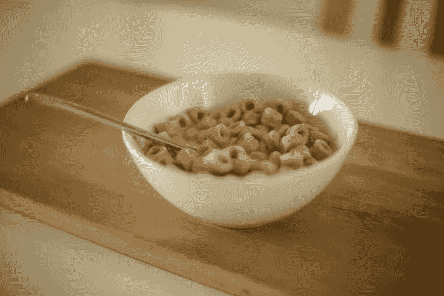

# 不是 UX VS UI 而是 UX 和 UI

> 原文：<https://dev.to/opeyemidjavu/not-ux-vs-ui-but-ux-and-ui-fd0>

现在很多开发者把 UX 和 UI 搞混了，他们把一切都搞混了。因此我决定写一篇短文来澄清混乱，让你正确理解 UX 和用户界面。让我们从定义什么是 UX 和用户界面开始。网络用户体验(UX)是人们从使用网站中获得的抽象感觉和乐趣，而用户界面(UI)是人们与之交互的体验的一部分。当设计一个网站时，你希望你的 UX 尽可能的正面，你希望你的用户喜欢在你的网站上，这就是重点。要实现这一点，你不能只是说让我们改进 UX，而是要由用户界面来负责。我将通过一些例子来概述 UI，并解释一些方法来帮助您理解为什么一个好的 UX 依赖于一个好的 UI，以及为什么创建一个 UI 总是比创建 UX 更容易

**什么是 web UI**

假设设计者选择包含拖动文件的选项，作为组织 UI 内容的一种方式。当一个用户因为喜欢某个网站而不喜欢它的竞争对手时，这就是 UX。因此，web UI 是组成网页的元素的设计、表现和执行。

**为什么我们构建 UI 而不是 UX**

铆钉游戏的 UI/UX 首席设计师 Shawn Borsky 提醒我们，UX 不仅仅是 UI 的结果。根据他的说法，UX 是“品牌的核心”，品牌本身是“一个人与一家公司或组织的经历的总和”这使得积极的 UX 不仅是用户界面的目标，也是所有与组织互动的目标。

网站提供的每一个细节都有助于用户的体验，以及他们在使用网站时形成的记忆和印象，但网站设计者无法直接控制这种体验。正如你在下图中看到的，我们很容易狭隘地只关注 UI，因为它是有形的，而不是像享受餐桌上的食物一样精心制作整个体验。
 
同样，如果你在做饭，你要投入很多心思，对吧？你亲手挑选所有最好的配料，选择最好的食谱，并仔细遵循它们，你甚至可以摆出一个漂亮的中心装饰品来创造合适的气氛。嗯，网站也不例外。你想把每件事都计划得尽善尽美，让你的访客玩得开心。这就是为什么只有当你牢记 UX 时，才值得关注 UI 的细节。如果一个用户界面是精心打造的，那么它会在 UX 中展现出来。如果用户界面是随意构建的，很少花费精力，那么 UX 将很可能遭受损失。我认为这篇文章澄清了你对 UI 和 UX 的疑问。更多细节请查看:Chris Bank 的 Web UI 设计最佳实践