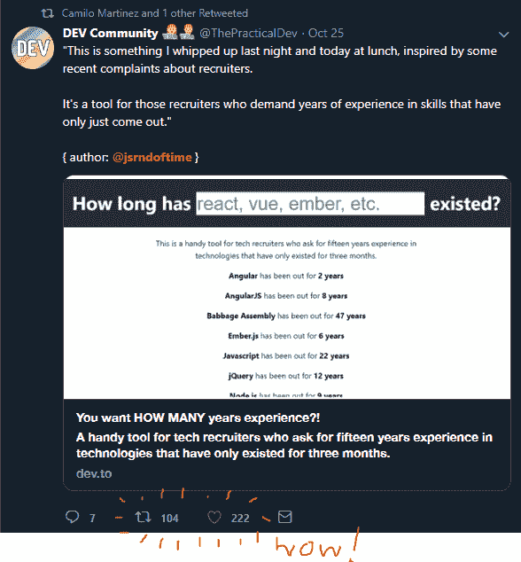
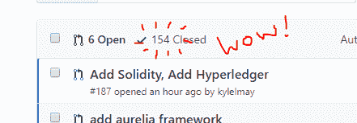
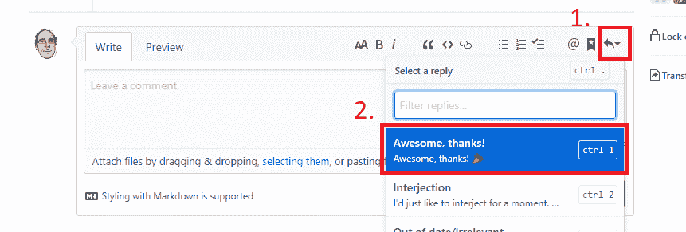

# 来自一个相当成功的开源项目的笔记

> 原文：<https://dev.to/jsrn/notes-from-a-modestly-successful-open-source-project-ndh>

大约一周前，我建造了这个作为测试[创建-反应-应用](https://github.com/facebook/create-react-app)的借口。我期待着从我的朋友那里得到一些半心半意的笑声，然后它会立即被遗忘。

但这次不是。这次我决定把它发布在 [dev.to](https://dev.to) 上，试图让*的陌生人发出半心半意的笑声。*

在这个过程中，我学到了一两件关于开源维护者的事情。

## 明确投稿指南

几乎同时，我收到了四个拉取请求。耶！同样的问题。哎呦。我没能做到的是让捐款过程变得清晰。我只是假设事情会解决，而不是建立一个如何将问题作为自己的问题的协议。结果是不得不尴尬地感谢一些人，但告诉他们不需要他们的贡献。

您可以在您的`README`中或者通过在您的存储库的根目录中创建一个`CONTRIBUTING`文件来明确贡献的指导方针。你应该详细说明一些事情，比如声称一个问题是你自己的问题的过程，对什么构成一个值得合并的补丁的期望，以及行为标准。通过预先明确这些期望，你可以避免像我遇到的不幸。

## 不要害怕告诉别人

我不愿意给任何人看我做的东西，因为我很确定我没有自己想象的那么有趣。然而，我很高兴我采取了将它贴在`#showdev`标签下的步骤，因为事实证明很多人真的很喜欢这个想法，并且它导致(并且仍然导致)来自开发社区的很多伟大的贡献。

## 社区助推信号

[T2】](https://res.cloudinary.com/practicaldev/image/fetch/s--qpOajaqc--/c_limit%2Cf_auto%2Cfl_progressive%2Cq_auto%2Cw_880/https://jsrn.net/asseimg/successful-project/twitter-post.PNG)

这是上一点的延伸，但是如果可能的话，找一个社区成为它的一部分。我不想听起来像是在玩世不恭地利用被俘虏的观众来建立你的*~个人品牌~* ，但是如果你想让人们看到并评论你所做的东西，那么像 [dev.to](https://dev.to) 这样的社区是很好的一部分。我试着创造一些东西，然后把它们扔进漠不关心的虚空，希望能有互动，但这不起作用。

## 想帮助人

在撰写本文时，存储库有相当数量的拉请求。

有一小段时间我在合并它们，新的拉取请求比我合并它们和感谢人们的速度还要快。我注意到我从某些人那里获得了很多回头客，所以我把他们作为合作者加入了这个项目。我期望他们会使用这种新的权力将他们自己的变更合并到主分支中，已经确定他们知道什么样的变更是预期的，但是没有。我的新同事很快开始审查和合并来自其他人的拉请求，讨论变更并测试提议的功能。

如果你有一个人们感兴趣的项目，并且你通过给他们对存储库的写访问权来表示对他们的信任，通常情况下，他们会以超出你预期的方式来应对这个情况。

## 利用 GitHub 的自动回复

[T2】](https://res.cloudinary.com/practicaldev/image/fetch/s--rqXZFjZo--/c_limit%2Cf_auto%2Cfl_progressive%2Cq_auto%2Cw_880/https://jsrn.net/asseimg/successful-project/git-replies.png)

如果你一遍又一遍地说同样的话，做程序员应该做的事情:自动化。这感觉有点不真诚，试图用一封格式信来表达衷心的感谢，但这会节省你很多时间和精力。

## 感谢人

最后也是最重要的一点。如果你发布了一个项目，人们把宝贵的时间和注意力都花在了这个项目上，感谢他们。如果他们贡献了代码，感谢他们。如果他们沾沾自喜地指出一个拼写错误，感谢他们。因为 76 个人的工作，他们的贡献现在远远超过了我自己，“它有多老了？”从六、七种技术发展到 100 多种，包括项目链接和图标。

这很特别。