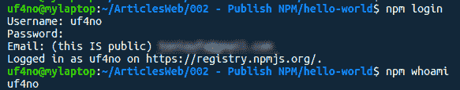
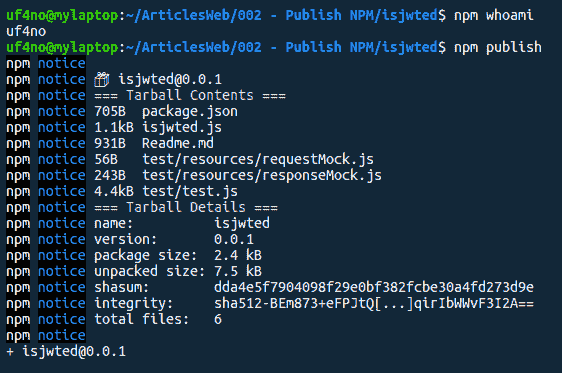
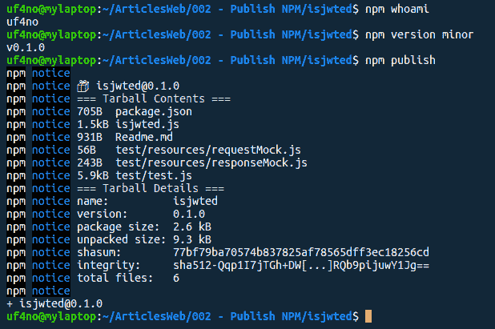

# 幕后的 NPM 和出版指南

> 原文：<https://dev.to/uf4no/npm-behind-the-scenes-and-publish-guide-4gi8>

最近，我发现自己不得不在不同的项目中重用我的一些代码，结果只是从一个项目到另一个项目复制粘贴函数或整个文件。这不是很实际，因为我必须在项目之间浏览，并且总是需要一段时间才能找到我要找的东西。我一直想在 NPM 出版这些包，但最终没有这样做...直到现在。

在这篇文章中，我将解释 NPM 是如何在幕后工作的，以及发布你自己的 JS 模块的不同方法，这样你就可以在其他项目中重用它们或者只是分享它们。

## 幕后的 NPM

NPM 与 Node 打包在一起，所以它们会被同时安装。它用于初始化 Node.js 包(用 ***$npm init*** 生成 package.json)和管理依赖关系(例如***$ NPM install express***)，类似于 Composer for PHP。

你可能已经无数次使用 NPM 来安装从[npmjs.com](https://registry.npmjs.org/ "NPM public registry")T2 提供的软件包，但是，它们是如何联系的呢？**。你可以把注册表想象成一个黄页。它是所有可用软件包的索引，默认情况下，它使用来自[【npmjs.com](https://registry.npmjs.org "NPM public registry")的公共注册表，但是你可以修改它并将其指向任何你想要的注册表，比如私有注册表。这通常是大公司的情况，他们有自己的注册中心来发布内部包。**

 **在注册表内部，包可以公开发布，或者作为**作用域**的一部分发布，作用域用于对相关的包进行分组。范围可以是一个组织，甚至是你的用户名。作用域包的命名遵循以下约定:@scope/package-name，默认情况下是私下发布的，因此您必须手动将它们公开，或者管理谁可以访问它们。

这是 NPM 幕后工作的简要概述。如果你想知道更多细节，他们有一份非常好的文档。现在让我们继续，看看如何发布您自己的包。

## 在 NPM 发布您的包

我们首先需要的是一个账户，所以如果你还没有，就在[npmjs.com](http://www.npmjs.com "NPM main page")注册吧。我们还需要一个包来发布。对于这个例子，我将发布一个小的包，我想我将在多个项目中使用它。它包含一个快速中间件来验证 API 请求对象是否具有有效的身份验证令牌(JWT)。该套餐的编码可以在**后面的[回购](https://gitlab.com/uF4No/isjwted "isjwted in Gitlab")和**中找到...在 NPM 也有 **[的。](https://www.npmjs.com/package/isjwted "isjwted in NPM")**

在 NPM 发布您的代码之前，我建议您:

*   把你的代码放在一个仓库里(GitHub，GitLab....)
*   包括一个尽可能详细的 Readme.md，甚至包括如何使用你的软件包的例子。
*   包括测试

一旦我们准备好代码，我们可以把它推到 NPM。打开终端，导航到您的项目文件夹，并使用 **$npm 登录在 NPM 进行身份验证。**为了确保您通过了身份验证，请键入 **$npm whoami** ，这将返回您的用户名。

T3】

现在，要发布您的包，您只需运行 ***$npm publish*** 。您的包将以 package.json 文件中的名称和版本在 NPM 发布，因此这些字段是必填的。尝试为您的包使用一个描述性的名称，但要确保它没有被使用。如果你的包名不可用，你会得到下面的错误“*你没有权限发布“hello-world”。您是否以正确的用户身份登录？*“所以最好先查一下你的套餐名称有没有。

如果您正确登录并且您的软件包名称可用，您的软件包应该出现在您的 npmjs.com 个人资料中，其他用户将能够通过***$ NPM install your-package-name***安装它。

T3】

### 更新您的包

您可能需要更新您的软件包来修复问题、漏洞、更新依赖关系，甚至添加新功能。你可以用两种不同的方法做到这一点。

自动补丁:你可以依靠 NPM 来更新你的包的版本号，这取决于你引入的变化类型:一个小的修正，一个向后兼容的新特性或者一个不向后兼容的变化。每个都有不同的命令:

*   **$npm 版本补丁** 将更新您版本的最后一位数字(如 v1.0.0 - > v.1.0.1)
*   ***$npm 版本次要*** 会更新第二位数(如从 v 1 . 0 . 0->v . 1 . 1 . 0)
*   ***$npm 版本主要*** 会更新第一位数字(如从 v1.0.0 - > v2.0.0)

手动:您必须将 package.json 文件中的版本号更新为您想要的任何版本。我会试着遵循上面解释的惯例。

在这两种情况下，一旦你的版本号被更新，你必须用*$ NPM publish*重新发布你的包。请注意，如果您试图发布一个具有相同版本号的修改过的包，您将会得到一个错误。 

T3】

## 结论

正如你所看到的，在 NPM 的公共注册表中发布你的包是非常容易的，你可以用几个命令来完成。此外，NPM 允许您使用范围来分组您的软件包，甚至保持他们的私人。所以，如果你有一段你认为可以重用的代码，或者对某人有用的代码，那就发表吧！你永远不知道什么时候它可能有助于解决问题，你甚至可以将这些包作为简历的一部分:)

既然你在这里，请随意安装并试用 [isjwted](https://www.npmjs.com/package/isjwted "isjwted package in NPM") 。如果您在基于 express 的应用程序中工作，并且需要验证请求中是否存在有效的令牌，这可能会对您有所帮助。非常欢迎反馈！

编码快乐！

本文原载于[我的网站](http://www.antonioufano.com)。请随时访问我，并在[联系人](http://www.antonioufano.com/contact)部分给我一些反馈。**