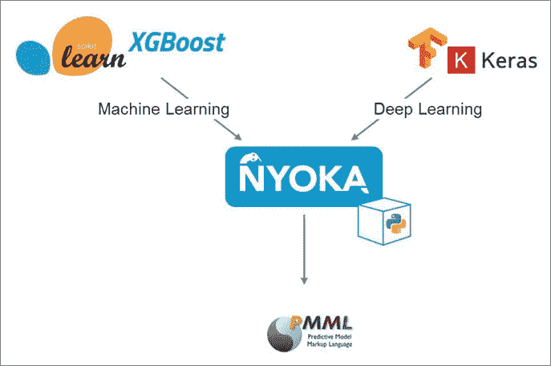
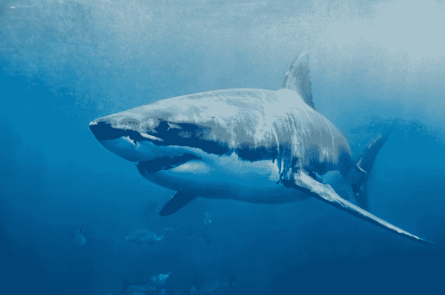

# 尼卡——蟒蛇动物园中的又一条蛇

> 原文：<https://dev.to/techcommunity/nyoka-yet-another-snake-in-the-python-zoo-745>

# 用 Python 支持数据科学

在本文中，我们介绍了 Nyoka，这是一个新的基于 Python 的库，可以将流行的机器学习/深度学习框架中的预测模型导出到 PMML。使用 Nyoka，数据科学家可以标准化和加速预测模型的部署过程。

*预测分析软件公司高级产品经理亚历山大·莱姆和人工智能分析软件公司高级总监莱纳·布哈特博士*

| 2018 年第四期 | [ 下载 PDFT4】](http://techcommunity.softwareag.com/ecosystem/download/techniques/2018-issue4/SAG_Nyoka_Release_TECHniques_Oct18_WEB.pdf) |
| --- | --- |

## 简介

8 月，Software AG 在 GitHub 上发布了 Nyoka，这是一个面向数据科学家的 Python 库。但是女奥卡到底是什么，它代表什么？使用 Nyoka，数据科学家可以将使用流行的基于 Python 的机器学习或深度学习框架创建的预测模型导出到 PMML(见下图 1)。“Nyoka”源自祖鲁语，意思是“蛇”，因此与它的蟒蛇表亲关系密切。

[](https://res.cloudinary.com/practicaldev/image/fetch/s--TFmgAhOs--/c_limit%2Cf_auto%2Cfl_progressive%2Cq_auto%2Cw_880/http://techcommunity.softwareag.com/documents/10157/10000089/nyoka1.png/13783207-d3f2-4c93-bd72-2a66d11ff45b%3Ft%3D1539765499003) 

**图 1:** 支持的机器学习和深度学习框架

PMML 是一种基于 XML 的预测模型交换格式，是统计和机器学习模型的领先标准。数据挖掘集团(DMG)是一个独立的、由供应商领导的联盟，近 20 年来一直支持和推动着 PMML 的发展。

Nyoka 强调了 Software AG 的人工智能(AI)战略和开放行业标准的愿景:PMML 是机器学习和深度学习模型的统一标准。

## 女娲在行动

让我们看一个简单的例子，说明如何使用 Nyoka 将预先训练好的用于图像识别的 MobileNet 模型从 Keras 导出到 PMML。这里我们假设您已经将所有必需的库加载到内存中。

```
# load pretrained keras mobilenet model model = mobilenet.MobileNet(input\_shape=(224, 224, 3), alpha=1.0, depth\_multiplier=1,                             dropout=1e-3, include\_top=True, weights='imagenet',                             input\_tensor=None, pooling=None, classes=1000)   # convert mobilnet model to PMML cnn\_pmml = KerasToPmml(model, model\_name="KerasMobileNet", dataSet="ImageNet")   # Save mobilenet PMML to disk cnn\_pmml.export(open("mobilenet\_demo.pmml, "w"),0) 
```

将名为 cnn_pmml 的对象构造为 Nyoka 类 KerasTopmml()的实例，这是将 MobileNet 模型转换为其 PMML 表示所需做的全部工作。将它保存到磁盘是通过调用 export()方法来完成的。

但是，当你不利用 PMML 档案来预测新的和看不见的价值时，它有什么用处呢？在我们的例子中，这些价值就是未分类的图像。

为了做到这一点，我们使用一个 PMML 文件的执行引擎，Zementis 服务器，软件公司在人工智能领域的旗舰产品。因此，下一步是将上面示例中创建的 PMML 文件部署到 Zementis 服务器实例中。我们再次假设您已经将所有必需的库加载到内存中。

```
pmml\_file = open(mobilenet\_demo.pmml,"r") pmml = {'file': pmml\_file} pmml\_upload = requests.post(adapaRS + "model/", files=pmml, auth=auth, verify=False,                             params = {"applyCleanser": "FALSE"}) 
```

该模型现已部署到 Zementis 服务器实例中，可用于对任何未见过的图像进行分类。我们将发送下面的图片到服务器，显示一条大白鲨。

[](https://res.cloudinary.com/practicaldev/image/fetch/s--qkZ17pOg--/c_limit%2Cf_auto%2Cfl_progressive%2Cq_auto%2Cw_880/http://techcommunity.softwareag.com/documents/10157/10000089/nyoka2.jpg/fc1e5eb3-db5a-40a8-8c23-aa86a98ea642%3Ft%3D1539765502577) 

**图 2:** 图像我们要分类

```
f = open("shark\_224\_224.png", "rb") files ={'file':f.read()} resp = requests.post(adapaRS+'apply/KerasMobileNet' , auth=auth, files=files,headers={},verify=False) 
```

好奇 Zementis 服务器的分类结果是什么？我们去看看吧！

```
Print(resp.text) { "model" : "KerasMobileNet", "outputs" : [{ "top1\_prob" : 0.9951145648956299, "predictedValue\_predictions" : "great\_white\_shark", "top5\_prob" : "great\_white\_shark:0.9951145648956299,tiger\_shark:0.0029412976000458,sturgeon:0.0012288052821531892,dugong:3.0053118825890124E-4,killer\_whale:2.2845140483696014E-4" }] } 
```

可以看到，部署的 MobileNet 模型将图片归类为大白鲨的概率为 99.5%。

检查输出，您会发现 Zementis 服务器不仅给出了最佳分类结果和相应的概率，而且实际上给出了五个最佳结果。

## 结论

在本文中，我们只是触及了 Nyoka 能力的皮毛。有了 Nyoka，你甚至可以为专门的/单独的模型类型创建自己的导出器。

你想了解更多关于尼奥卡的事情，并亲自进行一次深潜吗？请查看以下链接:

*   Nyoka 可以在 GitHub 上获得，包括文档和基于 Jupyter 笔记本的教程。如果你有关于 Nyoka 的反馈和问题——只要打开一个 [GitHub 问题](https://github.com/nyoka-pmml/nyoka/issues),我们会给你回复！
*   如果您想更进一步，将您生成的 PMML 文件付诸实施，请为我们的 PMML 执行引擎 Zementis Server 获得[免费试用许可。](https://aws.amazon.com/marketplace/pp/B07FRBG344)

[了解有关 Zementis 的更多信息，并立即下载免费试用版。](https://www.softwareag.com/corporate/products/apama_webmethods/zementis/default)