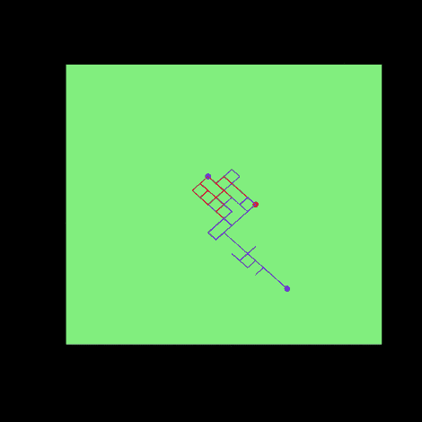
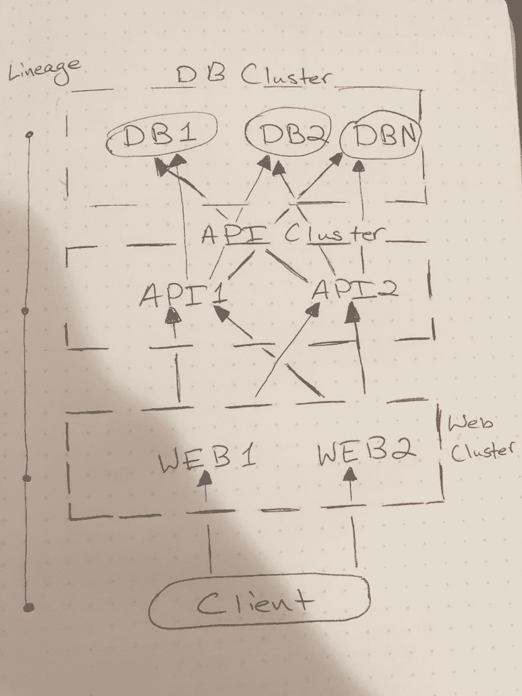

# O11ycon 访谈:彼得·阿尔瓦罗博士，“专家的黄昏”

> 原文：<https://dev.to/dangolant/o11ycon-talks-dr-peter-alvaro-twilight-of-the-experts-45e4>

这篇文章是一篇关于 [o11ycon](http://o11ycon.io) 的大型文章的一部分，如果你想了解更多，你可以在这里查看我的完整摘要。如果你想联系，请在 [dev.to](http://dev.to) 上关注我，或者随时在 Twitter [@dangolant](http://twitter.com/dangolant) 上联系我。

在今天的第二天开始时，Peter Alvaro 博士为观众调查了容错研究的现状。Alvaro 博士将这些当前和历史的容错系统设计方法框定为业界已经开始相信的“神话”,并为这些实践的不可持续性提出了强有力的理由，然后提出了自己的解决方案，至少解决了我们的一些问题。

(以防不明显，我对标题做了一些改动)

# 神话 1:牧师和他们的地狱魔法师

[T2】](https://res.cloudinary.com/practicaldev/image/fetch/s--ysU1dI2y--/c_limit%2Cf_auto%2Cfl_progressive%2Cq_auto%2Cw_880/https://thepracticaldev.s3.amazonaws.com/i/0xia6yn04t6g80so35sl.png)

阿尔瓦罗博士讲述的第一个神话是**专家、**大写的 E，他们创造的抽象概念，以及基于该领域这些个人远见卓识的天才的研究。在过去，技术专家已经能够通过建立现有的协议和算法来避免我们所有人面临的一些最困难的问题，处理诸如[可靠存储](https://en.wikipedia.org/wiki/RAID)、[消息传递](https://en.wikipedia.org/wiki/Out-of-order_delivery)和[安全加密](https://en.wikipedia.org/wiki/Elliptic-curve_cryptography)之类的事情，通过接口*下面只有巨头们才能漫游*。当被抽象的部分相对受限时，这种情况是成立的，并且它们本身不是位于我们所知道的*泄漏抽象*的堆之上。我们今天面临的问题有着不同的规模，我们站在巨人的肩膀上，却没有从他们身上带走任何东西，甚至我们最好的发明也在角落里变得支离破碎。基本上，阿尔瓦罗博士的断言是，虽然专家和奇才能够给工业领域的人们带来惊人的发明，但总有一天，即使是地球上最聪明的人也无法在他们的头脑中包含知识和无数的状态排列环境，而这些知识和环境是创造能够经受住我们对当今分布式系统的考验的抽象概念所必需的。他指出，像停滞不前的 NFS 和 T21 这样的努力，以及 RPC 和排队的缺陷，证明了在分布式系统中，不存在完美的故障检测器。如果我们不能可靠地检测失败，我们怎么能梦想断言一个抽象的有效性呢？

# 误区二:数学会让痛苦停止

[T2】](https://res.cloudinary.com/practicaldev/image/fetch/s--SpZj_F1a--/c_limit%2Cf_auto%2Cfl_progressive%2Cq_66%2Cw_880/https://thepracticaldev.s3.amazonaws.com/i/h2r49i62kzoatq4g48ak.gif)

这就把好医生带到了第二个神话:正式验证。形式验证依赖于数学模型，当运行一组足够详尽的状态和转换时，*证明*给定的算法或系统在所有情况下都“正确”地实现了既定的目标。这里的问题是，用阿尔瓦罗博士的话说，“你不能用模型检验网飞。”他知道，因为显然有人尝试过。模拟系统中的一个任意故障可以相当快地完成(我在之前的草稿中写下了准确的时间，但是概念吃得太多了，想想小的)。然而，容错能力取决于对故障组合的弹性，试图模拟所有故障组合*仅仅四个并发故障*就将模型检查的运行时间延长至 12 *周。*由于容错搜索的这种组合性质，试图对超过 4 个并发故障进行模型检查会非常快地接近宇宙类型号的热死。已经尝试对完形系统的子集进行模型检查，但是这仍然是昂贵的，并且可能掩盖源于那些系统集成的失败。

# 误区三:数字+术士=除了命理之外的任何东西

[T2】](https://res.cloudinary.com/practicaldev/image/fetch/s--m1hTm-9v--/c_limit%2Cf_auto%2Cfl_progressive%2Cq_66%2Cw_880/https://thepracticaldev.s3.amazonaws.com/i/zhr0h8ipf2dvp1hpyr4t.gif)

业界提出的解决方案是将这些应用程序分解成片段或流程，然后在给定的向量中有选择地寻找开始产生大量错误的组合。这种方法不可避免地导致了专家故障猎人的出现，产生了我们前两个神话的一种奇怪的混合方法，并创造了我们的第三个神话。阿尔瓦罗博士称之为“天才引导的遍历”可能的故障组合的整个领域，对于一个应用程序正变得越来越复杂的行业来说，这是一个站不住脚的解决方案，因为这种方法过于依赖一小撮人的直觉，产生了不均衡且难以衡量的结果。忘记了这样一个事实，即这种小规模的组合魔术师(实际上是混沌工程师或 Jepsen 测试人员)变得更加昂贵，不仅因为一小组系统变得更加复杂，而且因为复杂的、易出错的系统的总数增加，很难评估这些从业者中的一个是否真的在这样一个小领域中是可靠的，并且很难评估他们是否能够成功地执行他们的角色，如果它在很大程度上依赖于很好地管理一个组织。总之*太多该死的变量*。

正如我在这篇文章的链接中提到的，我试图解释这个特定的演讲就像一只狮子狗被分派了解释三角学的任务，所以我强烈建议你在这篇演讲发布到 o11ycon.io 后观看它，这是在我破坏阿尔瓦罗博士提出的(相当酷的)解决方案之前给你的最后警告。

# 我们的解脱

解决所有这些疯狂的方法是阿尔瓦罗博士称之为血统驱动故障注入的方法。本质上，假设所有容错都基于至少某种形式的冗余，我们可以假设所有容错都依赖于跨时间的冗余*或跨空间的冗余*。*基于空间的冗余的一个例子是启动服务器的另一个实例，而基于时间的冗余可以是当请求失败时对重试进行排队。正如 Alvaro 所说，这些冗余方案存在于特定的执行路径或谱系中。通过将这些流程并排可视化(演讲中有一张很棒的幻灯片，我不想破坏它),你可以开始看到在暴露错误的过程中，删除某个谱系中的某些点*是多么富有成效*,而其他策略显然是没有实际意义的。比方说，给定一个模型，它有一个 web 客户端、一个 web 服务器集群、一个 API 服务器集群和一个 DB 服务器集群，您必须导致服务中断，并且允许您导致两个故障。*

<figure>

[T2】](https://res.cloudinary.com/practicaldev/image/fetch/s--BUeXk-yv--/c_limit%2Cf_auto%2Cfl_progressive%2Cq_auto%2Cw_880/https://thepracticaldev.s3.amazonaws.com/i/xv15kkdp9r25f6rthu6e.jpg)

<figcaption>This looks so much easier when Vaidehi Joshi does it...</figcaption>

</figure>

在上面的例子中，很明显你会想要破坏两个 API 服务器，或者两个 web 服务器。这是一个过于简单的例子，“淘汰”可能是简单的轻微降低响应时间，而现实生活中的目标很可能是由多个血统中的共享依赖关系引起的级联故障。尽管如此，你可能会看到这是一个令人信服的方法，可以操作，然后自动化，正是因为它是如此简单。关键是，它依赖于能够跟踪请求，并在整个系统中看到这些请求的上下文，因此，为了从中受益，您必须开始构建可观察性。

# 最佳报价

> 如果你从今天的演讲中有任何收获，前三个应该是:
> 
> *   可组合性是最后一个难题
> *   牧师也是人
> *   我们可以自动化专家的特殊天赋

我希望你喜欢彼得·阿尔瓦罗博士在 o11ycon 的精彩演讲。如果你想阅读我当天的完整回顾，你可以在这里找到它，如果你想联系，请随时关注我的【T2 发展】到或 twitter [@dangolant](http://twitter.com/dangolant) 。