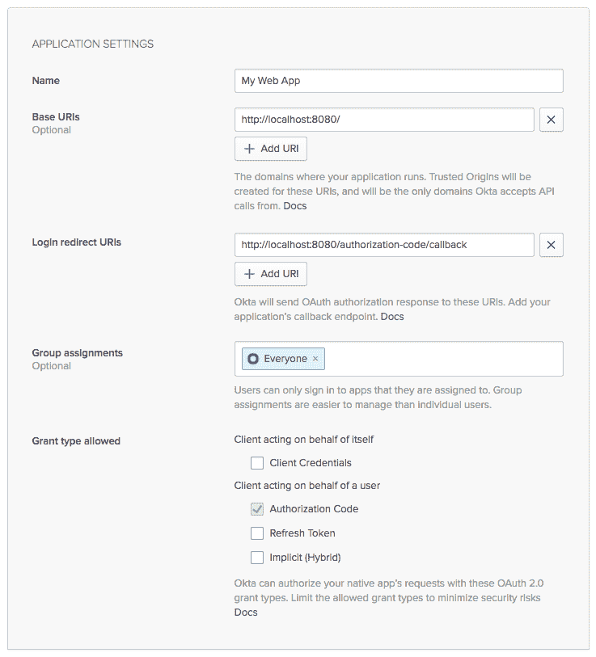

# 从命令行运行 OAuth 2.0

> 原文：<https://dev.to/oktadev/oauth-20-from-the-command-line-4d15>

所以您发现自己正在编写命令行脚本，并且需要与使用 OAuth 2.0 的 API 对话？从命令行脚本获取 OAuth 访问令牌的典型方法通常包括将授权代码复制并粘贴到终端中。但是我们可以做得更好！

在本教程中，我将向您展示如何编写一个命令行脚本来完成 OAuth 交换，而无需复制和粘贴任何长字符串！为什么？因为它有点用处，但最重要的是，因为它很有趣！

## Okta 入门

我们将编写这个示例应用程序来与 Okta API 对话，但是它应该很容易适应您正在使用的任何 OAuth 2.0 服务。首先，[注册一个免费的开发者帐户](https://developer.okta.com/signup/)，并在创建帐户后返回这里。

为什么是 Okta？嗯，因为 Okta 是一个免费使用的 API 服务，它存储用户帐户，并处理用户认证、授权、社交登录、密码重置等。—简单。Okta 利用 OAuth 2.0 这样的开放标准来实现无缝集成。

我们首先需要在 Okta 开发人员仪表板中创建一个 OAuth 应用程序。在你账户的应用部分，点击**添加应用**，选择**网页**。(是的，我意识到这是违反直觉的，但是选择 **Web** 就是告诉 Okta 我们想要做 OAuth [授权代码流](https://dev.to/oktadev/what-is-the-oauth-20-authorization-code-grant-type-368m)。)您可以接受应用程序设置中的所有默认设置。

[T2】](https://res.cloudinary.com/practicaldev/image/fetch/s--rGas2rpR--/c_limit%2Cf_auto%2Cfl_progressive%2Cq_auto%2Cw_880/https://developer.okta.com/assets/blog/oauth-2-command-line/create-app-e26389f3c54b648f687e07f380153ee1cd74f1c3b229e4c814eabab1d5775c4c.png)

点击**完成**，你将进入下一个屏幕，在那里你可以获得你的新客户 ID 和密码。复制这两个值并输入到下面的代码中，将它们添加到一个名为`login.php`的新 PHP 文件中。

```
<?php
$client_id = '{yourClientId}';
$client_secret = '{yourClientSecret}'; 
```

Enter fullscreen mode Exit fullscreen mode

我们还需要找到授权服务器元数据 URL。从顶部菜单中选择**API**->-**授权服务器**。您应该在列表中看到一个授权服务器，`default`。单击该按钮，将元数据 URI 填充到您的 PHP 文件中，如下所示:

```
$metadata = http('https://{yourOktaDomain}/oauth2/default/.well-known/oauth-authorization-server'); 
```

Enter fullscreen mode Exit fullscreen mode

## OAuth 2.0 命令行上的窍门

我们避免在登录流程中复制和粘贴任何东西的方法是让我们的 PHP 命令行脚本在我们需要时启动一个迷你 HTTP 服务器，并在我们完成时关闭它。

该脚本将启动浏览器访问授权 URL，当 Okta 将用户重定向回迷你内置服务器时，我们将捕获该响应，提取授权代码，关闭服务器，并继续执行脚本正在执行的任何操作。

首先，我们需要定义一些在设置服务器时将会用到的变量，以及定义一个帮助我们发出 HTTP 请求的函数。将以下代码复制到您的 PHP 文件中。

```
$ip = '127.0.0.1';
$port = '8080';

$redirect_uri = 'http://'.$ip.':'.$port.'/authorization-code/callback';
$socket_str = 'tcp://'.$ip.':'.$port;

function http($url, $params=false) {
  $ch = curl_init($url);
  curl_setopt($ch, CURLOPT_RETURNTRANSFER, true);
  if($params)
    curl_setopt($ch, CURLOPT_POSTFIELDS, http_build_query($params));
  return json_decode(curl_exec($ch));
} 
```

Enter fullscreen mode Exit fullscreen mode

## 启动 OAuth 2.0 流程

我们现在准备开始 OAuth 流程。首先，为了增加安全性，我们生成一个随机的“状态”值。因为我们是在命令行脚本中构建的，所以我们不需要担心将它存储在会话或任何东西中，因为我们将生成它，然后使用它，然后完成它。

```
$state = bin2hex(random_bytes(5)); 
```

Enter fullscreen mode Exit fullscreen mode

接下来，我们可以使用来自服务器元数据的`authorization_endpoint`构建授权 URL，我们将打开该 URL 来启动流程。

```
$authorize_url = $metadata->authorization_endpoint.'?'.http_build_query([
  'response_type' => 'code',
  'client_id' => $client_id,
  'redirect_uri' => $redirect_uri,
  'state' => $state,
]); 
```

Enter fullscreen mode Exit fullscreen mode

到目前为止，这是一个典型的 OAuth 请求，还没有什么特别独特的事情发生。

因为我们将从命令行运行它，我们显然不能使用发送 HTTP 重定向到浏览器的普通技术，因为我们不在浏览器中！相反，我们需要使用一个 shell 命令来启动一个指向该 URL 的新浏览器。

```
echo "Open the following URL in a browser to continue\n";
echo $authorize_url."\n";
shell_exec("open '".$authorize_url."'"); 
```

Enter fullscreen mode Exit fullscreen mode

在 Mac 上，`open`将尝试使用系统默认处理程序打开传递给它的任何参数。因为我们给了它一个 URL，它将打开一个浏览器窗口来访问这个 URL。如果你不在 mac 上，那么你必须点击显示在终端上的 URL。

现在诀窍来了。该脚本刚刚启动了一个到授权服务器的浏览器窗口，用户现在必须登录。之后，浏览器窗口将被重定向回`http://127.0.0.1:8080/authorization-code/callback`，并在查询字符串中包含一个授权码。这意味着我们需要一个 HTTP 服务器来处理这个请求，这样我们就可以从 URL 中提取授权代码。

因此，我们将在命令行脚本中创建一个迷你 HTTP 服务器。它将在端口 8080 上打开一个套接字，等待完整的 HTTP 请求，发送回一个简单的响应，并返回查询字符串中的授权代码。这里有一小段代码可以做到这一点，它改编自一个真正的命令行工具，由 [Christian Weiske](http://cweiske.de/shpub.htm) 编写。将下面的函数添加到你的 PHP 文件中。

```
function startHttpServer($socketStr) {
  // Adapted from http://cweiske.de/shpub.htm

  $responseOk = "HTTP/1.0 200 OK\r\n"
    . "Content-Type: text/plain\r\n"
    . "\r\n"
    . "Ok. You may close this tab and return to the shell.\r\n";
  $responseErr = "HTTP/1.0 400 Bad Request\r\n"
    . "Content-Type: text/plain\r\n"
    . "\r\n"
    . "Bad Request\r\n";

  ini_set('default_socket_timeout', 60 * 5);

  $server = stream_socket_server($socketStr, $errno, $errstr);

  if(!$server) {
    Log::err('Error starting HTTP server');
    return false;
  }

  do {
    $sock = stream_socket_accept($server);
    if(!$sock) {
      Log::err('Error accepting socket connection');
      exit(1);
    }
    $headers = [];
    $body = null;
    $content_length = 0;
    //read request headers
    while(false !== ($line = trim(fgets($sock)))) {
      if('' === $line) {
        break;
      }
      $regex = '#^Content-Length:\s*([[:digit:]]+)\s*$#i';
      if(preg_match($regex, $line, $matches)) {
        $content_length = (int)$matches[1];
      }
      $headers[] = $line;
    }
    // read content/body
    if($content_length > 0) {
      $body = fread($sock, $content_length);
    }
    // send response
    list($method, $url, $httpver) = explode(' ', $headers[0]);
    if($method == 'GET') {
      #echo "Redirected to $url\n";
      $parts = parse_url($url);
      #print_r($parts);
      if(isset($parts['path']) && $parts['path'] == '/authorization-code/callback'
        && isset($parts['query'])
      ) {
        parse_str($parts['query'], $query);
        if(isset($query['code']) && isset($query['state'])) {
          fwrite($sock, $responseOk);
          fclose($sock);
          return $query;
        }
      }
    }
    fwrite($sock, $responseErr);
    fclose($sock);
  } while (true);
} 
```

Enter fullscreen mode Exit fullscreen mode

现在我们可以用这个函数启动一个服务器，等待浏览器点击它。

```
// Start the mini HTTP server and wait for their browser to hit the redirect URL
// Store the query string parameters in a variable
$auth = startHttpServer($socket_str); 
```

Enter fullscreen mode Exit fullscreen mode

[T2】](https://res.cloudinary.com/practicaldev/image/fetch/s--Rb0ueCTM--/c_limit%2Cf_auto%2Cfl_progressive%2Cq_auto%2Cw_880/https://developer.okta.com/assets/blog/oauth-2-command-line/start-login-b3babdb83ba4241fe5ca60267d2305f17d81a9f07b98ae22792af0f114a598c1.png)

## 处理授权响应

此时，用户登录后，他们的浏览器会被重定向到`http://127.0.0.1:8080/authorization-code/callback?code=XXXX&state=YYYY`。我们内置的 web 服务器将查看请求的 URL，并提取代码和状态参数。我们需要仔细检查 state 参数是否与我们在开始时设置的参数相匹配，然后我们就可以使用代码了。

[](https://res.cloudinary.com/practicaldev/image/fetch/s--OckAQBBo--/c_limit%2Cf_auto%2Cfl_progressive%2Cq_auto%2Cw_880/https://developer.okta.com/assets/blog/oauth-2-command-line/browser-redirect-6171f9498f67d8418ffed7646fb627267f32300e4168a0a9af88a62d0f2f8024.png)T3】

```
if($auth['state'] != $state) {
  echo "Wrong 'state' parameter returned\n";
  exit(2);
}

$code = $auth['code']; 
```

Enter fullscreen mode Exit fullscreen mode

从这里开始，我们将继续处理普通的 OAuth 授权码请求，就像任何其他应用程序一样。我们向令牌端点发出 POST 请求，将授权码换成访问令牌。

```
echo "Getting an access token...\n";
$response = http($metadata->token_endpoint, [
  'grant_type' => 'authorization_code',
  'code' => $code,
  'redirect_uri' => $redirect_uri,
  'client_id' => $client_id,
  'client_secret' => $client_secret,
]);

if(!isset($response->access_token)) {
  echo "Error fetching access token\n";
  exit(2);
}

$access_token = $response->access_token; 
```

Enter fullscreen mode Exit fullscreen mode

现在我们在`$access_token`中有了一个访问令牌！如果这是一个真正的工具，您可能希望将它存储在脚本下次运行时可以找到的地方。但是出于演示的目的，我们不会将它存储在任何地方。相反，我们将请求找出刚刚登录的用户名。

```
echo "Getting the username...\n";
$token = http($metadata->introspection_endpoint, [
  'token' => $access_token,
  'client_id' => $client_id,
  'client_secret' => $client_secret,
]);

if($token->active == 1) {
  echo "Logged in as ".$token->username."\n";
  die();
} 
```

Enter fullscreen mode Exit fullscreen mode

这会向令牌自省端点发出请求，以查找登录者的用户名，将其打印到终端，然后退出。

[T2】](https://res.cloudinary.com/practicaldev/image/fetch/s--uVO0L3tE--/c_limit%2Cf_auto%2Cfl_progressive%2Cq_auto%2Cw_880/https://developer.okta.com/assets/blog/oauth-2-command-line/logged-in-45a2aea29c703ce80d264c2d2275f7e81265b03235849a340d97e1a67abca8b6.png)

就是这样！您可以打开一个终端，用下面的命令运行这段代码:

```
php login.php 
```

Enter fullscreen mode Exit fullscreen mode

你可以在 https://github.com/aaronpk/command-line-oauth 的 GitHub 上看到这个应用程序的完整源代码。

## 了解有关 OAuth 2.0 和 Okta 安全用户管理的更多信息

有关 OAuth 2.0 的更多信息和教程，请查看我们的其他博客帖子！

*   [在 5 分钟内为你的 PHP 应用添加认证](https://developer.okta.com/blog/2018/07/09/five-minute-php-app-auth)
*   [什么是 OAuth 2.0 授权码授予类型？](https://developer.okta.com/blog/2018/04/10/oauth-authorization-code-grant-type)
*   什么是 OAuth 2.0 隐式授权类型？
*   [用 Symfony 4 和 Vue 构建一个基本的 CRUD 应用](https://developer.okta.com//blog/2018/06/14/php-crud-app-symfony-vue)

一如既往，我们希望听到你对这篇文章的看法，或者任何其他的东西！请在评论中或在 Twitter 上联系我们！