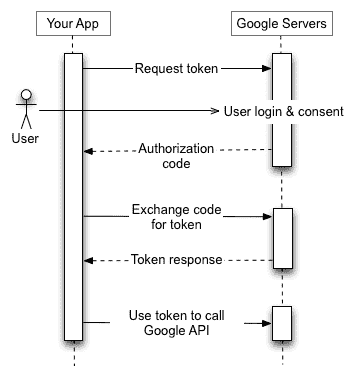

# Oauth2 与 Google in Go

> 原文：<https://dev.to/douglasmakey/oauth2-example-with-go-3n8a>

身份验证是任何应用程序中最常见的部分。您可以实现自己的身份验证系统，或者使用现有的多种方法之一，但是在本例中，我们将使用 OAuth2。

OAuth 是一种规范，允许用户授权访问他们的数据，而无需与该服务共享他们的用户名和密码，如果您想了解有关 Oauth2 的更多信息，请访问此处。

## 配置谷歌项目

首先，我们需要创建我们的 Google 项目并创建 OAuth2 凭证。

*   去谷歌云平台
*   创建一个新项目或选择一个已有的项目。
*   转到凭据，然后选择“OAuth 客户端 ID”创建一个新凭据
*   添加“授权重定向 URL”，对于本例`localhost:8000/auth/google/callback`
*   复制客户端 id 和客户端密码

## oauth 2 如何与谷歌合作

当您的应用程序将浏览器重定向到 Google URL 时，授权序列开始；该 URL 包括指示所请求的访问类型的查询参数。Google 处理用户认证、会话选择和用户同意。结果是一个授权码，应用程序可以用它来交换访问令牌和刷新令牌。

应用程序应该存储刷新令牌以备将来使用，并使用访问令牌来访问 Google API。一旦访问令牌过期，应用程序就使用刷新令牌来获取新的令牌。

[T2】](https://res.cloudinary.com/practicaldev/image/fetch/s--Ji3v9Mn7--/c_limit%2Cf_auto%2Cfl_progressive%2Cq_auto%2Cw_880/https://developers.google.com/accounimg/webflow.png)

## 我们去码吧

我们将使用包“golang.org/x/oauth2 ”,该包为 oauth2 授权和认证 HTTP 请求提供支持。

在你的工作目录中创建一个新的项目(文件夹)在我的例子中，我称它为“oauth2-example”，我们需要包含 oauth2 的包。

`go get golang.org/x/oauth2`

因此，在这个项目中，我们创建了一个 main.go.

```
package main

import (
    "fmt"
    "net/http"
    "log"
    "github.com/douglasmakey/oauth2-example/handlers"
)

func main() {
    server := &http.Server{
        Addr: fmt.Sprintf(":8000"),
        Handler: handlers.New(),
    }

    log.Printf("Starting HTTP Server. Listening at %q", server.Addr)
    if err := server.ListenAndServe(); err != http.ErrServerClosed {
        log.Printf("%v", err)
    } else {
        log.Println("Server closed!")
    }
} 
```

Enter fullscreen mode Exit fullscreen mode

我们使用 http 创建了一个简单的服务器。服务器并运行。

接下来，我们创建包含应用程序处理程序的文件夹“handlers ”,在该文件夹中创建“base.go”。

```
package handlers

import (
    "net/http"
)

func New() http.Handler {
    mux := http.NewServeMux()
    // Root
    mux.Handle("/",  http.FileServer(http.Dir("templates/")))

    // OauthGoogle
    mux.HandleFunc("/auth/google/login", oauthGoogleLogin)
    mux.HandleFunc("/auth/google/callback", oauthGoogleCallback)

    return mux
} 
```

Enter fullscreen mode Exit fullscreen mode

我们使用 **http。ServeMux** 为了处理我们的端点，接下来我们创建根端点“/”来为一个简单的模板提供一个最小的 HTML & CSS，在这个例子中我们使用“http。http。文件服务器”，该模板为“index.html”并位于文件夹“templates”中。

我们还用 Google“/auth/Google/log in”和“/auth/google/callback”为 Oauth 创建了两个端点。还记得我们在 Google 控制台中配置应用程序的时候吗？回拨 url 必须相同。

接下来，我们在 handlers 中创建另一个文件，我们将其命名为“oauth_google.go”，该文件包含了在我们的应用程序中使用 google 处理 oauth 的所有逻辑。

我们用 auth 声明 var googleOauthConfig。配置来与 Google 通信。作用域:OAuth 2.0 作用域提供了一种方法来限制授予访问令牌的访问量。

```
var googleOauthConfig = &oauth2.Config{
    RedirectURL:  "http://localhost:8000/auth/google/callback",
    ClientID:     os.Getenv("GOOGLE_OAUTH_CLIENT_ID"),
    ClientSecret: os.Getenv("GOOGLE_OAUTH_CLIENT_SECRET"),
    Scopes:       []string{"https://www.googleapis.com/auth/userinfo.email"},
    Endpoint:     google.Endpoint,
} 
```

Enter fullscreen mode Exit fullscreen mode

### 处理程序 oauthGoogleLogin

该处理程序创建一个登录链接，并将用户重定向到该链接:

AuthCodeURL 接收状态是保护用户免受 CSRF 攻击的令牌。您必须始终提供一个非空字符串，并验证它是否与您的重定向回调上的状态查询参数相匹配，建议这是为每个请求随机生成的，这就是我们使用简单 cookie 的原因。

```
func oauthGoogleLogin(w http.ResponseWriter, r *http.Request) {

    // Create oauthState cookie
    oauthState := generateStateOauthCookie(w)
    u := googleOauthConfig.AuthCodeURL(oauthState)
    http.Redirect(w, r, u, http.StatusTemporaryRedirect)
}

func generateStateOauthCookie(w http.ResponseWriter) string {
    var expiration = time.Now().Add(365 * 24 * time.Hour)

    b := make([]byte, 16)
    rand.Read(b)
    state := base64.URLEncoding.EncodeToString(b)
    cookie := http.Cookie{Name: "oauthstate", Value: state, Expires: expiration}
    http.SetCookie(w, &cookie)

    return state
} 
```

Enter fullscreen mode Exit fullscreen mode

### [T1】处理程序 oauthGoogleCallback](#handler-oauthgooglecallback)

该处理程序检查状态是否等于 oauthStateCookie，并将代码传递给函数**getuserdatafromcgoogle**。

```
func oauthGoogleCallback(w http.ResponseWriter, r *http.Request) {
    // Read oauthState from Cookie
    oauthState, _ := r.Cookie("oauthstate")

    if r.FormValue("state") != oauthState.Value {
        log.Println("invalid oauth google state")
        http.Redirect(w, r, "/", http.StatusTemporaryRedirect)
        return
    }

    data, err := getUserDataFromGoogle(r.FormValue("code"))
    if err != nil {
        log.Println(err.Error())
        http.Redirect(w, r, "/", http.StatusTemporaryRedirect)
        return
    }

    // GetOrCreate User in your db.
    // Redirect or response with a token.
    // More code .....
    fmt.Fprintf(w, "UserInfo: %s\n", data)
}

func getUserDataFromGoogle(code string) ([]byte, error) {
    // Use code to get token and get user info from Google.

    token, err := googleOauthConfig.Exchange(context.Background(), code)
    if err != nil {
        return nil, fmt.Errorf("code exchange wrong: %s", err.Error())
    }
    response, err := http.Get(oauthGoogleUrlAPI + token.AccessToken)
    if err != nil {
        return nil, fmt.Errorf("failed getting user info: %s", err.Error())
    }
    defer response.Body.Close()
    contents, err := ioutil.ReadAll(response.Body)
    if err != nil {
        return nil, fmt.Errorf("failed read response: %s", err.Error())
    }
    return contents, nil
} 
```

Enter fullscreen mode Exit fullscreen mode

### 全代码 oauth_google.go

```
package handlers

import (
    "golang.org/x/oauth2"
    "golang.org/x/oauth2/google"
    "net/http"
    "fmt"
    "io/ioutil"
    "context"
    "log"
    "encoding/base64"
    "crypto/rand"
    "os"
    "time"
)

// Scopes: OAuth 2.0 scopes provide a way to limit the amount of access that is granted to an access token.
var googleOauthConfig = &oauth2.Config{
    RedirectURL:  "http://localhost:8000/auth/google/callback",
    ClientID:     os.Getenv("GOOGLE_OAUTH_CLIENT_ID"),
    ClientSecret: os.Getenv("GOOGLE_OAUTH_CLIENT_SECRET"),
    Scopes:       []string{"https://www.googleapis.com/auth/userinfo.email"},
    Endpoint:     google.Endpoint,
}

const oauthGoogleUrlAPI = "https://www.googleapis.com/oauth2/v2/userinfo?access_token="

func oauthGoogleLogin(w http.ResponseWriter, r *http.Request) {

    // Create oauthState cookie
    oauthState := generateStateOauthCookie(w)

    /*
    AuthCodeURL receive state that is a token to protect the user from CSRF attacks. You must always provide a non-empty string and
    validate that it matches the the state query parameter on your redirect callback.
    */
    u := googleOauthConfig.AuthCodeURL(oauthState)
    http.Redirect(w, r, u, http.StatusTemporaryRedirect)
}

func oauthGoogleCallback(w http.ResponseWriter, r *http.Request) {
    // Read oauthState from Cookie
    oauthState, _ := r.Cookie("oauthstate")

    if r.FormValue("state") != oauthState.Value {
        log.Println("invalid oauth google state")
        http.Redirect(w, r, "/", http.StatusTemporaryRedirect)
        return
    }

    data, err := getUserDataFromGoogle(r.FormValue("code"))
    if err != nil {
        log.Println(err.Error())
        http.Redirect(w, r, "/", http.StatusTemporaryRedirect)
        return
    }

    // GetOrCreate User in your db.
    // Redirect or response with a token.
    // More code .....
    fmt.Fprintf(w, "UserInfo: %s\n", data)
}

func generateStateOauthCookie(w http.ResponseWriter) string {
    var expiration = time.Now().Add(365 * 24 * time.Hour)

    b := make([]byte, 16)
    rand.Read(b)
    state := base64.URLEncoding.EncodeToString(b)
    cookie := http.Cookie{Name: "oauthstate", Value: state, Expires: expiration}
    http.SetCookie(w, &cookie)

    return state
}

func getUserDataFromGoogle(code string) ([]byte, error) {
    // Use code to get token and get user info from Google.

    token, err := googleOauthConfig.Exchange(context.Background(), code)
    if err != nil {
        return nil, fmt.Errorf("code exchange wrong: %s", err.Error())
    }
    response, err := http.Get(oauthGoogleUrlAPI + token.AccessToken)
    if err != nil {
        return nil, fmt.Errorf("failed getting user info: %s", err.Error())
    }
    defer response.Body.Close()
    contents, err := ioutil.ReadAll(response.Body)
    if err != nil {
        return nil, fmt.Errorf("failed read response: %s", err.Error())
    }
    return contents, nil
} 
```

Enter fullscreen mode Exit fullscreen mode

## 让我们运行并测试

```
go run main.go 
```

Enter fullscreen mode Exit fullscreen mode

代码为 [Repo](https://github.com/douglasmakey/oauth2-example) 的存储库