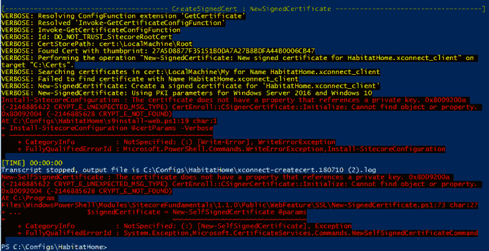
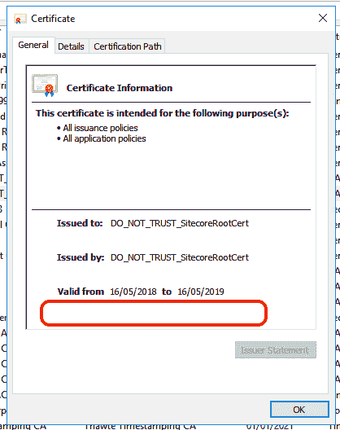
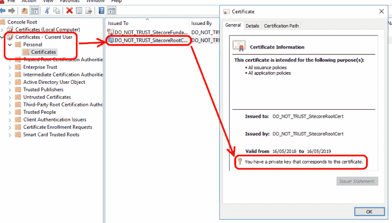

# 看起来模糊的 SIF 证书错误

> 原文：<https://dev.to/jermdavis/obscure-looking-sif-certificate-errors-9k2>

继续我围绕 Sitecore 9 的模糊错误发现之旅，本周 SIF 已经为我在控制台窗口中添加了许多红色。我不确定有多少人会有这种情况，但是如果有很多人都需要在一台机器上安装他们自己的 Sitecore 9 实例，这可能会很有趣:

## 我的问题……

在一家网络代理公司工作，我们有多个开发团队，他们共享开发和测试基础设施。到目前为止，我们已经愉快地在 web 服务器上安装了 Sitecore 的多个实例，使用 [SIM](http://dl.sitecore.net/updater/sim/) 没有任何问题。但是最近我是第二个尝试使用共享脚本通过 [SIF](https://dev.sitecore.net/Downloads/Sitecore_Installation_Framework.aspx) 在一台机器上安装网站的人。它并不快乐。

SIF 过程的第一步是生成用于与 xConnect 通信的证书:

```
#install client certificate for xconnect  $certParams  =  @{  Path  =  "$PSScriptRoot\xconnect-createcert.json"  CertificateName  =  "$prefix.xconnect_client"  }  Install-SitecoreConfiguration  @certParams  -Verbose 
```

Enter fullscreen mode Exit fullscreen mode

但那对我来说失败了。日志包括:

```
[---------------------------------------- CreateSignedCert : NewSignedCertificate ------------------------------------]
VERBOSE: Resolving ConfigFunction extension 'GetCertificate'
VERBOSE: Resolved 'Invoke-GetCertificateConfigFunction'
VERBOSE: Invoke-GetCertificateConfigFunction
VERBOSE: Id: DO_NOT_TRUST_SitecoreRootCert
VERBOSE: CertStorePath: cert:\LocalMachine\Root
VERBOSE: Found Cert with thumbprint: 763C0AA20CB3A8038928AC09CDD6DF2F7CFB2EBA 27A5D8877F35151B0DA7A27B8BDFA44B0006CB47
**********************
Command start time: 20180710101333
**********************
PS>TerminatingError(New-SignedCertificate): "Cannot process argument transformation on parameter 'Signer'. Cannot convert the "System.Object[]" value of type "System.Object[]" to type "System.Security.Cryptography.X509Certificates.X509Certificate2"."
Install-SitecoreConfiguration : Cannot process argument transformation on parameter 'Signer'. Cannot convert the 
"System.Object[]" value of type "System.Object[]" to type 
"System.Security.Cryptography.X509Certificates.X509Certificate2".
At C:\Configs\HabitatHome\s9install-web.ps1:19 char:1
+ Install-SitecoreConfiguration @certParams -Verbose
+ ~~~~~~~~~~~~~~~~~~~~~~~~~~~~~~~~~~~~~~~~~~~~~~~~~~
    + CategoryInfo          : NotSpecified: (:) [Write-Error], WriteErrorException
    + FullyQualifiedErrorId : Microsoft.PowerShell.Commands.WriteErrorException,Install-SitecoreConfiguration
Install-SitecoreConfiguration : Cannot process argument transformation on parameter 'Signer'. Cannot convert the
"System.Object[]" value of type "System.Object[]" to type
"System.Security.Cryptography.X509Certificates.X509Certificate2".
At C:\Configs\HabitatHome\s9install-web.ps1:19 char:1
+ Install-SitecoreConfiguration @certParams -Verbose
+ ~~~~~~~~~~~~~~~~~~~~~~~~~~~~~~~~~~~~~~~~~~~~~~~~~~
    + CategoryInfo          : NotSpecified: (:) [Write-Error], WriteErrorException
    + FullyQualifiedErrorId : Microsoft.PowerShell.Commands.WriteErrorException,Install-SitecoreConfiguration 
```

Enter fullscreen mode Exit fullscreen mode

## 致力于解决问题

稍微搜索一下那个错误[,就出现了一个栈溢出帖子](https://sitecore.stackexchange.com/questions/10129/sitecore-9-installation-error-cannot-process-argument-transformation-on-paramet),解释了背景:Powershell 真正的意思是“我向 cert store 请求一个特定的 certificate ID，并且我得到了不止一个”——并且在脚本期望单个证书的情况下，你不能使用证书列表…

您可以在日志输出中看到这一点，因为列出了两个证书指纹:

```
VERBOSE: Found Cert with thumbprint: 763C0AA20CB3A8038928AC09CDD6DF2F7CFB2EBA 27A5D8877F35151B0DA7A27B8BDFA44B0006CB47 
```

Enter fullscreen mode Exit fullscreen mode

根据公认答案下的评论，我删除了两个证书中“较新的”一个，并试图弄清楚发生了什么。SIF 脚本创建了一个新版本的“DO _ NOT _ TRUST _ SitecoreRootCert”证书——它对我来说没有任何意义。这应该已经存在了，因为已经有一个 Sitecore 实例在机器上愉快地运行了。并且查看本地机器的证书存储，它确实在那里:

[T2】](https://jermdavis.files.wordpress.com/2018/07/certpresent.png)

看到这个，我脑海中闪现的第一个想法是“啊——也许这个也需要放在我的商店里？”所以我把根证书从机器存储复制到我的存储。这给了我一个不同的，同样模糊的错误:

[T2】](https://jermdavis.files.wordpress.com/2018/07/sifcerterror.png)

为了谷歌的利益，这次的错误是:

```
[---------------------------------------- CreateSignedCert : NewSignedCertificate ------------------------------------]
VERBOSE: Resolving ConfigFunction extension 'GetCertificate'
VERBOSE: Resolved 'Invoke-GetCertificateConfigFunction'
VERBOSE: Invoke-GetCertificateConfigFunction
VERBOSE: Id: DO_NOT_TRUST_SitecoreRootCert
VERBOSE: CertStorePath: cert:\LocalMachine\Root
VERBOSE: Found Cert with thumbprint: 27A5D8877F35151B0DA7A27B8BDFA44B0006CB47
VERBOSE: Performing the operation "New-SignedCertificate: New signed certificate for HabitatHome.xconnect_client" on target "C:\Certs".
VERBOSE: Searching certificates in cert:\LocalMachine\My for Name HabitatHome.xconnect_client
VERBOSE: Failed to find certificate with Name HabitatHome.xconnect_client
VERBOSE: New-SignedCertificate: Create a signed certificate for 'HabitatHome.xconnect_client'
VERBOSE: New-SignedCertificate: Using PKI parameters for Windows Server 2016 and Windows 10
**********************
Command start time: 20180710102049
**********************
PS>TerminatingError(New-SelfSignedCertificate): "The certificate does not have a property that references a private key. 0x8009200a (-2146885622 CRYPT_E_UNEXPECTED_MSG_TYPE) CertEnroll::CSignerCertificate::Initialize: Cannot find object or property. 0x80092004 (-2146885628 CRYPT_E_NOT_FOUND)"
>> TerminatingError(New-SelfSignedCertificate): "The certificate does not have a property that references a private key. 0x8009200a (-2146885622 CRYPT_E_UNEXPECTED_MSG_TYPE) CertEnroll::CSignerCertificate::Initialize: Cannot find object or property. 0x80092004 (-2146885628 CRYPT_E_NOT_FOUND)"
Install-SitecoreConfiguration : The certificate does not have a property that references a private key. 0x8009200a 
(-2146885622 CRYPT_E_UNEXPECTED_MSG_TYPE) CertEnroll::CSignerCertificate::Initialize: Cannot find object or property. 
0x80092004 (-2146885628 CRYPT_E_NOT_FOUND)
At C:\Configs\HabitatHome\s9install-web.ps1:19 char:1
+ Install-SitecoreConfiguration @certParams -Verbose
+ ~~~~~~~~~~~~~~~~~~~~~~~~~~~~~~~~~~~~~~~~~~~~~~~~~~
    + CategoryInfo          : NotSpecified: (:) [Write-Error], WriteErrorException
    + FullyQualifiedErrorId : Microsoft.PowerShell.Commands.WriteErrorException,Install-SitecoreConfiguration
Install-SitecoreConfiguration : The certificate does not have a property that references a private key. 0x8009200a
(-2146885622 CRYPT_E_UNEXPECTED_MSG_TYPE) CertEnroll::CSignerCertificate::Initialize: Cannot find object or property.
0x80092004 (-2146885628 CRYPT_E_NOT_FOUND)
At C:\Configs\HabitatHome\s9install-web.ps1:19 char:1
+ Install-SitecoreConfiguration @certParams -Verbose
+ ~~~~~~~~~~~~~~~~~~~~~~~~~~~~~~~~~~~~~~~~~~~~~~~~~~
    + CategoryInfo          : NotSpecified: (:) [Write-Error], WriteErrorException
    + FullyQualifiedErrorId : Microsoft.PowerShell.Commands.WriteErrorException,Install-SitecoreConfiguration 
```

Enter fullscreen mode Exit fullscreen mode

至少这次它只报告了一个证书指纹——所以这至少是一个进步。现在，这一次的重要信息似乎是“证书没有引用私钥的属性”——如果您去查看可信存储中的根证书的详细信息，您会发现它没有附加私钥:

[T2】](https://jermdavis.files.wordpress.com/2018/07/certhasnokey.png)

这有一定的道理——如果没有“根”证书的私钥，就不能用它来签署任何东西。签名的安全性依赖于密钥的私有部分。

向在这台机器上安装第一个 SIF 的人核实，他们的证书副本确实有一个私钥。

## 所以答案是…

…如果您是共享一些“标准”SIF 脚本的一组开发人员中的一员，并且您碰巧是第二个(或随后的)在使用它们的机器上安装 Sitecore 实例的 Windows 用户，您需要确保您有一份包含私钥的原始根证书的副本。

您可以通过要求首先进行安装的用户从他们的个人证书存储中为您导出它来获得:

[T2】](https://jermdavis.files.wordpress.com/2018/07/certwithkey.png)

如果他们导出包含密钥的证书，而您将它导入到您的存储中，那么 SIF 脚本将成功完成。

现在我知道了错误来自哪里，我想有一些其他的方法可以用来解决这个问题。这些是否与您相关可能取决于您在多个安装中的精确工作模式:

*   如果您不依赖于共享相同根证书的所有站点，您可以调整 SIF 脚本来为每个站点生成一个单独的根证书(通过确保根证书的 ID 中可能包含实例名？)
*   如果您确实想让所有站点共享一个根证书，但又不想到处移动证书，那么您可以调整 SIF 脚本，在生成和读取共享根证书时使用机器的个人证书存储，而不是用户的。
*   [ *编辑添加了*，正如下面的评论中指出的，只要有一个人人共享的单一用户帐户来进行安装也能解决问题…

但是这些事情改天再调查吧…