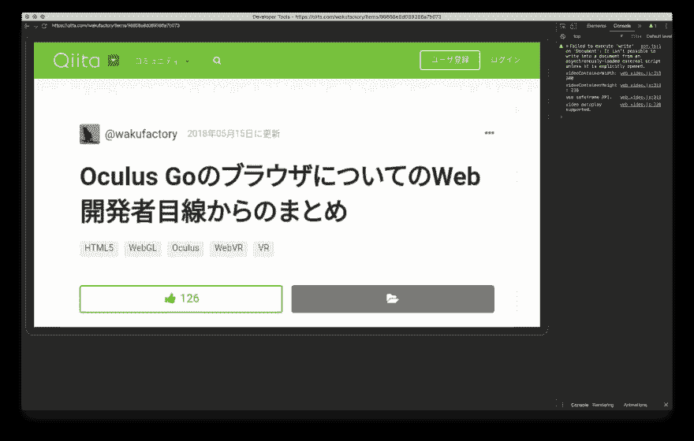
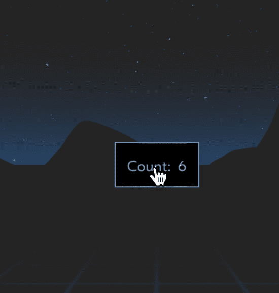

# 从 Oculus Go 开始开发 React 360

> 原文：<https://dev.to/jgs/oculus-go--react-360--29lg>

Oculus Go を買 https://note.mu/jgs/n/nd31e52697614った

顺便说一下，在这篇 FANBOX 的文章中，NetflixVR 从左上角的 Void theater 开始进入了咕噜咕噜跟随模式，所以很舒服

* * *

[从关于 Oculus Go 浏览器的 Web 开发者的角度看了总结- Qiita](https://qiita.com/wakufactory/items/98658e8d089386a7b073) 知道了 Oculus Go 搭载了相应的浏览器，所以 WebVR 不管是为了看什么东西而买的都过去了

大致的流程和上述的报道一样，但是有几个沉迷了，所以记下来

首先将 Oculus Go 置于开发者模式

这是[在 UE4 Oculus Go 开始 VR APP 开发之前的方法- Let's Enjoy Unreal Engine](http://unrealengine.hatenablog.com/entry/2018/05/04/232708) 在此进行详细说明

[https://dashboard.oculus.com](https://dashboard.oculus.com)组成团体后，手机的 oculus APP 上会出现设备的“其他设定”到“开发者模式”的项目，所以对此进行切换

访问`chrome://inspect/#devices`连接 USB 后，可以从 Chrome 的检查器中看到，但显示为`Pending authentication: please accept debugging session on the device.`很难访问

在 Oculus Go 上许可的话好像可以看到，但是完全没有显示类似的对话框

即使看了面向 Oculus 开发人员的页面，也公开了面向 Windows 的 zip，但没有特别提到 Mac

有 adb 吗？ 即使推测安装了 Android Studio

```
✈ ./adb shell
error: device unauthorized.
This adb server's $ADB_VENDOR_KEYS is not set
Try 'adb kill-server' if that seems wrong.
Otherwise check for a confirmation dialog on your device. 
```

等等，很难连接

如果在中途反复重启，控制器将无法识别 ...

这个也调查了一下，发现长按 Oculus 的按钮和后退按钮会再次配对

之后试着探索了很多，但是完全不能在 Oculus Go 上得到许可，从 APP 上尝试了各种各样的设定，在重新启动的时候出现了在启动时请求许可的对话框！ ！ ！ ！ ！ ！ ！ ！ ！ ！

经过各种探索，似乎设定了解锁模式后就不会出现允许调试的对话框 ...

另外，在许可时，即使选中“允许从这台机器始终调试”进行许可，如果设定了解锁模式，也会被吹走。

所以，在检查的时候，总之先删除解锁图案很像定式

删除这个解锁模式也是鬼门关，被要求输入“Oculus 密码”，但是即使沿着正规路线，我也没有设定过这样的号码。

没办法，只能从“重置 Oculus 密码”开始重置，但是在重置画面上被要求输入 8 位以上的密码，而在实际的密码输入画面上却输入了不太清楚只能输入 4 位的密码规格是否正确的号码，总之先输入了解锁键

监察员认为:

[T2】](https://res.cloudinary.com/practicaldev/image/fetch/s---sJ_FNOA--/c_limit%2Cf_auto%2Cfl_progressive%2Cq_auto%2Cw_880/https://i.gyazo.com/91254abb75a239e94c2d8bcc9ecbd321.png)

像这样，不戴医疗护目镜也能调试，所以想玩得很开心

但是，如果进入浏览器的 360 度模式，就会向控制台发出错误而死 ...

没办法，所以在 360 度模式的时候，先保持只能看到控制台和网络的程度

那么，因为我对 WebVR 不太了解，所以为了试试平时使用的 React 的`Learn Once Write Anywhere`，就想着摸一下 ReactVR，结果不知不觉中就改名为 React 360 了

在阅读文档之前，ReactVR 会在内部使用，分裂为 2 个，所以原来的 ReactVR 好像变成了 React 360

按照教程制作

https://github.com/e-jigsaw/Hello360 リポジトリ:

切去合适的目录`npm install react-360-cli`

`react-360 init Hello360`于是就给我做了扫描折叠，`npm install`开始了，但是也开始了 Electron 的安装，感觉像是要做什么用...

`npm start`之后`localhost:8081`就会启动，但是只会显示简单的 html，什么也做不了 ...

经常读文档的话，会写着要访问`localhost:8081/index.html`，所以打开这里就会用 CLI 开始构建

构建完成后，将出现可以 360 度环视的视图！ ！

编辑并重新加载源代码后，会迅速反映出来的神秘技术。 据观察，有一种依赖 React Native 周围技术的气氛

按照教程制作了带有 VR 按钮的柜台

[T2】](https://res.cloudinary.com/practicaldev/image/fetch/s---VP8w-xo--/c_limit%2Cf_auto%2Cfl_progressive%2Cq_66%2Cw_880/https://i.gyazo.com/2f948e372656b1009e37c865239da904.gif)

如果是浏览器的 360 度模式，找不到拍摄视频的手段，很为难。 如果知道解决方法的人能评论的话就帮大忙了...！ ！

今天就到此为止。 我开始考虑想做什么，但是 WebVR (标准好像是作为 WebXR 制定的吗？ )所以 UI 感觉和 Web 的那个完全不通，所以思考什么样的 UI 好看起来很开心

在 Scrapbox Meetup #4 中要进行三维搜索，什么样的 UI 比较好？ 虽然在 LT 上出现了这样的话题，但确实，因为我认为现在的 Web 界面是适合二维搜索的 UI，所以可以放到三维空间的面上，但从整体体验的设计上来看似乎很宽松。

Oculus Go 的主页画面的 UI 最终也是使用了定点设备的漏洞，所以感觉还差得远

虽然是百分之百的憧憬

[T2】](https://i.giphy.com/media/zg0IO38HIOH8k/giphy.gif)

要是能制作出像那样的 UI 就好了...！ ！