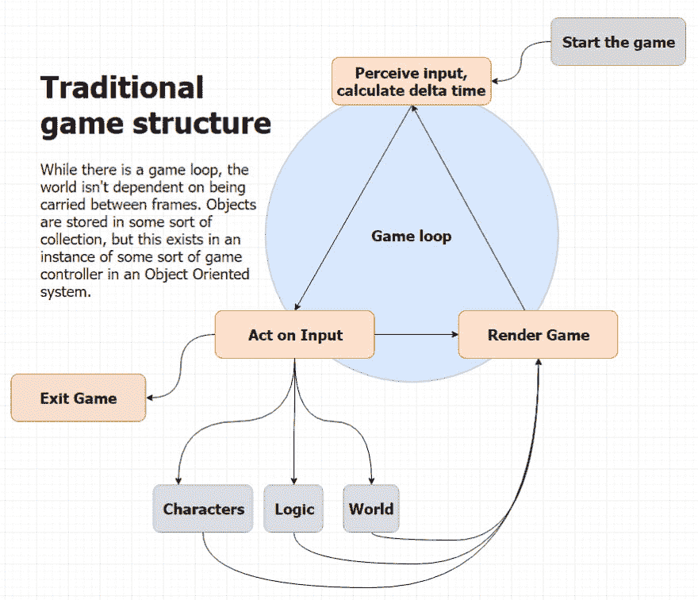
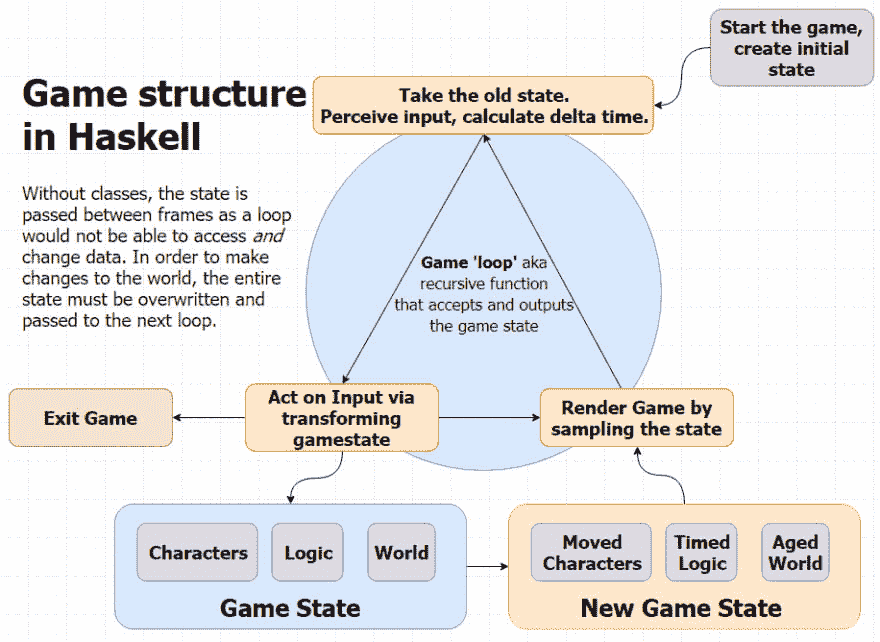

# 盒子和线程:Haskell 中的游戏开发

> 原文：<https://dev.to/ashe/of-boxes-and-threads-game-development-in-haskell-4g4m>

## 这个帖子到底是关于什么的？

用 Haskell 做游戏是一个开拓性的过程。尽管在 [wiki](https://wiki.haskell.org/Game_Development) 上有一个页面和一个完整的[子编辑](https://www.reddit.com/r/haskellgamedev/)致力于用这种美丽的语言制作游戏，但没有多少人真正成功地制作出任何接近当前游戏开发者已经可以实现的东西。我希望在这篇文章中尝试和交流我的经验。

我在游戏开发中看到的关于 Haskell 的最令人兴奋的事情是[任性的潮流](https://blog.chucklefish.org/wayward-tide-technical-details/)，一款由 [Chucklefish](https://blog.chucklefish.org/) 和 Haskell 一起制作的游戏。不幸的是，该项目似乎已经被搁置，已经对 Haskell 作为游戏语言的可行性产生了负面影响。也有 [Keera Studios](http://keera.co.uk/blog/) 用 Haskell 制作游戏和解决方案，然而在我看来，我不相信有足够的证据证明 Haskell 在游戏中的力量。

另一件令人兴奋的事情是约翰·卡马克在 2013 年 Quakecon 上的主题演讲。[约翰·卡马克](https://en.wikipedia.org/wiki/John_Carmack)是 [id 软件](https://en.wikipedia.org/wiki/Id_Software)的联合创始人，也是《毁灭战士》和《雷神之锤》等游戏的首席程序员。当如此重要的人开始以如此积极的方式谈论函数式编程时，它确实火了。我们都读过使用 Haskell 的收益，所以这种验证感觉很棒。我在下面嵌入了主题演讲，以防你错过了我提供的链接，它真的很有见地。

[https://www.youtube.com/embed/1PhArSujR_A](https://www.youtube.com/embed/1PhArSujR_A)

所以我们有一些 Haskell 可以为游戏行业做些什么的例子，但是最大的问题仍然没有解决: ***大家都在哪里？*** 。Haskell 中有很多游戏开发库，比如 [Apecs](https://github.com/jonascarpay/apecs) 。为什么没有更多的人做游戏？我们已经有了对 SDL2 的绑定，并且有很多有经验的程序员可以互相帮助。

## 我的经历

不满足于不知道和不理解缺乏发展背后的原因，我挑战自己在实践中学习。我试图将我在使用框架制作游戏方面的知识转化为与 Haskell 兼容的知识。这很难，但我总是说服自己回报将是惊人的。自然，使用高级语言会导致性能不如使用 C++之类的东西，但是一旦破解了，我相信开发会变得更加容易和更有价值。这真的促使我在比赛中努力。

> 在接下来的几节中，我将使用我的项目 [FirstGameHS](https://github.com/Crysikrend/FirstGameHS) 中的提交历史。作为一个初学者，你可以随意检查我犯的错误，嘲笑我的错误。请务必记住，这里要带走的是，这些是我从势在必行的游戏开发中得出的想法，如果我们要让功能游戏开发成为一件可行的事情，那么我们需要消除这些习惯，熨平皱褶，让每个人在进入这个世界时都能正确思考。

我从小处着手，浏览了 Lazyfoo 的 SDL 教程，试图回忆每一步是如何不同的。在这个阶段，游戏循环看起来非常简单，没有包含任何有趣的东西，所以我立即寻求更好的东西。[这个承诺](https://github.com/Crysikrend/FirstGameHS/commit/380789362919b55b024141fbcda935796700bd9c)是事情开始变得清晰的时候。这个提交包含一个可以用键盘控制的矩形。让我们开始吧，看一看一些东西。

```
-- This is our game world. It only consists of one lonely guy
-- who has a position and a velocity
data World
    = Guy
    { position :: Point V2 CDouble
    , velocity :: V2 CDouble
    } deriving (Show, Eq)

-- Our initial world starts out with the guy roughly in the middle
initialGuy :: World
initialGuy =
    Guy
    { position = P $ V2 (fromIntegral screenWidth / 2) (fromIntegral $ screenHeight - 100)
    , velocity = V2 0 0
    } 
```

Enter fullscreen mode Exit fullscreen mode

请原谅我没有提供完整的代码片段，但是您可以在我没有展示代码的情况下猜出`screenWidth`的确切意思。所以在我们代码的这个区域，我们开始定义游戏的`World`。因为只有一件事在改变，`World`不再是某种集合，而是我们角色`Guy`的别名。当`initialGuy`被用来创建一个`Guy`时，他被放置在屏幕中间，没有速度，简单。

```
processInput :: World -> SDL.EventPayload -> World
processInput world@(Guy _ curVel) (KeyPressed SDL.KeycodeRight) =
    world { velocity = walkingSpeed + curVel  }
processInput world@(Guy _ curVel) (KeyReleased SDL.KeycodeRight) =
    world { velocity = curVel - walkingSpeed  }
processInput w _ = w 
```

Enter fullscreen mode Exit fullscreen mode

下面是我们如何控制我们的角色。我只张贴了完整代码的一小部分，集中在右箭头键，但所有的方向都包括在内。我们在这里说的是，当你按下一个键时，你在那个方向上增加速度，当你放开它时，相反的情况发生。该函数将在迭代 SDL 事件的有效载荷时使用，这意味着自上一帧以来发生的所有事情都将通过该函数，然后检查当前事件是否相关。如果玩家同时按下左箭头键和右箭头键，速度将被抵消，留下 0 或恒定速度(`currentVelocity + walkingVelocity - walkingVelocity = currentVelocity`)。这里没什么异常。让我们看一些更有趣的东西。

```
-- This function takes cares of applying things like our entities' velocities
-- to their positions, as well as
updateWorld :: CDouble -> World -> World
updateWorld delta (Guy (P pos) vel) =
    let (V2 newPosX newPosY) = pos + (gravity + vel) * V2 delta delta
        -- Ensure that we stay within bounds
        fixedX = max 0 $ min newPosX (fromIntegral screenWidth - 50)
        fixedY = max 0 $ min (fromIntegral screenHeight - 100) newPosY
    in Guy (P $ V2 fixedX fixedY) vel 
```

Enter fullscreen mode Exit fullscreen mode

好吧，这里有更有趣的东西。这个函数接受一个`CDouble`和我们的“什么”来计算我们的`Guy`，它将产生另一个`Guy`。这一部分非常重要，因为这是 Haskell 中游戏的工作方式。在 C++中，不管你喜不喜欢，状态都是存在的。面向对象的环境中的每个对象都有一个状态。然而，在 Haskell 中，一切都只是一种转换。该函数取*`Guy`并产生*`Guy`。我在这里强调了 ***和*** ，因为这个函数根本不关心这是一个游戏的事实。这个函数是连接当前帧和下一帧的东西，所有将要发生在`Guy`的事情都发生在这里。现在，我们简单地使用`Guy`中的`velocity`值来操作他的`position`。然后，它确保将他留在一个任意的区域内。** 

```
let loop last world = do
      events <- SDL.pollEvents

      -- Need to calculate the time delta
      now <- SDL.getPerformanceCounter
      freq <- SDL.getPerformanceFrequency

      let delta = (fromIntegral now - fromIntegral last) * 1000 / fromIntegral freq
          payloads = map SDL.eventPayload events
          quit = SDL.QuitEvent `elem` payloads

      -- Update functions
      let worldAfterInput = foldl' processInput world payloads
          newWorld        = updateWorld delta worldAfterInput

      SDL.clear renderer

      -- Render functions
      SDL.copy renderer texture Nothing Nothing
      -- Draw our world(guy) as a white rectangle
      let drawColor = SDL.rendererDrawColor renderer
      drawColor $= V4 255 255 255 0
      SDL.fillRect renderer . Just $ SDL.Rectangle (truncate <$> position newWorld) (V2 50 100)

      -- My attempt at an FPS limit. I don't write games so it is possible this is incorrect
      let frameDelay = 1000 / fromIntegral frameLimit
      when (delta < frameDelay) $ SDL.delay (truncate $ frameDelay - delta)

      SDL.present renderer
      unless quit $ loop now newWorld

  now <- SDL.getPerformanceCounter
  loop now initialGuy

  SDL.destroyWindow window
  SDL.quit 
```

Enter fullscreen mode Exit fullscreen mode

最后，这里是游戏循环。我们得到一个事件有效载荷，并计算出自上一帧以来已经过了多长时间，就像我们在其他任何地方一样。不过，让我们来看看`newWorld`。请记住，`loop`不像`for`或`while`那样是一个关键字，我们只是简单地定义了一个名为`loop`的函数，它在变量`last`中获取一些定时数据，在变量`world`中获取我们的`Guy`。在这里，`newWorld`就是我们所说的在使用我们已经展示过的`processInput`和`updateWorld`函数后`world`转化成的东西。然后，我们在下面正常渲染。

看着这个游戏循环，很多事情让我觉得是挑战。首先，所有的东西都在一个文件中，所以我们需要一种可靠的方式让数据(比如`Guy`)存在于它自己的模块中，并在需要时被收集。这是任何语言的游戏都需要解决的挑战。第二，国家的管理变得非常重要。回想一下，现在`Guy`是我们`World`中唯一的东西，这就是为什么它们是同一个东西。后来，`World`将包含一切，因此`updateWorld`将不得不改变以适应一切。回到第一点，这意味着`updateWorld`需要将所有的内部数据转换成新数据(`Guy` - > `Guy`)，然后`Guy`必须实现自己的函数`updateGuy`。这听起来不错，因为我们可以从模块中导出`updateGuy`,然后我们的`Main.hs`文件将导入它并在`Guy`需要每帧更新时调用它。重要的是要记住，如果帧之间有什么变化，它需要进入`World`内部，并且需要以某种方式进行管理。

## 盒子和螺纹

那么，这个尖锐的标题是怎么回事呢？看完了上一节的最后一段，我觉得是时候进入本帖的正题了。在这个上下文中，我所说的盒子和线到底是什么意思？初学编程的人倾向于把变量想象成一个“盒子”，里面有一个数字。然后，一个数字就变成了一段数据，数据就变成了编程语言能够评估的任何东西——函数、类、指针、文件、星期几、布尔值。如果你看看上面的游戏循环，`newWorld`的值只对一帧有效。虽然在像 C++这样的命令式语言中，你可能会认为变量的值以同样的方式存在，但是我试图以稍微不同的方式来描述这一点。在 C++中，如果你创建了一个变量，它会一直存在直到超出范围。这发生在当前代码块结束时，例如函数或循环。诚然，变量在 Haskell 中也超出了范围，但每个函数都只是连续转换数据的一种方式，它不会停留，它 ***不能*** (这不是真的，但为了简单起见，我们会说它是真的)。

为了更好地说明我所说的，我做了两个图表。不要从字面上理解它们。

[T2】](https://res.cloudinary.com/practicaldev/image/fetch/s--sVdHik1l--/c_limit%2Cf_auto%2Cfl_progressive%2Cq_auto%2Cw_880/https://res.cloudinary.com/aas-sh/image/upload/v1617292470/blog/2018/06/traditional_game_structure_o3qxgm.png)

以下是我将如何解释传统的，命令式游戏结构的工作方式。在一个面向对象的系统中，你可能有一个游戏控制器类，以某种结构包含游戏中的一切。如果你正在使用一个[实体组件系统](https://en.wikipedia.org/wiki/Entity%E2%80%93component%E2%80%93system)，你将简单的拥有一个`GameObjects`列表或者其他的东西。这些`GameObjects`将包含你的游戏数据，你将操纵这些数据，然后作为游戏循环的一部分进行渲染。

让我们想象你在游戏中使用的所有东西都放在一个 ***盒子*** 里。你创造数据，把它放进盒子里。你把那个盒子放进一堆盒子里。只要这个控制器在范围内，这些盒子就会存在，任何`GameObjects`都可以操纵任何其他的，只要函数被公开等等等等。*对象本身不需要知道所有的可能性，只需要导出它能做什么，应该如何操纵当前对象*。

如果我现在插入下一张图，可能会更有意义，这样您就可以比较:

[T2】](https://res.cloudinary.com/practicaldev/image/fetch/s--A4NDpVVh--/c_limit%2Cf_auto%2Cfl_progressive%2Cq_auto%2Cw_880/https://res.cloudinary.com/aas-sh/image/upload/v1617292516/blog/2018/06/functional_game_structure_jxohms.png)

是的，我们可以将第一张图中的数据捆绑在一起，这两张图会非常相似。我试图从第二张图中得到的是，数据通过 与 ***程序流一起传输，而在命令式编程中，它们存在于 ***盒子*** 中，只要有东西持有它们，不管游戏循环中发生什么。我把 Haskell 程序想象成一束线——我们可以打包和解包成箱的数据，我们也可以把线缠绕、解开和绑在一起。这些线程并行运行(不要与并行计算混淆！)随着游戏的流动，它们一起行进，随着每次迭代而扭曲、交织和分离。盒子存在于循环之外，可以与*和*交互。然而，线程不会-任何没有传递到下一个迭代的线程都会被切断和终止， ***所有的*** 数据都必须在过渡到游戏的下一帧时考虑到。***

虽然在每一帧都用函数来传递整个游戏听起来非常低效，但 Haskell 实际上是为处理这一点而设计的，而且没有你想象的那么糟糕。此外，因为这里的数据不在内存中的某个地方，而只是初始状态的连续扭曲的回声，所以每次函数调用都会产生多个副本，所以你可以并行化(是的，[并行计算](https://en.wikipedia.org/wiki/Parallel_computing)！)非常容易。我不会深入讨论这个问题，因为信息就在那里。

## 困难重重

画图表很有趣，但是是时候谈谈我为什么要写这个了。在我掌握了 Haskell 中如何管理状态之后，我开始像每个优秀的程序员一样将代码分成模块。[这个提交](https://github.com/Ashe/FirstGameHS/commit/7bcb2a0114fba1e2b0a491e3137371a1bdb6a1dc)是我的下一个垫脚石，查看 [`Main.hs`](https://github.com/Crysikrend/FirstGameHS/blob/7bcb2a0114fba1e2b0a491e3137371a1bdb6a1dc/src/Main.hs) 将显示循环是如何变化的。我现在有了一个 [`GameState`](https://github.com/Crysikrend/FirstGameHS/blob/7bcb2a0114fba1e2b0a491e3137371a1bdb6a1dc/src/GameState.hs) ，它实际上包含了一个*列表*of[`Guy`](https://github.com/Crysikrend/FirstGameHS/blob/7bcb2a0114fba1e2b0a491e3137371a1bdb6a1dc/src/Guy.hs)s .`GameState`也是一个简化`deltaTime`计算的好方法，因为这是在帧之间传递的另一个元素，所以为什么不把它放入状态本身呢？

```
-- Updates the game state's entities
updateGameState :: GameState -> CDouble -> GameState
updateGameState state delta =
  state
  { deltaTime = delta
  , elapsedTime = elapsedTime state + delta
  , entities = map (\(Entity _ up _) -> up state) (entities state)
  }

updateGuy :: Guy -> GameState -> Guy
updateGuy g st =
  g
  { position =
    let (P pos) = position g
        res = screenRes $ options $ st
        (V2 newPosX newPosY) = (pos + velocity g) * V2 dt dt
        fixedX = max 0 $ min newPosX (fromIntegral (fst res) - 50)
        fixedY = max 0 $ min (fromIntegral (snd res) - 100) newPosY
     in P $ V2 fixedX fixedY
  , animation = updateAnimationState dt 0.1 (animation g)
  }
  where dt = deltaTime st 
```

Enter fullscreen mode Exit fullscreen mode

每一帧，每个家伙都使用 [`updateGameState`](https://github.com/Crysikrend/FirstGameHS/blob/7bcb2a0114fba1e2b0a491e3137371a1bdb6a1dc/src/GameState.hs#L79) 进行更新，这将`GameState`转换为一个新的、更新的`GameState`，同时还将 [`updateGuy`](https://github.com/Crysikrend/FirstGameHS/blob/7bcb2a0114fba1e2b0a491e3137371a1bdb6a1dc/src/Guy.hs#L38) 映射到`Guy`列表中的每个元素上。这听起来非常整洁，尤其是当`Guy`的所有代码都在他的模块中并且不在其中时(甚至是呈现他的函数)。问题是，为了在我们的游戏中改变某些东西，我们的函数签名需要看起来类似于`ClassToChange -> a -> ClassToChange`，这里的`ClassToChange`是一个`Guy`。另一个对象将以某种方式努力操纵我们集合中的一个家伙，因为所有这些函数都只是简单的*转换*。除非你计划将另一个类转换成一个`Guy`，否则与集合内部的事物交互比使用命令式结构要困难得多。

如果这个集合中的项目不能操作其他项目，那么我们如何完成任何事情呢？解决方案是*将所有可能改变你的类的不同东西编织到更新函数中。例如，我们的`Guy`带一个`CDouble`，也就是`deltaTime`。相反，我们可以通过包含`deltaTime`的整个`GameState`。`Guy`然后可以对该状态中的数据进行采样，并根据所有这些数据决定如何进行更改。因为数据是通过拷贝传递的，所以你可以对它做任何你想做的事情来简化操作，而不用担心会影响原始数据或游戏的性能。*

对于简单的游戏来说，这是可以的。然而，当您必须想象如何输入这些数据时，任何复杂的 RPG 都很难编码。当你想制造例外时(比如当编码过场动画或教程时)，这变得更糟，因为你必须找出一种方法来简化这些以使事情变得更容易。这绝对是我最大的挣扎，因为我不知道我应该如何以一种明智的方式去做这件事。

> 请注意，我并不是说用 Haskell 制作游戏是不可能的，我只是说对于不习惯这种编程风格的人来说确实存在挑战。我不能完全理解所有的事情，这些是摆在我面前的挑战。我坚信 Haskell 是一种很好的语言，我真的希望有人能打破这些障碍。

## 功能无功编程

因此，我开始研究动态数据值，试图解决上述挑战。我发现了 [FRP，或者说函数式反应编程](https://wiki.haskell.org/Functional_Reactive_Programming)，虽然我仍然不确定它是否可以用来克服这个挑战，但它对我来说绝对是新的学习内容。我在[这个提交](https://github.com/Crysikrend/FirstGameHS/commit/c2c39b2060acbde2a9aa842b25ec824a85c71e07)中开始使用[反应香蕉](https://github.com/HeinrichApfelmus/reactive-banana)，但是后来我继续在[这个提交](https://github.com/Crysikrend/FirstGameHS/commit/cbfef5323c8da3c9ec0fc0f9f9ea844db765eda9)中使用[反射 FRP](https://github.com/reflex-frp/reflex)——注意，我把我的逻辑移到了 [`Game.hs`](https://github.com/Crysikrend/FirstGameHS/blob/cbfef5323c8da3c9ec0fc0f9f9ea844db765eda9/src/Game.hs) 中以保持整洁。

我不打算深入 FRP 的细节，但是要点是这样的:在函数式编程中，用相同的参数调用函数将总是产生相同的输出。FRP 授权访问一组数据类型，通常称为`Behaviours`和`Events`(有时称为`Dynamics`)，它们的值*随时间变化*。简单来说，把这些变量想象成简单的一个`Data.Map`，以时间值为键，值为你想要的类型。这意味着您可以使用这些新类型来创建函数，当`Event`被触发时*触发*，并且*可以在任何时间点对* `Behaviours`进行采样以获取值。一个很好的例子是，每当鼠标移动时，将角色的位置设置为鼠标的相同位置，或者每当玩家的位置值改变时，改变敌人凝视的方向以面对玩家。

尽管 FRP 确实让事情变得更复杂了。如果你看一下 [Reflex 的快速参考表](https://github.com/reflex-frp/reflex/blob/develop/Quickref.md)，你会发现这些玻璃钢类型大多依赖玻璃钢。就线而言，你需要先有一根现成的线，然后才能捻线和织布。Reflex-SDL2 是一个“宿主”,它本质上把自己隐藏在 SDL 中，并创造一些关键的`Event`让你来操纵。当一个`Event`触发时，它包含你正在使用的那种`Event`的上下文信息。像`getDeltaTickEvent`这样的函数将获得自上一帧滴答以来的毫秒数，这意味着您可以设置一个函数，在每次该事件触发时(每个*滴答*)使用事件中的信息来渲染您的游戏。

FRP 确实大大改变了这个过程，但是我遇到的关于世界上的对象相互反应的问题仍然存在——我最终需要创建一个用整个`GameState`触发每个 tick 的`Event`,所以总的来说这和以前的问题是一样的，只是以不同的方式编写。这意味着当我定义每一个产生新的`Guy`的 tick 所触发的事件时，我还需要将 tick `Event`与任何其他会改变我的`Guy`的`Event`相结合。

## 结论

前瞻性思维的要求确实让我有点担心，但是确实让游戏更干净了。如果你准确地知道你的角色死亡的所有条件，那么清除 bug 肯定会更容易，但同时这也意味着你不能在不让你的角色知道具体情况的情况下添加新的`GameObjects`来调用`kill()`函数来杀死它们。我将继续在 [`FirstGameHS`](https://github.com/Crysikrend/FirstGameHS) 上工作，并在这里张贴我的发现。前瞻性思维通常是一件好事，但我发现，对于 RPG 等世界更加错综复杂的游戏来说，打包数据而不必担心它们如何集成到系统中的能力要比 puzzlers 等更简单的游戏友好得多。

## 今天就到这里。感谢阅读！**