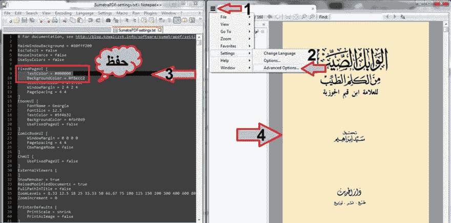

# 电子书读者的旧纸质书风格。

> 原文：<https://dev.to/lyjoker/old-paper-books-style-for-e-books-readers-4n1f>

这个 PDF 阅读器可以改变字体和背景颜色
来适应你想要的任何主题，黑色背景，白色文本，或者默认的相反颜色...一本很酷的旧书清香风格<3；)

所以从这里下载苏门答腊-PDF 阅读器>[https://goo.gl/5IYLS0](https://goo.gl/5IYLS0)

打开程序，按照图片中的步骤操作

苏门答腊-PDF >设置>高级选项。

将它们编辑成行

text color = # 000000-->黑色字体。
BackgroundColor = #F8ECC2 - >旧书纸张颜色。

حفظ = "保存"

[T2】](https://res.cloudinary.com/practicaldev/image/fetch/s--oT83abKw--/c_limit%2Cf_auto%2Cfl_progressive%2Cq_auto%2Cw_880/https://scontent-mrs1-1.xx.fbcdn.net/v/t1.0-9/18582359_1306964836083153_7055751414427336365_n.jpg%3F_nc_cat%3D0%26oh%3D04a4dee693b273ca850f6d622e342964%26oe%3D5B95ECF7)

#F8ECC2 的颜色与旧纸质书的颜色相同。通过改变设置文件中的十六进制颜色，你可以使用任何你喜欢的背景颜色或字体颜色。

你可以在这里使用这个网站:[http://www.color-hex.com/color/f8ecc2](http://www.color-hex.com/color/f8ecc2)
选择任何你喜欢的颜色。

我使用的颜色给你一种旧的感觉
阅读一本好的旧书< 3

**快乐阅读；)#LyJoker**