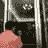
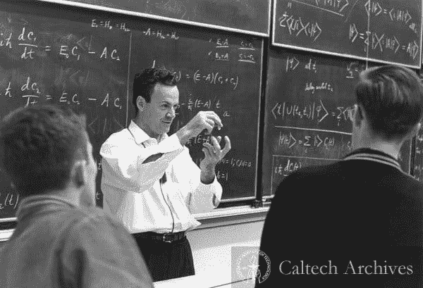

# 做技术决策

> 原文：<https://dev.to/adarshkkumar/on-making-tech-decisions-d2g>

我总是害怕做决定，即使是简单的决定。大部分是因为我害怕犯错。

> 别人会怎么看我？+冒名顶替综合征。

我们与团队讨论我们的想法，然后根据以下几点得出结论:

*   团队/搭档讨论的要点。
*   评估利弊。
*   团队的集体智慧。

**我们已经尽了最大努力，利用我们当时掌握的知识**

没有人会做出故意损害项目的决定。

这个决定可能是对的，也可能是错的。如果它是错的，就不要开始一场*指责游戏或指责*。这是有毒工作场所的标志，高级人员/“经理”必须尽早发现并解决此类问题。如果没有，团队中可能有好主意/解决方案的其他人会保持沉默，然后退出，因为他们害怕被羞辱。

液体错误:内部

一个软件只要被使用就会经历不断的进化。现在就看你如何处理这些变化了。如果你考虑的是短期问题，因为没有时间而用糟糕的设计和没有测试来推动变革，那也没关系，只要确保一旦你的紧迫性得到解决，这个技术债务就能得到解决。但是，如果一个又一个紧急的/“没有时间”的问题接踵而至，而你忘记了技术债务，它会反咬你一口。在这种情况下，项目/产品管理出现了严重的问题。

> Ajey Gore@ Ajey Gore如果你不停止偿还科技债，科技债总有一天会停止让你偿还。
> 
> 会有债务追讨，你可能不想去。
> 
> 按时还你的科技债！！！2018 年 8 月 16 日上午 05:58

> 快速失败->学习->改进

无论对错，我们从自己的决定中学习。我们发现了以前没有的数据点。但是等待而不做决定是没有进步的，我们只是在拖延明显的灾难发生。

因此，当我们发现我们所做的决定是错误的时，只需采取纠正措施并改进软件。有助于此的原则是 TDD/重构。如果我们有足够的测试覆盖率，我们就可以自信地进行重构。由**肯特·贝克**所著的**测试驱动开发示例**和**极限编程讲解**这两本书是学习这些技术的很好的资源。另一本书是马丁·福勒的《重构改进现有代码的设计》。

话虽如此，一个人不应该犯两次同样的错误，那是浪费时间。

如果你不知道什么，你应该伸出手和人们交谈，从他们面临的类似情况中学习，这样我们就不会犯他们可能犯的错误。

> 如果我们只是与其他人交流/交谈，寻求帮助，软件中的大多数困惑或问题都是可以避免的。

> 理查德·费曼@ proffeynman可以说“我不知道。”意识到我们不知道答案是很有价值的！2018 年 8 月 06 日下午 15:15

话虽如此，我有时仍感到对黑暗的恐惧！！！
**鉴于暗=‘做决定’**