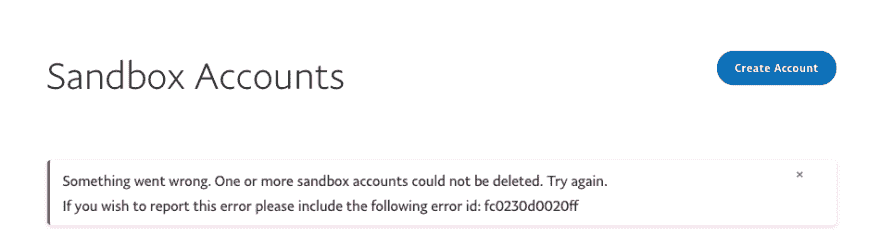

# 让你的应用程序不那么令人沮丧，即使它很破。

> 原文：<https://dev.to/moopet/on-making-your-app-less-frustrating-even-when-its-quite-breaky-4p5p>

所有的软件都有缺陷。

也许你网站的首页在客户关系方面是最重要的，因为第一印象是持久的。也许你的社交媒体团队如何处理公关灾难后的季风更重要。也许让更多的人参与你的金字塔计划比让你的用户群开心更重要。我不是来评判的。

所有软件都有 Suggs:

[T2】](https://res.cloudinary.com/practicaldev/image/fetch/s--6Ltzhi8l--/c_limit%2Cf_auto%2Cfl_progressive%2Cq_auto%2Cw_880/https://thepracticaldev.s3.amazonaws.com/i/44gfdgbxgqtipyio6to5.png)

PayPal 开发者界面经历了很多变化，坦率地说，从来没有这么好。我在这里挑出他们，因为这是我最近触发的错误，但当然有许多开发者为世界上其他应用程序提供了同样糟糕的用户体验，就像他们打字一样快。

那么这个错误有什么问题呢？我是技术用户；所以我在沙盒里。我当然想要一个技术错误消息？

好吧，等一下。没那么简单。让我们一步步来:

> 出事了。
> 
> 无法删除一个或多个沙盒帐户。

到底是哪个？一个账户还是多个账户？我是不是要仔细检查我的清单，看看哪些有用，哪些没用？有趣的是，我只尝试删除了一条，所以这条消息显然比我希望的更普通。

> 再试一次。

哇哦。这是鼓舞人心的，就在那里。“再试一次”？就像，也许会有用，因为他们不知道哪里出了问题？这是一家处理你所有的钱和滑稽作品的公司。

> 如果您希望报告此错误

等等，什么？此错误不会自动记录并作为问题提出吗？为什么我需要参与？也许这样我就可以

> 请包括以下错误 id:

这个标识符表明了一件事:错误已经被记录。这意味着他们的开发人员可以在因为您的错误报告而被要求检查时，检查出了什么问题。

更好的选择应该是这样的:

> 尝试删除沙盒帐户“[foo@example.com](mailto:foo@example.com)”时遇到问题。我们很抱歉发生这种情况，但错误已被报告，我们将调查它。如果你想帮忙，你可以[告诉我们错误发生时你在试图做什么](http://example.com)。

所有的软件都有缺陷。一旦你的用户找到了一个，你几乎就有了另一个机会去制造第一印象；就好像他们在以一种不同的方式与你互动。

我可以告诉你更多关于 PayPal 例子的错误:他们在错误消息上禁用了选择和鼠标事件，所以复制和粘贴错误 ID 是不可能的。取而代之的是，我不得不求助于记事本技术来记下号码，然后自己读给自己听，可能会弄错。他们在页面的其余部分(甚至是页脚)也没有任何链接，比如联系表单或电子邮件帐户。对@moopet 来说，这是令人沮丧的一天。

记住，孩子们:软件中的错误之旅需要和黄金之路一样多的关心和关注。

所有软件。hasbugs。再见。

morguefile.com[的克罗斯塞尔封面图片](https://morguefile.com/creative/krosseel)