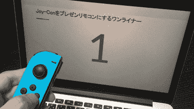
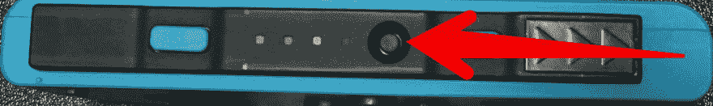
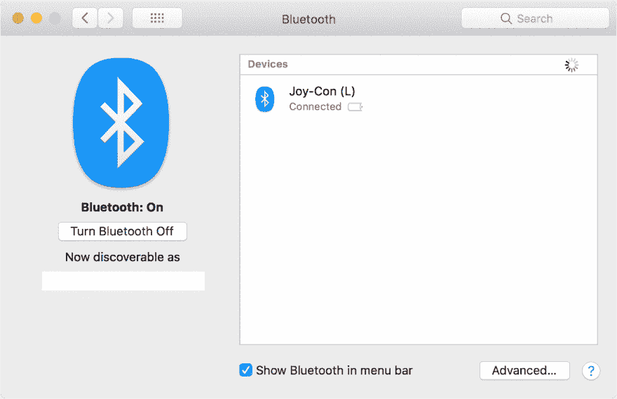
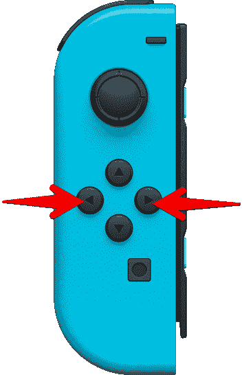

# 一行程序使任天堂 Switch 的 Joy-Con 成为一个演示遥控器

> 原文：<https://dev.to/mascii_k/one-liner-which-makes-joy-con-of-nintendo-switch-a-presentation-remote-control-591k>

如果你在浏览器上显示一个演示文稿，你可以用一行程序把 Joy-Con 变成一个演示遥控器！

[T2】](https://res.cloudinary.com/practicaldev/image/fetch/s--w5bUXRXn--/c_limit%2Cf_auto%2Cfl_progressive%2Cq_66%2Cw_880/https://thepracticaldev.s3.amazonaws.com/i/arjv8zikbai5am9dferz.gif)

# 环境

*   马科斯·卡特琳娜
*   铬 84
*   欢乐大会(左)

# 准备

将 Joy-Con (L)与 macOS 的标准功能连接。

[T2】](https://res.cloudinary.com/practicaldev/image/fetch/s--EZHDMrw8--/c_limit%2Cf_auto%2Cfl_progressive%2Cq_auto%2Cw_880/https://thepracticaldev.s3.amazonaws.com/i/c3nxsuvifh247ryudr4j.png)

按住箭头部分的按钮进入配对模式。

[T2】](https://res.cloudinary.com/practicaldev/image/fetch/s--Y9HU2Xvr--/c_limit%2Cf_auto%2Cfl_progressive%2Cq_auto%2Cw_880/https://thepracticaldev.s3.amazonaws.com/i/lhz9p96nbiw2souz4o08.png)

# 一句俏皮话让任天堂 Switch 的动漫大会变得遥不可及

将以下脚本粘贴到开发人员工具的控制台中(在 Mac 上为 command + option + I ),并按 Enter 键执行。

```
((a,b,c)=>{const d=(b,c)=>{const d=a.activeElement,e="IFRAME"===d.tagName?d.contentDocument:a;["keydown","keyup"].forEach(a=>{e.body.dispatchEvent(new KeyboardEvent(a,{key:b,keyCode:c,bubbles:!0}))})},e=({vibrationActuator:a},b,c)=>a?a.playEffect(a.type,{startDelay:b,duration:c,strongMagnitude:.8}):Promise.resolve();let f,g;if(c("gamepadconnected",({gamepad:a})=>{if(null!=f||!a.id.includes("57e")||!a.id.includes("2006"))return;f=a.index;let c=!1;g=setInterval(()=>{c=(a=>{const b=a.buttons;return b[0].pressed?(c||d("ArrowLeft",37),!0):b[3].pressed?(c||d("ArrowRight",39),!0):!!b[16].pressed&&(c||e(a,0,10),!0)})(b.getGamepads()[f])},1e3/60);const h=()=>e(a,300,5);h().then(h).then(h)}),c("gamepaddisconnected",a=>{f===a.gamepad.index&&(clearInterval(g),f=g=null)}),b.wakeLock){const c=d=>{"visible"!==a.visibilityState||b.wakeLock.request("screen").then(()=>{d&&(a.addEventListener("visibilitychange",c),a.addEventListener("fullscreenchange",c))}).catch(()=>{})};c(!0)}})(document,navigator,addEventListener); 
```

Enter fullscreen mode Exit fullscreen mode

您可以使用图中所示的按钮来更改幻灯片。

[T2】](https://res.cloudinary.com/practicaldev/image/fetch/s--SIjnWJ-h--/c_limit%2Cf_auto%2Cfl_progressive%2Cq_auto%2Cw_880/https://thepracticaldev.s3.amazonaws.com/i/xyhe84uk6qz0o7lpyydj.png)

按下截图捕捉键时控制器会有一点震动(用于测试通信确认，仅在 Chrome 等支持的浏览器上)。

## 支持的站点

我确认它可以在下面相应的站点上使用

*   [谷歌幻灯片](https://www.google.com/intl/ja_jp/slides/about/)(演示模式下)
*   [SlideShare](https://www.slideshare.net/)
*   [扬声器平台](https://speakerdeck.com/)
*   [图马](https://www.figma.com/)(演示模式下)

## 代码

下面是压缩前的代码:
【https://github.com/mascii/presentation-joy-con】
`git clone``npm ci``npm run minify`要运行这些代码，可以制作一行程序。如果有改进点，请给我发拉请求！

(2020 年 7 月 24 日增加)

*   屏幕唤醒锁定 API 现在在 Chrome 84 中可用，所以我们请求不要在支持的浏览器中关闭显示。([拉取请求](https://github.com/mascii/presentation-joy-con/pull/1)
*   修复了当幻灯片以外的元素处于活动状态时，试图在扬声器面板上移动幻灯片时出现错误的问题。([拉取请求](https://github.com/mascii/presentation-joy-con/pull/3)

(2021 年 2 月 7 日增加)

*   使用 Gamepad API 的`vibrationActuator`，这是 Chrome 等一些浏览器支持的( [Pull Request](https://github.com/mascii/presentation-joy-con/pull/6) ):
    *   当控制器连接时(当`gamepadconnected`事件触发时)，控制器以小增量振动三次。
    *   按下截图键时控制器会有一点震动。