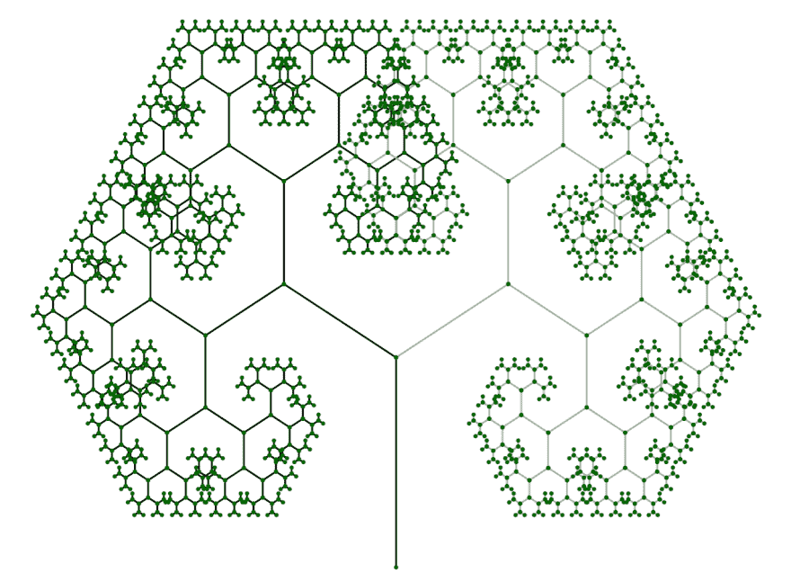

# 用 R6、ggplot2 和 gganimate 设计 R 中的分形树(第一部分)

> 原文：<https://dev.to/adamspannbauer/oop-fractal-trees-in-r-with-r6-ggplot2--gganimate-part-1-19bm>

在这篇文章中，我们将探索由 [`R6`](https://r6.r-lib.org/) 包实现的 R 中的 OOP。这篇文章是第 1 部分，共 2 部分，最终目标是用 [`R6`](https://r6.r-lib.org/) & [`gganimate`](https://github.com/thomasp85/gganimate) 创建一个动画分形树。今天，我们将创建一个分形树和一系列`R6Class`物体的静态图来帮助我们到达那里。

下面的代码和图表显示了在这篇文章的结尾我们将会得到什么。

```
# Create & plot R6 tree object  tree  =  fractal_tree$new()  tree$plot() 
```

[T2】](https://res.cloudinary.com/practicaldev/image/fetch/s--JbpijL9I--/c_limit%2Cf_auto%2Cfl_progressive%2Cq_auto%2Cw_880/https://thepracticaldev.s3.amazonaws.com/i/87g7xyjhxn4bjicd55lj.png)

***注**:本帖意在探究 [`R6`](https://r6.r-lib.org/) 功能；这并不是创造分形树的最好方法。一些设计选择仅仅是为了利用不同的功能。另外，这篇文章更多的是基于例子而不是解释。更深入的解释，我建议从`R6`进入[这一页](https://r6.r-lib.org/)或从[高级 R](https://adv-r.hadley.nz)*
查看[这一章](https://adv-r.hadley.nz/r6.html)

* * *

## 设计

[T2】](https://res.cloudinary.com/practicaldev/image/fetch/s--9RCeETi0--/c_limit%2Cf_auto%2Cfl_progressive%2Cq_auto%2Cw_880/https://thepracticaldev.s3.amazonaws.com/i/63wpxqcjz8u91xgqgodq.png)

上面的草图显示了我们将创建为一个 [`R6`](https://r6.r-lib.org/) 对象的分形树的基本设计；让我们打开它。我们将有一条垂直线作为主干，以及一系列分支线，每次递归地长出两条。最后，每个子分支相对于其父分支具有相同的角度。

让我们将草图转换成我们将要使用的对象结构。

[T2】](https://res.cloudinary.com/practicaldev/image/fetch/s--MCYGBggF--/c_limit%2Cf_auto%2Cfl_progressive%2Cq_auto%2Cw_880/https://thepracticaldev.s3.amazonaws.com/i/qw65z8upq724737neg9e.png)

按照它的绘制方式，我们看到我们将对主干和分支使用两个独立的类。主干和分支有很多共同点，所以我们将使用由 [`R6`](https://r6.r-lib.org/) 实现的 OOP 继承概念。下面展示了我们将如何使用基类和继承来实现主干和分支类，以保持[干燥](https://en.wikipedia.org/wiki/Don%27t_repeat_yourself)。

[T2】](https://res.cloudinary.com/practicaldev/image/fetch/s--RUkzmWAs--/c_limit%2Cf_auto%2Cfl_progressive%2Cq_auto%2Cw_880/https://thepracticaldev.s3.amazonaws.com/i/xs4lqtibqcy91cz6y6qd.png)

## 实现

我们将按照与设计部分相反的顺序开始。为了便于理解，代码将被分成不同的部分。如果你想在一个地方看到所有的代码，你可以在这里查看。

### `branch_base`

这个`branch_base`类将是我们的`trunk` & `branch`类的共享父类。所以我们想在里面装满他们可以分享的东西。从实现的角度来看，它们共享的是 [`ggplot2`](https://ggplot2.tidyverse.org/) 将如何绘制它们。在`public`中初始化的每个属性都将用于我们的绘图方法。此外，我们使用`active`特性来动态构建一个`data.frame`来表示我们的分支。放置在`active`中的函数可以像静态属性一样被访问。

```
branch_base  =  R6Class('branch_base',  public  =  list(  start_x  =  NA_integer_,  start_y  =  NA_integer_,  end_x  =  NA_integer_,  end_y  =  NA_integer_,  type  =  NA_character_,  id  =  NA_character_,  color  =  NA_character_  ),  # public  active  =  list(  df  =  function()  {  x  =  c(self$start_x,  self$end_x)  y  =  c(self$start_y,  self$end_y)  data.frame(x  =  x,  y  =  y,  type  =  self$type,  id  =  self$id,  branch_color  =  self$color)  }  )  # active  )  # branch_base 
```

### `trunk`

`trunk`类`inherit`来自`branch_base`，所以我们不必考虑初始化我们的属性或者重新定义`active`。为了定义这个类，我们添加了一个`initialize`方法，它将用于实际创建`trunk`的实例。

```
trunk  =  R6Class('trunk',  inherit  =  branch_base,  public  =  list(  initialize  =  function(len  =  10,  branch_color  =  '#000000')  {  self$start_x  =  0  self$start_y  =  0  self$end_x  =  0  self$end_y  =  len  self$type  =  'trunk'  self$branch_color  =  branch_color  self$id  =  uuid::UUIDgenerate()  }  )  # public  )  # trunk 
```

### `branch`

`branch`的定义和`trunk`类似，但是涉及的内容稍微多一点。当我们需要创建一个`branch`时，我们得到的信息是它应该从哪里开始，应该往哪个方向，应该有多长。有了这些信息，我们可以使用一些 trig 来获得`branch`的端点。其余的`initialize`方法与`trunk`非常相似。

```
branch  =  R6Class('branch',  inherit  =  branch_base,  public  =  list(  initialize  =  function(x,  y,  len  =  5,  theta  =  45,  type  =  NA_character_,  branch_color='#000000')  {  dy  =  sin(theta)  *  len  dx  =  cos(theta)  *  len  self$start_x  =  x  self$start_y  =  y  self$end_x  =  x  +  dx  self$end_y  =  y  +  dy  self$type  =  type  self$id  =  uuid::UUIDgenerate()  self$branch_color  =  branch_color  }  )  # public  )  # branch 
```

### `fractal_tree`

定义了`trunk`和`branch`之后，我们就有了`fractal_tree`类的构建模块。由于其长度/复杂性，此类定义将被分成几个部分；完整的定义可以在这里看到[。](https://gist.github.com/AdamSpannbauer/6aef835e1784a74b56b709c6159d2ca2#file-r6_fractal_tree-r-L66)

#### `public`

`fractal_tree`的`public`部分包含了我们创建和绘制树所需的功能。

方法创建了我们的树的所有分支，包括主干。`private$grow_branches`方法是我们类的一个递归`private`方法，我们将很快定义它。

剩下的`public`方法是`plot`，不出所料，它将绘制我们的树。熟悉 [`ggplot2`](https://ggplot2.tidyverse.org/) 的人应该对这个方法的内容相当熟悉。由于我们的设置，我们能够相对轻松地绘制我们的树。

```
public  =  list(  delta_angle  =  NA_real_,  len_decay  =  NA_real_,  min_len  =  NA_real_,  branch_left_color  =  NA_character_,  branch_right_color  =  NA_character_,  branches  =  data.frame(),  initialize  =  function(trunk_len  =  10,  delta_angle  =  pi  /  8,  len_decay  =  0.7,  min_len  =  0.25,  trunk_color  =  '#000000',  branch_left_color  =  '#000000',  branch_right_color  =  '#adadad')  {  self$delta_angle  =  delta_angle  self$len_decay  =  len_decay  self$min_len  =  min_len  self$branch_left_color  =  branch_left_color  self$branch_right_color  =  branch_right_color  self$branches  =  trunk$new(trunk_len,  trunk_color)$df  private$grow_branches(0,  trunk_len,  len  =  trunk_len  *  len_decay,  angle_in  =  pi  /  2)  },  plot  =  function()  {  ggplot(tree$branches,  aes(x,  y,  group  =  id,  color=branch_color))  +  geom_line()  +  geom_point(color  =  'darkgreen',  size=0.5)  +  scale_color_identity()  +  guides(color  =  FALSE,  linetype  =  FALSE)  +  theme_void()  }  ),  # public 
```

#### `private`

我们的`private`部分由一个方法`grow_branches`组成。如果给定一个起点和一个角度，这个方法将永远递归地构建我们的树。为了避免无限递归，我们内置了`min_len`属性作为停止点。

该函数的主体包括:

*   创建 2 个新的分支，分支到左边和右边
*   将这些分支添加到`branches`属性中(这个`data.frame`动态增长的方式可以重写为更有效)
*   对左分支重复该过程(这递归地创建了树的整个左侧)
*   对右分支重复这个过程(这递归地创建了树的整个右侧)

就是这样！我们现在终于有了所有的部分来创建和绘制一个带有 [`R6`](https://r6.r-lib.org/) 和 [`ggplot2`](https://ggplot2.tidyverse.org/) 的`fractal_tree`。

```
private  =  list(  grow_branches  =  function(start_x,  start_y,  len  =  1,  angle_in  =  pi  /  2,  parent_type  =  NA,  parent_color  =  NA)  {  if  (len  >=  self$min_len)  {  l_type  =  if  (!is.na(parent_type))  parent_type  else  'left'  r_type  =  if  (!is.na(parent_type))  parent_type  else  'right'  l_color  =  if  (!is.na(parent_color))  parent_color  else  self$branch_left_color  r_color  =  if  (!is.na(parent_color))  parent_color  else  self$branch_right_color  branch_left  =  branch$new(start_x,  start_y,  len,  angle_in  +  self$delta_angle,  l_type,  l_color)  branch_right  =  branch$new(start_x,  start_y,  len,  angle_in  -  self$delta_angle,  r_type,  r_color)  self$branches  =  rbind(self$branches,  branch_left$df,  branch_right$df)  private$grow_branches(branch_left$end_x,  branch_left$end_y,  angle_in  =  angle_in  +  self$delta_angle,  len  =  len  *  self$len_decay,  parent_type  =  branch_left$type,  parent_color  =  branch_left$branch_color)  private$grow_branches(branch_right$end_x,  branch_right$end_y,  angle_in  =  angle_in  -  self$delta_angle,  len  =  len  *  self$len_decay,  parent_type  =  branch_right$type,  parent_color  =  branch_right$branch_color)  }  }  # grow_branches  )  # private 
```

## 最终产品

这最后一节将是使用我们的`fractal_tree`类的功能的几个例子。

```
# Create & plot R6 tree object  tree  =  fractal_tree$new()  tree$plot() 
```

[T2】](https://res.cloudinary.com/practicaldev/image/fetch/s--JbpijL9I--/c_limit%2Cf_auto%2Cfl_progressive%2Cq_auto%2Cw_880/https://thepracticaldev.s3.amazonaws.com/i/87g7xyjhxn4bjicd55lj.png)

```
# Create & plot R6 tree object with new angle  tree  =  fractal_tree$new(delta_angle  =  pi  /  3)  tree$plot() 
```

[T2】](https://res.cloudinary.com/practicaldev/image/fetch/s--x49IcljB--/c_limit%2Cf_auto%2Cfl_progressive%2Cq_auto%2Cw_880/https://thepracticaldev.s3.amazonaws.com/i/hrylplz6gw0p7a0ejnjh.png)

```
# Create & plot R6 tree object with new branch length decay  tree  =  fractal_tree$new(delta_angle  =  pi  /  2,  len_decay  =  0.6)  tree$plot() 
```

[T2】](https://res.cloudinary.com/practicaldev/image/fetch/s--iSEE1Jvh--/c_limit%2Cf_auto%2Cfl_progressive%2Cq_auto%2Cw_880/https://thepracticaldev.s3.amazonaws.com/i/gutmbl6wqux9nue5ynfc.png)

```
# Create & plot R6 tree object with new color  tree  =  fractal_tree$new(trunk_color  =  'tan4',  branch_left_color  =  'tan3',  branch_right_color  =  'tan')  tree$plot() 
```

[T2】](https://res.cloudinary.com/practicaldev/image/fetch/s--bR8hS8oQ--/c_limit%2Cf_auto%2Cfl_progressive%2Cq_auto%2Cw_880/https://thepracticaldev.s3.amazonaws.com/i/h5ibn46rovfd26uov1ym.png)