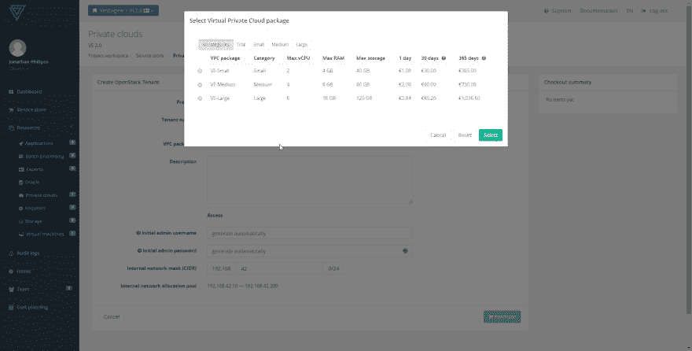
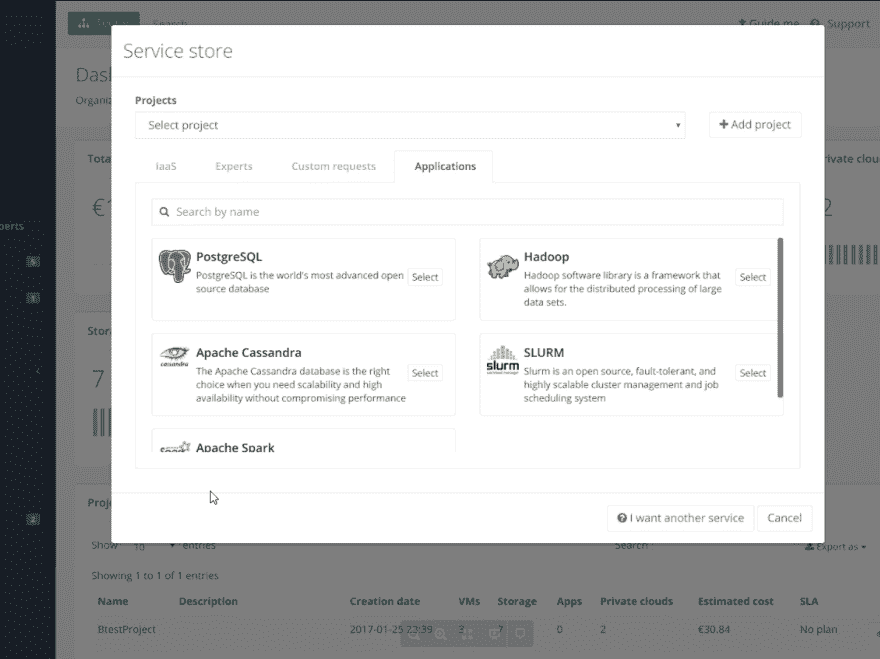
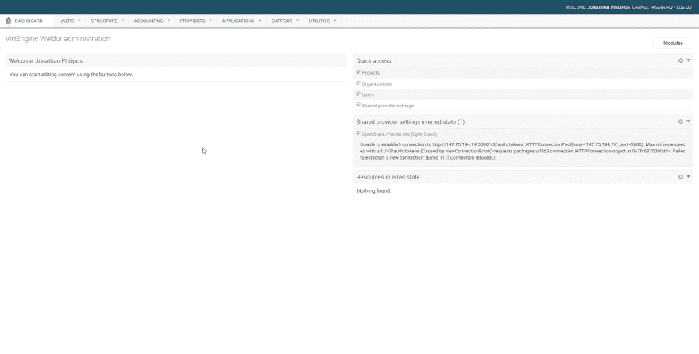

# 开放式混合云管理-自动化您的云

> 原文：<https://dev.to/jaeko44/open-hybrid-cloud-management---automate-your-cloud-j8b>

如今，用户在 AWS、Azure 或 DigitalOcean 等服务上运行云工作负载是很常见的。

但是，消耗云资源的最有效方法通常是通过裸机/专用服务器，这是因为您将一台完整的物理机专用于您的工作负载——它可能非常密集，可以处理跨虚拟机和容器分布的大量工作负载。

拥有一个云管理平台，允许您从现有的云中导入工作负载，然后在不同的基础架构之间以自动化的方式无中断地移动它们，这非常有帮助。

另一个使用案例是应用程序协调的自动化，即自动化重复任务的能力，如应用程序部署、扩展、备份等。

[VirtEngine](https://virtengine.com) 允许您基于流行的基础设施提供商和开源工具管理现有的云工作负载。

VirtEngine 目前与 OpenStack 和 OpenNebula 集成，但未来与 ProxMox、MAAS.io 和 Kubernetes 的集成正在进行中。

VirtEngine 也可以和 SLURM 这样的工具一起工作，进行批处理。

VirtEngine 还集成了公共云提供商，如 AWS、Azure、DigitalOcean 和即将推出的开放公共云市场。

那么 VirtEngine 到底是做什么的呢？

*   组织管理
*   小组管理
*   项目管理
*   资源消耗分析和指标
*   事件日志和审计日志
*   基于各种集成的基础架构(计算和存储)访问。
*   计费管理(根据我们的许可产品)

虚拟私有云管理:

[T2】](https://res.cloudinary.com/practicaldev/image/fetch/s--YJ52dBvH--/c_limit%2Cf_auto%2Cfl_progressive%2Cq_auto%2Cw_880/https://i.imgur.com/MtVKBxX.png)

应用程序编排:

[T2】](https://res.cloudinary.com/practicaldev/image/fetch/s--RqBHEfUb--/c_limit%2Cf_auto%2Cfl_progressive%2Cq_auto%2Cw_880/https://i.imgur.com/yI4iEl0.png)

管理员用户界面:

[T2】](https://res.cloudinary.com/practicaldev/image/fetch/s--ErbKtyUJ--/c_limit%2Cf_auto%2Cfl_progressive%2Cq_auto%2Cw_880/https://i.imgur.com/RIBNCoK.png)

如果您对部署 VirtEngine-Waldur 感兴趣，请查看以下文档:

[VirtEngine Waldur 文档](http://virtengine.com/VirtEngine_Waldur_Documentation.pdf)