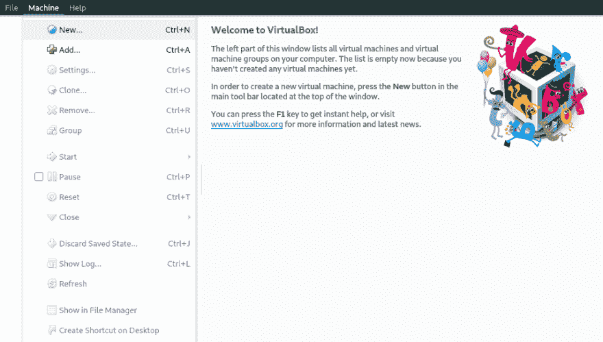
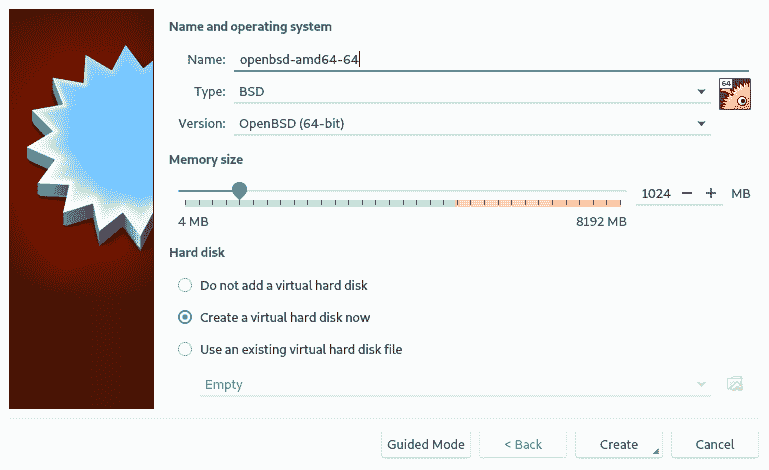
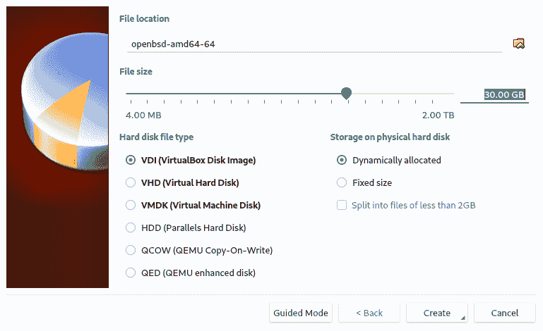
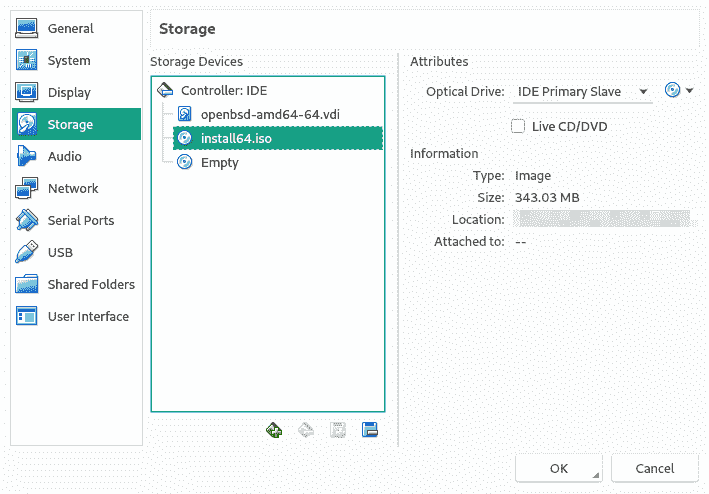
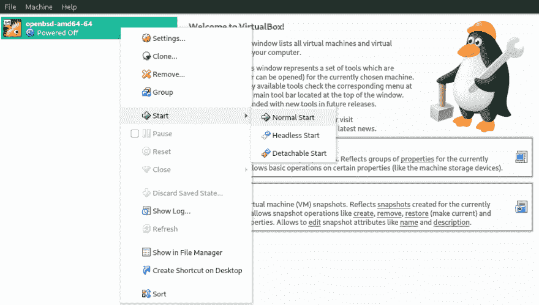
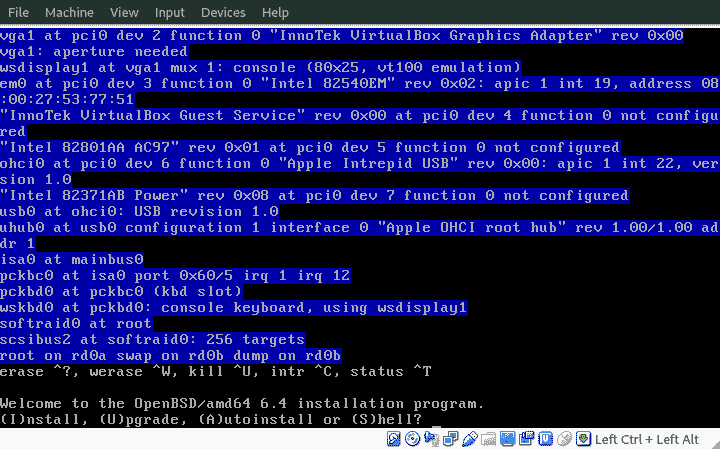
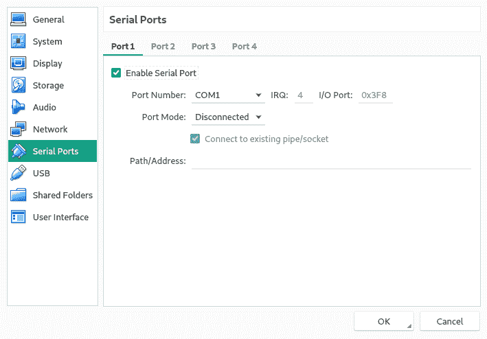

# GCE/GCP - (1/2)本地部分上的 OpenBSD vm

> 原文：<https://dev.to/nabbisen/openbsd-vm-on-gcegcp---12-local-part-gp3>

## [T1】简介](#intro)

这个月对我作为一个 [OpenBSD](https://www.openbsd.org/index.html) 用户来说是一个快乐的月份，因为新版本 6.4 已经于 2018 年 10 月 18 日发布。
[你好，胀鼓鼓的，又来了:)](https://www.openbsd.org/64.html)

嗯，谷歌云平台(GCP)是我最喜欢的云计算平台之一，因为它的功能和价格。不幸的是，它的基础设施即服务(IaaS)组件 Google Compute Engine (GCE)并不正式支持 OpenBSD。

多亏了 [dmitshur](https://github.com/dmitshur) 的[这个脚本](https://github.com/golang/build/tree/master/env/openbsd-amd64)，我设法在 GCE/GCP 上创建了一个 OpenBSD 的自定义映像。
我又快乐了！

<center>✿ ✿ ✿</center>

这篇文章是关于如何在 GCE/GCP 上创建一个 OpenBSD 虚拟机(vm)。

关键因素是 2x2:

*   要创建虚拟机:
    *   使用串行控制台。
    *   准备虚拟网络接口，vio0。(只是用 DHCP 也可以。)
*   要设置 GCP:
    *   上传原始图像。
    *   使用`gsutil`命令创建云图。

* * *

下面是操作步骤:

1.  由 [VirtualBox](https://www.virtualbox.org/) 创建安装了【OpenBSD 的 VDI 磁盘

2.  通过 [VBoxManage](https://www.virtualbox.org/manual/ch08.html) 命令将 VDI 图像转换为 GCE 的原始图像并压缩以上传

3.  通过 [gsutil](https://cloud.google.com/storage/docs/gsutil) 命令将图片上传到谷歌云存储

4.  通过[谷歌云控制台](https://console.cloud.google.com/)在 GCE
    上创建一个实例

* * *

## 环境

*   操作系统:OpenBSD 6.4 amd64

## 要求附参考文献

*   [OpenBSD 安装程序](https://www.openbsd.org/faq/faq4.html#Download)
    *   [installXX.iso - amd64](https://cdn.openbsd.org/pub/OpenBSD/6.4/amd64/install64.iso)
*   VirtualBox(虚拟方块)
*   [谷歌云存储](https://console.cloud.google.com/storage)
    *   **需要一个存储桶**来临时上传虚拟映像。
*   [谷歌云 SDK](https://cloud.google.com/storage/docs/gsutil)
    *   [在 Arch/Manjaro Linux 上为 GCP 安装 Google Cloud SDK](https://dev.to/nabbisen/setting-up-google-cloud-sdk-of-gcp-on-archmanjaro-linux-19mk)

<center>✿ ✿ ✿</center>

## 步骤

### 第一步:创建安装了 OpenBSD 的 VDI 磁盘

用 VirtulBox 为 OpenBSD 创建一个虚拟机:

[T2】](https://res.cloudinary.com/practicaldev/image/fetch/s--gSONn5yi--/c_limit%2Cf_auto%2Cfl_progressive%2Cq_auto%2Cw_880/https://thepracticaldev.s3.amazonaws.com/i/pt9qvy6wr7bwzejnm4wx.png)

[T2】](https://res.cloudinary.com/practicaldev/image/fetch/s--TDAWwzNM--/c_limit%2Cf_auto%2Cfl_progressive%2Cq_auto%2Cw_880/https://thepracticaldev.s3.amazonaws.com/i/xfefxa6aglrw7oshjqjz.png)

**注:根据 GCP[免费产品](https://cloud.google.com/free/)的规定，GCE 的存储大小必须小于 30gb 才能让其免费使用。*

[T2】](https://res.cloudinary.com/practicaldev/image/fetch/s--XKdt2KYf--/c_limit%2Cf_auto%2Cfl_progressive%2Cq_auto%2Cw_880/https://thepracticaldev.s3.amazonaws.com/i/98vmgezq09pex7pwk6xm.png)

将 OpenBSD 安装程序介质 install64.iso 添加到“Storage”中:

[T2】](https://res.cloudinary.com/practicaldev/image/fetch/s--QRKKRt7d--/c_limit%2Cf_auto%2Cfl_progressive%2Cq_auto%2Cw_880/https://thepracticaldev.s3.amazonaws.com/i/rq2sk77gic374uddmdfd.png)

让我们启动客户操作系统:

[T2】](https://res.cloudinary.com/practicaldev/image/fetch/s--7p3UrDMY--/c_limit%2Cf_auto%2Cfl_progressive%2Cq_auto%2Cw_880/https://thepracticaldev.s3.amazonaws.com/i/ing3kg76zbk6i66j9qz1.png)

[T2】](https://res.cloudinary.com/practicaldev/image/fetch/s--wP8utlUN--/c_limit%2Cf_auto%2Cfl_progressive%2Cq_auto%2Cw_880/https://thepracticaldev.s3.amazonaws.com/i/zx8fdtwd9xqhrpqtgbl3.png)

按照这些设置继续安装:

```
keyboard layout    :  [your-language]
hostname           :  [your-hostname]
network            :  "em0" -> "dhcp" -> "none" -> "done"
domain, dns        :  (default) (or [your-domain])
password for root  :  [your-password]
sshd               :  "yes"
x windows system   :  "no"
com0               :  "no"  # Because we'll set it up after installation by editing /etc/boot.conf
user               :  "no" (or create someone)
allow root login   :  "yes" # If you set it "no", be sure to create a ssh-allowed user. 
```

Enter fullscreen mode Exit fullscreen mode

** **注意**:为了在本教程结束时管理机器，拥有一个允许 ssh 的用户是绝对必要的。所以不要忘记允许 root 登录或者创建一个允许 ssh 的用户。此外，根据需要验证“允许 root 登录”配置。*

```
disk               :  "wd0" -> "W"hole -> Use "A"uto layout (or edit layout) 
```

Enter fullscreen mode Exit fullscreen mode

**注:您可以通过[手动分区](https://dev.to/nabbisen/openbsd-manual-partitioning-at-installation-4cif)选择编辑布局。*

```
location of sets   :  (default)             # "cd0"
                      -> (default)          # 6.4/amd64
                      -> "-game*" # optional: exclude more which is not necessary like "-x* -man*"
                      -> "done"
                      -> "yes" 
```

Enter fullscreen mode Exit fullscreen mode

安装完成后，暂停:

```
#  halt # and power off guest 
```

Enter fullscreen mode Exit fullscreen mode

我们需要向虚拟机添加一些设置。

所以，

1.  从 VirtualBox 的“存储”设置中弹出安装程序介质。
2.  再次启动机器。
3.  等待重新启动完成时的初始操作系统设置。

然后，按如下方式操作客户操作系统:

```
#  echo 'set tty com0' > /etc/boot.conf # activate serial connection
#  echo 'dhcp' > /etc/hostname.vio0     # register GCE virtual network
  #  # check file content
#  cat /etc/boot.conf
set tty com0 #  cat /etc/hostname.vio0
dhcp 
```

Enter fullscreen mode Exit fullscreen mode

接下来更改“/etc/ttys”中的行，以启用 GCP 串行控制台:
(感谢[里卡德·达尔斯特兰德](https://dev.to/rdahlstrand/comment/hi0m) )

```
- console "/usr/libexec/getty std.9600" vt220 off secure + console "/usr/libexec/getty std.9600" vt220 on  secure 
```

Enter fullscreen mode Exit fullscreen mode

也可以在 GCP 上创建虚拟机后更改它。

完成后，关机:

```
#  shutdown -p now 
```

Enter fullscreen mode Exit fullscreen mode

#### 选项:SMT -多线程

如果需要多线程，添加此设置:

```
#  echo 'hw.smt=1' > /etc/sysctl.conf
  #  # check file content
#  cat /etc/sysctl.conf
hw.smt=1 
```

Enter fullscreen mode Exit fullscreen mode

**注:OpenBSD [6.4 发布公告](https://www.openbsd.org/64.html)解释如下:*

> amd64 现在使用 eager-FPU 切换来防止 FPU 状态信息跨越保护边界的推测性泄漏。因为同步多线程(SMT)以共享和不安全的方式使用核心资源，所以现在默认情况下它是禁用的。它可以通过新的 hw.smt sysctl(2)变量来启用。

#### 选项:下次如何管理来宾操作系统

`set tty com0`表示使用串口作为控制台。
因此，为了下次管理客户操作系统，我们需要在运行之前设置“启用串口”:

[T2】](https://res.cloudinary.com/practicaldev/image/fetch/s--0r9-AZ_m--/c_limit%2Cf_auto%2Cfl_progressive%2Cq_auto%2Cw_880/https://thepracticaldev.s3.amazonaws.com/i/86edfvp8d4grc2g21yy8.png)

<center>✿ ✿ ✿</center>

**注:本帖分为两部分。后半部分是:*

[](/nabbisen) [## GCE/GCP - (2/2)云部分上的 OpenBSD 虚拟机

### nab bisen Oct 31 ' 183 分钟读数

#openbsd #gcp #gce #vm](/nabbisen/openbsd-vm-on-gcegcp---22-cloud-part-4fno)