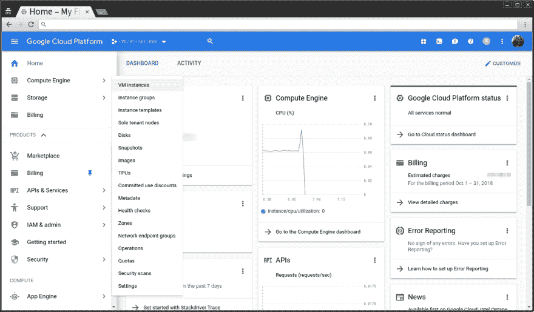
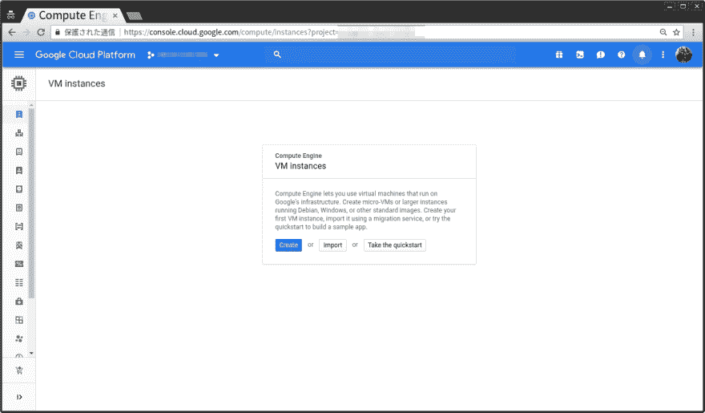
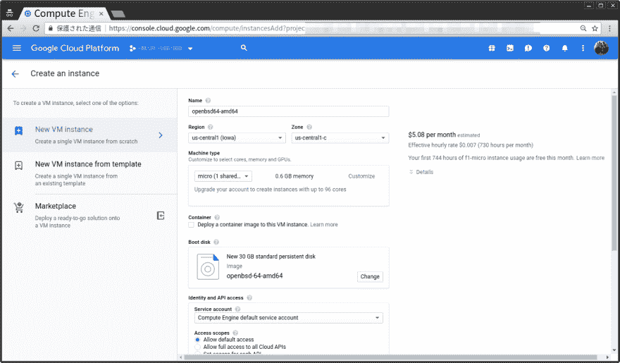
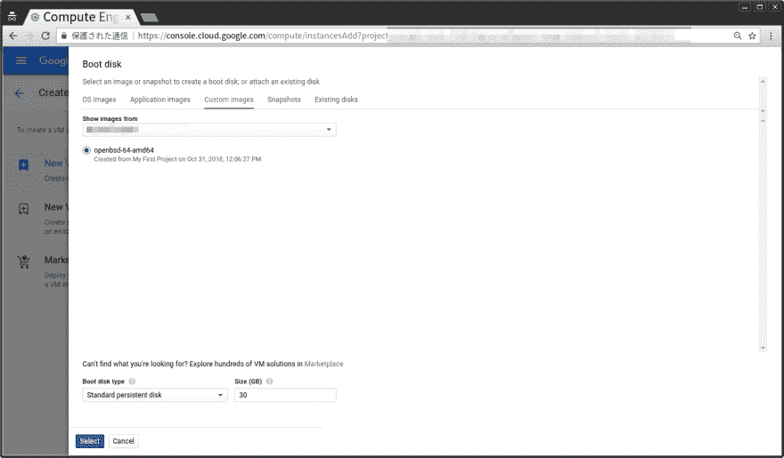
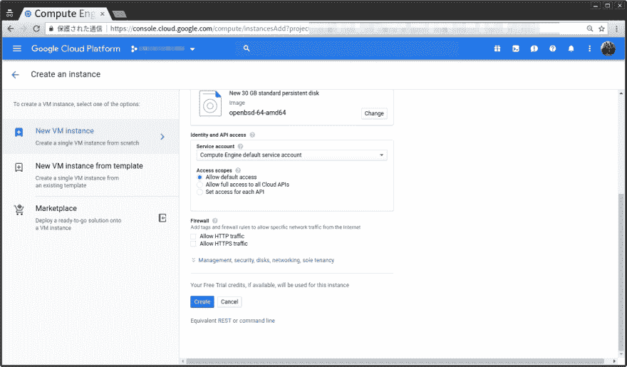
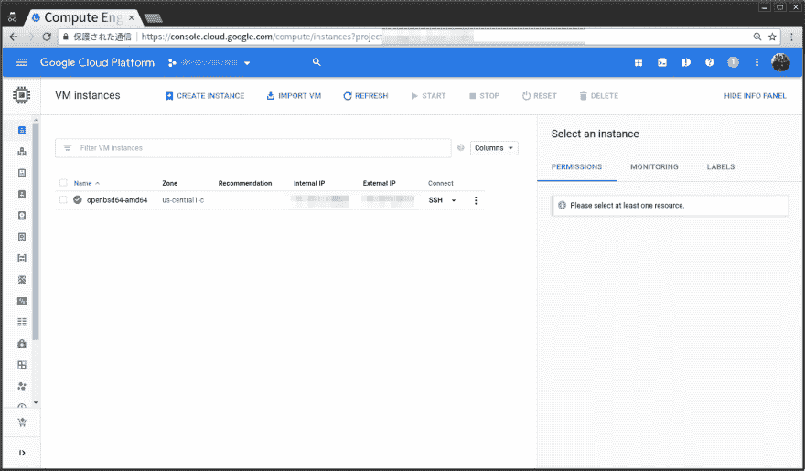
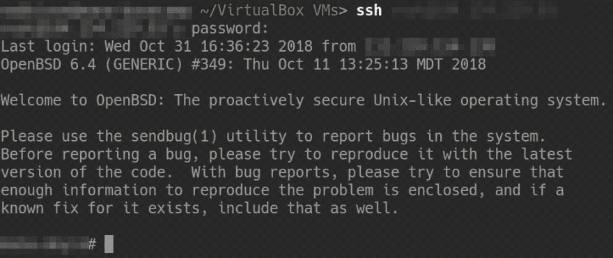
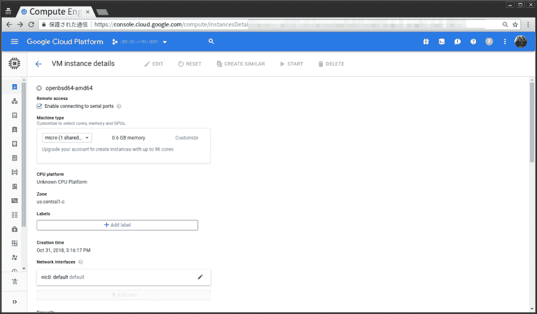
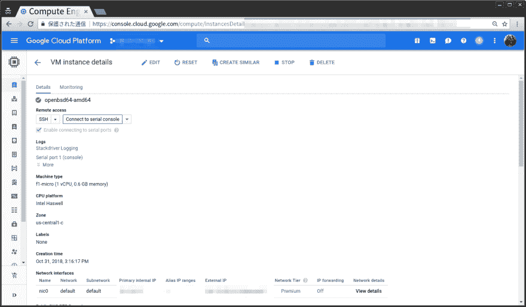
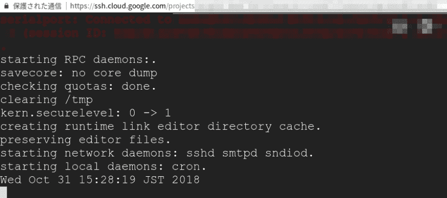

# GCE/GCP - (2/2)云部分上的 OpenBSD 虚拟机

> 原文：<https://dev.to/nabbisen/openbsd-vm-on-gcegcp---22-cloud-part-4fno>

**注:本帖分为两部分。前一部分是:*

[](/nabbisen) [## GCE/GCP - (1/2)本地部分上的 OpenBSD vm

### nab bisen Oct 31 ' 184 分钟读数

#openbsd #gcp #gce #vm](/nabbisen/openbsd-vm-on-gcegcp---12-local-part-gp3)

<center>✿ ✿ ✿</center>

### 第二步:将 VDI 图像转换为 GCE 的 RAW 图像并压缩上传

我们已经创建了一个安装了 OpenBSD 的虚拟机映像。下一步是将其转换为压缩的原始图像，以便上传到谷歌云存储。

```
$  cd "~/VirtualBox VMs/openbsd-64-amd64/" # where you created the image
  $  # convert image
$  VBoxManage internalcommands converttoraw openbsd-64-amd64.vdi disk.raw
$  # compress it
$  tar -Szcf openbsd-64-amd64.tar.gz disk.raw
  $  rm disk.raw # if necessary 
```

Enter fullscreen mode Exit fullscreen mode

### 第三步:上传图片到谷歌云存储

是有备而来，一桶[谷歌云存储](https://console.cloud.google.com/storage)？
如果没有，进入[仪表盘](https://console.cloud.google.com/storage)，执行“创建桶”。

让我们来看看管理谷歌云的步骤。
`gsutil`命令可用:

首先，上传文件:

```
$  gsutil cp -a public-read openbsd-64-amd64.tar.gz gs://[your-bucket]/openbsd-64-amd64.tar.gz
 Copying file://openbsd-64-amd64.tar.gz [Content-Type=application/x-tar]...
| [1 files][370.1 MiB/370.1 MiB]  986.6 KiB/s
Operation completed over 1 objects/370.1 MiB. 
```

Enter fullscreen mode Exit fullscreen mode

**注意:上传完成后，如有必要可以删除本地文件:*

```
$  rm openbsd-64-amd64.tar.gz 
```

Enter fullscreen mode Exit fullscreen mode

接下来，从上传的文件创建图像。

**注意:当您处于重试动作时，您可能需要删除之前的图像:*

```
$  gcloud compute --project [your-project] --quiet images delete openbsd-64-amd64
 Deleted [https://www.googleapis.com/compute/v1/projects/[your-project]/globimg/openbsd-63-amd64]. 
```

Enter fullscreen mode Exit fullscreen mode

创建图像:

```
$  gcloud compute --project [your-project] images create openbsd-64-amd64 --source-uri gs://[your-bucket]/openbsd-64-amd64.tar.gz
 Created [https://www.googleapis.com/compute/v1/projects/[your-project]/globimg/openbsd-64-amd64].
NAME              PROJECT               FAMILY  DEPRECATED  STATUS
openbsd-64-amd64  [your-project]                            READY 
```

Enter fullscreen mode Exit fullscreen mode

根据需要删除桶中已使用的资源文件:

```
$  gsutil rm gs://[your-bucket]/openbsd-64-amd64.tar.gz 
```

Enter fullscreen mode Exit fullscreen mode

### 第四步:在 GCE 上创建一个实例

首先，需要登录[谷歌云控制台](https://console.cloud.google.com/)。
然后，选择菜单:[计算引擎]-[虚拟机实例]:

[T2】](https://res.cloudinary.com/practicaldev/image/fetch/s--hAe1648L--/c_limit%2Cf_auto%2Cfl_progressive%2Cq_auto%2Cw_880/https://thepracticaldev.s3.amazonaws.com/i/c0nka6mg5u57l2x6mm43.jpg)

好的。让我们开始创建一个实例:

[T2】](https://res.cloudinary.com/practicaldev/image/fetch/s--f8Qbpfqm--/c_limit%2Cf_auto%2Cfl_progressive%2Cq_auto%2Cw_880/https://thepracticaldev.s3.amazonaws.com/i/j8opko52d744bb1ihzzj.jpg)

用上传的 OpenBSD 虚拟映像设置“启动盘”:

[T2】](https://res.cloudinary.com/practicaldev/image/fetch/s--h7RMPYQH--/c_limit%2Cf_auto%2Cfl_progressive%2Cq_auto%2Cw_880/https://thepracticaldev.s3.amazonaws.com/i/jqmdbzablwvvpr5ysxr2.jpg)

**注:您的图像位于“自定义图像”列表:*

[T2】](https://res.cloudinary.com/practicaldev/image/fetch/s--IkgbpXkQ--/c_limit%2Cf_auto%2Cfl_progressive%2Cq_auto%2Cw_880/https://thepracticaldev.s3.amazonaws.com/i/k3yktdebqair5s9zoyj5.jpg)

执行创建:

[T2】](https://res.cloudinary.com/practicaldev/image/fetch/s--xkMOfURd--/c_limit%2Cf_auto%2Cfl_progressive%2Cq_auto%2Cw_880/https://thepracticaldev.s3.amazonaws.com/i/qmi4ee1cjyi0vhxanh98.jpg)

现在完成了！

[T2】](https://res.cloudinary.com/practicaldev/image/fetch/s--2oCm4tPD--/c_limit%2Cf_auto%2Cfl_progressive%2Cq_auto%2Cw_880/https://thepracticaldev.s3.amazonaws.com/i/72lx39mefw32x5u0r1d7.jpg)

<center>✿ ✿ ✿</center>

## 用法

我们可以通过像这样的`ssh`命令来访问我们的虚拟机:`ssh user@host`或`ssh host -l user`。

希望键入`ssh`也给你带来快乐:)
你会看到“欢迎使用 OpenBSD”的消息:

[T2】](https://res.cloudinary.com/practicaldev/image/fetch/s--rY59bOx6--/c_limit%2Cf_auto%2Cfl_progressive%2Cq_auto%2Cw_880/https://thepracticaldev.s3.amazonaws.com/i/p4e87u38aw4guxr8talp.jpg)

运行实例后，我们可以构建各种服务器，如下所示:

[](/nabbisen) [## OpenBSD httpd 6.3: Web 服务器

### nab bisen Oct 5 ' 183 分钟读数

#openbsd #httpd #web #server](/nabbisen/setting-up-openbsds-httpd-web-server-4p9f)[](/nabbisen) [## OpenBSD 6.3 上的 PostgreSQL 10.3:安装

### nab bisen Oct 4 ' 182 分钟读数

#postgres #database #openbsd](/nabbisen/installing-postgresql-server-on-openbsd-1kc0)

* * *

#### 选项:留给我的一个未解小题

我好像已经可以通过“启用连接串口”之后的“连接到串口控制台”来管理 GCE 上的 OpenBSD vm 了。

[T2】](https://res.cloudinary.com/practicaldev/image/fetch/s--9N6t-paD--/c_limit%2Cf_auto%2Cfl_progressive%2Cq_auto%2Cw_880/https://thepracticaldev.s3.amazonaws.com/i/bxpuwzu73de11ahnpz1k.jpg)

[T2】](https://res.cloudinary.com/practicaldev/image/fetch/s--cd_saBzf--/c_limit%2Cf_auto%2Cfl_progressive%2Cq_auto%2Cw_880/https://thepracticaldev.s3.amazonaws.com/i/vfysz6jz49wpejr1a1pr.jpg)

但是响应在这一行停止了...

[T2】](https://res.cloudinary.com/practicaldev/image/fetch/s--0DEw4LC---/c_limit%2Cf_auto%2Cfl_progressive%2Cq_auto%2Cw_880/https://thepracticaldev.s3.amazonaws.com/i/ijh5mluc7bbdwomyvx51.jpg)

我是不是记错了？

如果你有一些知识或解决方案，我会很高兴收到你的来信: )

<center>✿ ✿ ✿</center>

## 其他

毕竟，我不仅加深了对创建 OpenBSD 映像的理解，还加深了对为云计算创建定制映像的理解。对我来说，这是一次非常好的经历。

嗯，为了安全或/和改进，我们有时需要修补系统或更新软件包。
所以我打算写 OpenBSD 的安装后设置。

为🕊服务愉快