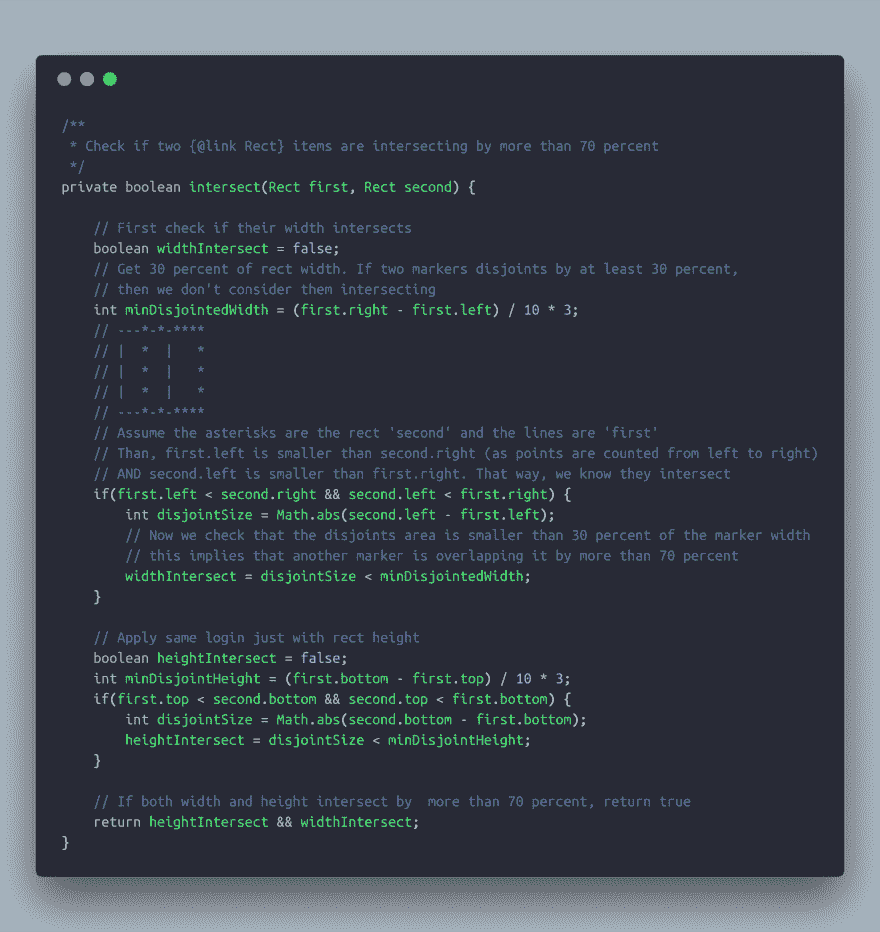
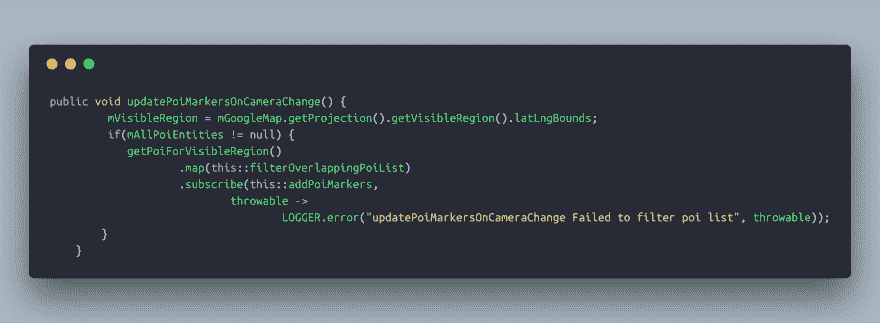
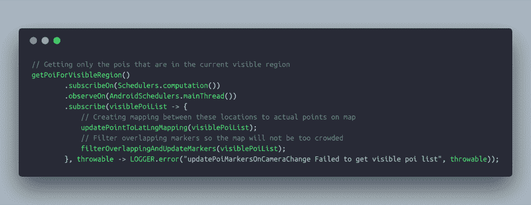

# 使用 RxJava 优化谷歌地图上的标记性能

> 原文：<https://dev.to/orelzion/optimising-markers-perofrmence-on-google-maps-using-rxjava-5622>

所以今天我遇到了一个有趣的问题。我需要在谷歌地图上显示大量的标记，我们认为标记太多不好看，所以我们去掉了相交超过 70%的标记，只显示其中的一个。

所以我写了这个小函数，用两个矩形对象来看它们是否相交。

[T2】](https://res.cloudinary.com/practicaldev/image/fetch/s--KtbFFjRL--/c_limit%2Cf_auto%2Cfl_progressive%2Cq_auto%2Cw_880/https://thepracticaldev.s3.amazonaws.com/i/uf9pmnczuwh6pamgjwop.png)

但是如果你只有一个你想放置标记的位置的坐标，你怎么得到一个矩形的物体呢？幸运的是，谷歌地图已经有了一个实用功能，可以将地图上的纬度/经度转换成一个点目标。

`mGoogleMap.getProjection().toScreenLocation(latLng)`

因此，我能够基于该点加上图标的宽度和高度创建一个 Rect 对象。

现在我们需要迭代所有的 lat/LNG，并检查它们中的哪些是相交的。

因为这可能很繁重(遍历每个对象并对照列表中的所有其他对象进行检查)，所以我决定在 RxJava observable 中运行它。

[T2】](https://res.cloudinary.com/practicaldev/image/fetch/s--2xFMlNtQ--/c_limit%2Cf_auto%2Cfl_progressive%2Cq_auto%2Cw_880/https://thepracticaldev.s3.amazonaws.com/i/z6w3izorywxbdzppcq0d.png)

似乎是合法的，对吧？

嗯，我想，我们试试吧。哦，天啊，太糟糕了。我在谷歌 Pixel 2 设备上运行该应用程序，每当我移动屏幕并且需要重画标记时，该应用程序就会停滞一秒钟。

所以我又看了一下我的代码，虽然方法‘getPoiForVisibleRegion’在后台运行，但是接下来的 map 操作却不是！这是因为我只在“getPoiForVisibleRegion”中添加了 subscribeOn 和 observeOn 方法，所以后面调用的 map 操作没有包括在内。

好，所以我只需要在 map 声明后包含 subscribe 方法，对吗？

别急，我的朋友。问题就在这里。谷歌地图无法在后台显示屏幕点，这意味着我可以在 RxJava 中运行算法的其他部分，除了交集过滤器。

那就回到制图桌吧。

现在，我想，如果我可以在滤镜之前获得当前可见标记的所有点，并在实际滤镜已经拥有所有点时在后台运行，会怎么样？

所以我就这么做了。我创建了一个 HashMap，它会在每次地图边界改变时更新(这意味着缩放级别改变了，或者地图移动了)。我在 UI 线程上获得了地图的当前可见区域

`mGoogleMap.getProjection().getVisibleRegion().latLngBounds;`

然后我去过滤掉我现在应该画的标记。我保存了这些位置和它们在屏幕上的位置之间的映射

[T2】](https://res.cloudinary.com/practicaldev/image/fetch/s---3JMZqDz--/c_limit%2Cf_auto%2Cfl_progressive%2Cq_auto%2Cw_880/https://thepracticaldev.s3.amazonaws.com/i/ktflh1zb3nsl26qo3kjf.png)

维奥拉。

结果非常令人满意！地图平滑地移动，标记被移除或者以一个漂亮的动画出现在屏幕上(这篇文章中没有描述)，用户不必等待超过一秒钟，更重要的是屏幕不会被卡住