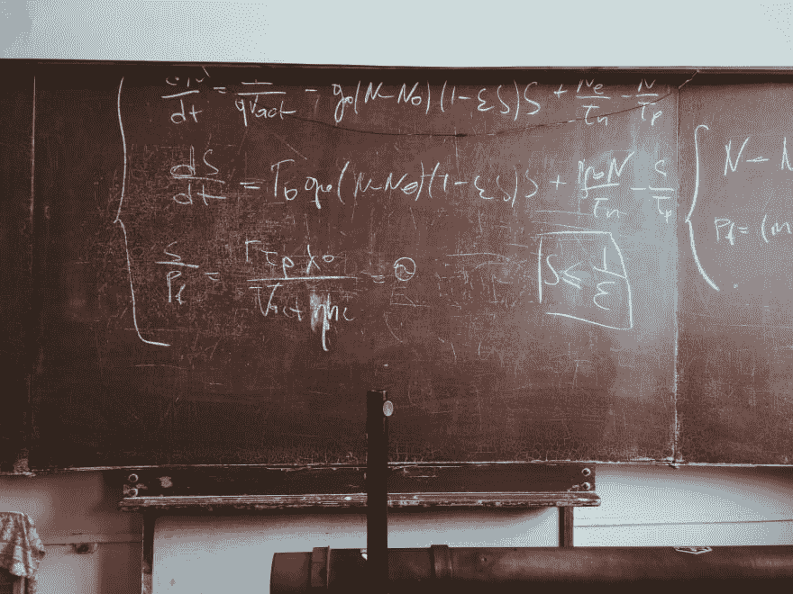
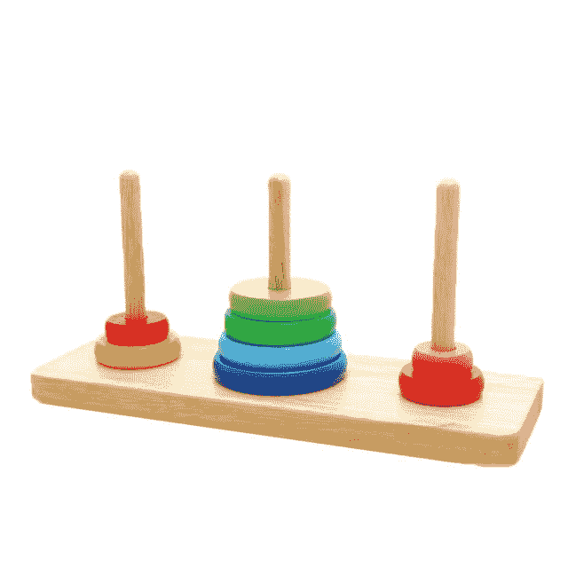
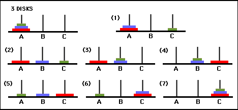
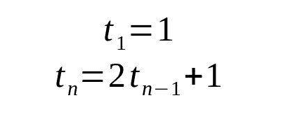
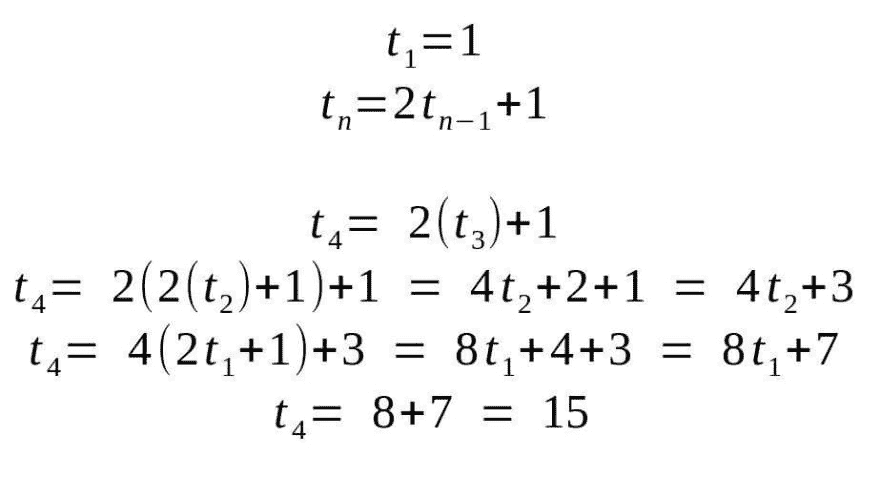
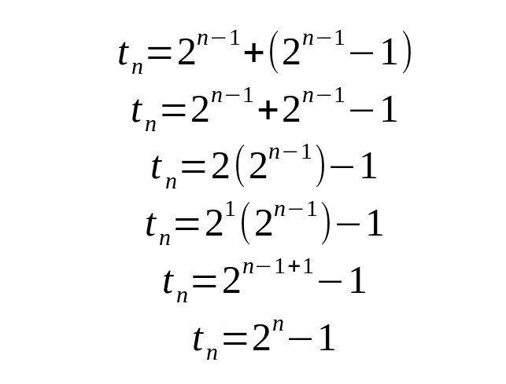
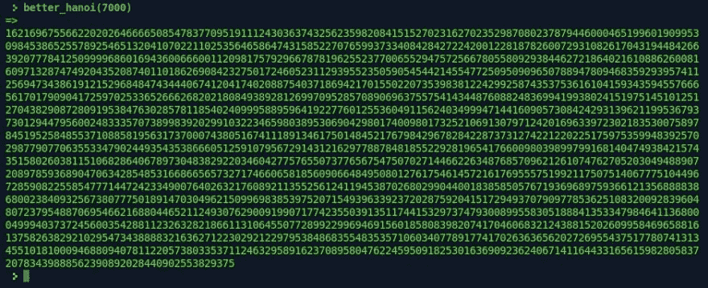

# 用代数优化代码

> 原文：<https://dev.to/socratesdz/optimizing-code-with-algebra-37en>

[T2】](https://res.cloudinary.com/practicaldev/image/fetch/s--O6cCrgbj--/c_limit%2Cf_auto%2Cfl_progressive%2Cq_auto%2Cw_880/https://thepracticaldev.s3.amazonaws.com/i/c24nlacbohaiz8vrwngt.jpg)

###### Unsplash 上 Roman Mager 的照片

在大学的一个学期里，我选修了一门叫做“离散数学”的课程。讲师决定将全班分成小组。每组由 2 或 3 名学生组成。他们被要求对讲师指定的特定主题进行阐述。

在我所在的小组(实际上我们只有两个人)，我们被分配了*重现关系*的主题。[根据维基百科的](https://en.wikipedia.org/wiki/Recurrence_relation)，这是:

> 给定一个或多个初始项后，递归定义值的序列或多维数组的方程:序列或数组的每个后续项都被定义为前面各项的函数。

换句话说，一个*递归函数*；)

用:D 代码来解释这个概念是再好不过了

## 河内塔

你记得这个玩具吗？

[T2】](https://res.cloudinary.com/practicaldev/image/fetch/s--F26Rw_eM--/c_limit%2Cf_auto%2Cfl_progressive%2Cq_auto%2Cw_880/https://thepracticaldev.s3.amazonaws.com/i/t3dh0kcy1au86mi86eev.jpg)

著名的河内塔。该游戏包括在尽可能少的步骤内将每个圆盘从第一个磁极移动到最后一个磁极(从左到右或反之亦然)。规则是较大的磁盘不能放在较小的磁盘上，一次只能移动一个磁盘。大概是这样的:

[T2】](https://res.cloudinary.com/practicaldev/image/fetch/s--g9Fida9y--/c_limit%2Cf_auto%2Cfl_progressive%2Cq_66%2Cw_880/https://thepracticaldev.s3.amazonaws.com/i/mq04i1fxf3thuw4horhc.gif)

这个问题有一个算法可以解决，它是这样的:
[](https://res.cloudinary.com/practicaldev/image/fetch/s--Dz8xVaEy--/c_limit%2Cf_auto%2Cfl_progressive%2Cq_auto%2Cw_880/https://thepracticaldev.s3.amazonaws.com/i/jirw4nz2rll5eua3uyxz.png)

其中 *n* 是问题中的磁盘数量。

## 我们来编码一下

让我们用 Python 来写这个算法。大概是这样的:

```
def hanoi(n):
    if n <= 1: return 1
    else: return 2 * hanoi(n-1) + 1 
```

Enter fullscreen mode Exit fullscreen mode

所以如果我们有 4 个磁盘...

```
>>> hanoi(4)
15 
```

Enter fullscreen mode Exit fullscreen mode

很好。它工作了。让我们试几次吧

```
>>> hanoi(5)
31
>>> hanoi(10)
1023
>>> hanoi(40)
1099511627775 
```

Enter fullscreen mode Exit fullscreen mode

看起来不错。现在我知道如果我使用 40 个磁盘，需要走多少步了(顺便说一句，这需要 10460 年，千万不要在家里尝试)。但是如果我有 7000 呢？

```
>>> hanoi(7000)
Traceback (most recent call last):which
  File "<stdin>", line 1, in <module>
  File "<stdin>", line 3, in hanoi
  File "<stdin>", line 3, in hanoi
  File "<stdin>", line 3, in hanoi
  [Previous line repeated 994 more times]
  File "<stdin>", line 2, in hanoi
RecursionError: maximum recursion depth exceeded in comparison 
```

Enter fullscreen mode Exit fullscreen mode

哦...这似乎是不够的。当然，你可以通过增加 Python 中的最大递归深度来“解决”这个问题(用`sys.setrecursionlimit(n)`)，但是优化它是一个更好的主意。

## 优化

求解递推关系有几种方法，其中一种是*迭代*。它由逐步求解操作和从过程中扣除非递归方程组成。首先我们尝试求解一个给定值:

[T2】](https://res.cloudinary.com/practicaldev/image/fetch/s--12VMqyWY--/c_limit%2Cf_auto%2Cfl_progressive%2Cq_auto%2Cw_880/https://thepracticaldev.s3.amazonaws.com/i/1tu014vif32swkw3mrjp.jpg)

然后，从最后一行，我们可以推导出一个等价方程:

[T2】](https://res.cloudinary.com/practicaldev/image/fetch/s--BmM46L7h--/c_limit%2Cf_auto%2Cfl_progressive%2Cq_auto%2Cw_880/https://thepracticaldev.s3.amazonaws.com/i/fsqr8515gwqcvpfaht5y.jpg)

如果你注意到，`t(4) = 8 + 7`和`t(4) = 2^(4-1) + (2^(4-1) - 1)`是一样的，这就是为什么它是我们的初始语句。但是现在我们已经解决了递归关系，让我们在代码中使用它。

```
def better_hanoi(n):
    return 2**n - 1 
```

Enter fullscreen mode Exit fullscreen mode

然后...

[T2】](https://res.cloudinary.com/practicaldev/image/fetch/s--pfrhuZmf--/c_limit%2Cf_auto%2Cfl_progressive%2Cq_auto%2Cw_880/https://thepracticaldev.s3.amazonaws.com/i/ntdygfkkefqgrl8zxdj6.jpg)

现在我们知道用 7000 个圆盘(大概是宇宙的寿命，好几次)要解多少步了。

## 结论

我们已经用离散数学的概念优化了一个小算法，这只是给我们一点启示，告诉我们如何利用这些简单的概念来构建更好的程序。