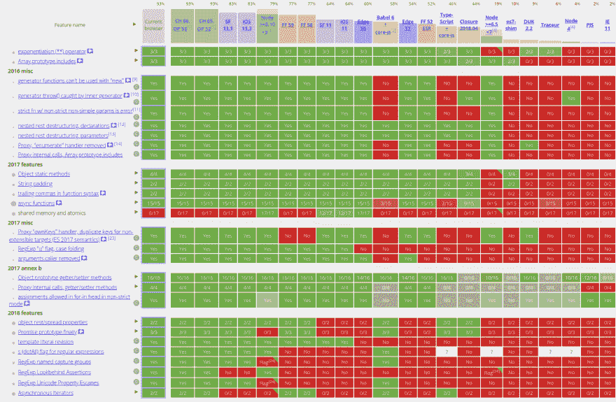
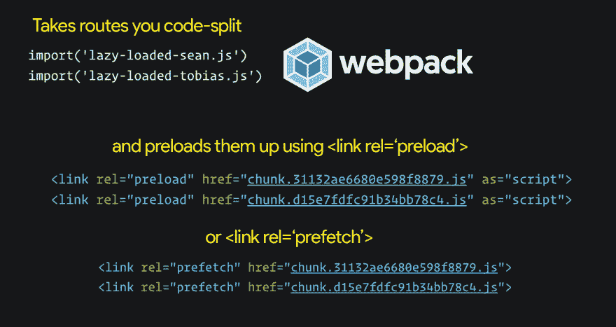
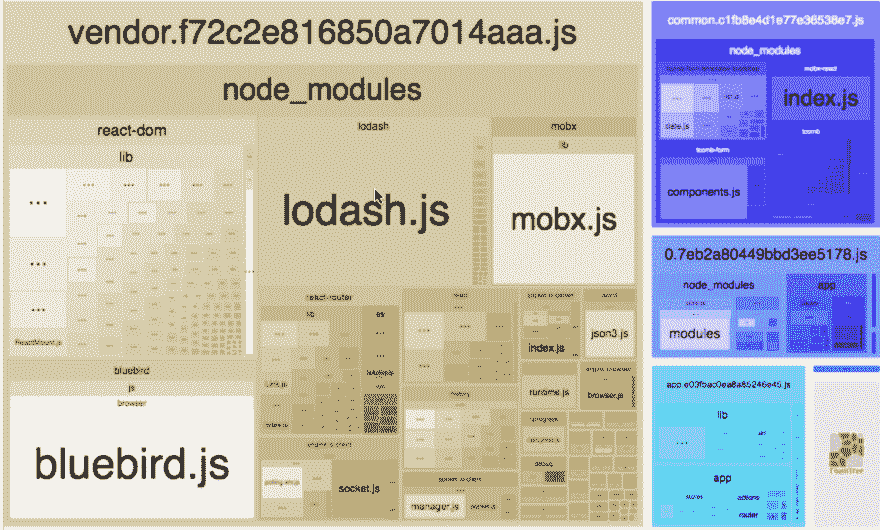
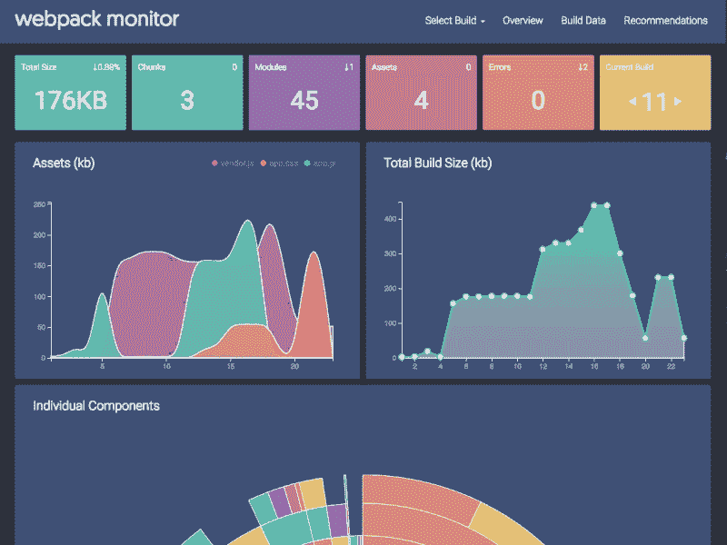

# 使用 Webpack 4 优化前端交付

> 原文：<https://dev.to/jesalg/optimizing-front-end-delivery-with-webpack-4-1mm4>

随着最新的主要 Webpack 发布(版本 4.x ),我们已经到了不需要配置就可以开始的地步。它是默认优化的(#0CJS！).因此，像`CommonsChunkPlugin`、`UglifyjsWebpackPlugin`等需要手动添加和配置的插件会被 Webpack 自动实例化，这让生活变得更加轻松！

尽管我们仍然可以做一些事情来确保我们从 Webpack 中获得最大收益。让我们一个一个地看。

## 模式

Webpack 4 有两种模式:`production`和`development`。默认情况下，运行带有标志`--mode development|production`的 webpack 或者在配置文件中设置该标志可以实现一系列优化:

| [计]选项 | 描述 |
| --- | --- |
| `development` | 为`process.env.NODE_ENV`提供值`development`。启用`NamedChunksPlugin`和`NamedModulesPlugin`。 |
| `production` | 为`process.env.NODE_ENV`提供值`production`。启用`FlagDependencyUsagePlugin`、`FlagIncludedChunksPlugin`、`ModuleConcatenationPlugin`、`NoEmitOnErrorsPlugin`、`OccurrenceOrderPlugin`、`SideEffectsFlagPlugin`和`UglifyJsPlugin`。 |

所以不需要手动包含那些插件或者使用`DefinePlugin`设置`NODE_ENV`，当使用`mode`时，这些都被处理了。

顺便说一下，如果您仍然想将自定义参数传递给`UglifyJsPlugin`，我发现自己也想这样做，您可以通过安装它:`npm install uglifyjs-webpack-plugin --save-dev`，然后在 Webpack 配置:
中指定您的自定义参数

```
const UglifyJsPlugin = require('uglifyjs-webpack-plugin');  

if (process.env.NODE_ENV === 'production') {  
  config.optimization = {  
    minimizer: [  
      new UglifyJsPlugin({  
        parallel: true,  
        cache: true,  
        sourceMap: true,  
        uglifyOptions: {  
          compress: {  
            drop_console: true  
          }  
        },  
      }),  
    ],  
  };  
} 
```

Enter fullscreen mode Exit fullscreen mode

这将基本上覆盖你自己的 Webpack 的默认最小化实例，这样你就可以完全控制它。

该配置将确保 uglifier 以并行模式运行，缓存输出以在下一个构建中重用，生成源映射，并在生产模式下运行时抑制控制台中的注释。您可以在此找到可用选项的完整列表[。](https://github.com/webpack-contrib/uglifyjs-webpack-plugin#options)

## 哈希

默认情况下，Webpack 不会将缓存破坏散列添加到输出文件名中(例如，`index.7eeea311f7235e3b9a17.js`)。因此，您的用户可能在下次发布时无法获得最新的代码，这可能会导致许多奇怪的行为和错误。

因此，为了在每次构建后刷新您的资产，您可以在文件名中添加`hash`:

```
module.exports = {
  entry: {
    vendor: './src/vendor.js',
    main: './src/index.js'
  },
  output: {
    path: path.join(__dirname, 'build'),
    filename: '[name].[hash].js'
  }
}; 
```

Enter fullscreen mode Exit fullscreen mode

虽然如果你仔细想想，这似乎有点重手。如果你的`vendor.js`没有变化，如果 Webpack 很聪明，只更新已经变化的块的散列，那就好了。这样，即使什么都没有改变，每次我们推出新的构建时，客户也不必再次下载所有的资产。

为了确保发生这种情况，Webpack 提供了`chunkhash`。Chunkhash 基于每个入口点的内容，而不是整个构建。使用它同样简单:

```
module.exports = {
  ...
  output: {
    ...
    filename: '[name].[chunkhash].js'
  }
}; 
```

Enter fullscreen mode Exit fullscreen mode

这将确保我们得到两个世界最好的东西。当一个新版本发布时，客户端将获取更新的文件，同时仍然使用没有改变的文件的缓存版本。

## 通天塔

**运输**

因为不是每个浏览器都支持 ES6/7/Next 特性，所以在浏览器上导航什么可以，什么不可以很快成为一个[雷区](http://kangax.github.io/compat-table/es2016plus/):

[T2】](https://res.cloudinary.com/practicaldev/image/fetch/s--L8dgwXXE--/c_limit%2Cf_auto%2Cfl_progressive%2Cq_auto%2Cw_880/https://jes.al/public/wp-content/uploads/compat-table.png)

这就是巴别尔的用武之地。它提供了一些令人惊叹的插件，通过将现代 JS 转换成可以在我们指定的每种浏览器上工作的东西，使得编写现代 JavaScript 变得轻而易举。

您可以通过安装:`npm install babel-core babel-loader babel-preset-env --save-dev`来设置它

现在你可以用简单的英语(使用[浏览器列表](https://github.com/browserslist/browserslist)语法)在你的项目文件夹的根目录`.babelrc`中告诉 Babel 我们想要哪个浏览器

```
{  
  "presets": [  
    ["env", {  
      "targets": {  
        "browsers": ["last 2 versions", "safari >= 9"]  
      }  
    }]  
  ]
} 
```

Enter fullscreen mode Exit fullscreen mode

这可以通过使用[环境预置](https://babeljs.io/docs/plugins/preset-env/)来实现，它会根据你指定的环境自动确定你需要的巴别塔插件。

最后，我们想让 Webpack 知道我们想用 Babel 传输我们所有的 JavaScript:

```
module.exports = {
  module: {
    rules: [
      {
        test: /\.js$/,
        exclude: /node_modules/,
        use: {
          loader: "babel-loader",
          options: {  
            cacheDirectory: true  
          }
        }
      }
    ]
  }
}; 
```

Enter fullscreen mode Exit fullscreen mode

现在，您可以放心地使用所有最新的 JavaScript 语法，因为 Babel 将负责浏览器兼容性。

**动态导入**

所以使用 Babel 的下一个优势是与性能相关的。我们可以使用它的[动态导入插件](https://babeljs.io/docs/plugins/syntax-dynamic-import/)来异步加载大的依赖项，只在你需要的时候，也就是延迟加载。这可能会对入口点文件的大小产生巨大的影响，因为 Webpack 不必一次加载整个依赖树。

你可以通过安装:`npm install syntax-dynamic-import --save-dev`然后把它添加到你的`.babelrc`
来设置它

```
{  "presets":  [  ...  ]  "plugins":  ["syntax-dynamic-import"]  } 
```

Enter fullscreen mode Exit fullscreen mode

所以现在一个模块看起来像这样:

```
import foo from 'foo'
import bar from 'bar'
import baz from 'baz'

const myfun = () => {  
  //Do something with the modules here 
} 
```

Enter fullscreen mode Exit fullscreen mode

可以转换成这样:

```
const myfun = () => {  
  return Promise.all([  
    import('foo'),  
    import('bar'),  
    import('baz'),  
  ]).then(([foo, bar, baz]) => {  
    //Do something with the modules here 
  });  
}; 
```

Enter fullscreen mode Exit fullscreen mode

Webpack 将识别这些动态导入，并将它们代码分割成单独的块。一旦在运行时调用了`myfun`，它们将被异步加载。这将确保我们的初始块大小保持较小，并且客户端不必下载甚至可能不需要的资源。

顺便说一下，如果你使用 Vue，它可以通过[异步组件](https://vuejs.org/v2/guide/components-dynamic-async.html#Async-Components)得到支持，但是当然，如果你处理的是一个有各种框架的大型应用程序，单靠这些框架是不够的，所以你需要一个通用的解决方案。

## 预载

现在我们有了最佳的代码分割，一个缺点是客户端仍然必须在运行时加载这些依赖项，这可能会降低应用程序的响应速度。所以在上面的例子中，当我们调用`myfun`时，客户端首先要加载`foo`、`bar`和`baz`才能执行函数。

如果我们可以在后台预加载这些依赖项，那么当我们调用`myfun`时，这些依赖项已经可用并准备就绪，会怎么样？这就是[预加载插件](https://github.com/GoogleChromeLabs/preload-webpack-plugin)的用武之地。

[T2】](https://res.cloudinary.com/practicaldev/image/fetch/s--kyRz_awW--/c_limit%2Cf_auto%2Cfl_progressive%2Cq_auto%2Cw_880/https://cloud.githubusercontent.com/assets/110953/22451103/7700b812-e720-11e6-89e8-a6d4e3533159.png)

它使用 [Preload](https://w3c.github.io/preload/) web 标准来声明性地让浏览器知道某个特定的资源将很快被需要，这样它就可以开始加载它。

您可以通过安装:`npm install --save-dev preload-webpack-plugin html-webpack-plugin`并将其添加到您的 Webpack 配置:
来进行设置

```
const PreloadWebpackPlugin = require('preload-webpack-plugin');
const HtmlWebpackPlugin = require('html-webpack-plugin')

plugins: [
  new HtmlWebpackPlugin(),
  new PreloadWebpackPlugin({
    rel: 'preload',
    include: 'asyncChunks'
  })
] 
```

Enter fullscreen mode Exit fullscreen mode

就是这样！现在我们所有的异步块都将被添加到我们的 HTML 中，并像这样预加载:

```
<link rel="preload" as="script" href="chunk.31132ae6680e598f8879.js">
<link rel="preload" as="script" href="chunk.d15e7fdfc91b34bb78c4.js">
<link rel="preload" as="script" href="chunk.acd07bf4b982963ba814.js"> 
```

Enter fullscreen mode Exit fullscreen mode

从 Webpack 4.6+开始，这是内置于中的[，您可以使用内嵌导入指令手动指定想要预加载或预取哪些依赖项，Webpack 将自动输出这些指令作为资源命中，而无需安装我上面提到的插件。](https://webpack.js.org/guides/code-splitting/#prefecting-preloading-modules)

因此，在上面的导入语句中，您需要做的全部更改是:

```
import("foo");
import("bar") 
```

Enter fullscreen mode Exit fullscreen mode

会是这样:

```
import(/* webpackPrefetch: true */ "foo");
import(/* webpackPreload: true */ "bar") 
```

Enter fullscreen mode Exit fullscreen mode

所以这归结为一个偏好的问题，不管你是想使用 preload 插件从配置文件中为整个项目管理你的 preload 偏好，还是你想留给单个开发人员，让他们决定应该预加载/预取哪些依赖项，在这种情况下不需要安装任何特殊的东西。

最后，您需要仔细考虑是使用预取还是预加载。这将取决于资源和应用程序上下文。我会给你看[艾迪·奥斯马尼](https://medium.com/@addyosmani)的这篇精彩的文章，来理解这两者之间的细微差别。但是一般来说:

> 预加载您有高可信度的资源将在当前
> 页面中使用。预取可能用于跨多个导航边界的未来导航
> 的资源。

## 分析仪

既然我们已经看到了优化 Webpack 设置的一些方法，我们将希望在添加更多代码和依赖项时关注这个包，以确保它仍然处于最佳状态。我最喜欢的两个工具是:

**[Webpack 捆绑包分析器](https://github.com/webpack-contrib/webpack-bundle-analyzer)**

[T2】](https://res.cloudinary.com/practicaldev/image/fetch/s--dtO0cVoQ--/c_limit%2Cf_auto%2Cfl_progressive%2Cq_66%2Cw_880/https://cloud.githubusercontent.com/assets/302213/20628702/93f72404-b338-11e6-92d4-9a365550a701.gif)

您可以通过安装:`npm install --save-dev webpack-bundle-analyzer`并将其添加到您的 Webpack 配置:
来进行设置

```
const BundleAnalyzerPlugin = require('webpack-bundle-analyzer').BundleAnalyzerPlugin;

if (process.env.NODE_ENV !== 'production') {
  config.plugins.push(new BundleAnalyzerPlugin())
} 
```

Enter fullscreen mode Exit fullscreen mode

下次当您在开发模式下启动 webpack-dev-server 时，您可以导航到 [http://localhost:8888](http://localhost:8888) 来查看如上所示的包可视化

**[Webpack 监视器](http://webpackmonitor.com/index.html)**

[T2】](https://res.cloudinary.com/practicaldev/image/fetch/s--I-xSTw65--/c_limit%2Cf_auto%2Cfl_progressive%2Cq_66%2Cw_880/http://webpackmonitor.com/img/overview.gif)

这是我第二喜欢的工具，它提供了与 Webpack Bundle Analyzer 相同的信息，但是除了提供了一种监视一段时间内的 Bundle 历史的方法之外，它的方式略有不同。

您可以通过安装:`npm install --save-dev webpack-monitor`并将其添加到您的 Webpack 配置:
来进行设置

```
const WebpackMonitor = require('webpack-monitor');

// ...

plugins: [
  new WebpackMonitor({
    capture: true, // -> default 'true'
    target: '../monitor/myStatsStore.json', // default -> '../monitor/stats.json'
    launch: true, // -> default 'false'
    port: 3030, // default -> 8081
    excludeSourceMaps: true // default 'true'
  }),
], 
```

Enter fullscreen mode Exit fullscreen mode

您可以像以前的插件一样在开发中运行它，或者也可以在生产构建中运行它，并将输出导出到某个地方，这样您就可以分析您的生产包是如何随着时间的推移而变化的。

## 结论

那都是乡亲们！希望有了所有这些技术，您能够显著缩减包的大小并提高性能。让我知道进展如何。还有什么我没注意到的技巧吗？下面留言评论！

*这篇文章最初发表在[我的博客](https://jes.al/2018/04/optimizing-front-end-delivery-with-Webpack-4/)上。如果你喜欢这篇文章，请在社交媒体上分享，并在推特上关注我！*