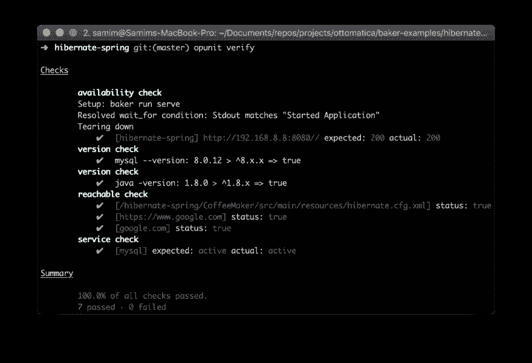

# opunit！虚拟机、容器和服务器的健全性检查。

> 原文：<https://dev.to/chrisparnin/opunit-30j0>

当构建/维护虚拟机映像、容器和服务器作为基础设施或 CI/CD 管道的一部分时，您如何验证您构建了正确的东西？

`opunit verify`是一个简单的[开源工具](https://github.com/ottomatica/opunit/)，它将针对环境运行健全性检查。例如，服务是否在端口上运行，我的实例能否解析 dns，是否安装了正确版本的包/工具？

运行 opunit，然后会给出一个测试报告，很像一个`mocha`或者其他测试框架。

[T2】](https://res.cloudinary.com/practicaldev/image/fetch/s--mHo_OlJb--/c_limit%2Cf_auto%2Cfl_progressive%2Cq_auto%2Cw_880/https://user-images.githubusercontent.com/9158546/47369653-29e20080-d6b2-11e8-8098-b64c59d282c6.png)

要设置检查，您只需要提供一个简单的配置文件:

```
- group:
    description: "Basic  checks  for  startup"
    checks:
      - availability:
          port: 8080
          status: 200
      - version:          
         cmd: node --version
         range: ^10.x.x 
```

你也可以连接到正在运行的容器或者远程服务器:

```
 # Just give address and ssh key:
$ opunit verify root@example.com:2222 -c {opunit.yml path} -i ~/.ssh/server_rsa

# Or name/sha of container
$ opunit verify -c {opunit.yml path} -t {docker container name or id} 
```

试试吧！请求任何你认为很酷的新功能！

```
npm install -g opunit 
```