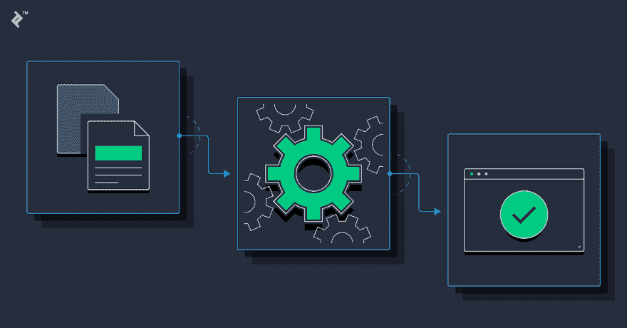
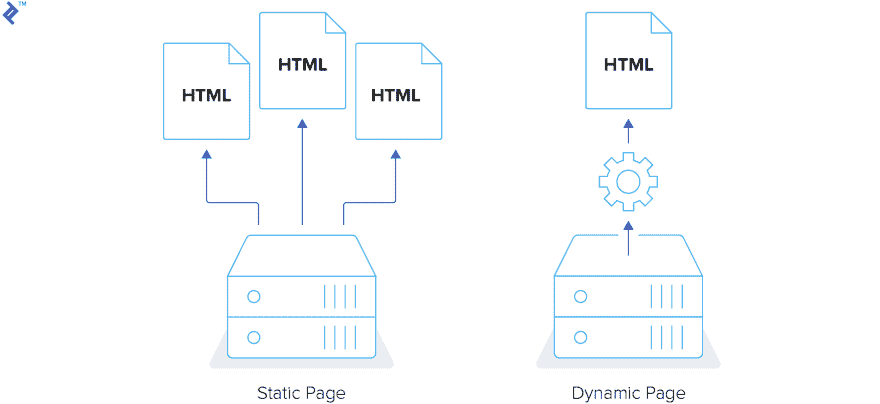
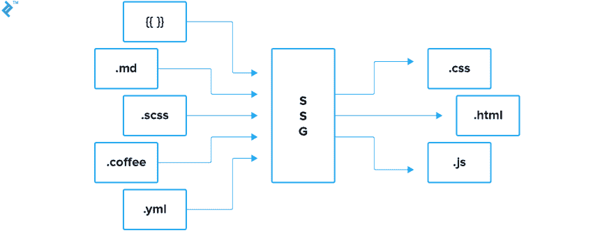
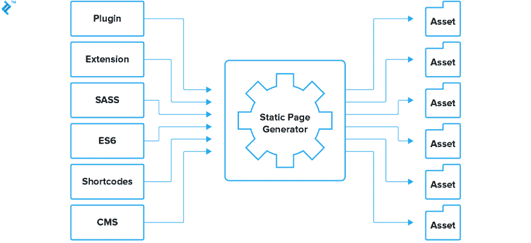

# 流行的静态站点生成器概述

> 原文：<https://dev.to/starbist/overview-of-popular-static-site-generators-poi>

[T2】](https://res.cloudinary.com/practicaldev/image/fetch/s---nq0MJwF--/c_limit%2Cf_auto%2Cfl_progressive%2Cq_auto%2Cw_880/https://thepracticaldev.s3.amazonaws.com/i/tn48wzx7osbqg2hwdc3b.png)

*本文最初发表在 [Toptal 博客](https://www.toptal.com/front-end/static-site-generators-comparison-2018)上。*

所有静态页面生成器都有一个看似简单的任务:生成一个静态 HTML 文件及其所有资产。

提供静态 HTML 文件有许多明显的好处，比如更容易缓存、更快的加载时间和总体上更安全的环境。每个静态页面生成器产生不同的 HTML 输出。

[T2】](https://res.cloudinary.com/practicaldev/image/fetch/s---UcTvcz_--/c_limit%2Cf_auto%2Cfl_progressive%2Cq_auto%2Cw_880/https://thepracticaldev.s3.amazonaws.com/i/sugiorh95xv3vmwh0kik.png)

然而，这篇文章的目的不是深入讨论它们错综复杂的机制，而是比较每个框架提供的特性集，并强调每个框架的独特方面和特性。

## 流行静态页面框架概述

在本帖中，我们将仔细研究以下静态页面框架:Jekyll、Middleman、Hugo 和 Hexo。这些绝不是唯一的生成器，但它们是最常用的，有大型社区和大量有用资源的支持。

让我们仔细看看它们，并比较它们的基本特征:

*   吉基尔博士
    *   用红宝石写的，
    *   支持开箱即用的液体模板引擎；
*   经纪人
    *   用红宝石写的，
    *   支持 ERB 和 Haml 模板引擎开箱即用；
*   雨果
    *   用 Go 写的，
    *   支持开箱即用的 Go 模板引擎；
*   Hexo
    *   用 JavaScript 写的，
    *   支持 EJS 和帕格跳出框框。

注意:*值得指出的是，这些静态页面生成器中的每一个都可以使用插件和扩展来定制和扩展，允许您覆盖您的大部分或全部需求。*

## 设置静态站点发电机

每个框架的文档都很全面，非常优秀，您可以从这里获得:

[杰基尔文档](////jekyllrb.com/docs/home/)

[中间人文档](////middlemanapp.com/basics/install/)

[雨果文档](////gohugo.io/documentation/)

[Hexo 文档](////hexo.io/docs/)

如果您只是按照安装指南进行操作，您应该在几分钟内就可以准备好开发环境。安装后，您可以通过从终端运行命令来启动新项目。

例如，这是您在不同框架中启动新项目的方式:

**哲基尔**

```
jekyll new my_website 
```

Enter fullscreen mode Exit fullscreen mode

**中间人**

```
middleman init my_website 
```

Enter fullscreen mode Exit fullscreen mode

**雨果**T2】

```
hugo new my_website 
```

Enter fullscreen mode Exit fullscreen mode

**己方**

```
hexo init my_website 
```

Enter fullscreen mode Exit fullscreen mode

## 配置

配置通常存储在一个文件中。每一个静态网站生成器都有它自己的特点，但是很多设置在所有四个站点上都是一样的。

您可以指定源文件存储的位置或输出构建的源代码的位置。通过设置 exclude 或`skip_render`选项来跳过构建过程中不会用到的数据总是有用的。您还可以使用配置文件来存储全局设置，如项目标题或作者。

## 迁移到静态发电机

如果您已经有了一个准备好的 Wordpress 项目，那么您可以相对容易地将其迁移到一个静态页面生成器。

对于 Jekyll，你可以 [Jekyll Exporter](////wordpress.org/plugins/jekyll-exporter/) 插件。对于中间人，您可以使用名为 [wp2middleman](////github.com/mdb/wp2middleman) 的命令行工具。你可以使用 Wordpress to Hugo Exporter 进行 Hugo 迁移，对于 Hexo，你可以阅读我去年写的关于如何从 Wordpress 迁移到 Hexo 的[指南。](////silvestar.codes/articles/a-guide-to-static-site-generators-using-hexo-and-wordpress/)

原理几乎完全相同，而且非常简单——首先将所有内容导出为合适的格式，然后将其包含在正确的文件夹中。

## 内容

静态页面生成器对主要内容使用 [Markdown](////daringfireball.net/projects/markdown/syntax) 。减价很有效，人们可以很快学会。用 Markdown 编写内容感觉很自然，因为它的语法很简单。这份文件看起来整洁有序。

[T2】](https://res.cloudinary.com/practicaldev/image/fetch/s--JK-0MgP4--/c_limit%2Cf_auto%2Cfl_progressive%2Cq_auto%2Cw_880/https://thepracticaldev.s3.amazonaws.com/i/4jbyqaui9rp45sxllbh3.png)

您应该将文章放在全局配置文件中指定的文件夹中。文章名称应该遵循生成器指定的约定。

在 Jekyll 中，你应该在 _posts 目录中放置一篇文章。文章名称应该具有以下格式:YEAR-MONTH-DAY-title.MARKUP。其他生成器也有类似的规则，它们提供了创建新文章的命令。

以下是在中间人、Hugo 和 Hexo 中创建新文章的命令:

**中间人**

```
middleman article my_article 
```

Enter fullscreen mode Exit fullscreen mode

**雨果**T2】

```
hugo new posts/my_article.md 
```

Enter fullscreen mode Exit fullscreen mode

**己方**

```
hexo new post my_article 
```

Enter fullscreen mode Exit fullscreen mode

在 Markdown 中，您只能使用一组特定的语法。幸运的是，所有生成器都可以处理原始 HTML。例如，如果您想要添加一个具有特定类的锚，您可以像在常规 HTML 文件中一样添加它:

```
This is a text with <a class="my-class" href="#">a link</a>. 
```

Enter fullscreen mode Exit fullscreen mode

## 身前要紧

前台事务是降价文件顶部的一个数据块。您可以设置自定义变量来存储创建更好内容所需的数据。你可以在前台定义一个变量，而不是用 Markdown 编写 HTML，那样会导致文档结构混乱难看。

例如，这就是你如何给你的文章添加标签。

```
tags:
 - web
 - dev
 - featured 
```

Enter fullscreen mode Exit fullscreen mode

## 静态页面生成器中的模板

静态页面生成器使用模板语言来处理模板。要将数据插入模板，您需要使用标签。例如，要在 Jekyll 中显示页面标题，您可以写:

```
{{ page.title }} 
```

Enter fullscreen mode Exit fullscreen mode

让我们试着在 Jekyll 的文章中显示一个标签列表。您需要检查变量是否可用。然后，您需要遍历标签，并在一个无序列表中显示它们。

```

 <ul>
   
     <li>{{ tag }}</li>
   
 </ul>
 
```

Enter fullscreen mode Exit fullscreen mode

**中间人**

```
<% if current_page.data.tags %>
 <ul>
   <% for tag in current_page.data.tags %>
     <li><%= tag %></li>
   <% end %>
 </ul>
<% end %> 
```

Enter fullscreen mode Exit fullscreen mode

**雨果**T2】

```
{{ if .Params.Tags }}
 <ul>
   {{ range .Params.Tags }}
     <li>{{ . }}</li>
   {{ end }}
 </ul>
{{ end }} 
```

Enter fullscreen mode Exit fullscreen mode

**己方**

```
<% if (post.tags) { %>
 <ul>
   <% post.tags.forEach(function(tag) { %>
     <li><%= tag.name %></li>
   <% } ); %>
 </ul>
<% } %> 
```

Enter fullscreen mode Exit fullscreen mode

注意:*检查变量是否存在是防止构建过程失败的一个好习惯。它可以节省你调试和测试的时间。*

## 使用变量

静态页面生成器提供可用于提交模板的全局变量。不同的变量类型保存不同的信息。例如，Hexo 中的一个全局变量站点保存了关于站点的帖子、页面、类别和标签的信息。

了解可用的变量以及如何使用它们可以让开发人员的工作更轻松。Hugo 使用 go 的模板库进行模板化。在 Hugo 中使用变量可能会有问题，如果你不熟悉[的上下文](////gohugo.io/templates/introduction/#context-aka-the-dot)，或者他们如何称呼它的“点”。

中间人没有全局变量。然而，你可以打开中间人博客扩展，允许你访问一些变量，比如文章列表。如果您想添加全局变量，可以通过将数据提取到数据文件中来实现。

## 数据文件

当您想要存储减价文件中没有的数据时，应该使用数据文件。例如，如果您需要保存您的社交链接列表，并希望显示在站点的页脚中。所有静态页面生成器都支持 YAML 和 JSON 文件。另外，Jekyll 支持 CSV 文件，Hugo 支持 TOML 文件。

让我们将这些社交链接存储在我们的数据文件中。由于所有生成器都支持 YAML 格式，所以我们将数据保存在 social.yml 文件中:

```
- name: Twitter
  href: https://twitter.com/malimirkeccita
- name: LinkedIn
  href: https://github.com/maliMirkec/
- name: GitHub
  href: https://www.linkedin.com/in/starbist/ 
```

Enter fullscreen mode Exit fullscreen mode

Jekyll 默认将数据文件存储在 _data 目录中。中间人和 Hugo 用数据目录，Hexo 用`source/_data directory`。

要输出数据，您可以使用以下代码:

**哲基尔**

```

 <ul>
   
     <li><a href="{{ social.href }}">{{ social.name }}</li>
   
 </ul>
 
```

Enter fullscreen mode Exit fullscreen mode

**中间人**

```
<% if data.social %>
 <ul>
   <% data.social.each do |s| %>
     <li><a href="<%= s.href %>"><%= s.name %></li>
   <% end %>
 </ul>
<% end %> 
```

Enter fullscreen mode Exit fullscreen mode

**雨果**T2】

```
{{ if $.Site.Data.social }}
 <ul>
   {{ range $.Site.Data.social }}
     <li><a href="{{ .href }}">{{ .name }}</a></li>
   {{ end }}
 </ul>
{{ end }} 
```

Enter fullscreen mode Exit fullscreen mode

**己方**

```
<% if (site.data.social) { %>
 <ul>
   <% site.data.social.forEach(function(social){ %>
     <li><a href="<%= social.href %>"><%= social.name %></a></li>
   <% }); %>
 </ul>
<% } %> 
```

Enter fullscreen mode Exit fullscreen mode

## 帮手

模板通常支持数据过滤。例如，如果你想让标题大写，你可以这样做:

```
{{ page.title | upcase }} 
```

Enter fullscreen mode Exit fullscreen mode

中间人有类似的语法:

```
<%= current_page.data.title.upcase %> 
```

Enter fullscreen mode Exit fullscreen mode

Hugo 使用以下命令:

```
{{ .Title | upper }} 
```

Enter fullscreen mode Exit fullscreen mode

Hexo 的语法不同，但结果是一样的。

```
<%= page.title.toUpperCase() %> 
```

Enter fullscreen mode Exit fullscreen mode

## 静态页面生成器如何处理资产

静态页面生成器对资产管理的处理方式不同。Jekyll 编译放置在任何地方的资产文件。中间人只处理存储在源文件夹中的资产。Hugo 中资产的默认位置是资产目录。Hexo 建议将资产放在 global sourcedirectory 中。

[T2】](https://res.cloudinary.com/practicaldev/image/fetch/s--mtX_w7F0--/c_limit%2Cf_auto%2Cfl_progressive%2Cq_auto%2Cw_880/https://thepracticaldev.s3.amazonaws.com/i/r72nnyqcmu24orqgxgxs.png)

## 萨斯

Jekyll 支持开箱即用的 Sass，但是你应该遵守一些规则。中间人也支持开箱即用的 Sass。Hugo 通过 [Hugo Pipes 为 Sass](////gohugo.io/hugo-pipes/scss-sass/) 编译 Sass。Hexo 是通过[插件](////github.com/knksmith57/hexo-renderer-sass)实现的。

## ES6

如果你想使用 es6 的现代 JavaScript 特性，那么你应该安装一个插件。一个类似的插件可能有多个版本，所以你可能需要检查代码或者查看未解决的问题或者最新的提交来找到最好的一个。

## 图像

默认情况下也不支持图像优化。此外，像 es6 插件，有一个以上的插件来优化图像。做好你的功课，尝试找到最适合这项工作的插件。或者，您可以使用第三方解决方案。在我用 Hexo 建立的博客中，我使用的是[云免费计划](////cloudinary.com/documentation/upload_images)。我开发了一个 [cloudinary 标签](////www.npmjs.com/package/hexo-cloudinary)，我正在通过 cloudinary 转换提供响应性和优化的图像。

## 插件、扩展

静态页面生成器有强大的库，允许你定制你的网站。每个插件都有不同的用途。您可以找到各种各样的插件，从用于更好的开发环境的 LiveReload 到生成 Sitemap 或 RSS 提要。

你可以写一个新的插件或扩展。在此之前，请检查是否存在类似的插件。参见 [Jekyll 插件列表](////jekyllrb.com/docs/plugins/#available-plugins)、[中间人扩展](////directory.middlemanapp.com/#/extensions/all)、 [Hexo 插件](////hexo.io/plugins/)。Hugo 没有插件或扩展。但是，它支持自定义短码。

## 降价中的短码

短代码是可以放在 Markdown 文档中的代码片段。这些片段输出 HTML 代码。Hugo 和 Hexo 支持短码。有内置的短码，像 Hugo 里的图:

```
 
```

Enter fullscreen mode Exit fullscreen mode

Hexo youtube 短代码:

```
 
```

Enter fullscreen mode Exit fullscreen mode

如果你找不到合适的短代码，你可以创建一个新的。比如 Hexo 不支持 CanIUse 嵌入，我开发了[一个支持 CanIUse 嵌入的新标签](////www.npmjs.com/package/hexo-caniuse)。不要忘记在 npm 或官方生成器网站上发布你的插件。如果你这样做，社区会很感激的。

## CMS

对于非技术人员来说，静态页面生成器可能是一种开销。学习如何使用命令或降价对每个人来说都不容易。在这种情况下，用户可以从 JAMstack 网站的内容管理系统中获益。在此列表中，您可以找到最适合您需求的系统。要知道，配置 CMS 需要一些时间，但从长远来看，您和其他用户可以从更高效地发布内容中受益。

## 奖励:JAMstack 模板

如果你不想在配置项目上花太多时间，你可以从 [JAMstack 模板](////templates.netlify.com/)中获益。其中一些模板已经预先配置了 CMS，这可以节省您很多时间。

通过检查代码，您还可以学到很多东西。尝试安装一个模板，与其他模板进行比较，选择最适合自己的模板。

## 包装完毕

静态页面生成器是构建网站的一种快速可靠的方法。如今，你甚至可以用一个生成器来构建非平凡的和高度定制的网站。

例如， [Smashing Magazine](////www.smashingmagazine.com/2017/03/a-little-surprise-is-waiting-for-you-here/) 去年搬到了 JAMstack，他们设法显著加快了他们网站的速度。静态网站还有其他成功的例子，它们都有相同的原则——生成静态资源，并通过内容交付网络交付，以获得更快的加载速度和更好的用户体验。

你可以对你的静态网站做更多的事情:从使用 Wordpress REST API 作为后端到使用 Lambda 函数。即使是简单的网站也有很好的解决方案，比如使用 [HTTPS 开箱](////www.netlify.com/docs/ssl/)或[处理表单提交](////www.netlify.com/docs/form-handling/)。

我希望这个静态页面框架的概述能帮助你认识到它们的潜力，并在下次你想到一个新项目时考虑使用它们。