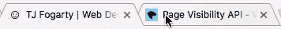

# 页面可见性 API

> 原文：<https://dev.to/teej/page-visibility-api-5086>

页面可见性 API 允许您检测页面何时对用户可见或处于焦点位置。如果他们切换到另一个标签或者当窗口最小化时，该页面被认为不再可见。

那么它有什么好处呢？MDN 文档很好地解释了这个 API 及其潜在用途。例如，您可以使用它来暂停视频或游戏，或者推迟您可能正在进行的任何后台请求。

我的案子远没有那么高尚和激动人心。是的，我用它在文档标题中显示一个表情符号。继续，切换到不同的选项卡。不过，一定要回来。求你了。MDN 文档的链接给出了一个如何实现 API 的例子，以及支持厂商前缀版本的旧浏览器的启示。我将为我的实现概述一个基本脚本。

```
const PageVisibility = {
  asleepEmoji: '💤',
  originalTitle: document.title, // [1]

  init() {
    if (typeof document.hidden === 'undefined') return // [2]

    this.handleVisibilityChange = this.handleVisibilityChange.bind(this) // [3]

    document.addEventListener('visibilitychange', this.handleVisibilityChange, false)
  },

  handleVisibilityChange() {
    let title = this.originalTitle

    if (document.hidden) {
      title = `${this.asleepEmoji}  ${title}`
    }

    document.title = title
  }
} 
```

[1]我们正在存储文档标题的原始副本，以便在页面再次可见时可以恢复到它。

[2]我们对这一特性的现代支持做了初步的检查。您可以查看上面的 MDN 链接，了解供应商前缀版本。

[3]绑定`this`的词法范围。这意味着当我调用`this`时，它将引用我创建的 PageVisibility 对象，而不是`document`。

打完电话后，你就可以走了。

结果:

[T2】](https://res.cloudinary.com/practicaldev/image/fetch/s--PsA1l0GH--/c_limit%2Cf_auto%2Cfl_progressive%2Cq_66%2Cw_880/https://thepracticaldev.s3.amazonaws.com/i/ou5tq1izdbt8xp6ki5je.gif)

这最初是[发布在我的博客](https://tj.ie/page-visibility)上。