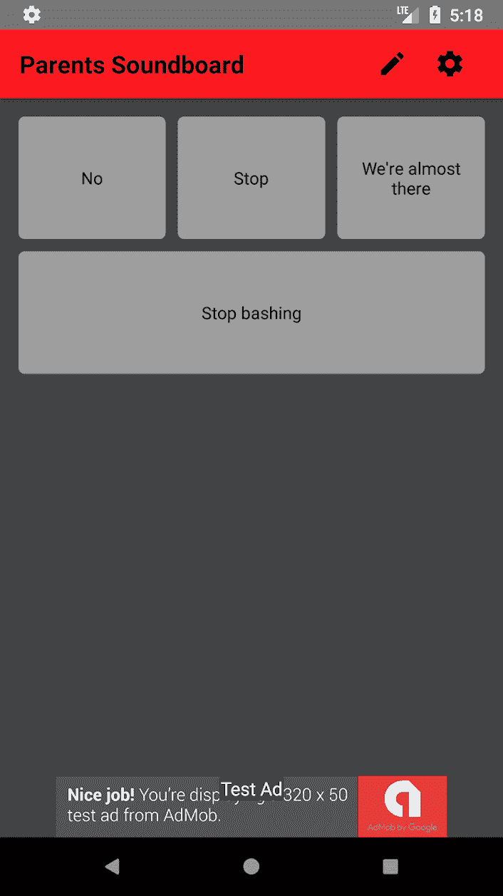

# “父母共鸣板”:让智能手机为你说话

> 原文：<https://dev.to/mokkapps/parents-soundboard-let-the-smartphone-speak-for-you-m3>

我为父母开发了一个可以在 iOS 和 Android 上使用的小型智能手机应用程序。

它是使用 React Native 开发的。你可以定义自己的文本，让智能手机通过 TTS 阅读。

> 你是否对一遍又一遍地对你的孩子说同样的句子感到恼火？
> 
> 如果是的话，这个音板将会是你新的最好的朋友。
> 
> 你可以定义自定义句子，让智能手机为你朗读。
> 
> 你的孩子会讨厌它；-)

[T2】](https://res.cloudinary.com/practicaldev/image/fetch/s--Yi8PvcTg--/c_limit%2Cf_auto%2Cfl_progressive%2Cq_auto%2Cw_880/https://thepracticaldev.s3.amazonaws.com/i/s6p5kj5uu1ylz76d96jv.png)

# 链接

*   [在 Google Play 上获取](https://play.google.com/store/apps/details?id=de.mokkapps.parentssoundboard)

*   [在 iTunes 上获得](https://itunes.apple.com/us/app/parents-soundboard/id1434425575?mt=8)

*   [GitHub 上的源代码](https://github.com/Mokkapps/parents-soundboard)

让我知道你对它的想法；-)