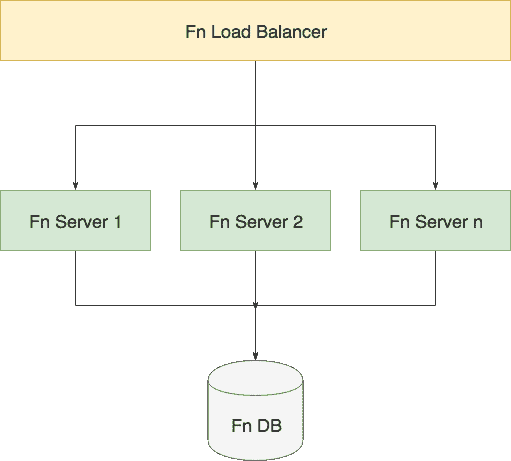

# 第二部分:Fn 负载平衡器

> 原文：<https://dev.to/peterj/part-ii-fn-load-balancer-52kb>

* * *

**目录**

*   [第一部分:Fn 项目入门](https://dev.to/peterj/playing-with-the-fn-project-5e3f)

*   **第二部分:Fn 负载均衡器(本岗位)**

* * *

如果你想启动并运行 Fn 项目，看看这个系列的第一篇文章。在这篇文章中，我将讨论 Fn 负载平衡器——它是什么，如何在本地运行它，以及如何将其部署到 Kubernetes 集群。

* * *

Fn 负载平衡器的目的是智能地将流量路由到 Fn 服务器集群。这不是一个简单的循环路由，因为它有一些逻辑来根据传入的请求确定将流量路由到哪些节点。例如，如果您的函数在 node2 上是“热”的，负载平衡器将确保它被路由到该节点，而不是没有加载该函数的另一个节点。这样你可以获得更好的性能。
查看下面的简单图表，了解负载平衡器如何与 Fn 服务器和 Fn 数据库相适应。

[T2】](https://res.cloudinary.com/practicaldev/image/fetch/s--MHjbBiS9--/c_limit%2Cf_auto%2Cfl_progressive%2Cq_auto%2Cw_880/https://cdn-images-1.medium.com/max/800/1%2Ae0P5kgq0kGHsghzGjsngVw.png)

负载平衡器还收集有关整个集群的信息，并显示节点列表及其状态，因此您可以使用这些信息通过添加更多 Fn 服务器来扩展您的集群，或者扩大-减少集群中的服务器数量。

## 本地运行

让多个 Fn 服务器在负载均衡器后面启动和运行并进行试验的最快方法是使用 Docker 在您的机器上本地运行它。
你要拉着跑的图像叫做`fnproject/fnlb`。在撰写本文时，最新的版本/标签是`0.0.268`。

让我们试着运行几个 Fn 服务器和一个负载平衡器。我们将在容器中运行 Fn 服务器和负载均衡器——我们将负载均衡器链接到 Fn 服务器实例，以便它能够发现它。

如果您不想手动复制/粘贴本节中的命令，您可以在此处获得脚本[——该脚本将自动启动 N 个 Fn 服务器容器和一个 Fn 负载平衡器。](https://gist.githubusercontent.com/peterj/25f658880c4415f6da8769c095d16b9f/raw/4d780fb5e810810ec18c16659e1d149f71d16c41/run-fn-lb.sh)