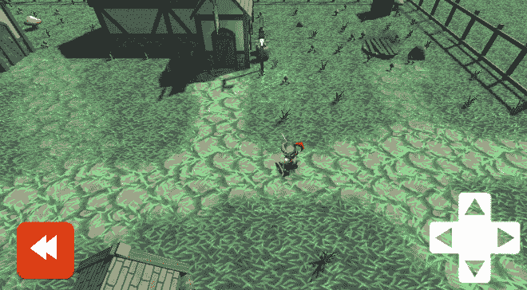

# 游戏编程模式，命令

> 原文：<https://dev.to/homerdalords/patterns-in-gameplay-programming-command-43hl>

我将跟随 Matt 开始一系列关于应用于使用 Unity3D 的现实游戏编程的设计模式，以及解释一种机制的示例场景，Matt 是我们刚刚加入工作室的虚拟游戏程序员。

## CTRL+Z:

马特今天早上来到他的办公室，很有动力，他正在研究圣骑士战术，一个基于回合制的手机 RPG。打开 Slack 时，他发现他的产品经理刚刚给他布置了这个故事

> 作为一名玩家，我应该能够在回合结束前撤销并修改我的动作。

带有显示所需结果的解释图像:

[T2】](https://i.giphy.com/media/Rd6sv6StGGedfnPy2b/giphy.gif)

我们的开发者挠了挠头，所有的游戏机制，比如动作和攻击，都被深深地硬编码在与玩家相关的组件中，要将它们分离是非常困难的。嗯，没有那么多，进入命令模式，引用维基百科:

> 在面向对象编程中，**命令模式**是一种“行为模式”模式，在这种模式中，一个对象用于封装执行一个动作或在以后触发一个事件所需的所有信息。

“以后”可能听起来像是回调，一个简单的 slugline 应该是“回调的面向对象替代”

在每个视频游戏中，都有一些从玩家那里读取原始用户输入并将其转化为游戏世界中有价值的东西的功能，Matt 的实现非常简单，但在构思阶段就可以工作:

```
 void HandleInput()
    {
        //....other inputs tied here
        if (Input.GetButton("BUTTON_X"))
        {
            Move();
        }
        //....other inputs tied here
    } 
```

Enter fullscreen mode Exit fullscreen mode

虽然这在早期阶段工作得很好，但它带来的问题是不允许用户配置他/她自己的输入方案，它迫使我们为其他不受玩家控制的移动单元编写重复的代码，最后，使实现我们的撤销功能变得很痛苦，进入我们的模式。

## 命令:

我们从定义一个代表任何可触发游戏动作的基类开始:

```
/// <summary>
/// The 'Command' abstract class that we will inherit from
/// </summary>
abstract class Command
{
    public abstract void Execute();
    public abstract void UnExecute();
} 
```

Enter fullscreen mode Exit fullscreen mode

然后，我们可以为游戏中的每个动作创建一组子类，在我们的例子中，只是运动:

```
class MoveCommand : Command
{
    private MoveDirection _direction;
    private float _distance;
    private GameObject _gameObject;
    //Constructor
    public MoveCommand(MoveDirection direction, float distance, GameObject gameObjectToMove)
    {
        this._direction = direction;
        this._distance = distance;
        this._gameObject = gameObjectToMove;
    }
    //Execute new command
    public override void Execute()
    {
        MoveOperation(_gameObject, _direction, _distance);
    }
    //Undo last command
    public override void UnExecute()
    {
        MoveOperation(_gameObject, InverseDirection(_direction), _distance);
    }

    // Rest of code, MoveOperation can just be a method that translates a Transform with a given distance
} 
```

Enter fullscreen mode Exit fullscreen mode

通过给它传递一个我们想要移动的角色，我们放松了限制，使得这个命令也可以被 AI 代理调用，而不仅仅是玩家输入控制器。然后，我们可以实现我们的球员运动处理器的其余部分，它将是一个存在于我们场景中某处的 Monobehaviour。
注意要提到的是，由于撤销机制，这种实现与标准实现略有不同，这里的命令表示在特定时间点可以完成的事情，因此我们应该跟踪它们。

```
public class PlayerMovementHandler : MonoBehaviour
{
    public float moveDistance = 10f;
    public GameObject objectToMove;

    private List<Command> commands = new List<Command>();
    private int currentCommandNum = 0;

    void Start()
    {
        // some null checks
    }

    private void Move(MoveDirection direction)
    {
        MoveCommand moveCommand = new MoveCommand(direction, moveDistance, objectToMove);
        moveCommand.Execute();
        commands.Add(moveCommand);
        currentCommandNum++;
    }

    public void Undo()
    {
        if (currentCommandNum > 0)
        {
            currentCommandNum--;
            MoveCommand moveCommand = (MoveCommand)commands[currentCommandNum];
            moveCommand.UnExecute();
            commands.Remove(moveCommand);
        }
    }
    // Simple public move methods below
    // to attach to UI buttons, Gamepad buttons
    // EventSystem or whatever
    //....
} 
```

Enter fullscreen mode Exit fullscreen mode

可以在这里找到一个完全可下载的样本。

### 引用:

Robert Nystrom 的《游戏编程模式》一书，语言和框架不可知。

本帖使用的免费视觉资产积分:
[RPG 英雄 HP](https://assetstore.unity.com/packages/3d/characters/humanoids/rpg-hero-hp-121480) ，[中世纪城镇外景](https://assetstore.unity.com/packages/3d/environments/fantasy/medieval-town-exteriors-27026)，[简单 UI](https://assetstore.unity.com/packages/2d/gui/icons/simple-ui-103969)