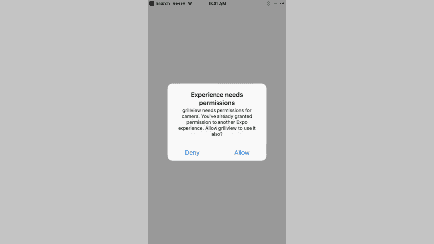
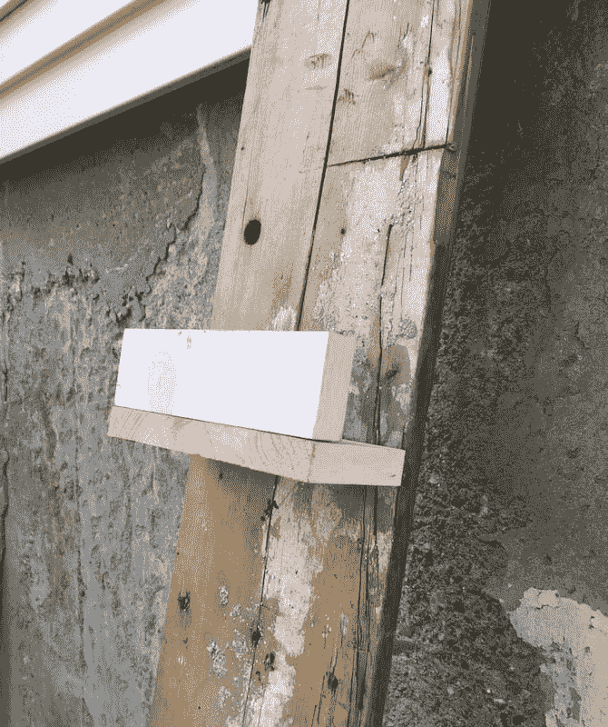
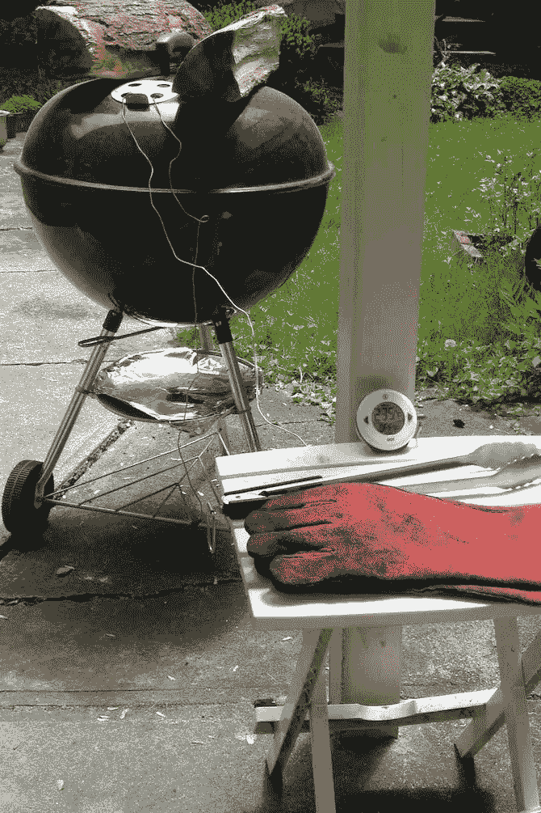
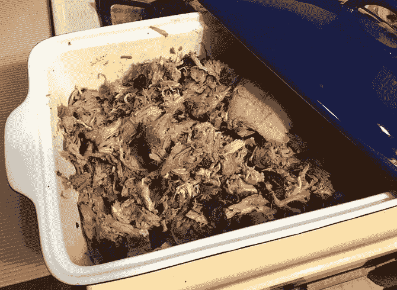

# 完美的拉肉配 React Native、Expo 和 Express

> 原文：<https://dev.to/dceddia/perfect-pulled-pork-with-react-native-expo-and-express-2dag>

*最初发布于[我的博客](https://daveceddia.com/perfect-pulled-pork-react-native-expo-express/)。*

[T2】](https://res.cloudinary.com/practicaldev/image/fetch/s--gd8RkwY8--/c_limit%2Cf_auto%2Cfl_progressive%2Cq_auto%2Cw_880/https://daveceddia.cimg/pulled-pork-post.png)

或者:*每 30 秒拍一张照片，发给服务器*。

我正打算第二天做猪肉拉面。那天晚上，我支起韦伯水壶，拿出一袋木炭和一些苹果木，把所有东西都摆好。正如他们所说的，Mise en place。我会在第二天早上 7 点醒来点燃它，我不相信我昏昏欲睡的自己能记住一切。

我准备的东西之一是探针温度计和两个探针:一个测量空气温度，一个测量肉的内部温度。烟熏是一种低而慢的烹调方法:当肉慢慢烹调并被烟熏时，你想让空气温度达到 225 华氏度，并保持这个温度达几个小时的 T2 时间。烟熏猪肩肉(又名拉肉)可能需要 8 - 12 个小时。所以我早上 7 点就醒了。

那么本土游戏在这一切中起着什么样的作用呢？

嗯，用韦伯水壶来保持温度是一个小技巧。而且是手动的。有两个通风口你可以调整-一个在顶部，一个在底部。打开它们来增加温度，关闭它们来降低温度。不过，火势需要一段时间才能反应过来。是火，不是数字拨盘。因此，作为维修站站长，你今天将成为一名人工 PID 控制器。

我的意思是:你必须不断观察温度，调整通风口，并重新检查。如果你很擅长，你不需要调整太多，但是我是个新手，所以我经常出去。

我想知道，不用每隔 15 分钟就跑到吸烟者那里，温度是否达到 225 华氏度或足够接近。

这就是 React Native 的用武之地。

晚上 9 点，在我摆好所有材料后，我有了一个想法:我将制作一个应用程序，每 30 秒拍一张温度计的照片，并上传到服务器上——然后我就可以刷新页面，而不是跑到吸烟者那里！

在你告诉我之前——是的，我知道有出售的远程温度计就是这样做的。是的，我也知道我可以整天坐在外面拿着啤酒看比赛，那也会很有趣。但实际上我只是想找个借口玩 React Native:)

## 宏伟计划:系统布局

像任何好的项目一样，我开始思考我希望它如何工作。

我需要:

1.  一部带摄像头的手机(老款 iPhone 4S)。
2.  一个在手机上运行一整天拍照的 app。
3.  在我的笔记本电脑上运行的接收图片的服务器。
4.  相同的服务器提供最新的图片。

我决定尽可能地缩短这个时间(主要是因为已经是晚上 9 点了，我仍然需要在 7 点醒来)。几乎没有安全可言。不会有 websockets 通知 React 应用程序下载最新的图像。该服务器将简单地接受图像，并根据请求发回最新的图像。

### 反应原生

您可能听说过[React Native](https://facebook.github.io/react-native/)——一个使用 React 和 JS 构建本地移动应用的框架。如果你能写反应应用程序，你可以很快算出反应原生的。核心概念是一样的，只是道具和状态。

尽管 React Native 后面没有 DOM，但还是有一些区别。主要是你所知道和喜爱的 HTML 元素(`div`、`span`、`img`等)。)被 React 原生组件(`div` == `View`、`span` == `Text`、`img` == `Image`)取代。

此外，不支持“真正的”CSS，但是 RN 支持通过内联样式进行样式化。Flexbox 布局和大多数普通样式如`color`和`backgroundColor`等都可以。我注意到一些简写属性也不起作用:像`border: 1px solid red`这样的属性会被显式描述，比如`{ borderWidth: 1, borderColor: 'red' }`。

### 世博会

Expo 是一个工具和平台，用于使用 React Native 构建应用。

使用 Expo 的一个好处是，它可以让你将应用程序部署到你的手机上，而无需注册苹果开发者订阅(至少对于我们这些 iPhone 用户来说)。我了解到，你实际上可以在没有苹果开发者订阅的情况下在你的手机上安装一个应用程序，但是这需要修改 Xcode，这不是我今晚想要解决的问题。

Expo 的另一大好处是它附带了 [Expo SDK](https://docs.expo.io/) ，它为您提供了一系列开箱即用的本地 APIs 如加速度计、指南针、位置、地图，以及这个项目中最重要的一个:相机。

#### 在电脑和手机上安装 Expo

我使用了 Expo 命令行，但是他们也提供了一个 ide。如果你想跟进，用 NPM 或 Yarn 安装 Expo 命令行工具:

```
npm install -g exp 
```

Enter fullscreen mode Exit fullscreen mode

(对，是`exp`，不是 expo)。

然后你需要在手机上安装 Expo 应用，你可以在 App Store / Play Store 中找到。

#### 创建项目

安装命令行工具后，运行此命令创建一个新项目:

```
exp init grillview 
```

Enter fullscreen mode Exit fullscreen mode

它会提示输入一个模板:选择“空白”的那个。

然后按照提供的说明启动它:

```
$ cd grillview
$ exp start 
```

Enter fullscreen mode Exit fullscreen mode

在某个时候，它会要求你创建一个与博览会的帐户。这是为了将应用程序从您的计算机部署到 Expo 的服务器上。然后手机上的世博 app 就可以加载你的 app 了。

按照说明将 URL 发送到您的设备，或者直接键入。Expo 还允许你在模拟器上运行这个，但我认为用真实的手机会更有趣，所以我就这么做了。

一旦你在手机上打开它，开发者的体验会非常好。更改代码，保存，应用程序将自动重新加载(自动刷新)——就像用 Create React App 在本地开发一样。每次下载 JS 包时会有一点延迟。你也可以从 Expo 的开发者菜单中启用热重装(无刷新)，摇一下手机就能调出。轻轻地。不要把它从窗户扔出去。

#### 文件结构

Expo 在项目的根目录中为我们设置了一个`App.js`文件，它导出了`App`组件。下面是生成的应用程序的整体:

```
import React from 'react';
import { StyleSheet, Text, View } from 'react-native';

export default class App extends React.Component {
  render() {
    return (
      <View style={styles.container}>
        <Text>Open up App.js to start working on your app!</Text>
      </View>
    );
  }
}

const styles = StyleSheet.create({
  container: {
    flex: 1,
    backgroundColor: '#fff',
    alignItems: 'center',
    justifyContent: 'center',
  },
}); 
```

Enter fullscreen mode Exit fullscreen mode

您会注意到在`View`中有一个`Text`组件。尝试保留“Open up App.js…”文本，但是去掉包装的`Text`组件，看看会发生什么。

如果你往`package.json`里面看，你会看到这一行:

```
"main":  "node_modules/expo/AppEntry.js" 
```

Enter fullscreen mode Exit fullscreen mode

这是我们的应用程序的开始，它期望找到一个导出根组件的`App.js`文件。

如果您想要重新组织项目结构，第一步是将 AppEntry.js 复制到您的项目中，并对其进行相应的修改，但是我们将坚持使用默认值。

## 使用相机

### 授予权限

为了拍照，Expo 提供了一个`Camera`组件。但是在我们使用它之前，我们需要请求许可。

打开`App.js`，为相机和权限对象添加一个新的`import`，并将组件更改为如下所示:

```
import React from 'react';
import { StyleSheet, Text, View } from 'react-native';

// add this:
import { Camera, Permissions } from 'expo';

export default class App extends React.Component {
  // initialize state
  state = {
    cameraPermission: null
  };

  render() {
    const { cameraPermission } = this.state;

    // Render one of 3 things depending on permissions
    return (
      <View style={styles.container}>
        {cameraPermission === null ? (
          <Text>Waiting for permission...</Text>
        ) : cameraPermission === false ? (
          <Text>Permission denied</Text>
        ) : (
          <Text>yay camera</Text>
        )}
      </View>
    );
  }
} 
```

Enter fullscreen mode Exit fullscreen mode

现在应用程序应该呈现“等待许可…”并停留在那里，因为我们还没有做任何事情。

我们将在`componentDidMount`生命周期挂钩中请求许可。添加到:

```
export default class App extends React.Component {
  ...

  componentDidMount() {
    Permissions.askAsync(Permissions.CAMERA)
      .then(({ status }) =>
        this.setState({
          cameraPermission: status === 'granted'
        })
      );
  }

  render() {
    ...
  }
} 
```

Enter fullscreen mode Exit fullscreen mode

当你保存时，应用程序刷新，你会看到一个对话框，要求相机的许可。一旦你允许，文本应该改变。

如果这是你第一次使用 Expo，它可能会在询问你的应用程序之前询问 Expo 本身的权限。

[T2】](https://res.cloudinary.com/practicaldev/image/fetch/s--1ZsSsXCf--/c_limit%2Cf_auto%2Cfl_progressive%2Cq_66%2Cw_880/https://daveceddia.cimg/expo_permission_check.gif)

### 现场摄像视图

现在，让我们用一个组件替换“yay camera”文本，该组件将呈现相机。向`App.js`添加一个名为`Autoshoot`的新组件。现在，它只是渲染相机，我们可以确保一切正常。

```
class Autoshoot extends React.Component {
  render() {
    return (
      <View style={{ flex: 1, width: '100%' }}>
        <Camera
          style={{ flex: 1 }}
          type={Camera.Constants.Type.back}
          ref={cam => this.camera = cam}>
        </Camera>
      </View>
    );
  }
} 
```

Enter fullscreen mode Exit fullscreen mode

我们将摄像机放在一个视图中，给两个`flex: 1`以占据整个高度，给`width: '100%'`以占据整个屏幕(没有宽度设置，你会看到一个空白屏幕:试试看！).

我们用的是“更好”的相机(不管怎样，在 iPhone 上——是`back`相机，而不是`front`自拍相机)。

我们将保存一个`ref`到这个相机组件中，因为这是我们在下一节中触发快门的方式。

现在这个组件已经存在，回到`App`的渲染方法，用这个自动拍摄组件替换“yay camera”元素:

```
render() {
  const { cameraPermission } = this.state;

  // Render one of 3 things depending on permissions
  return (
    <View style={styles.container}>
      {cameraPermission === null ? (
        <Text>Waiting for permission...</Text>
      ) : cameraPermission === false ? (
        <Text>Permission denied</Text>
      ) : (
        <Autoshoot/>
      )}
    </View>
  );
} 
```

Enter fullscreen mode Exit fullscreen mode

### 最后:拍照

为了触发快门，我们将在相机组件中放置一个类似“按钮”的东西。不幸的是`Camera`不支持`onPress`道具(当你点击它时触发的那个)，所以我们将导入`TouchableOpacity`并在里面渲染其中一个。

在顶部，导入它:

```
import { StyleSheet, Text, View, TouchableOpacity } from 'react-native'; 
```

Enter fullscreen mode Exit fullscreen mode

在 Autoshoot 的`render`中，插入组件作为 Camera 的子组件:

```
render() {
  const { photo } = this.state;

  return (
    <Camera
      style={{ flex: 1 }}
      type={Camera.Constants.Type.back}
      ref={cam => this.camera = cam}>
      <TouchableOpacity
        style={{ flex: 1 }}
        onPress={this.takePicture}/>
    </Camera>
  );
} 
```

Enter fullscreen mode Exit fullscreen mode

然后我们需要一个`takePicture`方法，我们可以把它插在`render` :
上面

```
takePicture = () => {
  this.camera.takePictureAsync({
    quality: 0.1,
    base64: true,
    exif: false
  }).then(photo => {
    this.setState({ photo });
  })
} 
```

Enter fullscreen mode Exit fullscreen mode

此时，应用程序将表现相同:当你点击屏幕时，应用程序仍将显示相机(希望没有错误)。

接下来，我们需要初始化顶部`photo`的状态:

```
class Autoshoot extends React.Component {
  state = {
    photo: null
  }

  ...
} 
```

Enter fullscreen mode Exit fullscreen mode

然后在`render`中，我们将渲染照片(如果有的话)或者相机:

```
render() {
  const { photo } = this.state;

  return (
    <View style={{ flex: 1, width: '100%' }}>
     {photo ? (
       <ImageBackground
         style={{ flex: 1 }}
         source={{ uri: photo.uri }} />
     ) : (
       <Camera
         style={{ flex: 1 }}
         onPress={this.takePicture}
         type={Camera.Constants.Type.back}
         ref={cam => this.camera = cam}>
         <TouchableOpacity
           style={{ flex: 1 }}
           onPress={this.takePicture}/>
       </Camera>
     )}
    </View>
  );
} 
```

Enter fullscreen mode Exit fullscreen mode

我们在这里也是第一次使用`ImageBackground`组件，所以确保在顶部从‘react-native’:
导入它

```
import { StyleSheet, Text, View, TouchableOpacity, ImageBackground } from 'react-native'; 
```

Enter fullscreen mode Exit fullscreen mode

我们走吧！现在你可以点击屏幕拍照，它会停留在屏幕上。

**这里有一个快速练习:**

这样，当你点击捕获的照片时，应用程序会返回显示相机。提示:`ImageBackground`不支持`onPress`，所以你需要使用我们对`TouchableOpacity`使用的相同技巧。

## 用定时器拍照

我们已经有了手动拍照的代码*——现在让我们来自动化它。*

 *我们可以通过间隔调用`takePicture`来做到这一点。但是有一个小问题:相机在拍摄之前需要一点时间来对焦。所以我们真正需要的是这样的东西:

1.  激活摄像机(屏幕显示实时摄像机)
2.  让它聚焦 3 秒钟
3.  拍照(屏幕显示静止图像)
4.  等待 27 秒
5.  转到 1

一旦我们开始工作，我们将插入一个步骤“3a”:将图片发送到服务器。(现在还不存在，但我们稍后会讲到)

当`Autoshoot`开始渲染时，我们将启动一个 30 秒的计时器。让我们为计时器创建一个常量，以及聚焦的时间量，因为我们在一些地方需要它。

```
const PHOTO_INTERVAL = 30000;
const FOCUS_TIME = 3000;

class Autoshoot extends React.Component {
  componentDidMount() {
    this.countdown = setTimeout(
      this.takePicture,
      PHOTO_INTERVAL
    );
  }

  componentWillUnmount() {
    clearInterval(this.countdown);
  }

  ...
} 
```

Enter fullscreen mode Exit fullscreen mode

出于测试目的，只需将超时时间更改为 2 秒，这样我们就不用整天等待了。

当应用程序重新加载时(你可以通过摇动你的设备手动触发，并选择“重新加载 JS 包”)，照片将自动拍摄。太棒了。

### 启动另一个计时器

现在我们正在自动拍照，我们只需要几个计时器就可以让它整天拍照了。

有几种方法来写这个:我们可以用两个堆叠的定时器来做(一个 27 秒，然后触发一个 3 秒)，或者我们可以用两个同时的定时器来做，或者我们可以用`setState`回调来做。

后一个选项可能是最精确的(并且避免了潜在的竞争情况)，但是我们将使用最简单的选项:2 个同步定时器。由于触发器相距如此之远，竞争条件/重叠计时器不太可能出现。

为了让它工作，用这个实现:
替换`takePicture`

```
takePicture = () => {
  this.camera.takePictureAsync({
    quality: 0.1,
    base64: true,
    exif: false
  }).then(photo => {
    this.setState({ photo });

    // In 27 seconds, turn the camera back on
    setTimeout(() => {
      this.setState({ photo: null });
    }, PHOTO_INTERVAL - FOCUS_TIME);

    // In 30 seconds, take the next picture
    setTimeout(this.takePicture, PHOTO_INTERVAL);
  });
} 
```

Enter fullscreen mode Exit fullscreen mode

现在 app 刷新的时候会无限拍照。(或者直到你的电池耗尽)

## 快递服务器

我们现在有 React 原生应用程序拍照。让我们建立一个服务器来发送它们。

我们将使用 Express 编写一个准系统服务器来处理两个路由:

*   `POST /`:上传新照片
*   `GET /`:查看最新照片

对于这个最简单的服务器，我们将在我们的`grillview`项目的根目录下创建一个`server.js`文件。反应自然和表达，肩并肩。(这是创建 Real Projects 的推荐方法吗？不，但这整件事有点不靠谱，所以。).

我们需要几个软件包来完成这项工作，所以现在就安装它们:

```
yarn add express body-parser 
```

Enter fullscreen mode Exit fullscreen mode

然后，我们可以从一个准系统 Express 服务器开始。创建`server.js`文件并将其粘贴到:

```
const express = require('express');
const bodyParser = require('body-parser');

const app = express();

// If your phone has a modern camera (unlike my iPhone 4S)
// you might wanna make this bigger.
app.use(bodyParser.json({ limit: '10mb' }));

// TODO: handle requests

const port = process.env.PORT || 5005;
app.listen(port);

console.log(`Grill server listening on ${port}`); 
```

Enter fullscreen mode Exit fullscreen mode

这还不能处理请求，但会运行。我们已经准备好处理贴出的图片。现在让我们添加 POST 请求处理程序来代替 TODO:

```
// Store the single image in memory.
let latestPhoto = null;

// Upload the latest photo for this session
app.post('/', (req, res) => {
  // Very light error handling
  if(!req.body) return res.sendStatus(400);

  console.log('got photo')

  // Update the image and respond happily
  latestPhoto = req.body.photo;
  res.sendStatus(200);
}); 
```

Enter fullscreen mode Exit fullscreen mode

这只是接受来自客户端的图像，并将其保存在一个本地变量中，稍后再返回。

*快速预警*:这是*对安全无所作为*。我们盲目地从客户端保存一些东西，然后鹦鹉学舌，这在部署的应用程序中是一个灾难。但是因为我只在我的本地网络上运行，所以我不太担心。对于一个真正的应用程序，在保存之前要对图片进行一些验证。

在它下面，我们将添加 GET 处理程序，它将发送回最新的图像:

```
// View latest image
app.get('/', (req, res) => {
  // Does this session have an image yet?
  if(!latestPhoto) {
    return res.status(404).send("Nothing here yet");
  }

  console.log('sending photo');

  try {
    // Send the image
    var img = Buffer.from(latestPhoto, 'base64');
    res.writeHead(200, {
      'Content-Type': 'image/png',
      'Content-Length': img.length
    });
    res.end(img);
  } catch(e) {
    // Log the error and stay alive
    console.log(e);
    return res.sendStatus(500);
  }
}); 
```

Enter fullscreen mode Exit fullscreen mode

我们正在创建一个缓冲区，将 base64 图像转换为二进制，然后将其发送到客户端。

再次重申:这不是一个安全的设置。我们假设客户端发送给我们一个好的 base64 图像，但是规则 1 是“不要相信客户端”——我们应该在存储图像之前验证它。

这就是我们需要的服务器！启动它:

```
node server.js 
```

Enter fullscreen mode Exit fullscreen mode

然后访问[http://localhost:5005](http://localhost:5005)——你应该会看到消息“这里还没有”。让服务器在单独的命令行终端中运行，我们将继续向服务器发送图像。

### 上传图片

回到`App.js`和`Autoshoot`组件，我们需要添加一个上传图片的方法。在一个更大的应用程序中，我们可能会将 API 方法放入一个单独的文件中，并将它们作为单独的函数导出——但是因为我们只有一个调用，所以我们将把它放在`Autoshoot`中。添加此方法:

```
uploadPicture = () => {
  return fetch(SERVER_URL, {
    body: JSON.stringify({
      image: this.state.photo.base64
    }),
    headers: {
      'content-type': 'application/json'
    },
    method: 'POST'
  })
  .then(response => response.json())
} 
```

Enter fullscreen mode Exit fullscreen mode

这里我们使用`fetch`(内置于 React Native 中)将数据发送到服务器。注意`SERVER_URL`变量，我们还没有创建它。因为这只能在我们的本地网络上工作，我们可以硬编码上面的`Autoshoot` :

```
const SERVER_URL = 'http://<your-ip>:5005/' 
```

Enter fullscreen mode Exit fullscreen mode

用你自己的开发机器的 IP 地址替换`<your-ip>`。如果你不知道在哪里可以找到它，[谷歌是你的朋友](https://www.google.com/search?q=get+local+ip+address&oq=get+local+ip+address):)

现在我们将把`takePicture`改为调用`uploadPicture`，作为这一改变的一部分，我们将把计时器代码提取到一个单独的方法中，因为我们想从两个地方调用它:

```
// Here's the timer code, lifted from takePicture:
queuePhoto = () => {
  // In 27 seconds, turn the camera back on
  setTimeout(() => {
    this.setState({ photo: null });
  }, PHOTO_INTERVAL - FOCUS_TIME);

  // In 30 seconds, take the next picture
  setTimeout(this.takePicture, PHOTO_INTERVAL);
}

// Take the picture, upload it, and
// then queue up the next one
takePicture = () => {
  this.camera.takePictureAsync({
    quality: 0.1,
    base64: true,
    exif: false
  }).then(photo => {
    this.setState({ photo }, () => {
      this.uploadPicture()
        .then(this.queuePhoto)
        .catch(this.queuePhoto);
    });
  });
} 
```

Enter fullscreen mode Exit fullscreen mode

注意，我在`.then`和`.catch`处理程序中都调用了`queuePhoto`。

我想让应用程序继续运行，即使我重启服务器(这会导致请求失败)，所以我让它完全忽略错误。

在开发过程中，在那里添加一个控制台日志来查看事情失败的原因(语法错误等)是很有帮助的，但是一旦一切正常，我就把它去掉了。

有了这些最新的变化，应用程序开始工作了！

我很兴奋能尝试一下。第二天早上，我装好了温度计和电话。启动应用程序，嗯……嗯，没有合适的地方放手机。

我可以把电话和温度计放在地上。那是我应该做的。一个理智的人会怎么做。

7am 大卫没有这样做。他抓起一块旧木板，砍下两块碎木头，一起做成一个靠在房子上的小架子。

[T2】](https://res.cloudinary.com/practicaldev/image/fetch/s--SVmWEuxO--/c_limit%2Cf_auto%2Cfl_progressive%2Cq_auto%2Cw_880/https://daveceddia.cimg/phone-shelf.jpg)

“木工。”它有*方头螺钉*。为什么？我不知道。

至于 app？

它表现得令人钦佩。大部分是。它只坠毁了几次。

事实证明它非常有用，省去了我跑上跑下检查温度的时间。A+++会再次构建。

[T2】](https://res.cloudinary.com/practicaldev/image/fetch/s--gxYWV2Bz--/c_limit%2Cf_auto%2Cfl_progressive%2Cq_auto%2Cw_880/https://daveceddia.cimg/grill-cam-action-shot.jpg)

而且拉出来的猪肉*好吃*。

[T2】](https://res.cloudinary.com/practicaldev/image/fetch/s--lAoho57o--/c_limit%2Cf_auto%2Cfl_progressive%2Cq_auto%2Cw_880/https://daveceddia.cimg/pulled-pork.jpg)

## 外卖

我认为在编程项目中加入一些乐趣是很重要的。允许你自己建造一些已经存在的东西，哪怕只是为了学习如何自己建造它。它不必是一个大的严肃的项目，或者一个完美的作品集。

在这一点上，不要害怕一起动手。这是一个有趣的项目！写一些你知道很可怕的可怕代码。不要过分强调完美的抽象和最佳实践，不要觉得你必须整合每一个新的库和工具。天气会变好的。写博文的时候随时可以重构；)

#### 食谱、工具、代码…

你可以在 Github 上获得这个项目[的完整代码。](https://github.com/dceddia/grillview)

我按照神奇排骨的[完美拉猪肉](https://amazingribs.com/tested-recipes/pork-chops-pulled-pork-ham-and-more-pork-recipes/perfect-pulled-pork-recipe)食谱。

我用的是带有[慢火](https://abcbarbecue.com/product/slow-n-sear/)的[韦伯 22”烤架](https://www.amazon.com/Weber-741001-Original-22-Inch-Charcoal/dp/B00004RALU)(显然已经停产，但我看到有一个 [v2](https://abcbarbecue.com/product/slow-n-sear-2-0/) 看起来很相似)。

温度计是一个[热电偶点](https://www.thermoworks.com/DOT)。

(没有会员链接，只有好产品)

感谢阅读！

我的博客上有更多关于 React 和 Redux 的文章。*