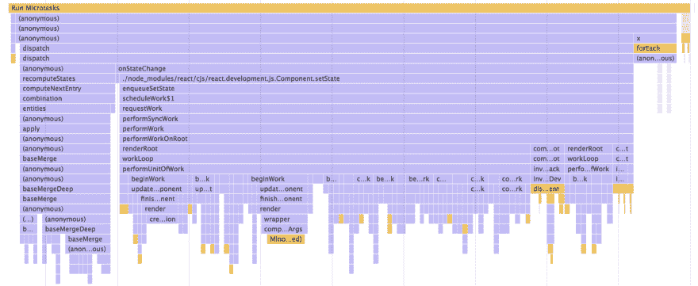
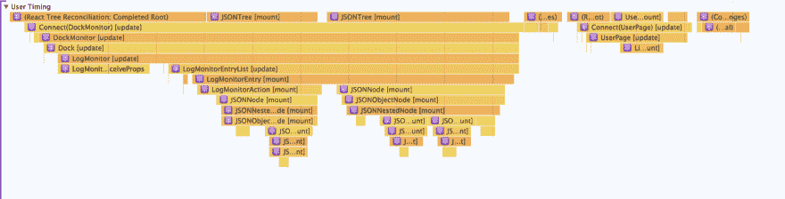
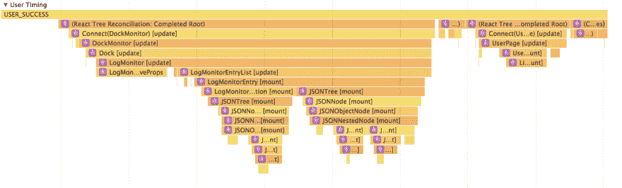

# Redux 应用程序的性能分析

> 原文：<https://dev.to/vcarl/performance-profiling-a-reduxapp-1k3b>

Redux 应用程序通常很容易进行性能优化。Redux 在某种程度上是默认快速的。通过加强不变性，它为通过`===`等式检查进行简单优化提供了很多空间。简单的等式检查意味着很容易记忆函数，让你的应用程序避免多余的工作。

大型应用程序中优化的困难部分是找出代码的哪些部分运行起来最昂贵。Chrome devtools 提供了非常高级的分析工具，可以帮助你分析你的代码，但是很难区分你写的代码和来自库的代码。

下面是提交搜索后来自真实世界 Redux 示例的火焰图。

[T2】](https://res.cloudinary.com/practicaldev/image/fetch/s--iRE-MZt2--/c_limit%2Cf_auto%2Cfl_progressive%2Cq_auto%2Cw_880/https://cdn-images-1.medium.com/max/2000/1%2AYEHoKo5Vg3LVf4zcFcZaGQ.png)

那里的大多数函数名都来自 React。像 dispatch、recomputeStates、onStateChange 和 performUnitOfWork 这样的函数并不能很好地帮助您确定如何加快速度。

React 的开发模式通过连接到标准的“用户计时 API”来告诉你哪些组件与火焰图的哪些部分相关联，从而帮助你。这对于确定哪些组件花费了最多的时间来渲染非常有帮助，并为您的优化提供了一个清晰的起点。

[T2】](https://res.cloudinary.com/practicaldev/image/fetch/s--lFR9xMxn--/c_limit%2Cf_auto%2Cfl_progressive%2Cq_auto%2Cw_880/https://cdn-images-1.medium.com/max/2000/1%2ADavRFpufXUedEnpIbQXorA.png)

我们没有得到的一个细节是:我们调度了什么 Redux 动作来触发所有这些组件的安装？我在列表的顶部看到了 Connect(DockMonitor ),所以我可以通过查看该组件的 mapStateToProps 函数来缩小状态中必须更改的部分，但是我必须进行更多的调试来准确识别正在发生的更改。

但事实证明，有一个更简单的方法。我偶然发现了一个要点，展示了一个将 Redux 动作绑定到用户计时 API 的中间件的例子。我的 linter 有一些抱怨，我的 Jest 环境没有提供性能 API，所以我修改成下面的形式。

```
const userTiming = () => (next) => (action) => {
  if (performance.mark === undefined) return next(action);
  performance.mark(`${action.type}_start`);
  const result = next(action);
  performance.mark(`${action.type}_end`);
  performance.measure(
    `${action.type}`,
    `${action.type}_start`,
    `${action.type}_end`,
  );
  return result;
} 
```

Enter fullscreen mode Exit fullscreen mode

它是一个常规的中间件，所以将它添加到现有的项目中很容易。将它添加到创建商店时应用的中间件列表中。

```
applyMiddleware(/* other middlewares, */ userTimingMiddleware) 
```

Enter fullscreen mode Exit fullscreen mode

再次运行性能分析器后，我现在可以看到用户计时 API 中记录的操作名称了！

[T2】](https://res.cloudinary.com/practicaldev/image/fetch/s--lSkFAfpO--/c_limit%2Cf_auto%2Cfl_progressive%2Cq_auto%2Cw_880/https://cdn-images-1.medium.com/max/1800/1%2Az1RyZXBpWib54uWOANZlrw.png)

厉害！现在，在任何给定的动作之后，React 组件被重新呈现是显而易见的，这给了我一个明显的位置来寻找特别昂贵或频繁运行的动作。一个原本要花几分钟才能回答的问题现在变得非常明显。向前去做侧写！

* * *

感谢阅读！我在 Twitter 上的名字是 [@cvitullo](https://mobile.twitter.com/cvitullo) ，我是 React 开发者聊天室[React flux](http://join.reactiflux.com)和 Node 聊天室 [Nodeiflux](https://discord.gg/vUsrbjd) 的主持人。JS 开发者。如果您有任何问题或建议，请联系我们！

(封面图片鸣谢:[吴作栋](https://unsplash.com/@gohrhyyan)上 [Unsplash](https://unsplash.com/)