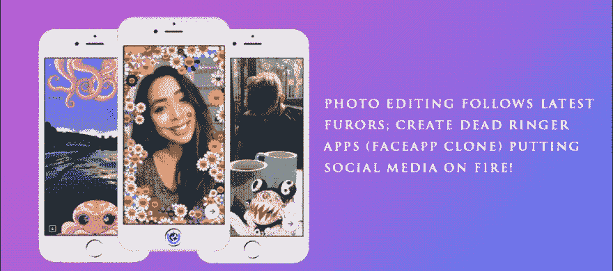

# 照片编辑跟随最新的狂热；创建完全相同的应用程序(FaceApp Clone ),让社交媒体火起来！

> 原文：<https://dev.to/ryanmiller/photo-editing-follows-latest-furors-create-dead-ringer-apps-faceapp-clone-putting-social-media-on-fire-4fle>

 
模仿图片来模仿机器人恋物癖，像 FaceApp 这样的应用程序创造了讨人喜欢的电子人(控制论有机体)，重新定义了你的自拍，让它们更上一层楼。查看更多[https://www . it firms . co/photo-editing-follows-latest-furos-create-dead-ringer-apps-face app-clone-put-social-media-on-fire/](https://www.itfirms.co/photo-editing-follows-latest-furors-create-dead-ringer-apps-faceapp-clone-putting-social-media-on-fire/)