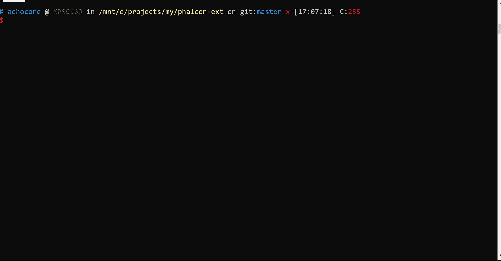

# PHP 控制台应用程序变得简单

> 原文：<https://dev.to/adhocore/php-console-application-made-easy-18ao>

## [ad hoc ore](https://github.com/adhocore)/[PHP-CLI](https://github.com/adhocore/php-cli)

### PHP 控制台应用程序变得简单——轻松构建优秀的控制台应用程序。附带零依赖性和自动完成支持。

<article class="markdown-body entry-content container-lg" itemprop="text">

## ad hoc core/CLI

框架无关的 PHP 命令行界面实用程序和助手。轻松、有趣、有趣地创建控制台应用程序。

[](https://github.com/adhocore/php-cli/releases)[](https://github.com/adhocore/php-cli/actions/workflows/build.yml)[](https://scrutinizer-ci.com/g/adhocore/php-cli/?branch=main)[](https://codecov.io/gh/adhocore/php-cli)[](https://styleci.io/repos/139012552)[](https://github.com/adhocore/php-cliLICENSE)[](https://www.paypal.me/ji10/15usd)[](https://www.paypal.me/ji10/25usd)[](https://www.paypal.me/ji10/50usd)[](https://twitter.com/intent/tweet?text=Framework+agnostic+Command+Line+Interface+utilities+and+helpers+for+PHP&url=https://github.com/adhocore/php-cli&hashtags=php,cli,cliapp,console)

*   命令行应用变得简单
*   受 nodejs [指挥官](https://github.com/tj/commander.js)启发(感谢 tj)
*   零依赖。
*   对于 PHP7，PHP8 和为好

[T2】](https://github.com/adhocore/phalcon-ext/tree/master/example/cli)

#### 包括什么

**核心:** [Argv 解析器](https://github.com/adhocore/php-cli#argv-parser) [Cli 应用](https://github.com/adhocore/php-cli#console-app) [外壳](https://github.com/adhocore/php-cli#shell)

**IO:** [上色器](https://github.com/adhocore/php-cli#color) [光标操纵器](https://github.com/adhocore/php-cli#cursor) [流编写器](https://github.com/adhocore/php-cli#writer) [流阅读器](https://github.com/adhocore/php-cli#reader)

**其他:** [自动补全](https://github.com/adhocore/php-cli#autocompletion)

## 装置

```
# PHP8.0 and above v1.0.0
composer require adhocore/cli:^v1.0.0
# PHP 7.x
composer require adhocore/cli:^v0.9.0
```

Enter fullscreen mode Exit fullscreen mode

## 使用

### Argv 解析器

```
$command = new Ahc\Cli\Input\Command('rmdir', 'Remove dirs')
$command
    ->version('0.0.1-dev')
    // Arguments are separated by space
    // Format: `<name>` for required, `[name]` for optional
    //  `[name:default]` for default value, `[name...]` for variadic (last argument)
    ->arguments('<dir> [dirs...]')
    // `-h --help`, `-V --version`, `-v --verbosity` options are already added by default.
    // Format: `<name>` for
```

…Enter fullscreen mode Exit fullscreen mode</article>

[View on GitHub](https://github.com/adhocore/php-cli)

帮助您建立定制的，互动的控制台应用程序简单快捷-包括命令，行动，参数解析，颜色，光标，互动和所有需要的。

*受到 nodejs 指挥官*的启发

### 安装

`composer install adhocore/cli`