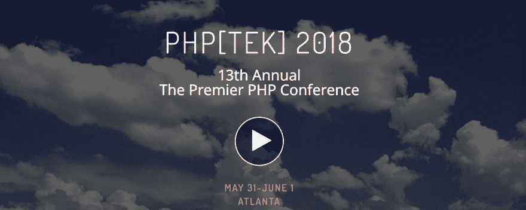
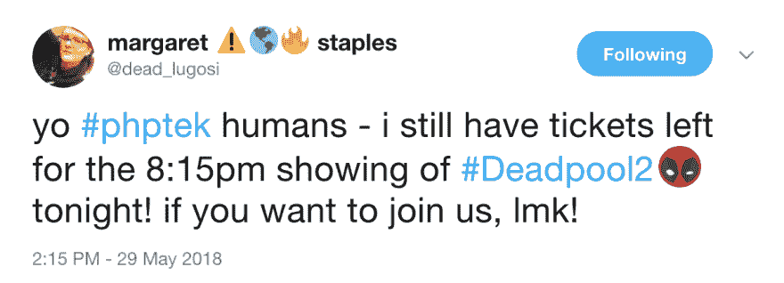
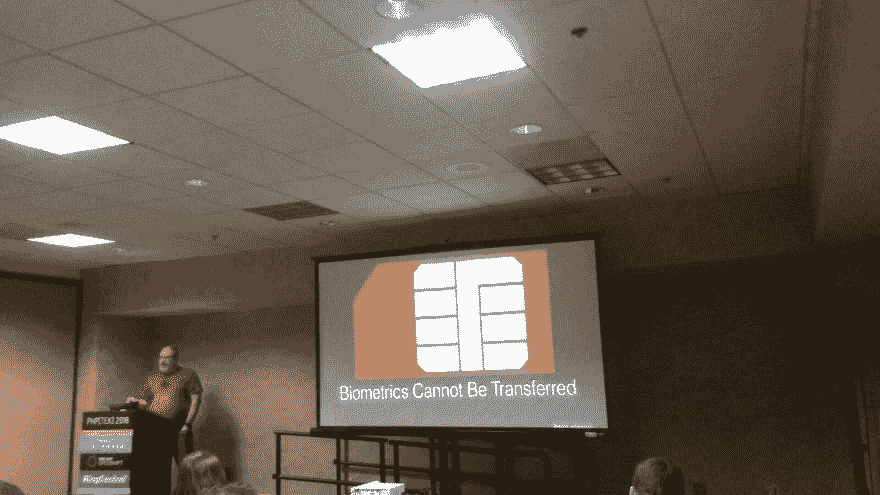

# PHP Tek 2018 已经开始了！

> 原文：<https://dev.to/matt24ray/php-tek-2018-has-begun-50cb>

PHP[TEK] 2018 第一天已经开始了！

[T2】](https://res.cloudinary.com/practicaldev/image/fetch/s--A3DykXXF--/c_limit%2Cf_auto%2Cfl_progressive%2Cq_auto%2Cw_880/https://thepracticaldev.s3.amazonaws.com/i/r54dufa2t0dinrgirmyn.png)

我参加了由 Chris Hartjes 举办的单元测试培训课程。克里斯被称为脾气暴躁的程序员。他对 PHP 单元测试进行了扎实的介绍，并深入探讨了数据提供者和 doubles 等更深层次的主题。

会议的第一个演讲是由玛格丽特·斯台普斯做的关于社区的扎实演讲。我听到了很多关于开发世界中的社区的讨论，并且很高兴听到了一些实际的期望和这个领域中的社区的例子。感谢玛格丽特邀请大家去看《死侍 2》。即使在第一次邀请之后，她还是继续联系，看看是否还有其他人能来。

[T2】](https://res.cloudinary.com/practicaldev/image/fetch/s--_nzcrNIQ--/c_limit%2Cf_auto%2Cfl_progressive%2Cq_auto%2Cw_880/https://thepracticaldev.s3.amazonaws.com/i/dc37zaeyxdymtwnn0a04.png)

现在，我正在欣赏 Adam Englander 关于生物统计学的精彩演讲。Adam 详细介绍了生物识别技术的历史和当前趋势，并通过说“世界上大多数人都不是高价值目标”让自己感觉好一点第一步是把我所有的密码改成不在这个列表上的。

[T2】](https://res.cloudinary.com/practicaldev/image/fetch/s--lksrlmGe--/c_limit%2Cf_auto%2Cfl_progressive%2Cq_auto%2Cw_880/https://thepracticaldev.s3.amazonaws.com/i/5ee5badb3oiqyv2ymq53.jpeg)