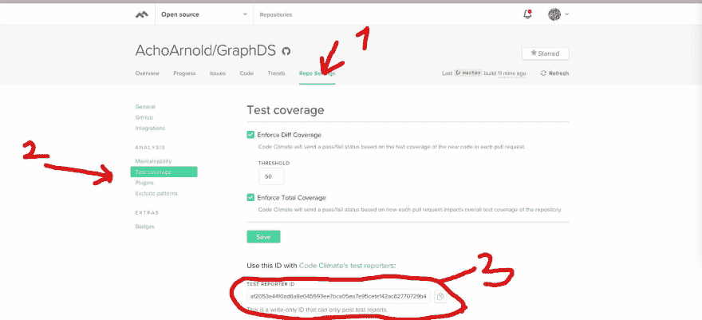

# 使用 Travis CI 的 PHP 测试覆盖率和使用 Clover 的代码气候

> 原文：<https://dev.to/acho_arnold/php-test-coverage-with-travis-ci-and-code-climate-using-clover-eih>

这篇文章是关于如何在[代码环境](https://codeclimate.com)上建立一个基于 PHP 的存储库的指南，这样它可以报告测试覆盖率。当你在 GitHub 上向你的存储库提交一个提交时， [Travis CI](https://travis-ci.org) 管道将会运行并生成测试覆盖报告，该报告将会被发送到 code climate 平台。

#### 1。获取您的代码气候测试记者 ID

导航到“回购设置->测试覆盖”，如下图所示
[](https://res.cloudinary.com/practicaldev/image/fetch/s--NnDhvnWW--/c_limit%2Cf_auto%2Cfl_progressive%2Cq_auto%2Cw_880/https://res.cloudinary.com/acho-arnold-cf/image/upload/v1539644048/Screenshot_2018-10-15_23.49.21_gxhz7l.jpg)

#### 2。配置您的. travis.yml 文件

从这个库[https://git.io/fxu0q](https://git.io/fxu0q)获取一个 PHP 项目的样本`.travis.yml`文件

注意:从**示例 2** 中复制`.travis.yml`文件，因为它使用`Clover`进行测试覆盖。

在`.travis.yml`文件的`global`部分，用从上面第一步复制的 ID 替换`CC_TEST_REPORTER_ID`变量。

将`php`块下的 php 版本更改为您想要的版本。

此外，在`before_install`部分下，添加脚本`composer install --no-dev`，以便在测试运行之前安装您的 composer 依赖项。

最后，将最后一行从
改为

```
 - if [ "$TRAVIS_PULL_REQUEST" == "false" ]; then ./cc-test-reporter after-build --exit-code $TRAVIS_TEST_RESULT; fi 
```

至

```
 - if [ "$TRAVIS_PULL_REQUEST" == "false" ]; then ./cc-test-reporter after-build  -t clover --exit-code $TRAVIS_TEST_RESULT; fi 
```

您的`.travis.yml`文件在上面的修改
之后会是这样的

```
env:
  global:
  - CC_TEST_REPORTER_ID={put your reporter id here}
  - GIT_COMMITTED_AT=$(if [ "$TRAVIS_PULL_REQUEST" == "false" ]; then git log -1 --pretty=format:%ct; else git log -1 --skip 1 --pretty=format:%ct; fi)
language: php
php:
  - '7.2'
before_script:
  - composer install --no-dev
  - curl -L https://codeclimate.com/downloads/test-reporter/test-reporter-latest-linux-amd64 > ./cc-test-reporter
  - chmod +x ./cc-test-reporter
  - ./cc-test-reporter before-build
script:
  - "phpunit  --coverage-text  --coverage-clover  build/logs/clover.xml"
  - if [ "$TRAVIS_PULL_REQUEST" == "false" ]; then ./cc-test-reporter after-build  -t clover --exit-code $TRAVIS_TEST_RESULT; fi 
```

[你可以在 github 上获得这个`.travis.yml`文件。]((https://github.com/AchoArnold/GraphDS/blob/master/.travis.yml))

#### 3。配置 phpunit.xml

必须配置一个白名单来告诉 PHPUnit 在代码覆盖率报告中包含哪些源代码文件。如果您的`phpunit.xml`文件中还没有白名单过滤器，添加一个这样的

```
<filter>
    <whitelist processUncoveredFilesFromWhitelist="true">
        <directory suffix=".php">./src</directory> 
        <exclude>
           <directory>./vendor</directory>
        </exclude>
    </whitelist>
</filter> 
```

在上面的例子中，`./src`是你的源文件所在目录的路径，`./vendor`是你想忽略的目录的路径。

另外，通过在`phpunit.xml`文件
中添加一个`logging`块，告诉 PHPUnit 在哪里记录测试覆盖输出

```
<logging>
    <log type="coverage-clover" target="build/logs/clover.xml"/>
</logging> 
```

我完整的 PHPUnit 文件如下所示

```
<?xml version="1.0" encoding="UTF-8"?>
<phpunit backupGlobals="false"
         backupStaticAttributes="false"
         bootstrap="vendor/autoload.php"
         colors="true"
         convertErrorsToExceptions="true"
         convertNoticesToExceptions="true"
         convertWarningsToExceptions="true"
         processIsolation="false"
         stopOnFailure="false">
    <testsuites>
        <testsuite name="unit">
            <directory suffix="Test.php">./tests</directory>
        </testsuite>
    </testsuites>
    <filter>
        <whitelist processUncoveredFilesFromWhitelist="true">
            <directory suffix=".php">./src</directory>
            <exclude>
                <directory>./vendor</directory>
                <directory>./doc</directory>
                <directory>./SampleApp_RoadPlanner/</directory>
            </exclude>>
        </whitelist>
    </filter>
    <logging>
        <log type="coverage-clover" target="build/logs/clover.xml"/>
    </logging>
</phpunit> 
```

[你可以在 GitHub 上看到这段代码](https://github.com/AchoArnold/GraphDS/blob/master/phpunit.xml)

#### 仅此而已！

下次当您在 Travis CI 上推送构建时，它将运行您的测试并将覆盖报告发送给 Code Climate。

[样本测试覆盖报告](https://res.cloudinary.com/acho-arnold-cf/image/upload/v1540182992/test-coverage-report.jpg)