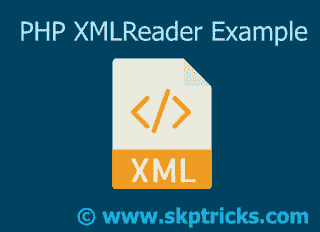

# PHP XML 阅读器示例

> 原文：<https://dev.to/skptricks/php-xml-reader-example-2h53>

帖子链接:[https://www . skptricks . com/2018/04/PHP-XML-reader-example . html](https://www.skptricks.com/2018/04/php-xml-reader-example.html)

今天，在本教程中，我们将学习如何使用 XMLReader 类解析大型 XML 文件。XMLReader 扩展是一个 XML 拉解析器。阅读器就像一个光标，在文档流中前进，并在途中的每个节点停下来。

[PHP XML 阅读器示例](https://www.skptricks.com/2018/04/php-xml-reader-example.html)

[T2】](https://res.cloudinary.com/practicaldev/image/fetch/s--aaT0ATeN--/c_limit%2Cf_auto%2Cfl_progressive%2Cq_auto%2Cw_880/https://2.bp.blogspot.com/-1309kYe_Mpg/Wt1eMN6HNXI/AAAAAAAABhM/Hq0TAhsYfXIHCO86i1Lt_ih5HFjfA-bagCLcBGAs/s320/xml.jpg)

XMLReader 扩展最初是 PHP 5 的 PECL 扩展。从 PHP 5.1.0 开始，它被转移到 PHP 源代码包中，从 PHP 5.1.2 开始，它被默认启用

XMLReader 的优点:
它速度更快，因为它没有将整个 XML 加载到内存中。
它可以解析具有更多子树的大型且高度复杂的 XML 文档。

XML Reader 特性:
根据当前节点检索 XML 文档的一部分。
根据索引、名称或命名空间获取属性。
根据属性的索引、名称或命名空间解析元素。
验证 XML 文档

让我们看看这个例子，我们将从外部源文件中解析一个 xml 标记。这里我们使用 XMLReader 访问每个节点，然后使用 SimpleXML 访问它们。通过这种方式，您可以保持较低的内存使用率，因为您一次处理一个节点，并且仍然可以利用 SimpleXML 的易用性。

下载链接: [PHP XML 阅读器示例](https://www.skptricks.com/2018/04/php-xml-reader-example.html)