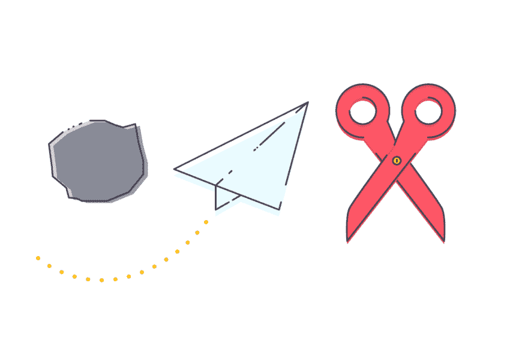
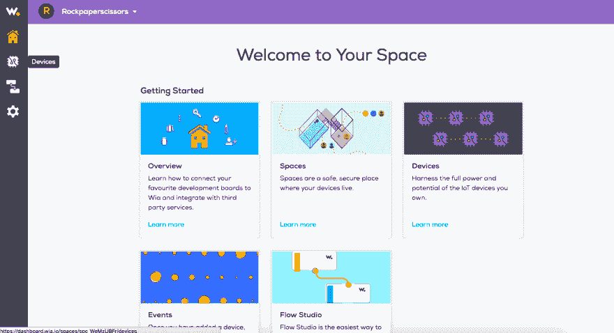
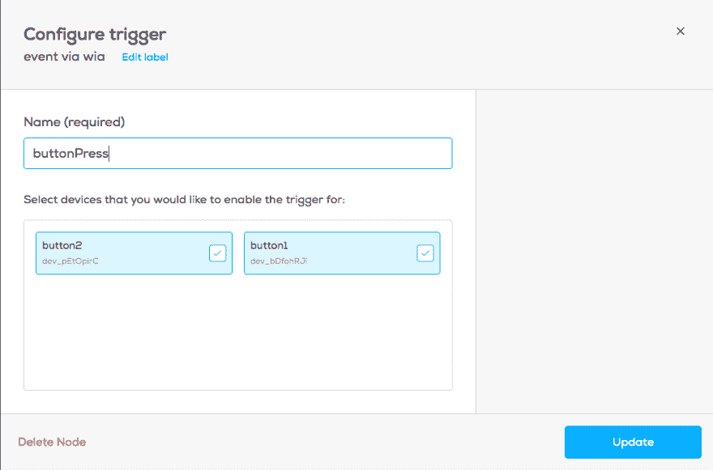
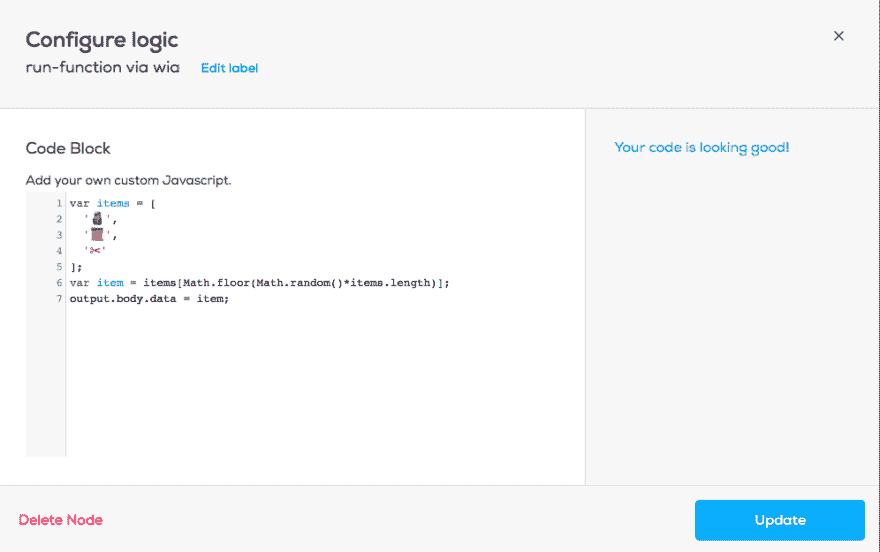
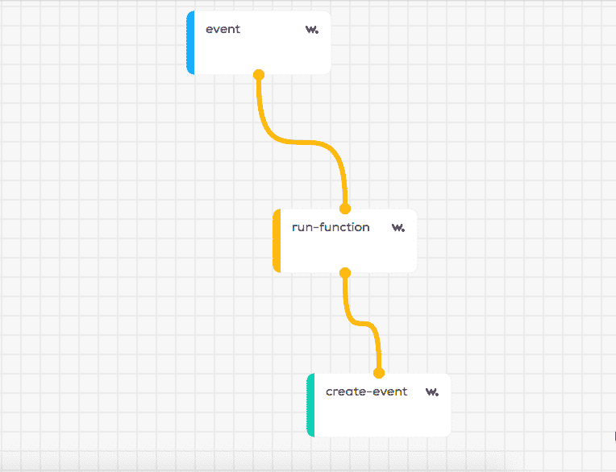
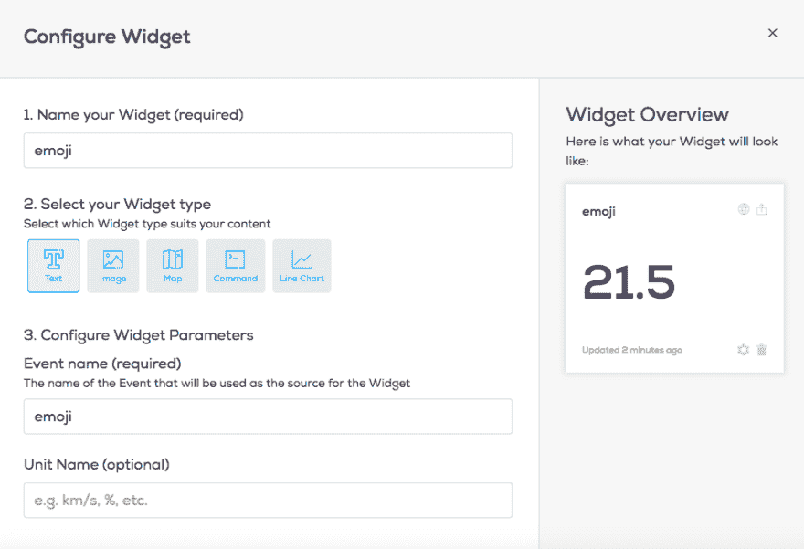

# 使用 ESP8266 玩石头剪刀布

> 原文：<https://dev.to/wiaio/play-rock-paper-scissors-using-the-esp8266-1h7>

[](https://res.cloudinary.com/practicaldev/image/fetch/s--EzRTciRN--/c_limit%2Cf_auto%2Cfl_progressive%2Cq_auto%2Cw_880/https://s3-eu-west-1.amazonaws.com/wia-flarum-bucket/2018-07-04/1530701878-372923-blog-05.png) 
在本教程中，我们将使用 ESP8266、Wia Dashboard 和 Github 构建一个在线石头、布、剪刀游戏。

# 你将需要什么

*   2 个 ESP8266
*   2 根微型 USB 转 USB 电缆

开始之前，您必须有一个 Wia 帐户。[您可以在这里创建一个](https://dashboard.wia.io/login)。

如果您还没有使用 Arduino 设置您的 ESP8266，您需要先这样做。本教程将告诉你如何做。

# 入门

首先，将 USB 电缆连接到其中一个 ESP8266，并将其插入您的计算机或笔记本电脑。

打开 Arduino IDE。你可以在这里下载[的最新版本](https://www.google.ie/search?q=arduino&oq=arduino&aqs=chrome..69i57j69i60l4j69i59.1724j0j7&sourceid=chrome&ie=UTF-8)。在 Arduino IDE 中，创建一个新的草图并另存为`playerOne.ino`。创建第二个草图，将其命名为`playerTwo.ino`。

接下来，导航到 Wia 仪表板，创建一个新的`space`和`add device`。给它起个类似“playerOne”的名字。

[T2】](https://res.cloudinary.com/practicaldev/image/fetch/s--mfVp0MmQ--/c_limit%2Cf_auto%2Cfl_progressive%2Cq_auto%2Cw_880/https://s3-eu-west-1.amazonaws.com/wia-flarum-bucket/2018-07-03/1530630222-32159-screen-shot-2018-07-03-at-40324-pm.png)

添加设备后，导航至页面左侧的`Devices`选项卡。选择您的设备，然后导航至`configuration`选项卡。您将看到您的设备 ID 以及您的`device_secret_key`。稍后您将需要设备密钥。

# 代码

将以下代码复制并粘贴到名为 playerOne.ino.
的 Arduino 草图中

```
 #include <Arduino.h>
#include <ESP8266WiFi.h>
#include <ESP8266WiFiMulti.h>
#include <ESP8266HTTPClient.h>

#define USE_SERIAL Serial

ESP8266WiFiMulti WiFiMulti;

const char* ssid     = "name-of-your-Wifi";
const char* password = "your-Wifi-Password";

// get this from the wia dashboard. it should start with `d_sk`

const char* device_secret_key = "your-device-secret-key";

boolean buttonState = HIGH;
boolean buttonDown = false;

void setup() {
  // put your setup code here, to run once:
  pinMode(0, INPUT);
  Serial.begin(115200);
  while (!Serial) {
    ; // wait for serial port to connect. Needed for native USB port only
  }
  WiFi.mode(WIFI_STA);
  WiFiMulti.addAP(ssid, password);
}

void loop() {
  // put your main code here, to run repeatedly:
  buttonState = digitalRead(0);
  // check if the pushbutton is pressed.
  // if it is, the buttonState is LOW:
  if (buttonState == LOW) {
    if (buttonDown == false) {
      Serial.println("Button Pushed");
      buttonDown = true;
      postToWia();
      delay(750);
    }
  } else {
    buttonDown = false;
  }
}

void postToWia() {
  // wait for WiFi connection
  if((WiFiMulti.run() == WL_CONNECTED)) {
    HTTPClient http;
    USE_SERIAL.print("[HTTP] begin...\n");
    // configure wia rest api
    http.begin("http://api.wia.io/v1/events");
    USE_SERIAL.print("[HTTP] POST...\n");

    // set authorization token
    http.addHeader("Authorization", "Bearer " + String(device_secret_key));
    // set content-type to json
    http.addHeader("Content-Type", "application/json");
    // start connection and send HTTP headers. replace name and data values with your own.
    int httpCode = http.POST("{\"name\":\"buttonPress\"}");
    // httpCode will be negative on error

    if(httpCode > 0) {
        // HTTP header has been send and Server response header has been handled
        USE_SERIAL.printf("[HTTP] POST... code: %d\n", httpCode);
        // file found at server
        if(httpCode == HTTP_CODE_OK) {
            String payload = http.getString();
            USE_SERIAL.println(payload);
        }
    } else {
        USE_SERIAL.printf("[HTTP] POST... failed, error: %s\n", http.errorToString(httpCode).c_str());
    }
    http.end();
  }
} 
```

Enter fullscreen mode Exit fullscreen mode

更改以下值:

*   `name-of-your-WiFi`到您的 WiFi 名称。这必须是您的电脑正在使用的同一个 WiFi 网络。
*   `your-WiFi-password`您的 WiFi 网络密码

*   `you-device-secret-key`您的设备密钥，可在 Wia 仪表盘的`Devices > Configuration`下找到

点击 Arduino IDE 中的`upload`将代码上传至您的设备。然后，将您的设备放在一边。记住这个设备是`playerOne`，包含 playerOne 代码。

将第二台设备连接到您的计算机，并将其添加到您在 Wia 仪表板中的共享空间。这个设备将有一个完全不同的`device-secret-key`。从配置选项卡中收集密钥。将之前的代码复制并粘贴到 Arduino 文件`playerTwo.ino`中，但是更改`device-secret-key`以匹配第二个设备。

将文件`playerTwo.ino`中的代码上传到您的第二个设备上。

# 威亚流

现在，在您的 Wia 仪表板中，单击左侧边栏中的`Flows`。创建一个新的流程，随便你怎么命名。

从 trigger 选项卡中拖动一个`Event`并将其命名为 buttonPress。选择两个设备。

[T2】](https://res.cloudinary.com/practicaldev/image/fetch/s--Q_ybAHN3--/c_limit%2Cf_auto%2Cfl_progressive%2Cq_auto%2Cw_880/https://s3-eu-west-1.amazonaws.com/wia-flarum-bucket/2018-07-03/1530630415-225803-screen-shot-2018-07-03-at-40602-pm.png)

在`logic`选项卡中，拖动一个`run-function`节点。将黄点从`Event`节点拖到`run-function`节点。在框中，复制并粘贴以下代码:

```
 var items = [
    '🗿',
    '📜',
    '✂'
];

var item = items[Math.floor(Math.random()*items.length)];
output.body.data = item; 
```

Enter fullscreen mode Exit fullscreen mode

您的屏幕应该是这样的:

[T2】](https://res.cloudinary.com/practicaldev/image/fetch/s--jr386xCV--/c_limit%2Cf_auto%2Cfl_progressive%2Cq_auto%2Cw_880/https://s3-eu-west-1.amazonaws.com/wia-flarum-bucket/2018-07-03/1530630492-182475-screen-shot-2018-07-03-at-40737-pm.png)

点击`Update`。
然后，在`action`选项卡中，拖动一个`event`并将其命名为`emoji`。要连接节点，请拖动橙色的点。您的屏幕应该是这样的:

[T2】](https://res.cloudinary.com/practicaldev/image/fetch/s--T6ROrLnU--/c_limit%2Cf_auto%2Cfl_progressive%2Cq_auto%2Cw_880/https://s3-eu-west-1.amazonaws.com/wia-flarum-bucket/2018-07-03/1530630561-581691-screen-shot-2018-07-03-at-40904-pm.png)

接下来，导航至`Devices > playerOne`。这将带您进入设备的概览页面。在右上角，点击`add a widget`。标题写`emoji`，事件写`emoji`。然后，导航回侧边栏上的`Devices`，选择您的设备进行`playerTwo`。创建一个新的小部件，为标题编写`emoji`,为事件编写`emoji`。

[T2】](https://res.cloudinary.com/practicaldev/image/fetch/s--U3zxPlK4--/c_limit%2Cf_auto%2Cfl_progressive%2Cq_auto%2Cw_880/https://s3-eu-west-1.amazonaws.com/wia-flarum-bucket/2018-07-03/1530630620-277373-screen-shot-2018-07-03-at-41007-pm.png)

将两个设备都插入电脑。按下两个设备上的`flash`按钮。你的小工具将显示设备是选择石头、布还是剪刀。

然而，在两个设备之间导航并不是玩游戏的有效方式。所以，我们必须制作一个网页，同时向我们展示每个玩家的选择结果。

为此，我们将使用 Github。您[可以在这里](https://github.com/)创建一个账户。

# 网页

首先登录 Github。创建一个新的存储库，并将其命名为 your-github-username.github.io。

创建存储库后，将其打开。点击`create new file`。将下面的代码复制并粘贴到名为`index.html`的文件中。文件**必须**命名为 index.html。

```
<!DOCTYPE html>
<html>
  <head>
    <meta charset="UTF-8">
    Wia Game
  </head>
  <body>
    <h1>Wia Rock Paper Scissors</h1>
  </body>
</html> 
```

Enter fullscreen mode Exit fullscreen mode

这是 HTML 样板文件。为了实时查看我们的游戏更新，我们需要嵌入来自 Wia 的小部件。回到 Wia 仪表板，导航到两个播放器设备之一。在概览中，您可以看到您的小部件。单击小部件右上角带箭头的框。选择设置`anyone can view this widget`。复制代码以嵌入小部件。代码以开始，以结束。

回到 GitHub，编辑`index.html`文件。将小部件代码粘贴在标题`<h1>Wia Rock Paper Scissors</h1>`下。

对另一台设备的小部件重复此操作。现在，你的 HTML 文件应该是这样的:

```
<!DOCTYPE html>
<html>
  <head>
    <meta charset="UTF-8">
    Wia Game
  </head>
  <body>
    <h1>Wia Rock Paper Scissors</h1>
    <iframe> YOUR WIDGET </iframe>
    <iframe> YOUR SECOND WIDGET </iframe>
  </body>
  </html> 
```

Enter fullscreen mode Exit fullscreen mode

要查看您的新网页，请导航至`https://your-github-username.github.io/`

这就是你的游戏！