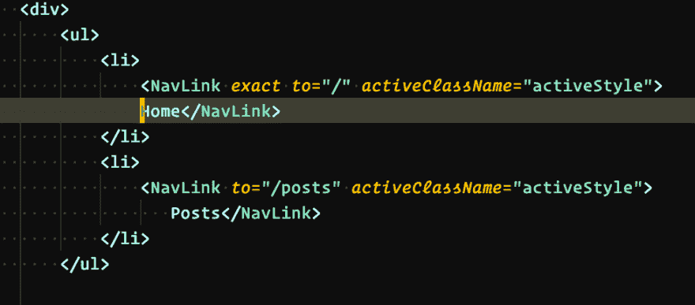
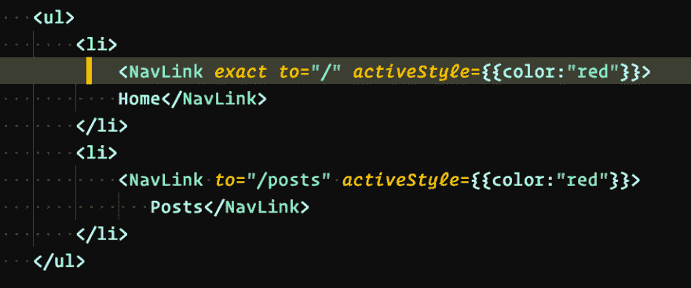
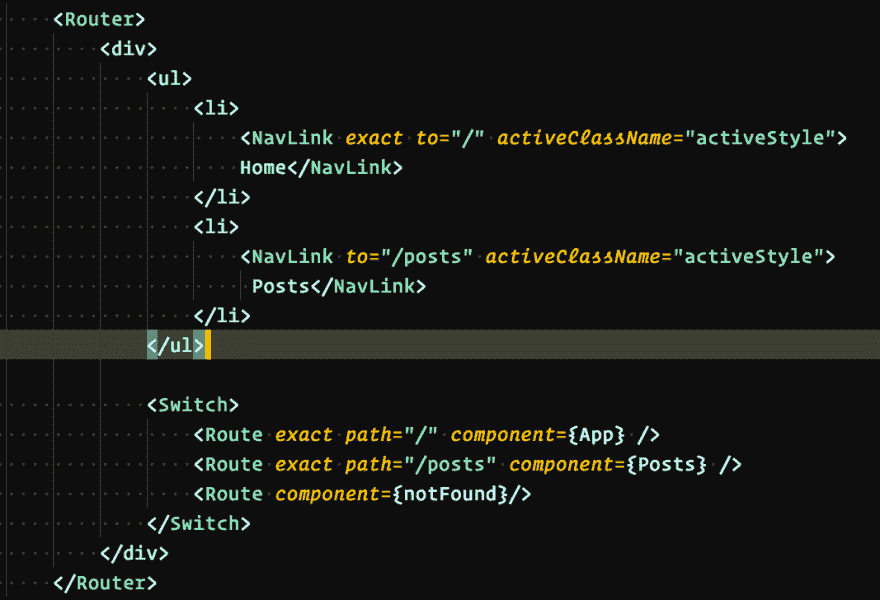
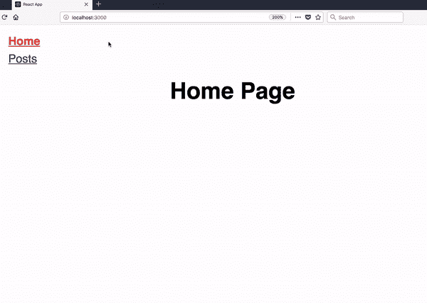

# 使用 React 路由器第 2 部分

> 原文：<https://dev.to/sait/play-with-react-router-part-2-4i8m>

如何处理 React 路由器中的 404 请求和主动样式？

如果您想从第一部分开始，请参考[弹奏 React🐘路由器](https://dev.to/saigowthamr/play-with-the-react-router-1e79)。

## 如何在 React 路由器中每当 URL/路径匹配时应用主动样式？

*   NavLink 组件可用于设计导航项目的样式。
*   我们需要使用 NavLink 而不是 Link 组件。

[T2】](https://res.cloudinary.com/practicaldev/image/fetch/s--yONvTzT0--/c_limit%2Cf_auto%2Cfl_progressive%2Cq_auto%2Cw_880/https://thepracticaldev.s3.amazonaws.com/i/urgjyki08pv5zl8iowja.png)

有两个属性可用于样式化。

*   activeClassName
*   activeStyle。

**activeClassName** :我们需要传递类名。
**activeStyle** :我们需要将样式作为对象传递。

现在让我们来看看实践中的 *activeStyle* 属性。

[T2】](https://res.cloudinary.com/practicaldev/image/fetch/s--gfgEhkVf--/c_limit%2Cf_auto%2Cfl_progressive%2Cq_auto%2Cw_880/https://thepracticaldev.s3.amazonaws.com/i/eh27j81xx746udiqhf82.png)

# React 路由器如何处理 404 请求？

[T2】](https://res.cloudinary.com/practicaldev/image/fetch/s--_iuSPfbp--/c_limit%2Cf_auto%2Cfl_progressive%2Cq_auto%2Cw_880/https://thepracticaldev.s3.amazonaws.com/i/koozyr0ui6n54d6sz2ue.png)

我们需要用交换机组件包装所有的路由。

**Switch** :只有当特定的路径/URL 匹配时，它才帮助我们渲染组件。

在上面的代码中，只有两个路由，所以只有当 URL 匹配时，switch 才呈现那个组件。如果任何一个 URL 不匹配，开关将显示未找到的组件。

# 最终输出。

[T2】](https://res.cloudinary.com/practicaldev/image/fetch/s--9iVJyJbf--/c_limit%2Cf_auto%2Cfl_progressive%2Cq_66%2Cw_880/https://thepracticaldev.s3.amazonaws.com/i/70flwlze39pvmosritm1.gif)

快乐编码...

[玩弄 React🐘路由器第一部分](https://dev.to/saigowthamr/play-with-the-react-router-1e79)