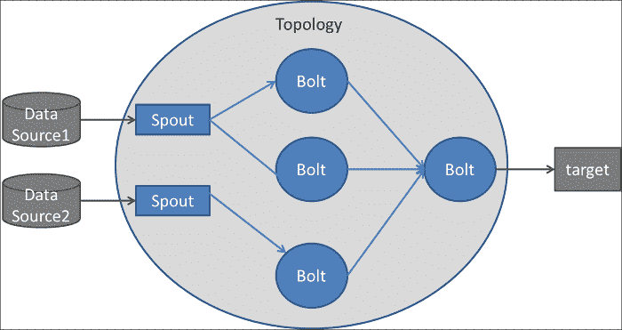
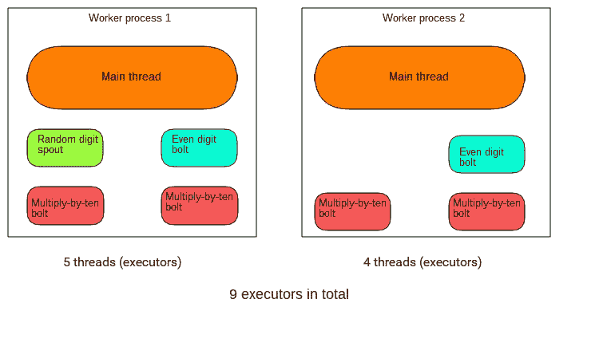
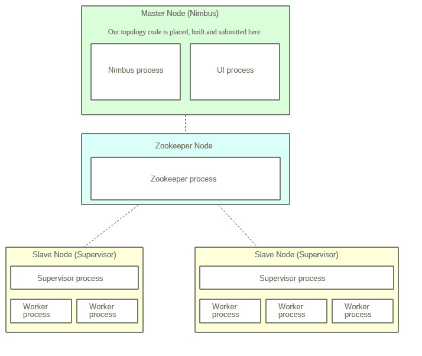
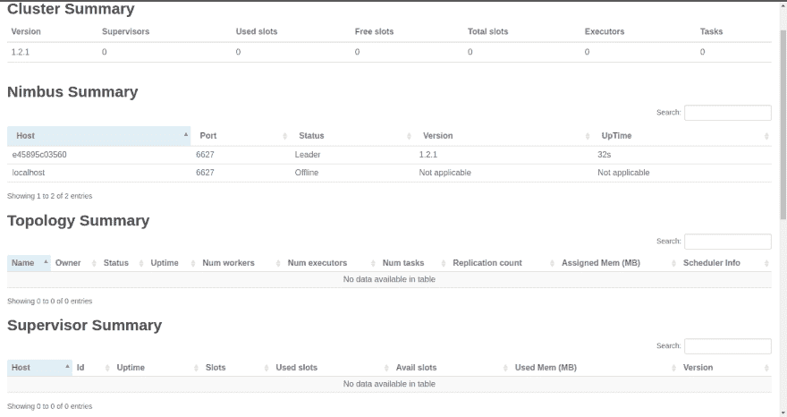
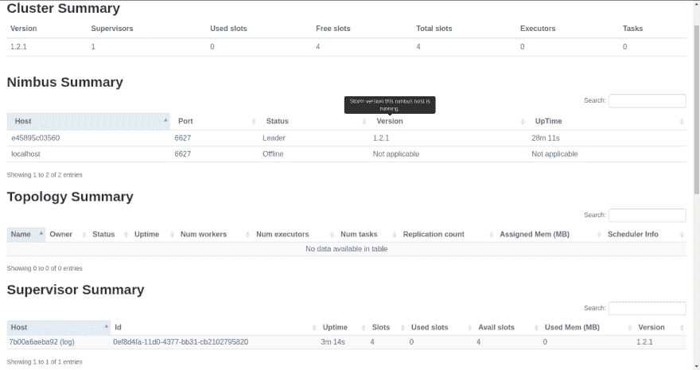
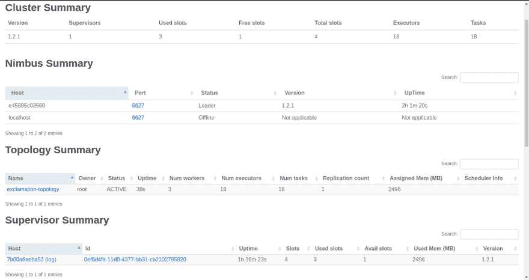
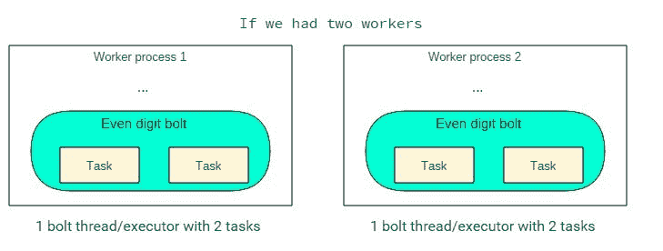
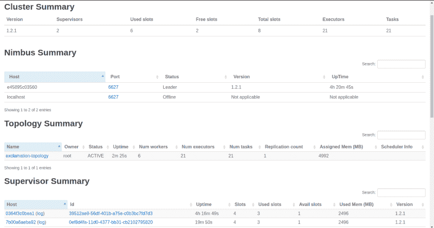
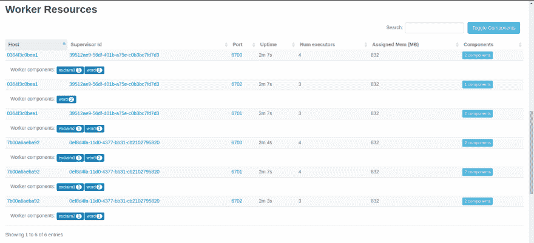

# 像老板一样在 Docker 上玩 Apache Storm

> 原文：<https://dev.to/usamaashraf/playing-with-apache-storm-on-docker---like-a-boss-4bgb>

这篇文章不是风暴的最终指南，也不意味着是。风暴是相当巨大的，只是一个长期阅读可能无法做到这一点。当然，任何补充，反馈或建设性的批评将非常感谢。
好了，现在我们来看看我们将要讨论的内容:

*   风暴的必要性，它的“为什么”,它是什么和它不是什么
*   它是如何工作的鸟瞰图。
*   Storm 拓扑在代码(Java)中大致是什么样子
*   在 Docker 上设置和使用值得生产的 Storm 集群。
*   关于消息处理可靠性的一些话。

我还假设你至少对码头工人和集装箱化有所了解。

持续的数据流无处不在，随着越来越多的物联网设备被使用，这种情况会变得更加普遍。当然，这些数据被存储、处理和分析，以提供可预测的、可操作的结果。但是分析 Pb 需要很长时间，即使使用 [Hadoop](http://hadoop.apache.org/) (可能和 MapReduce 一样好)或 [Spark](https://spark.apache.org/) (对 MapReduce 局限性的补救)。其次，我们通常不需要长时间推断模式。在几个月的时间里，*在任何给定的时刻*，我们可能不需要考虑所有的数据，只需要一个实时的快照。也许我们不需要知道五年来最长的流行标签，只需要知道现在的一个。这就是 Storm 的构建目的，接受大量可能来自各种来源的极快的数据，对其进行分析，并将实时更新发布到 UI 或其他地方*，而不存储任何数据。*

## 工作原理

Storm 的架构可以比作连接一组检查站的道路网络。交通从某个检查站(称为**喷口**)开始，并通过其他检查站(称为**门闩**)。流量当然是由**喷口**检索的数据流(例如，从一个数据源，一个公共 API)并路由到各种**螺栓**，在那里数据被过滤、净化、聚集、分析，发送到用户界面供人们查看或任何其他目标。由喷嘴和螺栓组成的网络被称为**拓扑**，数据以**元组**(可能具有不同类型的值列表)的形式流动。

[](https://res.cloudinary.com/practicaldev/image/fetch/s--YiZdrdr2--/c_limit%2Cf_auto%2Cfl_progressive%2Cq_auto%2Cw_880/https://thepracticaldev.s3.amazonaws.com/i/ae7en7kiyjwqnl28yknm.png) 
<sub><sup>*来源:*</sup></sub>

需要讨论的一件重要事情是数据流量的方向。按照惯例，我们会有一个或多个 spouts 从一个 API、一个 [Kafka topic](https://kafka.apache.org/documentation/#intro_topics) 或其他一些排队系统中读取数据。然后，数据将通过*单向*流向一个或多个螺栓，这些螺栓可能会将数据转发给其他螺栓，依此类推。Bolts 可以将分析的数据发布到 UI 或另一个 bolts。但是*交通几乎总是单向的*，就像一条匕首。虽然当然有可能形成循环，但我们不太可能需要如此复杂的拓扑结构。

安装一个 Storm 版本需要很多步骤，你可以在你的机器上自由操作。但稍后我将使用 Docker 容器进行 Storm 集群部署，映像将负责设置我们需要的一切。

## 一些代码

虽然 Storm 确实提供了对其他语言的支持，但是大多数拓扑都是用 Java 编写的，因为这是我们拥有的最有效的选择。

一个非常基本的喷口，只是发出随机数字，可能看起来像这样:

```
public class RandomDigitSpout extends BaseRichSpout 
{
  // To output tuples from spout to the next stage bolt
  SpoutOutputCollector collector;  

  public void nextTuple() 
  {
    int randomDigit = ThreadLocalRandom.current().nextInt(0, 10);

    // Emit the digit to the next stage bolt
    collector.emit(new Values(randomDigit));
  }

  public void declareOutputFields(OutputFieldsDeclarer outputFieldsDeclarer)
  {
    // Tell Storm the schema of the output tuple for this spout.
    // It consists of a single column called 'random-digit'.
    outputFieldsDeclarer.declare(new Fields("random-digit"));
  }
} 
```

Enter fullscreen mode Exit fullscreen mode

和一个简单的螺栓，它接收随机流，只发出偶数:

```
public class EvenDigitBolt extends BaseRichBolt 
{
  // To output tuples from this bolt to the next bolt.
  OutputCollector collector;

  public void execute(Tuple tuple) 
  {
    // Get the 1st column 'random-digit' from the tuple
    int randomDigit = tuple.getInt(0);

    if (randomDigit % 2 == 0) {
      collector.emit(new Values(randomDigit));
    }
  }

  public void declareOutputFields(OutputFieldsDeclarer declarer) 
  {
    // Tell Storm the schema of the output tuple for this bolt.
    // It consists of a single column called 'even-digit'
    declarer.declare(new Fields("even-digit"));
  }
} 
```

Enter fullscreen mode Exit fullscreen mode

另一个简单的 bolt 将从`EvenDigitBolt`接收过滤后的流，并将每个偶数数字乘以 10，然后向前发送:

```
public class MultiplyByTenBolt extends BaseRichBolt 
{
  OutputCollector collector;

  public void execute(Tuple tuple) 
  {
    // Get 'even-digit' from the tuple.
    int evenDigit = tuple.getInt(0);

    collector.emit(new Values(evenDigit * 10));
  }

  public void declareOutputFields(OutputFieldsDeclarer declarer) 
  {
    declarer.declare(new Fields("even-digit-multiplied-by-ten"));
  }
} 
```

Enter fullscreen mode Exit fullscreen mode

将它们放在一起形成我们的拓扑:

```
package packagename
// ...

public class OurSimpleTopology { 

  public static void main(String[] args) throws Exception
  {
    // Create the topology
    TopologyBuilder builder = new TopologyBuilder();

    // Attach the random digit spout to the topology.
    // Use just 1 thread for the spout.
    builder.setSpout("random-digit-spout", new RandomDigitSpout());

    // Connect the even digit bolt to our spout. 
    // The bolt will use 2 threads and the digits will be randomly
    // shuffled/distributed among the 2 threads.
    // The third parameter is formally called the parallelism hint.
    builder.setBolt("even-digit-bolt", new EvenDigitBolt(), 2)
           .shuffleGrouping("random-digit-spout");

    // Connect the multiply-by-10 bolt to our even digit bolt.
    // This bolt will use 4 threads, among which data from the
    // even digit bolt will be shuffled/distributed randomly.
    builder.setBolt("multiplied-by-ten-bolt", new MultiplyByTenBolt(), 4)
           .shuffleGrouping("even-digit-bolt");

    // Create a configuration object.
    Config conf = new Config();

    // The number of independent JVM processes this topology will use.
    conf.setNumWorkers(2);

    // Submit our topology with the configuration.
    StormSubmitter.submitTopology("our-simple-topology", conf, builder.createTopology());
  }
} 
```

Enter fullscreen mode Exit fullscreen mode

### 风暴拓扑中的并行性

完全理解 Storm 中的并行性可能会令人望而生畏，至少在我的经验中是这样。一个拓扑至少需要一个流程来操作(很明显)。在这个过程中，我们可以使用线程并行执行我们的喷口和螺栓。在我们的例子中，`RandomDigitSpout`将只启动一个线程，从那个线程中喷出的数据将分布在`EvenDigitBolt`的两个线程中。但是这种分布发生的方式，被称为**流分组**，可能很重要。例如，您可能有一个来自两个城市的温度记录流，其中由 spout 发出的元组如下所示:

```
// City name, temperature, time of recording

("Atlanta",       94, "2018-05-11 23:14")
("New York City", 75, "2018-05-11 23:15")
("New York City", 76, "2018-05-11 23:16")
("Atlanta",       96, "2018-05-11 23:15")
("New York City", 77, "2018-05-11 23:17")
("Atlanta",       95, "2018-05-11 23:16")
("New York City", 76, "2018-05-11 23:18") 
```

Enter fullscreen mode Exit fullscreen mode

假设我们只连接了一个螺栓，它的工作是计算每个城市平均温度的变化。如果我们可以合理地预期，在任何给定的时间间隔内，我们将从两个城市获得大致相等数量的元组，那么将两个线程专用于我们的螺栓，并将亚特兰大的数据发送给其中一个，将纽约的数据发送给另一个，这是有意义的。一个**字段分组**将服务于我们的目的，它通过分组
中指定的字段的值在线程之间划分数据

```
// The tuples with the same city name will go to the same thread.
builder.setBolt("avg-temp-bolt", new AvgTempBolt(), 2)
       .fieldsGrouping("temp-spout", new Fields("city_name")); 
```

Enter fullscreen mode Exit fullscreen mode

当然还有其他类型的分组。然而，在大多数情况下，分组可能没多大关系，你可以随意地将数据打乱，并将其扔进螺栓螺纹中(**打乱分组**)。
现在还有另一个重要的组成部分:我们的拓扑将在其上运行的工作进程的数量。*我们指定的线程总数将在工作进程中平均分配*。因此，在我们的随机数字拓扑示例中，我们有 1 个喷口螺纹、2 个偶数数字螺栓螺纹和 4 个乘以 10 的螺栓螺纹(总共 7 个)。2 个工作进程中的每一个都将负责运行 2 个乘以 10 的螺栓线程、1 个偶数的螺栓，其中一个进程将运行 1 个喷口线程。

[](https://res.cloudinary.com/practicaldev/image/fetch/s--_zvrKKmP--/c_limit%2Cf_auto%2Cfl_progressive%2Cq_auto%2Cw_880/https://thepracticaldev.s3.amazonaws.com/i/ppnwksjfn8ji051ec8z8.jpg) 
当然，这两个 worker 进程都会有自己的主线程，它们依次会启动 spout 和 bolt 线程。所以总的来说，我们将有 9 个线程。这些人统称为**执行者**。

重要的是要意识到，如果你设置了一个 spout 的并行提示> 1(即多个执行器)，你可能会多次发出相同的数据。比方说，spout 从公共 Twitter 流 API 中读取数据，并使用两个执行器。这意味着从 spout 接收数据的螺栓将获得两次相同的 tweet。只有在 spout 发出元组之后，数据并行性才开始发挥作用，即元组根据指定的流分组在螺栓之间划分。

在一个节点上运行多个工作线程是毫无意义的。但是，稍后，我们将使用一个适当的分布式多节点集群，并了解不同节点上的工作人员是如何分配的。

### 构建我们的拓扑

下面是我建议的目录结构:

```
yourproject/
            pom.xml  
            src/
                jvm/
                    packagename/
                           RandomDigitSpout.java
                           EvenDigitBolt.java
                           MultiplyByTenBolt.java
                           OurSimpleTopology.java 
```

Enter fullscreen mode Exit fullscreen mode

[Maven](https://maven.apache.org/) 通常用于构建风暴拓扑，它需要一个`pom.xml`文件(POM)[定义各种配置细节、项目依赖等](https://maven.apache.org/guides/introduction/introduction-to-the-pom.html)。在这里，进入 POM 的[细节可能有点矫枉过正。](https://maven.apache.org/pom.html)

*   首先，我们将在`yourproject`中运行 **`mvn clean`** 来清除我们可能有的任何编译文件，确保从头开始编译每个模块。
*   然后 **`mvn package`** 编译我们的代码，并将其打包到一个可执行的 JAR 文件中，放在一个新创建的`target`文件夹中。这第一次可能要花几分钟，尤其是如果您的拓扑有许多依赖项的话。
*   提交我们的拓扑: **`storm jar target/packagename-{version number}.jar packagename.OurSimpleTopology`**

希望到现在为止，Storm 中概念和代码之间的鸿沟已经在某种程度上被弥合了。然而，任何严重的风暴部署都不会是在一台服务器上运行单个拓扑实例。

## 一个风暴群是什么样子的

为了充分利用 Storm 的[可伸缩性](http://storm.apache.org/about/scalable.html)和[容错性](http://storm.apache.org/releases/current/Fault-tolerance.html)，任何生产级拓扑都将被提交给一个机器集群。

Storm 发行版安装在主节点(Nimbus)和所有从节点(Supervisors)上。
*主*节点运行风暴[光轮](https://github.com/apache/storm/blob/exclamation/storm-server/src/main/java/org/apache/storm/daemon/nimbus/Nimbus.java)守护进程和风暴 UI。*从节点*运行 Storm [管理器](https://github.com/apache/storm/blob/exclamation/storm-server/src/main/java/org/apache/storm/daemon/supervisor/Supervisor.java)守护进程。独立节点上的 [Zookeeper](http://zookeeper.apache.org/) 守护进程用于主节点和从节点之间的协调。顺便说一下，Zookeeper 只用于集群管理，从不用于任何类型的消息传递。这不像喷口和螺栓通过它或类似的东西互相发送数据。Nimbus 守护进程通过 ZooKeeper 找到可用的监管程序，监管程序守护进程向 ZooKeeper 注册。和其他管理任务，其中一些将很快变得清晰。

[T2】](https://res.cloudinary.com/practicaldev/image/fetch/s---D5zwVtt--/c_limit%2Cf_auto%2Cfl_progressive%2Cq_auto%2Cw_880/https://thepracticaldev.s3.amazonaws.com/i/aywsreb970kpinm5pt4e.jpg)

<sub><sup>Storm UI 是一个 web 界面，用来管理我们集群的状态。我们稍后再谈这个。<sup>T3</sup>T5】</sup></sub>

**我们的拓扑被提交给主节点上的 Nimbus 守护进程，然后在运行于从节点/监管节点上的工作进程之间分发**。因为有了 Zookeeper，最初运行多少个从节点/管理节点并不重要，因为您总是可以无缝地添加更多节点，Storm 会自动将它们集成到集群中。

每当我们启动一个 Supervisor 时，它都会分配一定数量的工作进程(我们可以配置这些进程),然后提交的拓扑就可以使用这些进程。所以在上图中总共有 5 个*分配的工人*。记住这一行:
**`conf.setNumWorkers(5)`**
这意味着拓扑将尝试使用总共 5 个工人。由于我们的两个管理节点总共有 5 个*分配的工作进程*:5 个分配的工作进程中的每一个都将运行拓扑的一个实例。如果我们做了:
**`conf.setNumWorkers(4)`**
，那么一个工作进程将保持空闲/未使用状态。如果指定的工作线程数量是 6，分配的工作线程总数*是 5，那么由于限制，只有 5 个实际的拓扑工作线程可以工作。*

在我们使用 Docker 设置这一切之前，需要记住一些关于容错的重要事项:

*   如果任何一个从节点上的任何一个工作线程死亡，监管守护进程将重启它。如果重新启动反复失败，该工人将被重新分配到另一台机器。
*   如果整个从节点死亡，它的工作份额将交给另一个管理节点/从节点。
*   如果光轮关闭，工人们不会受到影响。然而，在光轮恢复之前，工人不会被重新分配到其他从节点，比如说，如果他们的节点崩溃。
*   Nimbus & Supervisors 本身是无状态的，但是有了 Zookeeper，可以存储一些状态信息，这样如果节点崩溃或守护进程意外死亡，事情就可以从中断的地方开始。
*   光轮，管理员和动物园管理员守护进程都是快速失效的。这意味着它们本身对意外错误的容忍度不是很高，遇到一个就会关机。因此*它们必须在使用看门狗程序的监督下运行，该程序持续监控它们，如果它们崩溃了*就会自动重启它们。 [Supervisord](http://supervisord.org/) 可能是最受欢迎的选项(不要与风暴监管守护进程混淆)。

注意:在大多数 Storm 集群中，Nimbus 本身从不作为单个实例部署，而是作为一个集群部署。如果不包含这种容错功能，并且我们唯一的光轮出现故障，[我们将失去提交新拓扑的能力，优雅地终止正在运行的拓扑，如果一个管理节点崩溃，将工作重新分配给其他管理节点，等等](https://hortonworks.com/blog/fault-tolerant-nimbus-in-apache-storm/)。为了简单起见，我们的说明性集群将使用单个实例。类似地，Zookeeper 经常被部署为一个集群，但是我们将只使用一个。

### 对集群进行分类

启动单个的容器以及随之而来的一切可能会很麻烦，所以我更喜欢使用 [Docker Compose](https://docs.docker.com/compose/) 。我们最初会有一个 Zookeeper 节点，一个 Nimbus 节点和一个 Supervisor 节点。它们将被定义为组合服务，开始时都对应于一个容器。稍后，我将使用[合成缩放](https://docs.docker.com/compose/reference/scale/)来添加另一个监督节点(容器)。下面是我们的[完整代码](https://github.com/UsamaAshraf/coincident-hashtags-with-apache-storm/tree/exclamation) &项目结构:

```
zookeeper/
         Dockerfile
storm-nimbus/
         Dockerfile
         storm.yaml
         code/
             pom.xml
             src/
                 jvm/
                     coincident_hashtags/
                                ExclamationTopology.java  
storm-supervisor/
         Dockerfile
         storm.yaml
docker-compose.yml 
```

Enter fullscreen mode Exit fullscreen mode

还有我们的`docker-compose.yml` :

```
version: '3.2'

services:
    zookeeper:
        build: ./zookeeper
        # Keep it running. 
        tty: true

    storm-nimbus:
        build: ./storm-nimbus
        # Run this service after 'zookeeper' and make 'zookeeper' reference.
        links:
            - zookeeper
        tty: true
        # Map port 8080 of the host machine to 8080 of the container.
        # To access the Storm UI from our host machine.
        ports:
            - 8080:8080
        volumes:
            - './storm-nimbus:/theproject'

    storm-supervisor:
        build: ./storm-supervisor
        links:
            - zookeeper
            - storm-nimbus
        tty: true

# Host volume used to store our code on the master node (Nimbus).
volumes:
    storm-nimbus: 
```

Enter fullscreen mode Exit fullscreen mode

请随意探索 docker 文件。他们基本上只是在相关的容器上安装依赖项(Java 8、Storm、Maven、Zookeeper 等)。
`storm.yaml`文件覆盖 Storm 安装的某些默认配置。光轮和管理员 Dockerfiles 中的行 **`ADD storm.yaml /conf`** 将它们放入 Storm 可以读取的容器中。
T2:

```
# The Nimbus needs to know where the Zookeeper is. This specifies the list of the
# hosts in the Zookeeper cluster. We're using just one node, of course.
# 'zookeeper' is the Docker Compose network reference.
storm.zookeeper.servers:
  - "zookeeper" 
```

Enter fullscreen mode Exit fullscreen mode

`storm-supervisor/storm.yaml` :

```
# Telling the Supervisor where the Zookeeper is.
storm.zookeeper.servers:
  - "zookeeper"

# The worker nodes need to know which machine(s) are the candidate of master
# in order to download the topology jars.
nimbus.seeds : ["storm-nimbus"]

# For each Supervisor, we configure how many workers run on that machine. 
# Each worker uses a single port for receiving messages, and this setting 
# defines which ports are open for use. We define four ports here, so Storm will 
# allocate up to four workers to run on this node.
supervisor.slots.ports:
    - 6700
    - 6701
    - 6702
    - 6703 
```

Enter fullscreen mode Exit fullscreen mode

这些选项对于我们的集群已经足够了。比较好奇的可以在这里查看所有[默认配置。](https://github.com/apache/storm/blob/exclamation/conf/defaults.yaml)

在项目根运行 **`docker-compose up`** 。

在所有的图像都已经建立并且所有的服务都已经启动之后，打开一个新的终端，输入 **`docker ps`** ，你会看到这样的内容:
[](https://res.cloudinary.com/practicaldev/image/fetch/s--1H5h-qYi--/c_limit%2Cf_auto%2Cfl_progressive%2Cq_auto%2Cw_880/https://thepracticaldev.s3.amazonaws.com/i/sdant5e3lbk71ez55jtz.png)

### 启动灵气

让我们使用名称:
**`docker exec -it coincidenthashtagswithapachestorm_storm-nimbus_1 bash`**
SSH 到光轮容器，然后启动光轮守护进程:
**`storm nimbus`**

[T2】](https://res.cloudinary.com/practicaldev/image/fetch/s--Dy1YTZ3T--/c_limit%2Cf_auto%2Cfl_progressive%2Cq_auto%2Cw_880/https://thepracticaldev.s3.amazonaws.com/i/raux9m8jvfaiyrgerevh.png)

### 启动暴风 UI

类似地，打开另一个终端，SSH 再次进入 Nimbus 并使用 **`storm ui`** 启动 UI:

[T2】](https://res.cloudinary.com/practicaldev/image/fetch/s--Ome6wluZ--/c_limit%2Cf_auto%2Cfl_progressive%2Cq_auto%2Cw_880/https://thepracticaldev.s3.amazonaws.com/i/b6j60az4x7gkvhlrt3rl.png)

在您的浏览器上转到`localhost:8080`，您会看到我们集群的一个很好的概述:

[T2】](https://res.cloudinary.com/practicaldev/image/fetch/s--rkuaXqTM--/c_limit%2Cf_auto%2Cfl_progressive%2Cq_auto%2Cw_880/https://thepracticaldev.s3.amazonaws.com/i/dqrrb7hkq3q7c4wkde7v.png)

**集群摘要**中的**空闲槽**指示等待拓扑消耗它们的可用工作者总数(在所有管理节点上)&。**已用槽位**表示当前有多少槽位正忙于一个拓扑。由于我们还没有推出任何主管，所以他们都是零。稍后我们将讨论*执行者*和*任务*。此外，正如我们所看到的，还没有提交拓扑。

### 启动一个主管节点

SSH 进入一个 Supervisor 容器，启动 Supervisor 守护进程:
**`docker exec -it coincidenthashtagswithapachestorm_storm-supervisor_1 bash`**
**`storm supervisor`**

[T2】](https://res.cloudinary.com/practicaldev/image/fetch/s--sEM7nsfZ--/c_limit%2Cf_auto%2Cfl_progressive%2Cq_auto%2Cw_880/https://thepracticaldev.s3.amazonaws.com/i/vdal0lryhbse6plvi4b7.png)

现在让我们刷新一下我们的用户界面:

[T2】](https://res.cloudinary.com/practicaldev/image/fetch/s--9gnUkPZR--/c_limit%2Cf_auto%2Cfl_progressive%2Cq_auto%2Cw_880/https://thepracticaldev.s3.amazonaws.com/i/x4ss0igztavokmmszv06.png)

*注意:我们集群中的任何变化可能需要几秒钟才能反映在用户界面上。*

我们有一个新的运行主管，配有四名工作人员。这四个 workers 是在我们的`storm.yaml`中为 Supervisor 节点指定四个端口的结果。当然，它们都是免费的(四个**免费位置**)。让我们向 Nimbus 提交一个拓扑，并让它们工作。

### 向光轮提交拓扑

SSH 在新的终端上进入光轮。我已经编写了 [Dockerfile](https://github.com/UsamaAshraf/coincident-hashtags-with-apache-storm/blob/exclamation/storm-nimbus/Dockerfile#L65) ，这样我们就可以登陆到我们的工作(登陆)目录`/theproject`。这里面是我们的拓扑所在的`code`。[我们的拓扑非常简单](https://github.com/UsamaAshraf/coincident-hashtags-with-apache-storm/blob/exclamation/storm-nimbus/code/src/jvm/coincident_hashtags/ExclamationTopology.java)。它使用了一个生成随机单词的喷口和一个仅仅附加三个感叹号(！！！)到的话。其中两个符号是背对背添加的，所以在流的末尾，我们会看到有六个感叹号的单词。它还指定它需要三个工人( [conf.setNumWorkers(3)](https://github.com/UsamaAshraf/coincident-hashtags-with-apache-storm/blob/exclamation/storm-nimbus/code/src/jvm/coincident_hashtags/ExclamationTopology.java#L77) )。

```
public static void main(String[] args) throws Exception
{
    TopologyBuilder builder = new TopologyBuilder();

    builder.setSpout("word", new TestWordSpout(), 10);

    builder.setBolt("exclaim1", new ExclamationBolt(), 3).shuffleGrouping("word");

    builder.setBolt("exclaim2", new ExclamationBolt(), 2).shuffleGrouping("exclaim1");

    Config conf = new Config();

    // Turn on  debugging mode
    conf.setDebug(true);

    conf.setNumWorkers(3);

    StormSubmitter.submitTopology("exclamation-topology", conf, builder.createTopology());
} 
```

Enter fullscreen mode Exit fullscreen mode

1.  **T2`cd code`**
2.  **T2`mvn clean`**
3.  **T2`mvn package`**
4.  **T2`storm jar target/coincident-hashtags-1.2.1.jar coincident_hashtags.ExclamationTopology`**

拓扑成功提交后，刷新 UI:

[T2】](https://res.cloudinary.com/practicaldev/image/fetch/s--dbpH9UfL--/c_limit%2Cf_auto%2Cfl_progressive%2Cq_auto%2Cw_880/https://thepracticaldev.s3.amazonaws.com/i/o6t04y8j39t9mjqdnpwr.png)

我们一提交拓扑，动物园管理员就收到了通知。动物园管理员又通知管理员从雨云下载代码。我们现在可以看到我们的拓扑以及三个被占用的工作线程，只剩下一个空闲。
和 10 个字喷口螺纹+ 3 个惊呼螺栓螺纹+ 2 个惊呼螺栓螺纹+3 个工人主螺纹= **总共 18 个执行者**。你可能已经注意到一些新的东西:**任务**。

#### WTF 是任务

斯托姆平行论中的另一个概念。但是不要担心，任务只是一个执行者使用的喷口或插销的实例；实际上是什么在处理？默认情况下，任务的数量等于执行者的数量。在极少数情况下，您可能需要每个执行器实例化更多的任务。

```
// Each of the two executors (threads) of this bolt will instantiate
// two objects of this bolt (total 4 bolt objects/tasks).
builder.setBolt("even-digit-bolt", new EvenDigitBolt(), 2)
       .setNumTasks(4) 
       .shuffleGrouping("random-digit-spout"); 
```

Enter fullscreen mode Exit fullscreen mode

[](https://res.cloudinary.com/practicaldev/image/fetch/s--ebJYcxoC--/c_limit%2Cf_auto%2Cfl_progressive%2Cq_auto%2Cw_880/https://thepracticaldev.s3.amazonaws.com/i/jeukzyaqwqr0atwryp4v.jpg) 
这是我的一个缺点，但是我想不出一个好的用例，我们需要每个执行程序有多个任务。如果我们自己添加一些并行性，比如在 bolt 中生成一个新线程来处理一个长时间运行的任务，那么主 executor 线程将不会阻塞，并且能够使用另一个 bolt 继续处理。然而，这可能会使我们的拓扑难以理解。如果有人知道多任务带来的性能提升超过了增加的复杂性，请发表评论。

不管怎样，从这个小弯路回来，让我们看看我们的拓扑结构的概况。点击**拓扑摘要**下的名称，向下滚动到**工作者资源** :
[](https://res.cloudinary.com/practicaldev/image/fetch/s--cp1oTbQM--/c_limit%2Cf_auto%2Cfl_progressive%2Cq_auto%2Cw_880/https://thepracticaldev.s3.amazonaws.com/i/4ry2lizx8sfwb6fpcqtm.png) 
我们可以清楚的看到我们的执行者(线程)在 3 个工作者之间的划分。当然，这 3 个工人都在我们运行的同一个管理节点上。

现在，让我们说横向扩展！

### 添加另一个主管

从项目根，让我们添加另一个监督节点/容器
**`docker-compose scale storm-supervisor=2`**

SSH 进入新容器:
**`docker exec -it coincidenthashtagswithapachestorm_storm-supervisor_2 bash`**

又火了起来:
**`storm supervisor`**

[T2】](https://res.cloudinary.com/practicaldev/image/fetch/s--ryznXDm3--/c_limit%2Cf_auto%2Cfl_progressive%2Cq_auto%2Cw_880/https://thepracticaldev.s3.amazonaws.com/i/h3k02g7cuvm73fhz41y2.png)

如果您刷新 UI，您将看到我们已经成功添加了另一个主管和四个工人(总共 8 个工人/插槽)。为了真正利用新主管，让我们增加拓扑的工作人员。

*   先干掉跑路的:`storm kill exclamation-topology`
*   将[这一行](https://github.com/UsamaAshraf/coincident-hashtags-with-apache-storm/blob/exclamation/storm-nimbus/code/src/jvm/coincident_hashtags/ExclamationTopology.java#L77)改为:`conf.setNumWorkers(6)`
*   更改您的`pom.xml`中的项目版本号。尝试使用合适的方案，比如语义版本控制。我还是坚持 1.2.1 吧。
*   重建拓扑:`mvn package`
*   重新提交:`storm jar target/coincident-hashtags-1.2.1.jar coincident_hashtags.ExclamationTopology`

重新加载 UI:
[](https://res.cloudinary.com/practicaldev/image/fetch/s---AhCBfge--/c_limit%2Cf_auto%2Cfl_progressive%2Cq_auto%2Cw_880/https://thepracticaldev.s3.amazonaws.com/i/8977swo8ftr9nufe84oi.png) 
您现在可以看到新的主管和总共 8 个可用主管中的 6 个忙碌的工人。同样需要注意的是，这 6 个繁忙的任务被平均分配给了两个主管。再次单击拓扑名称并向下滚动。
[](https://res.cloudinary.com/practicaldev/image/fetch/s--fDrt1miv--/c_limit%2Cf_auto%2Cfl_progressive%2Cq_auto%2Cw_880/https://thepracticaldev.s3.amazonaws.com/i/ztuf2zjtds9zte1tmg0x.png) 
我们看到两个唯一的主管 id，它们都运行在不同的节点上，并且我们所有的执行者在它们之间平均分配。这太棒了。但是在拓扑运行时，Storm 提供了另一种漂亮的方式。叫做*再平衡*的东西。在光轮上我们会运行:
**`storm rebalance exclamation-topology -n 6`** *(从 3 个工人转到 6 个)*
或者为某个组件改变执行者的数量:
**`storm rebalance exclamation-topology -e even-digit-bolt=3`**

### 可靠的消息处理

我们还没有解决的一个问题是，如果一个 bolt 不能处理一个 tuple 会发生什么。Storm 为我们提供了一种机制，利用这种机制，发起的 spout(特别是任务*任务*)可以重放失败的元组。这种处理保证不会自动发生，它是一种有意识的设计选择，确实会增加延迟。
spout 向 bolt 发出元组，bolt 向其他 bolt 发出从输入元组导出的元组，依此类推。那个，原始元组刺激了整个元组树。如果原始元组的任何子元组失败，那么任何补救步骤(回滚等)都必须在多个螺栓上采取。这可能会变得非常棘手，因此 Storm 所做的就是允许原始元组从源(喷口)再次发出。因此，由作为传入元组的函数的螺栓执行的任何**操作应该是幂等的**。当一个元组的树中的每个元组都已经被处理时，该元组被认为是“完全处理的”，并且每个元组都必须被 bolts 明确地确认。然而，这还不是全部。还有一件事需要明确完成:维护原始元组和其子元组之间的链接。然后，Storm 将能够跟踪子元组的来源，从而能够重放原始元组。这叫做*锚定*。[这已经在我们的惊叹号](https://github.com/UsamaAshraf/coincident-hashtags-with-apache-storm/blob/exclamation/storm-nimbus/code/src/jvm/coincident_hashtags/ExclamationTopology.java#L44) :
中实现了

```
// ExclamationBolt

// 'tuple' is the original one received from the test word spout.
// It's been anchored to/with the tuple going out.
_collector.emit(tuple, new Values(exclamatedWord.toString()));

// Explicitly acknowledge that the tuple has been processed.
_collector.ack(tuple); 
```

Enter fullscreen mode Exit fullscreen mode

调用`ack`将导致调用 spout 上的`ack`方法，如果它已经被实现的话。比方说，您正在从某个队列中读取元组数据，并且只有在元组被完全处理后，您才能将它从队列中取出。嗯，`ack`方法就是你要做的。您也可以发出元组而不锚定:`_collector.emit(new Values(exclamatedWord.toString()))`并放弃可靠性。

一个元组有两种失败方式:
i)一个螺栓死了，一个元组超时。或者因为其他原因而超时。默认情况下，超时时间为 30 秒，可以使用`config.put(Config.TOPOLOGY_MESSAGE_TIMEOUT_SECS, 60)`
进行更改 ii)在 bolt: `_collector.fail(tuple)`中的元组上显式调用`fail`方法。在例外情况下，您可以这样做。

在这两种情况下，都会调用 spout 上的`fail`方法，如果它被实现的话。如果我们想重放元组，就必须通过调用`emit`在`fail`方法中显式完成，就像在`nextTuple()`中一样。当跟踪元组时，每个元组都必须进行`ack`或`fail`运算。否则，拓扑最终会耗尽内存。同样重要的是要知道，在编写定制的喷口和螺栓时，你必须自己完成所有这些工作。但是风暴核心可以帮忙。例如，实现 [BaseBasicBolt](https://storm.apache.org/releases/1.2.1/javadocs/org/apache/storm/topology/base/BaseBasicBolt.html) 的 bolt 会自动打包。或者像 [Kafka](https://github.com/apache/storm/blob/master/external/storm-kafka/src/jvm/org/apache/storm/kafka/KafkaSpout.java) 这样的流行数据源的内置喷口负责确认和失败后的排队和重放逻辑。

## 临别赠言

设计 Storm 拓扑或集群总是要调整我们拥有的各种旋钮，并在结果看起来最佳的地方安顿下来。在这个过程中有一些事情会有所帮助，比如使用一个配置文件来读取并行度提示、工作线程数量等，这样你就不必反复编辑和重新编译你的代码。逻辑地定义你的螺栓，每个不可分割的任务一个，并保持它们轻便高效。同样的，你的方法也应该被优化。
有效使用暴风 UI。默认情况下，它没有向我们展示完整的图片，只显示了总元组的 5%。使用`config.setStatsSampleRate(1.0d)`来监控它们。通过用户界面关注单个螺栓和拓扑的**确认**和**延迟**值，这是你在转动旋钮时想要查看的。