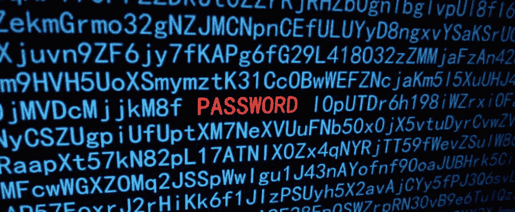
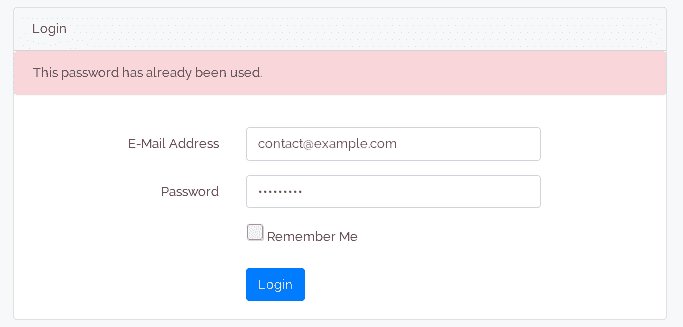

# [PoC]部分随机密码:或者如何使用部分随机密码保护用户密码不被键盘记录器窃取

> 原文：<https://dev.to/djug/poc-partially-random-passwords-or-how-to-protect-users-passwords-from-keyloggers-with-partially-random-passwords-4cpe>

当我们登录到一些在线帐户时，尤其是在公共计算机上，或者在我们不拥有的任何计算机上，我们都面临的一个问题是，我们的密码总是有被盗的风险，尤其是使用键盘记录器。如果黑客得到了你密码的“副本”，她就可以登录你的账户，为所欲为。

[](https://res.cloudinary.com/practicaldev/image/fetch/s--33wl8RE7--/c_limit%2Cf_auto%2Cfl_progressive%2Cq_auto%2Cw_880/https://thepracticaldev.s3.amazonaws.com/i/6p0ehei17eqaupnv4k7g.jpg) 
一如既往，使用双因素认证可以缓解这个问题，因为黑客也需要访问您的手机。但是，如果使用 2FA 不是一个选项，即使在这种情况下，我们也想保护用户，那么当黑客试图登录时，我们能否检测到不是真正的用户，而是试图登录的人窃取了她的密码？

## 部分随机密码

这个问题的一个解决方案是使用部分随机密码，其中随机部分每次都不相同。我的意思是这样的:
假设我的密码是 123456789，但当我尝试登录时，我不会直接使用这个密码，而是会在开头或结尾(甚至在中间)添加一些随机字符串，就像这样:
**564564** 123456789

当我们收到这个密码(让我们称之为“原始密码”)时，我们将去掉随机部分，并将剩余部分用作密码，并将这个原始密码的散列版本保存在 used_passwords 表中。下次同一个用户试图登录时，我们会检查这个原始密码(真实密码+随机部分)以前是否被使用过，如果找到，我们会拒绝访问该帐户。
代码将如下所示:

```
public function postLogin(Request $request)
    {
        $data = $request->all();
        $email = $data['email'];
        $rawPassword = $data['password'];
        $user = User::where('email', $email)->first();
        $password = $this->getRealPassword($rawPassword, $user);
        if (Auth::attempt(['email' => $email, 'password' => $password])) {
            if (! $this->usedBefore($user->id, $rawPassword)) {
                $this->saveRawPassword($user->id, $rawPassword);
                return redirect('/home');
            } else {
                Auth::logout();
                return redirect()->route('login')->with('authentication-issue', true)->with('used-password', true);
            }
        } else {
            return redirect()->route('login')->with('authentication-issue', true);
        }
    } 
```

Enter fullscreen mode Exit fullscreen mode

[T2】](https://res.cloudinary.com/practicaldev/image/fetch/s--UTXrsUpm--/c_limit%2Cf_auto%2Cfl_progressive%2Cq_auto%2Cw_880/https://thepracticaldev.s3.amazonaws.com/i/8726l3lsesln8qjxmz9u.png)

## 如果黑客确切知道密码的哪一部分是随机的怎么办？

这是一个合理的担忧，如果我们的黑客知道某个实施部分随机密码技术的特定网站每次都会删除前 6 个字符，她也会这样做并登录受害者的帐户。

这个问题的解决方案是允许用户自己选择随机部分的长度及其在密码中的位置，并且每次我们试图验证某个用户时，我们将使用她自己的“规则”(即随机部分的位置和长度因用户而异)。

我们甚至可以在同一个密码中添加多个随机部分，这使得从任何捕获的密码中提取真实密码变得更加困难。

我们甚至可以将部分随机密码的概念与我在上一篇文章中描述的基于密码的角色和动作的概念结合起来，如果密码被第二次使用，通过触发一些特定的动作来为帐户增加另一层安全性。

[https://github.com/djug/partially-random-passwords](https://github.com/djug/partially-random-passwords)