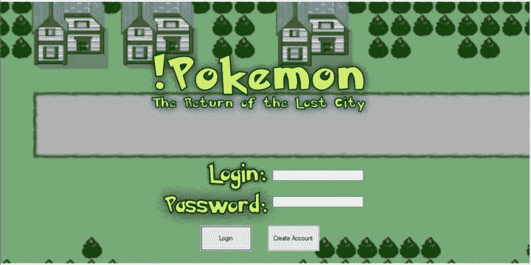
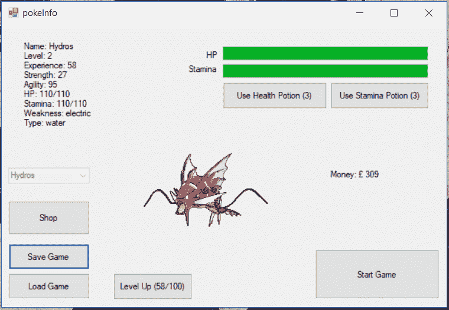
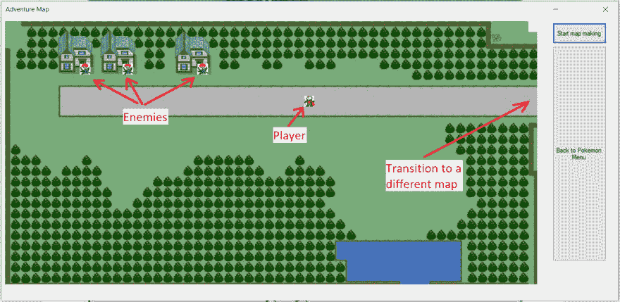
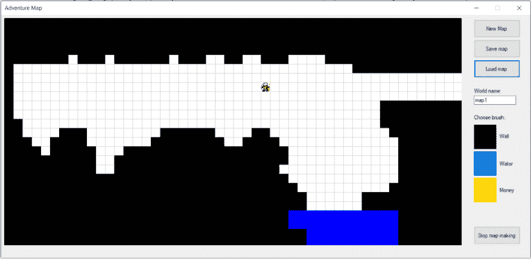
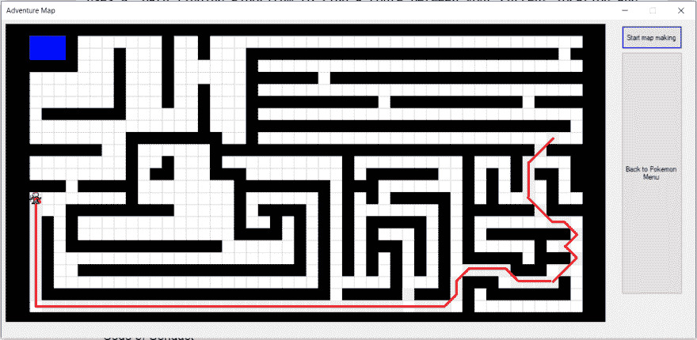

# ！神奇宝贝还是(不是神奇宝贝)

> 原文：<https://dev.to/jansonsa/pokmon-or-not-pokmon-5dn6>

###### 不是神奇宝贝(双关语)

一个托管的 C++ Windows 窗体游戏，作为我的大学项目。

通过在 2018 年计算、电子和数学展示新向导中展示这款游戏，我也想把它放在这里。

在 8 周的时间里，我们不得不用 c++制作一个游戏，同时开始从头开始学习 c++。

让我惊讶的是，我做了很多研究来制作这个游戏，在大学里，每周我们都会引入一个新的主题，我已经在游戏中实现了相同的概念。从指向类、结构的指针和引用以及如何将它们放入一个集合开始。

我担任项目负责人，领导一个 5 人小组。我们从神奇宝贝游戏中获得了灵感，但有趣的是，我们中没有人玩过真正的神奇宝贝游戏，我们只是对其机制的工作原理有一个简单的了解。

尽管如此，我确实有一个很棒的团队:

*   第一个负责登录/注册系统；
*   *第二个做了一个 SQL 数据库；*
*   第三个制作图像和声音，让游戏变得生动；
*   *第四个实行店铺制；*
*   当我为每一个物体，一个战斗系统，一个寻路算法，一张地图和一个地图创建者创建类的时候。

[T2】](https://res.cloudinary.com/practicaldev/image/fetch/s--SvAx-vFD--/c_limit%2Cf_auto%2Cfl_progressive%2Cq_auto%2Cw_880/https://thepracticaldev.s3.amazonaws.com/i/il2cicc1t4yt2fp40axi.PNG)

登录后，你会看到一个信息屏幕，让你选择一个神奇宝贝等等...如果你已经做到这一步，这意味着你可以阅读，我不需要列出所有的按钮。

[T2】](https://res.cloudinary.com/practicaldev/image/fetch/s--lWVIL9pb--/c_limit%2Cf_auto%2Cfl_progressive%2Cq_auto%2Cw_880/https://thepracticaldev.s3.amazonaws.com/i/h47cgjw29a8g0wy0qygz.PNG)

在*【开始游戏】*之后是下一个大的步骤。你会看到一个地图对话框，里面有一个玩家角色，一些敌人和障碍物，比如树。因为我们想实现一些很酷的算法，所以我们选择在屏幕上双击鼠标，而不仅仅是用箭头键来移动。然后，它使用 A*路径查找算法来查找您当前位置和点击位置之间的路线，避开路上的障碍物。

[T2】](https://res.cloudinary.com/practicaldev/image/fetch/s--laMCrfKN--/c_limit%2Cf_auto%2Cfl_progressive%2Cq_auto%2Cw_880/https://thepracticaldev.s3.amazonaws.com/i/olpwx9xoa9at6hu6wrr3.png)

在图片覆盖的下面，画有允许越过障碍物的边界。我们用一个 *Shift* 键切换图片，看看奇迹发生了。

[T2】](https://res.cloudinary.com/practicaldev/image/fetch/s--lJ8n-b2o--/c_limit%2Cf_auto%2Cfl_progressive%2Cq_auto%2Cw_880/https://thepracticaldev.s3.amazonaws.com/i/gjt0ggac0fi1jcl7p5fi.PNG)

我做了一个绘图系统，我在这里说的是这个系统。所以你可以选择画笔，按住鼠标左键进行绘制，或者用鼠标右键进行擦除。然后，通过指定一个唯一的名称将地图保存在本地，并将其转换为一个*。txt* 文件，包含每个彩色块及其颜色。效率不高，但是很好理解。

这是 A*算法如何工作的简单演示。它能相当快地找到足够好的路线，这正是我们在游戏中需要的。

[T2】](https://res.cloudinary.com/practicaldev/image/fetch/s--r18g5UJi--/c_limit%2Cf_auto%2Cfl_progressive%2Cq_auto%2Cw_880/https://thepracticaldev.s3.amazonaws.com/i/5t0o6cjblypt3g990xl9.png)

点击这里查看更多关于 A*实现的信息。

总之，通过制作游戏来学习一门新语言是一次有趣的经历。作为一名游戏玩家，我发现在做自己喜欢的事情时很容易学习，并且我使用 Visual Studio 完善了我的技能，大量使用了 *Peek 函数*或*带断点的 Debug* 。更不用说我作为项目经理学到的东西，以及跟踪项目的当前状态和分配任务意味着什么，同时还要制作文档。

[下载](https://github.coventry.ac.uk/jansonsa/D1/raw/master/NotPokemon.zip)游戏并亲自试用或查看 GitHub 资源库【https://github.coventry.ac.uk/jansonsa/D1 T2】