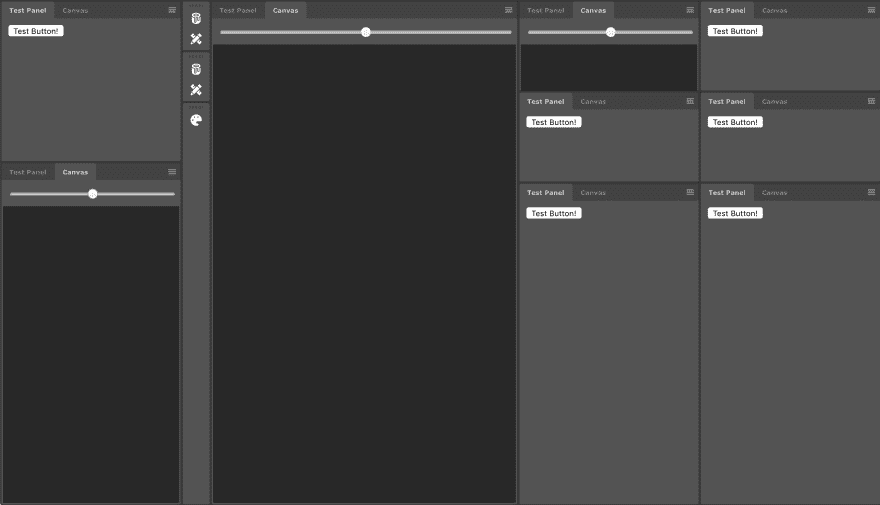

# 将 React 组件工具包移植到 Go

> 原文：<https://dev.to/progrium/porting-a-react-component-kit-to-go-4pdf>

不久前，我的朋友 Dan 向我展示了一个类似 Photoshop 的可停靠窗格系统的原型实现，它是作为 React 组件构建的，带有 smokey pro 主题。它仍然缺少拖放和浮动窗口，但这是一个很好的开始，看起来很酷。

[T2】](https://res.cloudinary.com/practicaldev/image/fetch/s--Wedv7SZZ--/c_limit%2Cf_auto%2Cfl_progressive%2Cq_auto%2Cw_880/https://thepracticaldev.s3.amazonaws.com/i/zzp5is2sqprgjmf5bssv.png)

我觉得把它带走会很有趣。它不仅会推动我的原型 UI 框架和我的使用体验的极限，而且我实际上会在我的大项目中使用它，可能还有很多其他项目。

首先，我确保它还能工作，而且丹的项目做得足够好，我可以把它制作成一个演示。然后，我开始了解它是如何工作的，大致了解哪些组件做什么，并试图找出一条路径，将组件“从里到外”移植，因为最内部的组件可能会更简单一些，可以独立工作。

我从测试按钮和滑块组件开始，它们大部分只是包装输入元素，但迫使我思考如何设计样式。我不确定 React 中的样式目前的艺术水平如何，但是 Dan 做了很多内联样式。我制作了一个简单的函数，将地图转换为 style 属性的适当值。

然后就不那么琐碎了。下一个组件是一个窗口，它可能更像是一个窗格，但是它使用了 WindowTabs，所以我必须同时实现这两个组件。WindowTab 只是根据状态改变样式，并在单击时更新窗口的选中状态。这是很多调试工作进行的地方，但那是后来的事。

随着 WindowTab 的实现，我完成了 Window。除了有一些问题。我修复了一些小错误，但是我的`v-for`指令还不支持多赋值变量。所以我加了这个，比我想象的要简单。但是在 React 版本中，它使用内嵌 JSX 来收集所有的窗口标签。对我来说，这意味着我需要将它们放在接受`v-for`指令的元素中。

因为他们有兄弟姐妹，我不能把它放在父母那里，我必须给他们一个新的父母。这破坏了样式，所以我实现了 React 所谓的“片段”，这是一种无操作元素，可以用来包装由于技术原因需要包装的元素。

所以一切都准备好了，但是 WindowTab 上的所有事件处理程序都没有工作。我以为它们没有被赋值是因为它们没有出现在元素中，但是当然 Vecty 正在用`addEventListener`动态地添加它们。我应该登录看看他们是否先开火，但是好吧。所以他们被分配和解雇，但我没有看到任何变化。

在某种程度上，我记得 Vecty 需要你手动告诉组件重新渲染，但即使这样也不起作用。最后，尽管我之前提到过，但我忘记了我需要将样式键名从 JavaScript camelcase 规范化为虚线小写，就像样式属性实际需要的那样。

嘣，工作。

显然还有更多工作要做，但这是一个有趣的练习，有助于填补我的堆栈的空白，并获得使用它构建真正组件的经验。有他们真的很酷。

[https://www.youtube.com/embed/_ornXEQBghU](https://www.youtube.com/embed/_ornXEQBghU)