# 如何引入 PostgreSQL

> 原文：<https://dev.to/programmingmonky/postgresql-1h6h>

介绍如何在 windows732 位环境中引入 PostgreSQL。

[下载页面](https://www.enterprisedb.com/downloads/postgres-postgresql-downloads)

访问，

[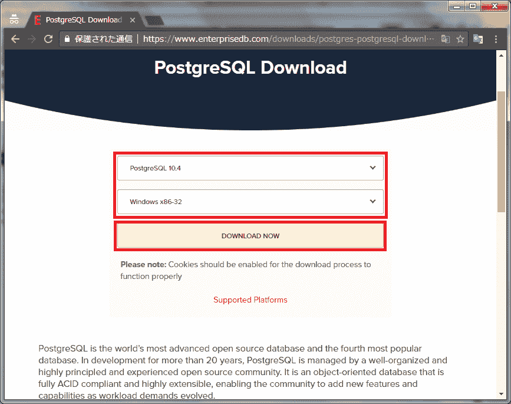T2】](https://res.cloudinary.com/practicaldev/image/fetch/s--fRU_Q0K0--/c_limit%2Cf_auto%2Cfl_progressive%2Cq_auto%2Cw_880/https://thepracticaldev.s3.amazonaws.com/i/ct8ogaw8n0nra454akh0.png)

指定与要下载的电脑操作系统相同类型的操作系统和
PostgreSQL 的版本，然后单击“DOWNLOAD NOW”按钮。

我觉得 PostgreSQL 的版本尽量最好是最新的。

下载完成后运行安装程序。
安装程序名称在笔者的环境中为`postgresql-10.4-1-windows.exe`。

安装程序已启动，请直接按“Next”。

[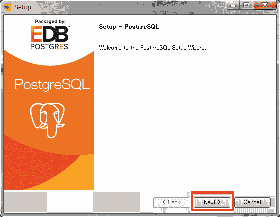T2】](https://res.cloudinary.com/practicaldev/image/fetch/s--9N330Fyd--/c_limit%2Cf_auto%2Cfl_progressive%2Cq_auto%2Cw_880/https://thepracticaldev.s3.amazonaws.com/i/7c19t0yxwkfn1o4kdb40.png)

系统会询问安装位置。

[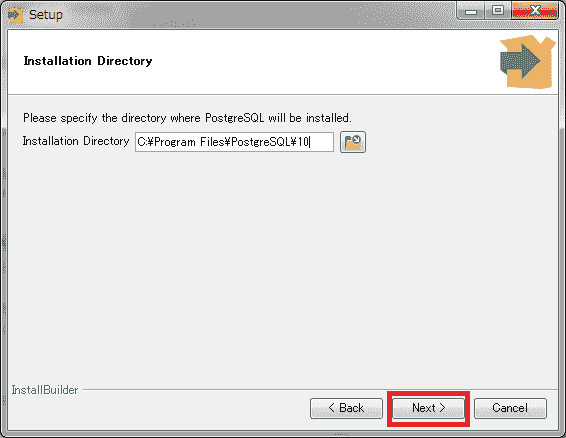T2】](https://res.cloudinary.com/practicaldev/image/fetch/s--JrhCa149--/c_limit%2Cf_auto%2Cfl_progressive%2Cq_auto%2Cw_880/https://thepracticaldev.s3.amazonaws.com/i/72gomwrk8zf0gfjrdy8m.png)

在默认位置没有问题，所以按“next”

有选择下载对象的画面。

[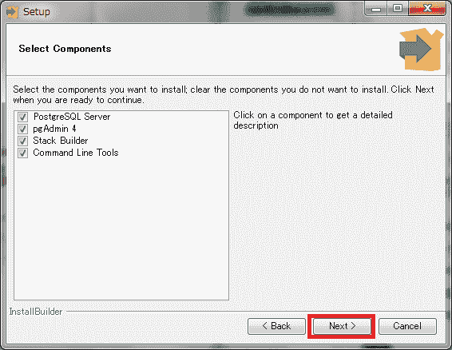T2】](https://res.cloudinary.com/practicaldev/image/fetch/s--PksCVSSx--/c_limit%2Cf_auto%2Cfl_progressive%2Cq_auto%2Cw_880/https://thepracticaldev.s3.amazonaws.com/i/ktqnts72wq1p6405r983.png)

| 工具 | meaning |
| --- | --- |
| PostgreSQL 服务器 | 数据库服务器主体 |
| pgAdmin 4 | 在 GUI 中操作 DB 的工具 |
| 堆栈生成器 | 安装附加功能的工具 |
| 命令行工具 | 从命令行处理数据库的便利工具 |

这次一切都被选中了，所以直接按“next”。

会被询问保存数据的位置

[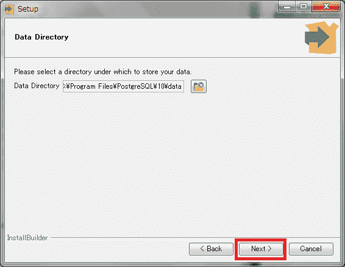T2】](https://res.cloudinary.com/practicaldev/image/fetch/s--NMxc83z0--/c_limit%2Cf_auto%2Cfl_progressive%2Cq_auto%2Cw_880/https://thepracticaldev.s3.amazonaws.com/i/sqy7tev45vqbzzvregwl.png)

没有必要特别改变，所以直接按“next”

在下一个画面中设定管理用户(用户名: postgres )的密码。

[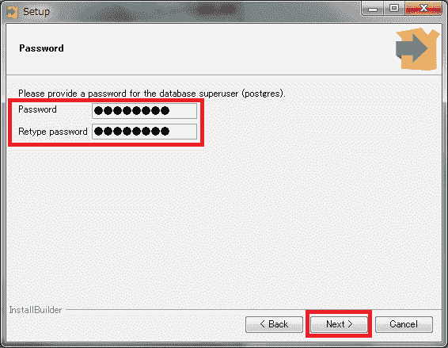T2】](https://res.cloudinary.com/practicaldev/image/fetch/s--tHZNge4F--/c_limit%2Cf_auto%2Cfl_progressive%2Cq_auto%2Cw_880/https://thepracticaldev.s3.amazonaws.com/i/ixraigcyvv7mzrqq9gzn.png)

密码请输入别人不知道的东西，还有不要忘记的东西(重要)。

输入密码后按“Next”。

接着出现了设定 postgresql 端口号的画面。

[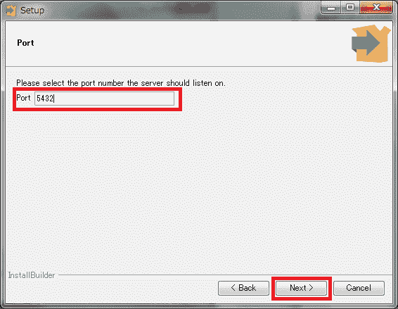T2】](https://res.cloudinary.com/practicaldev/image/fetch/s--FqlltdtG--/c_limit%2Cf_auto%2Cfl_progressive%2Cq_auto%2Cw_880/https://thepracticaldev.s3.amazonaws.com/i/e0jvn05mrtkcoovjzfhl.png)

我认为默认端口号没有问题，但是已经使用此端口的人请将
端口号适当改为 1024~65536 的范围内的值。

然后设置创建 database cluster (现在不需要知道)时的区域设置。

[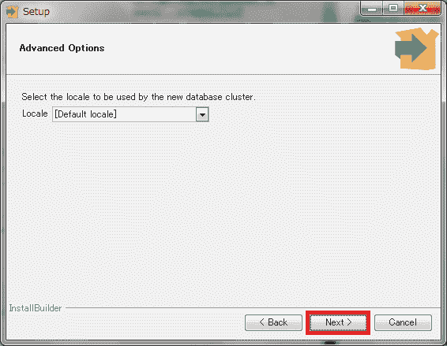T2】](https://res.cloudinary.com/practicaldev/image/fetch/s--GFHskZo2--/c_limit%2Cf_auto%2Cfl_progressive%2Cq_auto%2Cw_880/https://thepracticaldev.s3.amazonaws.com/i/a7jnuwf89gnecv1sx0q1.png)

在正式使用时，可以在创建 database cluster 和 db 时设置语言环境，所以
现在不要烦恼，选择[Default locale]。

可以更新安装内容。

[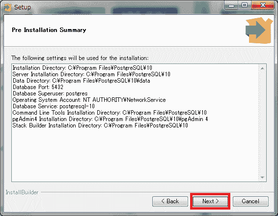T2】](https://res.cloudinary.com/practicaldev/image/fetch/s--2FccZR8r--/c_limit%2Cf_auto%2Cfl_progressive%2Cq_auto%2Cw_880/https://thepracticaldev.s3.amazonaws.com/i/x26skqfsa5vj5bky2814.png)

就这样按“Next”吧

显示安装准备就绪的画面。

[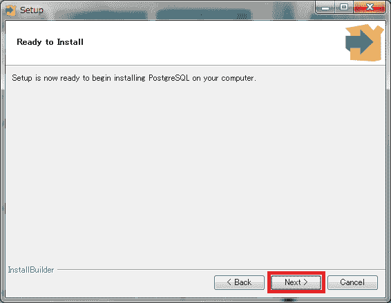T2】](https://res.cloudinary.com/practicaldev/image/fetch/s--yWsiihfM--/c_limit%2Cf_auto%2Cfl_progressive%2Cq_auto%2Cw_880/https://thepracticaldev.s3.amazonaws.com/i/fesmcexazh9o366m43tk.png)

按“Next”按钮，安装开始

PostgreSQL 下载完成。

[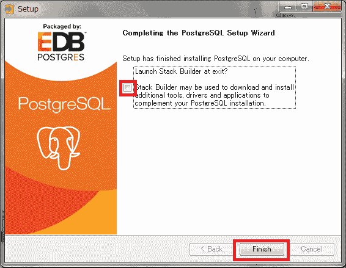T2】](https://res.cloudinary.com/practicaldev/image/fetch/s--84TIzg8M--/c_limit%2Cf_auto%2Cfl_progressive%2Cq_auto%2Cw_880/https://thepracticaldev.s3.amazonaws.com/i/wbicbf4ny8giwrwq4uru.png)

虽然会被催促使用 step builder 进行追加安装，但是
因为现在不需要，所以取消选中。

请按“finish”退出安装程序。

# PostgreSQL 的初始启动

```
cd C:\Program Files\PostgreSQL\10\bin
psql -U postgres 
```

Enter fullscreen mode Exit fullscreen mode

> note :环境变量的设定说明这次很费时间，所以不进行。
> 感兴趣的人调查设定方法，尝试在环境变量中添加
> c:\ program files\PostgreSQL\10\bin。

敲入 psql 的命令，就会询问密码。
在此输入安装时设定的密码。

输入后的控制台如下所示。

```
C:\Program Files\PostgreSQL\10\bin>psql -U postgres
ユーザー postgres のパスワード:
psql (10.4)
"help" でヘルプを表示します。

postgres=# 
```

Enter fullscreen mode Exit fullscreen mode

登录成功了。

连安装的 PostgreSQL 及其登录都可以确认。

因为投稿太长了，所以暂时剪掉报道。
下次介绍从数据库制作到 SQL 执行验证。