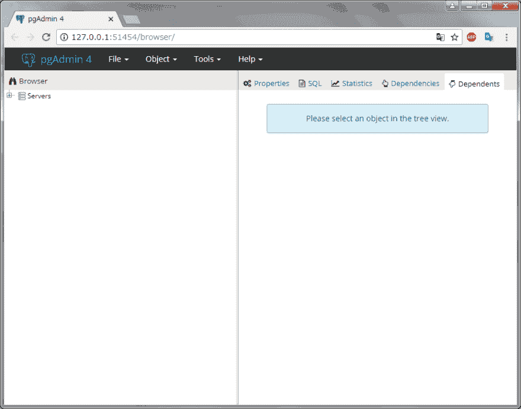
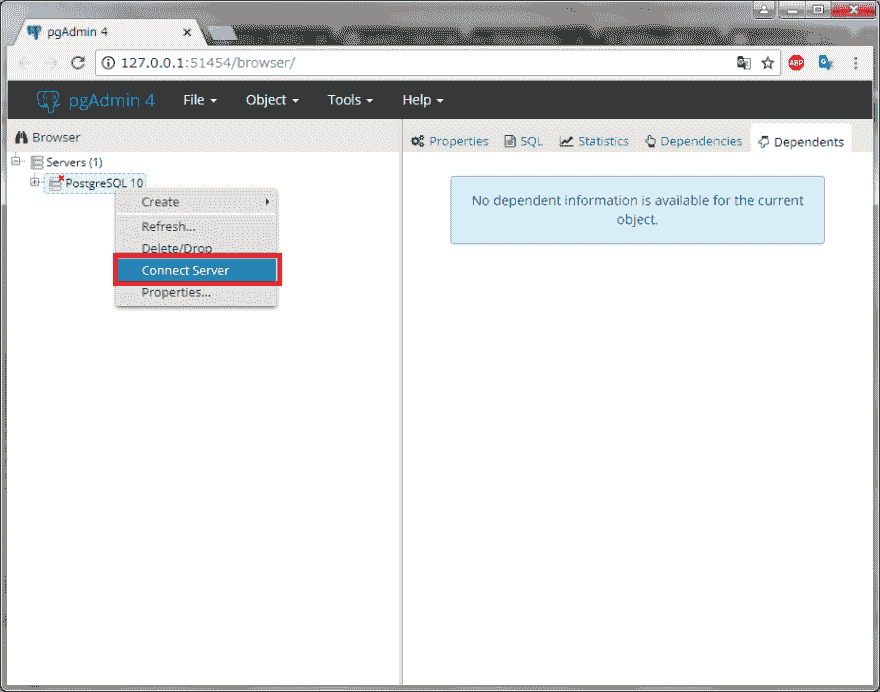
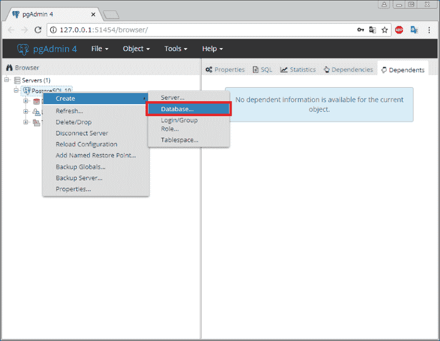
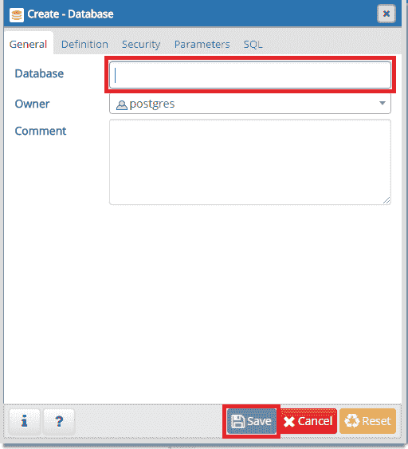
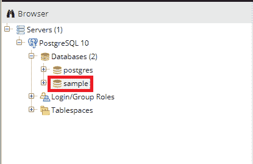
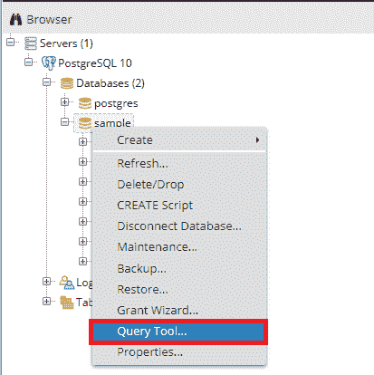
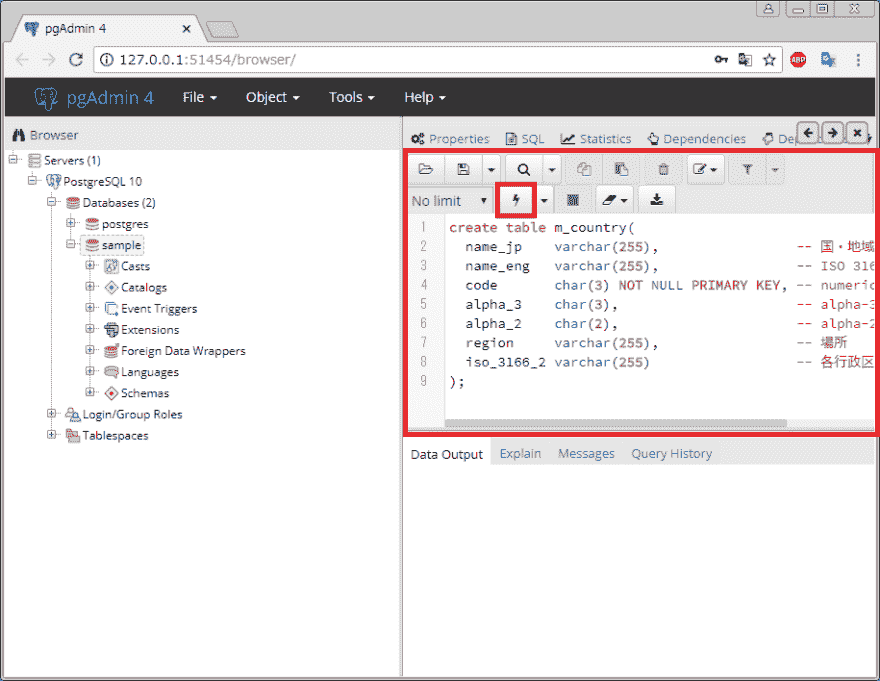
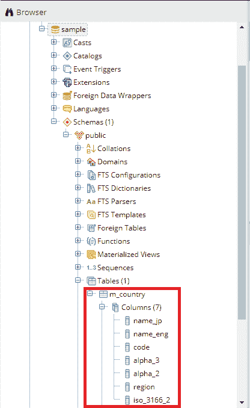
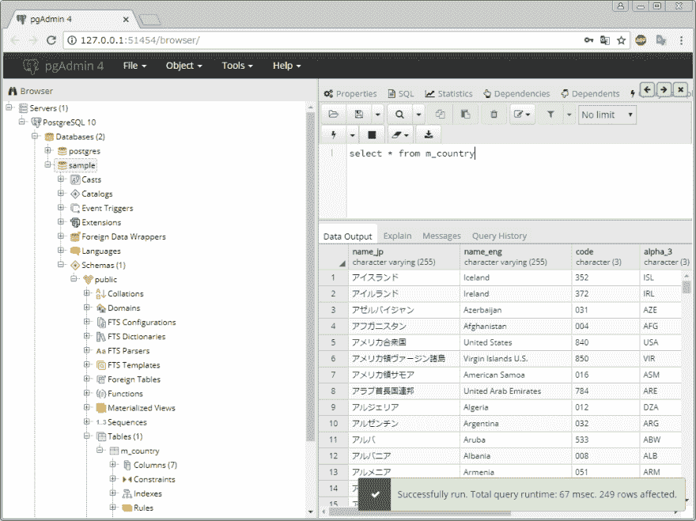

# 在 PostgreSQL 中执行 SQL 之前的教程

> 原文：<https://dev.to/programmingmonky/postgresqlsql-3dja>

本帖子访问 PostgreSQL，、

*   创建数据库
*   创建表
*   数据的投入
*   执行 SQL

的双曲正切值。

还没有 PostgreSQL 的人请参阅以下文章

[引入 PostgreSQL 的方法](https://dev.to/programmingmonky/postgresql-1h6h) 

请参考在 Windows 上引入 PostgreSQL。

# pgadmin 起動

本论文在 PostgreSQL 的客户中使用了 GUI 工具 pgadmin

请通过开始菜单等输入 pgadmin 等启动 pgadmin。

[T2】](https://res.cloudinary.com/practicaldev/image/fetch/s--h8hytAZQ--/c_limit%2Cf_auto%2Cfl_progressive%2Cq_auto%2Cw_880/https://thepracticaldev.s3.amazonaws.com/i/g3fhcxvs0ra7t7rx8hzn.png)

# 服务器连接

从一开始就连接到默认存在的服务器。

右键单击 Server > PostgreSQL 10，然后按“连接服务器”。

[T2】](https://res.cloudinary.com/practicaldev/image/fetch/s--pIviDmT---/c_limit%2Cf_auto%2Cfl_progressive%2Cq_auto%2Cw_880/https://thepracticaldev.s3.amazonaws.com/i/zpgwfc404gx3bdf299da.png)

然后会出现输入密码的画面，请输入
安装时设定的密码。

[https://thepractical dev . S3 . Amazon AWS . com/I/ropad w7 o 5064 hvgcgo0k . png](https://thepracticaldev.s3.amazonaws.com/i/ropadw7o5064hvgcgo0k.png)

输入密码后请按“确定”

无法连接到服务器。

# 创建数据库

右键单击浏览器中显示的服务器的" PostgreSQL 10 "

创建>数据库...

，然后单击。

[T2】](https://res.cloudinary.com/practicaldev/image/fetch/s--QgN88HK5--/c_limit%2Cf_auto%2Cfl_progressive%2Cq_auto%2Cw_880/https://thepracticaldev.s3.amazonaws.com/i/yen0q4unrj5w379pwb7x.png)

然后就会出现制作数据库的画面

[T2】](https://res.cloudinary.com/practicaldev/image/fetch/s--HK5bJDit--/c_limit%2Cf_auto%2Cfl_progressive%2Cq_auto%2Cw_880/https://thepracticaldev.s3.amazonaws.com/i/bvjc0jmuf27hq09x10fk.png)

请在 database 栏中输入数据库名称。
这次设为 sample。

输入完成后，单击“保存”

已创建名为 sample 的数据库。
可以用浏览器确认。
[](https://res.cloudinary.com/practicaldev/image/fetch/s--2k9EZk9d--/c_limit%2Cf_auto%2Cfl_progressive%2Cq_auto%2Cw_880/https://thepracticaldev.s3.amazonaws.com/i/ywjotx7yuajgamd02oax.png)

# 制作表格

那么就在创建的 sample 数据库中立即创建表。

表是通过 SQL 创建的。
SQL 的发行使用 Query Tools。

请右键单击样例，然后选择“查询工具”。

[T2】](https://res.cloudinary.com/practicaldev/image/fetch/s--XQoUNGFm--/c_limit%2Cf_auto%2Cfl_progressive%2Cq_auto%2Cw_880/https://thepracticaldev.s3.amazonaws.com/i/yqysv6r36hoyvttno7gw.png)

请在 Query Tool 窗口中粘贴以下 SQL 并单击运行按钮(雷电标记)。

```
create table m_country(
  name_jp    varchar(255),                 -- 国・地域名
  name_eng   varchar(255),                 -- ISO 3166-1における英語名
  code       char(3) NOT NULL PRIMARY KEY, -- numeric
  alpha_3    char(3),                      -- alpha-3
  alpha_2    char(2),                      -- alpha-2
  region     varchar(255),                 -- 場所
  iso_3166_2 varchar(255)                  -- 各行政区分(ISO 3166-2)
); 
```

Enter fullscreen mode Exit fullscreen mode

[T2】](https://res.cloudinary.com/practicaldev/image/fetch/s--hCYKojBk--/c_limit%2Cf_auto%2Cfl_progressive%2Cq_auto%2Cw_880/https://thepracticaldev.s3.amazonaws.com/i/p3t845ozqfx0fplqou7w.png)

执行查询后会显示
浏览器的

在 sample > Schemas(1) > public > Tables(1)下面应该出现用
SQL 创建的 m_country。

[T2】](https://res.cloudinary.com/practicaldev/image/fetch/s--2fsWjIsz--/c_limit%2Cf_auto%2Cfl_progressive%2Cq_auto%2Cw_880/https://thepracticaldev.s3.amazonaws.com/i/eyrhpa1oy6uhguejmww2.png)

## 数据投入

那么把数据输入到创建的 m_country 表中。

使用查询工具执行以下 SQL :

[https://github . com/programming monky/sample _ SQL/blob/master/country _ insert . SQL](https://github.com/programmingMonky/sample_SQL/blob/master/country_insert.sql)

*   因为 SQL 太大，所以放在了 github 的存储库中。
*   这个数据的出处是日语版的[维基百科](https://ja.wikipedia.org/wiki/ISO_3166-1)。

# 试着实行一下 SQL

再次进入 Query Tool，确认一下表的内容吧

```
select * from m_country 
```

Enter fullscreen mode Exit fullscreen mode

我想可以确认用 insert 输入的数据。

[T2】](https://res.cloudinary.com/practicaldev/image/fetch/s--qX3in6n_--/c_limit%2Cf_auto%2Cfl_progressive%2Cq_auto%2Cw_880/https://thepracticaldev.s3.amazonaws.com/i/5qhvxkxps3a199zdxy9c.png)

那么就用 SQL 玩一下吧。
在 Query Tool 中输入以下查询

```
select code,name_jp,region,
count('1') over(partition by region) as num

from m_country
order by num 
```

Enter fullscreen mode Exit fullscreen mode

查询内容为
按地区分类，按照属于较少地区的国家顺序显示。 就是这样。

※因为使用了分析函数这一较难的语法，所以 SQL 初学者不需要理解。

| 密码 | 姓名 _jp | 地区 | 数字 |
| --- | --- | --- | --- |
| Six hundred and forty-three | 俄罗斯联邦 | 俄罗斯 | one |
| 010 | South Pole | South Pole | Two |
| Four hundred and seventy | 马耳他 | Mediterranean region | Two |
| One hundred and ninety-six | 塞浦路斯 | Mediterranean region | Two |
| 074 | 布贝岛 | South Pole | Two |
| Six hundred and sixty-six | 圣皮埃尔和密克隆岛 | 北美洲 | three |
| Eight hundred and forty | 美利坚合众国 | 北美洲 | three |
| One hundred and twenty-four | 加拿大 | 北美洲 | three |

我发现南极也有乡村代码在挥动，这一点很有趣。

像这样按照本投稿中登载的步骤，可以在 PostgreSQL 上制作
数据库和表，并可以用
SQL 处理数据了。

希望能作为大家制作 web APP 展的参考。