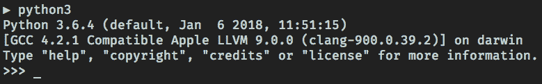
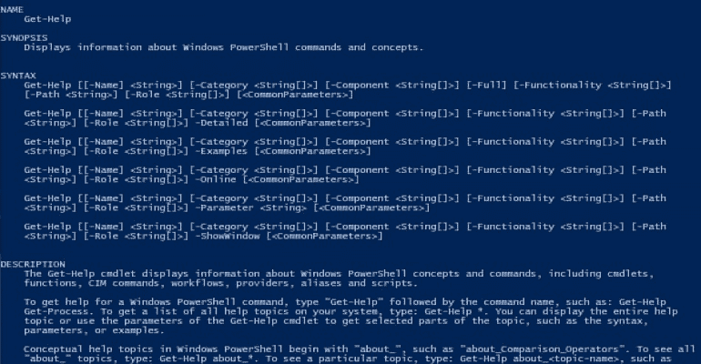
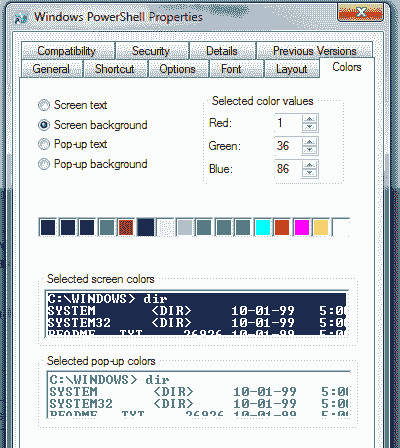

# PowerShell 教程(特别针对讨厌 PowerShell 的人)

> 原文：<https://dev.to/rpalo/powershell-tutorial-especially-for-people-who-hate-powershell-2g25>

## 前言

这是一篇长文。我在这里为不耐烦的人放了一个目录，所以你能找到你正在寻找的特定部分。

1.  【PowerShell 入门
2.  [一些有用的入门命令](#some-useful-commands-to-get-started)
3.  告诉我怎么做这件事！
4.  [学会爱上 PowerShell](#learning-to-love-powershell)

* * *

我和终端的关系——尤其是 Windows PowerShell——有点像过山车。

第一次发现终端是在听说 Python 的时候，对什么都不懂。和一般人用电脑做游戏和 Excel、PowerPoint 之类的应用一样，我去了 [Python 网站](https://www.python.org/)，下载了安装程序，安装好，点击图标。想象一下当这样的事情出现时我有多害怕:

[T2】](https://res.cloudinary.com/practicaldev/image/fetch/s--lZApZ0GM--/c_limit%2Cf_auto%2Cfl_progressive%2Cq_auto%2Cw_880/https://assertnotmagic.com/img/python-repl.png)

按钮在哪里？老式字体是怎么回事？我用我的鼠标做什么？

在开始编程越来越多，了解了终端之后，我开始热爱 Bash。是古风吗？是的。这些命令是否不直观且难以记忆？见鬼，是的。出于某种原因，这只是让我更爱它。

我不得不努力工作，输入一堆看似天书却有强大效果的东西让我觉得自己像个巫师。例如，输入`du -sk * | sort -n | tail`(参见？天书！)是查看当前目录中最大目录的一种非常快速的方法。

随着我了解得越来越多，我能够定制它的外观，并获得字体、颜色和提示，使终端更具吸引力。

所以我决定利用我新发现的编程能力去工作。除了我是一名机械工程师，这通常意味着 SolidWorks 和 Windows。于是我打开了推荐的终端，PowerShell。让我震惊的是:

[T2】](https://res.cloudinary.com/practicaldev/image/fetch/s--ruQ6SfIr--/c_limit%2Cf_auto%2Cfl_progressive%2Cq_auto%2Cw_880/https://assertnotmagic.com/img/powershell-1.png)

没问题，我想。我只需转到首选项屏幕。

[T2】](https://res.cloudinary.com/practicaldev/image/fetch/s--skGJFHOk--/c_limit%2Cf_auto%2Cfl_progressive%2Cq_auto%2Cw_880/https://assertnotmagic.com/img/powershell-customize.png)

哦，不。我们已经不在堪萨斯了。不完全是我所习惯的。于是我就进了 PowerShell，尝试做一些简单的事情。有些东西工作得很好！`ls`、`cd`和`mkdir`都像我习惯的那样工作。但是我不明白为什么设置`$PATH`这么难。这些反弹是怎么回事？我怎么就不能`sudo`？

越来越多的小烦恼不断提醒我没有使用 Bash。我放弃了，安装了 [Cygwin](https://www.cygwin.com/) ，这让我在我的 Windows 7 电脑上有了 Bash 体验。除了不引用。我试图在我的 Windows 机器上运行 Bash 的一切都只是...不太对。

最后，我尝试了另一种方法，并开始以正确的方式学习 PowerShell，从一开始，作为另一种语言。随着我的了解，我发现自己完全接受了 PowerShell 的理念，并注意到一些比我使用 Bash 时更好的东西。请记住，像所有东西一样，PowerShell 只是工具箱中的另一个工具，它是否是最好的工具真的取决于具体情况。

我不会给你一堂完整的 PowerShell 语言基础课。我也不会花太多时间告诉你如何安装它。[这套文档](https://github.com/PowerShell/PowerShell/tree/master/docs/learning-powershell)还算全面，也是后面参考的好小抄。

我在这里的目标是向您展示如何从其他 Shell 翻译东西，并让您开始自己的 PowerShell 之旅，所以我假设您至少对 Bash 这样的 shell 语言有一点点经验。

## PowerShell 入门

当你开始学习 PowerShell 时，你需要做的事情与 Bash-like shell 的方式有所不同。如果当你看到这些差异时，你能克服最初的本能反应，你可能会开始发现它们实际上让你更有效率。

### 一切都是物体

这大概是你要想通的最大的区别。在 Unix shells 中，所有内容都是纯文本。这让事情变得很好，因为你可以期望文本输入到你所有的脚本中，并且你知道如果你输出文本，一切可能都没问题。

然而，缺点是这使得检查特定数据成为文本解析的噩梦，并且使得处理除文本之外的任何东西(浮点数，有人知道吗？)真痛苦。

在 PowerShell 中，它实际上是建立在[之上的。NET](https://en.wikipedia.org/wiki/.NET_Framework) ，一切都是对象。如果您来自 Python、Ruby、JavaScript 或类似的语言背景，这会让您感到非常欣慰。让我们看一些例子，并得到我们的手脏。打开你的 PowerShell 解释器。

> 补充说明:我在每个命令前面放了一个 PowerShell 提示符(`PS>`)，这样您就可以知道输出的是什么。以`PS>`开头的每一行都是你需要输入的内容。其他都是输出。

```
PS>  Get-Process 
```

Enter fullscreen mode Exit fullscreen mode

您应该会看到一个相当长的文本字符串。我们不需要忍受这些！我们是终极一族。我们的血管里流淌着代码！试试这个:

```
PS>  Get-Process  |  Sort-Object  CPU  -descending  |  Select-Object  -first  10 
```

Enter fullscreen mode Exit fullscreen mode

现在您应该会看到一个较短的列表，按照 CPU 时间反向排序。如果您已经因为所有这些命令和选项太长而感到不舒服，我将在几个小节中解决这个问题。和我在一起。

这里需要注意的重要事情是每一列顶部的标题。这个表的每一行实际上都是一个`System.Diagnostics.Process` *对象*，而不仅仅是一个表的一行。不相信我？只是检查！

```
PS>  (Get-Process)[0]  |  Get-TypeData 
```

Enter fullscreen mode Exit fullscreen mode

看到了吗？`Get-Process`命令返回了一个`Process`对象的列表，我们能够通过索引选择第一个对象(不需要将输出拆分为\n！)并通过`Get-TypeData`命令进行洗牌。这些物品作为物体给了我们一些力量。如果我们只想要他们的`ProcessName`呢？

```
PS>  Get-Process  |  Sort-Object  CPU  -descending  |  Select  Object  ProcessName  -first  10 
```

Enter fullscreen mode Exit fullscreen mode

看到它有多容易进入了吗？我们不必剪切由制表符或冒号分隔的字段，也不必计算我们需要哪个字段(1...2...3...四...5!).我们只是告诉它我们需要`ProcessName`属性。不再需要解析、拆分、连接、格式化输出等。

### 对象有类型

另一个副作用是。NET 和让所有东西都成为对象是因为所有东西都必须有一个类型。对于只有字符串和可能被解释为命令的字符串的 Bash shell 来说，这可能会令人困惑。这就是它为我们做的。

```
PS>  2  +  2  4 
```

Enter fullscreen mode Exit fullscreen mode

啊！你惊讶吗？这在 Bash 中需要做更多的工作！甚至不要让我开始:

```
PS>  4.2  /  3  1.4 
```

Enter fullscreen mode Exit fullscreen mode

PowerShell 通常做得很好，试图找出您所指的类型，这样您就可以感觉像使用其他 Shell 和脚本语言一样动态，而不必严格地在每件事情上都有类型。但是，如果您真的想要强制一个类型，您可以通过在方括号中预先加上对象的类型来实现。

```
PS>  "2"  +  2  22  # A string  PS>  [Int]"2"  +  2  4  # An integer.  The conversion only applies to the "2" 
```

Enter fullscreen mode Exit fullscreen mode

### 可预测的命令结构

这是我开始使用 PowerShell 时注意到的第一件事。我在 StackOverflow 上查看示例命令，我一直对 PowerShell 命令与 Bash 命令相比有多长感到恼火。例如，在 Bash 中列出当前目录的内容:

```
$ ls -l 
```

Enter fullscreen mode Exit fullscreen mode

在 Powershell 中:

```
PS>  Get-ChildItem 
```

Enter fullscreen mode Exit fullscreen mode

好长啊！大写字母呢？走吧。好消息是，如果你不想的话，你不必把整个东西都打出来。但是，在我开始之前，让我解释一下背后的基本原理。

### 为什么这么久？

PowerShell 的创建者希望命令非常直观，这样您几乎可以猜出您需要的命令。这对于 Bash 来说基本上是不可能的。你不可能猜到`cat`是向终端读取文件的常用命令。一旦你学会了它，它是“连接”的缩写是有意义的，但它本身不是直观的。

PowerShell 命令是按照一个简单的模式设计的:“动词-名词”PowerShell 的创建者试图将动词的数量保持在最小。你会看到的常见的有`Get, New, Add, Clear, Export, Remove, Set, Update, and Write`。名词通常也很直观:`Process, Item, Object, Date, Job, and Command`是几个。

这种一致的模式允许人们查看包含他们从未使用过的命令的脚本，并且仍然对该脚本正在做的事情有所了解。

保持一致模式的另一个好处是 PowerShell 可以检测命令的“动词”和“名词”部分。例如，您是否希望看到所有带有动词“New”的命令

```
PS>  Get-Command  -verb  New 
```

Enter fullscreen mode Exit fullscreen mode

事实上，如果你知道你想做什么，但是你不记得命令，Get-Command 是少数几个会成为你朋友的命令之一。如果您想知道您可以对“作业”对象做什么样的事情呢？

```
PS>  Get-Command  -noun  Job 
```

Enter fullscreen mode Exit fullscreen mode

是的，这些命令比它们的对等命令(通常是简洁的 Bash 命令)更长，但是伴随着这种额外的冗长而来的是易用性、更少的命令记忆和有助于保持生产力的工具。

#### 化名让你生活轻松

尽管命令又长又冗长，PowerShell 知道使用终端的人很懒(从好的方面来说！)，它也不想妨碍你。它有大量的内置别名，让你的生活更轻松，让你感觉更舒适，它实际上可以在飞行中做一些别名。

还记得我们之前运行的查看目录中所有文件的命令吗？

```
PS>  Get-ChildItem  # You can also do:  PS>  gci  PS>  dir  # And just to make you feel a little bit more at home...  PS>  ls 
```

Enter fullscreen mode Exit fullscreen mode

想要查看所有可用的别名吗？至此，您不应该对这个命令感到惊讶:

```
PS>  Get-Alias 
```

Enter fullscreen mode Exit fullscreen mode

在 shell 会话期间使用这些别名可以保持您的工作效率，并避免您的手指磨损，而不会放弃它们所代表的较长命令的功能和可读性。

#### 脚本的最佳实践

关于最佳实践，我只想说一句:当您独自进行命令行工作时，可以随意使用任意多个别名。化名吧。提高您的工作效率。

然而，如果你正在写一个脚本或者与别人共享代码，最好把整个命令和整个标志名都打出来。相信我，你未来的自己和同事会感谢你的。

## 一些开始使用的有用命令

虽然学习 PowerShell 的最好方法是深入实践，但我将在这里与您分享一些命令，当您遇到困难时，这些命令会非常有用。

### 当你不确定使用哪个命令时

```
PS>  Get-Command 
```

Enter fullscreen mode Exit fullscreen mode

此命令将为您提供有关可用命令的更多信息。您可以通过指定-动词或-名词参数来关注您想要的。为了获得关于一个或两个特定命令的更多信息，将输出通过管道传输到`Format-List`。这将为您提供选项、位置和其他一些有用的功能。

```
PS>  Get-Command  Get-Alias  |  Format-List 
```

Enter fullscreen mode Exit fullscreen mode

### 当你不确定一个命令做什么的时候

```
PS>  Get-Help  command  # You can also get help by adding the ? parameter  PS>  command  -? 
```

Enter fullscreen mode Exit fullscreen mode

`Get-Help`大致就是 PowerShell 世界的`man`。你开始看到直观命令的好处了吗？实际上，`Get-Help`也有不少有用的旗帜。使用我们上面讨论的方法来查看它们可能是个好主意:

```
PS>  Get-Command  Get-Help  |  Format-List  # Or, if you're feeling cheeky:  PS>  Get-Help  Get-Help 
```

Enter fullscreen mode Exit fullscreen mode

我最喜欢的是，你可以专门问它的用法。

```
PS>  Get-Help  Get-Alias  -examples 
```

Enter fullscreen mode Exit fullscreen mode

### 当你不确定你的对象有什么属性时

```
PS>  Get-Process  |  Get-Member  # Another similar command:  PS>  (Get-Process)[0]  |  Format-List 
```

Enter fullscreen mode Exit fullscreen mode

如果你知道你想要什么数据，但是你只是不知道它叫什么，*或者*如果你甚至不确定什么数据对你是可用的，这些命令将帮助你更好地“看到”你的对象。

### 当你想得到一部分数据时

```
PS>  Get-Process  |  Select-Object  Id,  ProcessName  -last  20 
```

Enter fullscreen mode Exit fullscreen mode

是你的通用材料。您可以指定想要的特定属性以及想要的数量。

### 当你想过滤你的数据时

```
PS>  Get-Process  |  Where-Object  WS  -gt  150MB 
```

Enter fullscreen mode Exit fullscreen mode

有几种方法可以使用`Where-Object`命令，但这是最简单的一种。在上面的例子中，我只选择了工作集(内存使用)大于 150MB 的进程。(还有，能不能稍微喷一下 PowerShell 是怎么做 KB/MB/GB 数学的？)

## 告诉我怎么做这件事！

这最后一节只是为你们当中不耐烦的人准备的一些片段。如果你只是想在 PowerShell 中完成一件该死的事情，但你不能让它工作，这些提示应该会有所帮助。

### 翻译的基本 Unix 命令

```
# pwd  PS>  Get-Location  # or gl or pwd  # ls  PS>  Get-ChildItem  # or gci or dir or ls  # cd  PS>  Set-Location  # or sl or chdir or cd  # cp  PS>  Copy-Item  # or copy or cpi or cp  # mv  PS>  Move-Item  # or move or mi or mv  # cat  PS>  Get-Content  # or gc or type  # mkdir  PS>  New-Item  -ItemType  Directory  # or ni -ItemType Directory or mkdir  # touch  PS>  New-Item  -ItemType  File  # or ni  # rm  PS>  Remove-Item  # or del or erase or ri or rm  # rm -rf  PS>  Remove-Item  -Recurse  -Force  # or rm -recurse -force  # head or tail  PS>  Select-Object  -first  # or -last  # usage: Get-Process | Select-Object -first 10  # find  PS>  Get-ChildItem  -filter  *.rb  -recurse  .  # but, for a slightly easier to read version:  PS>  Get-ChildItem  -filter  *.rb  -recurse  .  |  Select-Object  FullName 
```

Enter fullscreen mode Exit fullscreen mode

### 访问路径(和其他环境变量)

在 PowerShell 中，很多东西都像文件位置一样被处理——环境变量也不例外。这些特殊的类文件变量组称为 PSDrives。同样你可以用`Get-ChildItem C:\Users\ryan\Desktop`询问 C: drive 在“\Users\ryan\desktop”下是什么文件，你可以用`env:`环境 PSDrive 做同样的事情。

```
PS>  Get-ChildItem  env:  # and to get a specific one  PS>  Get-Content  env:PATH 
```

Enter fullscreen mode Exit fullscreen mode

这些 PSDrives 的一个非常好的地方是，你可以像读取变量一样读取文件位置。所以你也可以这样得到一个环境变量:

```
PS>  $env:PATH 
```

Enter fullscreen mode Exit fullscreen mode

第二种方法可能是获取 PATH 变量最流行的方法。

### 自定义您的个人资料

如果您喜欢命令行，并且和我一样，您可能想知道如何定制它们。答案就在`$profile`里。

#### 寻找轮廓

实际上有几个配置文件，这取决于您使用哪个“主机”来与 PowerShell 交互。例如，如果您只是使用常规的 PowerShell 命令行，那么您的配置文件的名称将是 Microsoft。但是，如果您在 PowerShell 集成脚本环境(ISE)中工作，您的配置文件将是 Microsoft。PowerShellISE_profile.ps1 .你可以忽略这一点，因为如果你想知道，只要问:

```
PS>  $profile 
```

Enter fullscreen mode Exit fullscreen mode

但是，还有其他选择。如果您想创建一个适用于 ISE 或常规命令行的概要文件，您将需要`$profile.CurrentUserAllHosts`。或者，如果您想为您电脑上的所有用户配置一个配置文件，您将需要`$profile.AllUsersCurrentHost`。有几个选项，你可以用
看到它们

```
PS>  $profile  |  Get-Member  -type  NoteProperty 
```

Enter fullscreen mode Exit fullscreen mode

#### 创建定制

您的个人资料就像 Bash 中的`.bash_profile`一样工作。它只是在您开始使用 PowerShell 之前运行的一个脚本。您可以添加别名(尽管参见下面的注释)、函数、变量和设置自定义设置。检查您是否已经有个人资料的最简单方法是:

```
PS>  Test-Path  $profile 
```

Enter fullscreen mode Exit fullscreen mode

开始创建您的个人资料:

```
# Use whichever editor you love best  PS>  code  $profile 
```

Enter fullscreen mode Exit fullscreen mode

这里有几个有用的设置，你可能会喜欢:

```
# Microsoft.PowerShell_profile.ps1  # You can customize the window itself by accessing $Host.UI.RawUI  $window  =  $Host.UI.RawUI  $window.WindowTitle  =  "Pa-pa-pa-pa-pa-pa-POWERSHELL"  $window.BackgroundColor  =  "Black"  $window.ForegroundColor  =  "Gray"  # You can define functions (remember to follow the Verb-Noun convention!)  function  Count-History  {  (Get-History  |  Measure-Object).count  }  function  beep  {  echo  `a  }  function  Edit-Profile  {  [CmdletBinding()]  [Alias("ep")]  PARAM()  vim  $profile  }  # You can set aliases.  # NOTE: In PowerShell, you can only alias simple commands.  # Unlike Bash, you can't alias commands with arguments flags.  # If you want to do that, you should define a function instead.  Set-Alias  touch  New-Item  # old habits die hard, amirite?  # You can customize your prompt!  function  prompt  {  # ... see the next section for details  } 
```

Enter fullscreen mode Exit fullscreen mode

### 自定义您的提示

有两种方法可以做到这一点:简单的方法和复杂的方法。

#### 简单提示

定制提示的最简单方法是定义`prompt`函数，手动或在您的配置文件中定义。比如:

```
function  prompt  {  $histCount  =  (Get-History  |  Measure-Object).count  return  "POWERSHELL LEVEL OVER $histCount THOUSAND! >"  } 
```

Enter fullscreen mode Exit fullscreen mode

这是一种有趣的方式来打印您已经在提示符中输入的输入数量。无论返回什么字符串，都会被设置为提示。

#### 复杂的提示

基本上，你可以在你的提示函数中做任何你想做的事情，只要它最后返回一个字符串。例如，这里有一个更复杂的提示。

```
function  prompt  {  $loc  =  (Get-Location).Path.Replace("$HOME",  "~")  $gitBranch  =  git  branch  |  Select-String  "\*"  if  (!$gitBranch)  {  $gitBranch  =  ""  }  else  {  $gitBranch  =  $gitBranch.ToString().Replace("`* ",  "")  }  $hisCount  =  (Get-History  |  Measure-Object).count  WriteHost  -ForegroundColor  yellow  "`n  $loc"  WriteHost  -NoNewLine  "PS [$histCount] $gitBranch ->"  return  " "  } 
```

Enter fullscreen mode Exit fullscreen mode

您可以看到，我通过多次使用`Write-Host`实现了多行提示符。最后，我简单地返回一个空格。我的提示最终是这样的:

```
~/Documents/blog  PS  [102]  master  -> 
```

Enter fullscreen mode Exit fullscreen mode

### 把它弄得不难看

这是一个棘手的问题。就像我上面提到的，在 Windows 上，PowerShell 运行在一个没有太多定制选项的窗口中。尤其是对于那些习惯于随意调节文本编辑器的每个旋钮的人来说，这几乎是痛苦的。不过，有两个很好的选择。

1.  这个是建立在 ConEmu 之上的，ConEmu 是一个非常流行的 Windows 终端模拟器。如果你喜欢 Notepad++，我想你真的会喜欢这个，因为感觉差不多。

2.  对于那些对电子应用没有深仇大恨并且更有前瞻性的人来说，这是一个不错的选择。定制和设置都是在 JavaScript 和 CSS 中完成的，这使得搜索帮助变得非常好。正如 JavaScript 爱好者所期待的那样，有大量的插件，其中一些非常稳定而且非常好。现在 Hyper 上有很多工作要做，所以你可能会有一些稳定性问题，但在过去的几个月里，它真的变得更快了，更顺畅了。

### 查找更多资源

最好的去处肯定是[官文书](https://docs.microsoft.com/en-us/powershell/)。那里有如此多的内容，他们应该有你需要的答案。既然 PowerShell 现在是开源的，你也可以看看他们的 [GitHub 库](https://github.com/PowerShell)。那里也有一些很棒的文档和入门指南。

对于那些喜欢从书本中学习的人，我推荐李·霍尔姆斯的 Windows PowerShell 烹饪书，以及布鲁斯·帕耶特和理查德·西德维的 [Windows PowerShell 操作手册](https://amzn.to/2r5V7Jm)。那两本书里有大量的知识。

## 学会爱上 PowerShell

这篇文章的目的是要表明，仅仅因为 PowerShell 与您所习惯的不同，它就不一定是坏的。

如果你真的花时间去挖掘差异，学习它们背后的推理和设计决策，你会开始看到它们的优势和价值。当您回到其他 shells 时，实际上可能会错过在命令行中处理类型化的对象。

不得不解析文本流可能开始感觉过时了。您可能会发现自己在任何地方都使用更长、更一致的函数名，因为您意识到在编写脚本六个月后能够阅读和理解它们是多么美好的事情。

或者，当人们提到 PowerShell 时，你可以停止告诉他们你有多讨厌它。

* * *

*原贴于[简单程序员](https://simpleprogrammer.com/powershell-tutorial/)T3】*