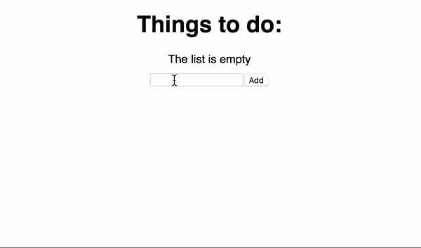

# Redux 和 Sagas 的实例

> 原文：<https://dev.to/simme/practical-examples-of-redux-and-sagas-2ln>

在这一部分中，我们将使用 redux 设置一个 react 应用程序，并通过一些简单的操作使其工作。因为我是 typescript 及其卓越可读性的大力拥护者；我们将继续使用它。

## 创建应用程序

因此，让我们从使用 typescript 模板创建一个 react 应用程序开始。如果您还没有 create-react-app cli，请开始安装:

```
$ npm install -g create-react-app 
```

Enter fullscreen mode Exit fullscreen mode

然后用 typescript 模板创建一个 react 应用程序。

```
$ create-react-app demo-app --scripts-version=react-scripts-ts 
```

Enter fullscreen mode Exit fullscreen mode

您最终将得到一个小的 react 模板:

[T2】](https://res.cloudinary.com/practicaldev/image/fetch/s--HxZOXIYm--/c_limit%2Cf_auto%2Cfl_progressive%2Cq_auto%2Cw_880/https://cdn-images-1.medium.com/max/2028/1%2A2U-GoQvitCs2CamM1I7LoA.png)

您可以通过键入 npm start 在本地开发服务器上运行该应用程序。然后打开浏览器进入 [http://localhost:3000](http://localhost:3000) 查看一下。

## 添加 Redux

要开始使用 Redux，我们首先需要添加一些额外的包。继续在您的终端中键入以下内容，以添加包和一些类型。

```
$ npm install -D redux react-redux @types/react-redux 
```

Enter fullscreen mode Exit fullscreen mode

这样一来，让我们创建两个组件，它们将成为我们 redux 消费者(以及 dispatchers)。我们将使用[表示/容器组件模式](https://medium.com/@dan_abramov/smart-and-dumb-components-7ca2f9a7c7d0)来做到这一点，因为这将使代码更干净、更易维护。如果您不喜欢这种模式，请随意继续，只是将所有内容放在一起，但我强烈建议您至少尝试一下。

[T2】](https://res.cloudinary.com/practicaldev/image/fetch/s--2UsTyGvM--/c_limit%2Cf_auto%2Cfl_progressive%2Cq_auto%2Cw_880/https://cdn-images-1.medium.com/max/2000/1%2A1lylSUFjKv8SdGpuOVcWVQ.png)

除了根应用程序组件之外，我们的应用程序将由两个组件组成，一个用于添加新的待办事项，我们称之为**待办事项加法器**，另一个用于列出现有待办事项，我们称之为**待办事项列表**。这种布局没有什么特别之处:

*   * *.component.tsx* 持有表示组件，这是一种奇特的说法*与我们向用户显示的内容相关的所有逻辑*。

*   * *.container.tsx* 是一个容器组件，它将状态和调度动作连接到我们的呈现组件，*将任何非呈现内容与呈现组件*隔离开来。

*   *index.tsx* 重新导出容器组件。这纯粹是为了方便，因为它允许我们使用更短的导入路径。

我不会详细介绍这些组件，因为它们大多是常见的 react 代码。如果您对这段代码中的任何内容感到不安全，可以随时重新阅读 reactjs 文档。

### 待办事项加法器

```
import * as React from "react";
import { Component } from "react";

export
  class TodoAdderComponent
  extends Component<ITodoAdderProps> {

  public state: any = {
    title: '',
  }

  public render() {
    return (
      <form onSubmit={this.handleSubmit}>
        <input type="text" value={this.state.title} onChange={this.handleChange} />
        <button type="submit">
          Add
        </button>
      </form>
    );
  }

  private handleSubmit = (event: any) => {
    const title = this.state.title;
    if (title) {
      this.props.onSubmit(this.state.title)
      this.setState({ title: '' })
    }
    event.preventDefault();
  }

  private handleChange = (event: any) => {
    this.setState({ title: event.target.value })
  }
}

interface ITodoAdderProps {
  onSubmit: (title: string) => any
}

import { connect } from "react-redux";
import { Dispatch } from "redux";

import { addTodo } from "../../actions";
import { TodoAdderComponent } from "./todo-adder.component";

const mapDispatchToProps = (dispatch: Dispatch) => ({
  onSubmit: (title: string) => dispatch(addTodo(title))
});

export const TodoAdder = connect
  (null, mapDispatchToProps)
  (TodoAdderComponent); 
```

Enter fullscreen mode Exit fullscreen mode

### 待办事宜

```
import * as React from "react";

import { Component } from "react";
import { ITodo } from "../../models/todo";

export class TodoListPresentationComponent extends Component<ITodoListProps> {
  constructor(props: any) {
    super(props);
  }

  public render() {
    return (
      <div>
        <h1>Things to do:</h1>
        {this.props.todos.length > 0 ? this.renderList() : this.renderPlaceholder()}
      </div>
    );
  }

  private renderList = () => (
    <ul id="todoList" style={styles.list}>
      {this.props.todos.map(this.renderTodo)}
    </ul>
  );

  private renderTodo = (todo: ITodo) => (
    <li
      key={todo.id}
      style={{ textAlign: "left", cursor: 'pointer', ...(todo.done ? styles.todoDone : null) }}
      onClick={this.props.onTodoClick.bind(this, todo.id)}
    >
      {todo.title}
    </li>
  );

  private renderPlaceholder = () => (<div style={styles.placeholder}>The list is empty</div>);
}

export interface ITodoListProps {
  onTodoClick: (id: number) => void;
  todos: ITodo[];
}

const styles = {
  list: {
    margin: "10px auto 10px auto",
    width: "200px"
  },
  placeholder: {
    margin: '10px 0 10px 0'
  },
  todoDone: {
    textDecoration: "line-through"
  },
};

import { connect } from "react-redux";

import { toggleTodo } from "../../actions";
import { TodoListPresentationComponent } from "./todo-list.component";

const mapStateToProps = (state: any) => ({
  todos: state
});

const mapDispatchToProps = (dispatch: any) => ({
  onTodoClick: (id: number) => dispatch(toggleTodo(id))
})

export const TodoList = connect
  (mapStateToProps, mapDispatchToProps)
  (TodoListPresentationComponent); 
```

Enter fullscreen mode Exit fullscreen mode

## 减速器

reducer 的目的是基于分派的动作和当前状态，创建一个新的状态，我们的组件可以依次使用它。虽然这不是必需的，但我强烈建议您保持状态不变。

不要操纵现有的状态，而是用您想要执行的更改创建一个新的状态。

```
import { ActionType } from "../enums/action-types";
import { ITodo } from "../models/todo";

let nextId: number = 0;

const addTodo = (state: any, action: any) => [
  ...state,
  {
    done: false,
    id: nextId++,
    title: action.title
  }
];

const toggleTodo = (state: any, action: any): any => [
  ...state.map((todo: ITodo) =>
      todo.id === action.id ? { ...todo, done: !todo.done } : todo
  )];

export const todoReducer = (state: any = [], action: any) => {
  switch (action.type) {
    case ActionType.AddTodo:
      return addTodo(state, action);
    case ActionType.ToggleTodo:
      return toggleTodo(state, action);
    default:
      return state;
  }
} 
```

Enter fullscreen mode Exit fullscreen mode

让我们继续为我们的两个动作实现我们的枚举以及动作创建器。

```
export enum ActionType {
  AddTodo,
  ToggleTodo,
};

import { ActionType } from "../enums/action-types";

export const addTodo = (title: string) => ({
  title,
  type: ActionType.AddTodo
});

import { ActionType } from "../enums/action-types";

export const toggleTodo = (id: number) => ({
  id,
  type: ActionType.ToggleTodo,
}); 
```

Enter fullscreen mode Exit fullscreen mode

在大多数关于 Redux 的介绍中，我看到的范围仅限于 javascript。这是一个地方，虽然只是一个小地方，typescript 通过引入枚举来改善可读性和可维护性，我们可以使用枚举来区分彼此的操作。

作为 redux 介绍的最后一部分，我们需要创建一个**商店**，并将其与我们的应用程序
连接起来

```
import * as React from 'react';
import './App.css';

import { Provider } from 'react-redux';
import { createStore } from 'redux';

import { TodoAdder } from './components/todo-adder';
import { TodoList } from './components/todo-list';
import { todoReducer } from './reducers/todos';

const rootStore = createStore(todoReducer);

class App extends React.Component {
  public render() {
    return (
      <Provider store={rootStore}>
        <div className="App">
          <TodoList />
          <TodoAdder />
        </div>
      </Provider>
    );
  }
}

export default App; 
```

Enter fullscreen mode Exit fullscreen mode

说完这些，让我们看看我们已经创建了什么。

[T2】](https://res.cloudinary.com/practicaldev/image/fetch/s--pwv5cRpK--/c_limit%2Cf_auto%2Cfl_progressive%2Cq_66%2Cw_880/https://cdn-images-1.medium.com/max/2000/1%2AZZtTu2otobgiQ37lQ9-2og.gif)

### 总结

为了总结文章的这一部分，让我们回顾一下到目前为止我们所做的工作:

*   我们添加了一个简单的 redux store 来跟踪我们的全局应用程序状态。

*   我们添加了一个 reducer 来处理添加和切换操作。

*   我们已经将状态数据绑定到组件

*   我们已经从组件中分派了动作来创建新的全局状态。

## 和现在；萨迦

现在，如果我们想在这个应用程序中异步地做些什么呢？假设我们的任务在完全准备好之前必须经过一些服务器端的处理。**英雄救美！**

### 那么，会做些什么呢？

详细讲述传奇故事将会是一个很好的结局，也许由其他地方的其他人来完成会更好。

为了让你感受一下如何使用传奇，我们将异步添加新任务，并使用传奇来创建我们的新任务。

为了让这个例子看起来更“生动”，我们还将使用 [lorem picsum](https://picsum.photos/) 为每个任务添加一个随机选择的图像。

让我们从安装所需的包开始:

```
$ npm install -D redux-saga @types/redux-saga 
```

Enter fullscreen mode Exit fullscreen mode

### 创造传奇

然后我们将继续创建我们真正的传奇:

```
import { call, put, takeEvery } from 'redux-saga/effects';
import { IAddTodo } from "../actions/add-todo";
import { addTodoDone} from '../actions/add-todo-done';
import { ActionType } from "../enums/action-types";

const randomPictureUrl = 'https://picsum.photos/25/20/?random';
let nextNumber = 0;

function* addTodoAsync(action: IAddTodo): IterableIterator<any> {
  const { url } = yield call(fetch, randomPictureUrl);
  yield put(addTodoDone(nextNumber++, action.title, url));
}

export function* watchAddTodoSaga() {
  yield takeEvery(
    ActionType.AddTodo as any,
    addTodoAsync as any
  );
} 
```

Enter fullscreen mode Exit fullscreen mode

所以，我们在这里做的是，我们指示我们的生成器函数(saga)采取 AddTodo 类型的每个动作，并将其传递给函数 addTodoAsync。这个函数又调用 picsum 服务并获得一个随机图像，我们将这个图像的 url 存储在 todo 项中。

然后，我们将从 nextNumber 变量中为 todo 项分配一个 ID，最后递增它，以便为下一个操作做好准备。我们还需要修改我们的 reducer，以便它只在动作类型为 AddTodoDone:
的动作上添加 todos

```
export enum ActionType {
  AddTodo = 'ADD_TODO',
  AddTodoDone = 'ADD_TODO_DONE',
  ToggleTodo = 'TOGGLE_TODO',
};

import { ActionType } from "../enums/action-types";

export const addTodoDone = (id: number, title: string, imageUrl: string): IAddTodoDone => ({
  id,
  imageUrl,
  title,
  type: ActionType.AddTodoDone
});

export interface IAddTodoDone {
  id: number,
  imageUrl: string,
  title: string,
  type: ActionType,
};

export interface ITodo {
  id: number;
  title: string;
  done: boolean;
  imageUrl?: string;
}

import { ActionType } from "../enums/action-types";
import { ITodo } from "../models/todo";

const addTodo = (state: any, action: any) => [
  ...state,
  {
    done: false,
    id: action.id,
    imageUrl: action.imageUrl,
    title: action.title,
  }
];

const toggleTodo = (state: any, action: any): any => [
  ...state.map((todo: ITodo) =>
      todo.id === action.id ? { ...todo, done: !todo.done } : todo
  )];

export const todoReducer = (state: any = [], action: any) => {
  switch (action.type) {
    case ActionType.AddTodoDone:
      return addTodo(state, action);
    case ActionType.ToggleTodo:
      return toggleTodo(state, action);
    default:
      return state;
  }
} 
```

Enter fullscreen mode Exit fullscreen mode

…连接我们的应用程序以使用 redux saga 中间件。

```
import * as React from 'react';
import './App.css';

import { Provider } from 'react-redux';
import { applyMiddleware, createStore } from 'redux';
import createSagaMiddleware from 'redux-saga'

import { TodoAdder } from './components/todo-adder';
import { TodoList } from './components/todo-list';
import { todoReducer } from './reducers/todos';
import { watchAddTodoSaga } from './sagas/add-todo-saga';

const middleware = createSagaMiddleware()
const rootStore = createStore(
  todoReducer,
  applyMiddleware(middleware));

middleware.run(watchAddTodoSaga);

class App extends React.Component {
  public render() {
    return (
      <Provider store={rootStore}>
        <div className="App">
          <TodoList />
          <TodoAdder />
        </div>
      </Provider>
    );
  }
}

export default App; 
```

Enter fullscreen mode Exit fullscreen mode

最后一步，修改 todo-list-component 的 renderTodo 函数来显示图像:

```
private renderTodo = (todo: ITodo) => (
    <li
      key={todo.id}
      style={{ display: 'flex', textAlign: 'left', ...(todo.done ? styles.todoDone : null) }}
      onClick={this.props.onTodoClick.bind(this, todo.id)}
    >
      <div style={styles.todoImage}>
        
      </div>
      <div style={styles.todoTitle}>
        <span>
          {todo.title}
        </span>
      </div>
    </li>
  ); 
```

Enter fullscreen mode Exit fullscreen mode

## 停止—演示时间！

[T2】](https://res.cloudinary.com/practicaldev/image/fetch/s--lUZMTyZM--/c_limit%2Cf_auto%2Cfl_progressive%2Cq_66%2Cw_880/https://cdn-images-1.medium.com/max/2000/1%2AaO9WI6yW1bSuqJDdyBQ6yg.gif)

在那里！我们完成的演示，使用 redux 和 sagas！演示源代码[可以在 GitHub](https://github.com/simskij/medium-react-redux-saga-demo) 上完整获得。不言而喻，这不是产品级代码，我们已经通过跳过错误处理、加载指示器等简化了很多事情**。但我希望它至少让你对进一步的实验感到好奇。**